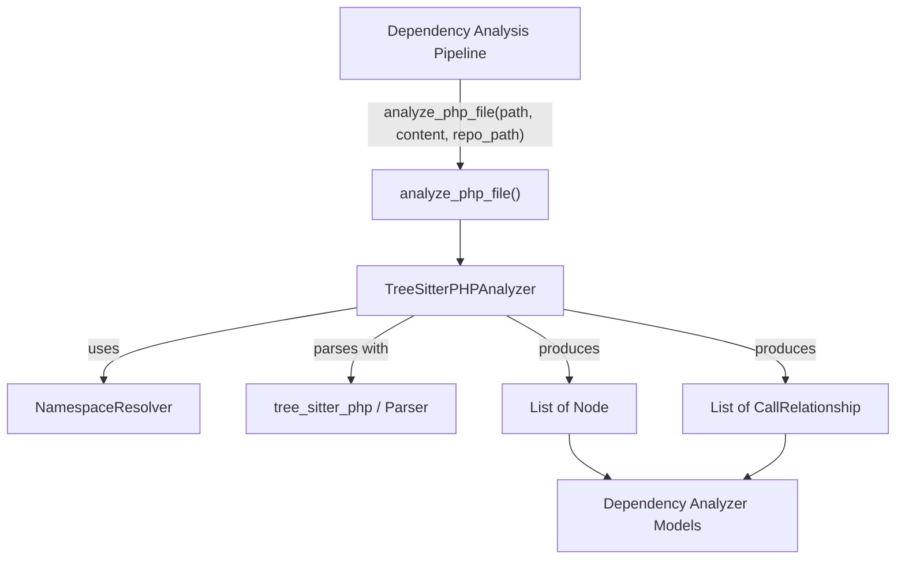
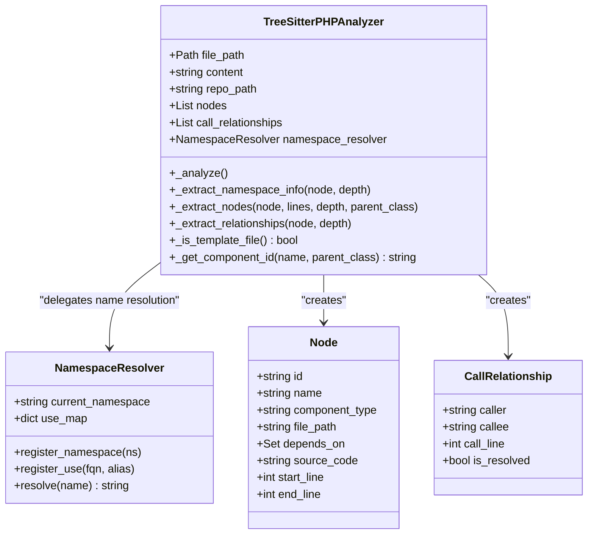
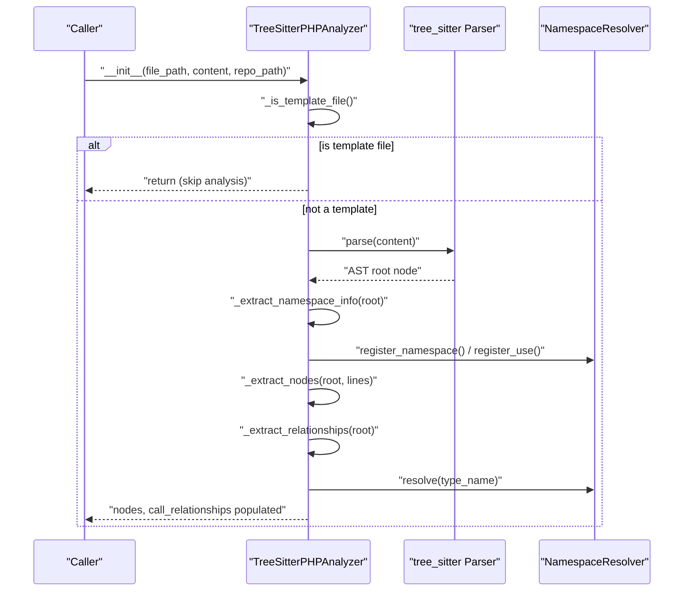
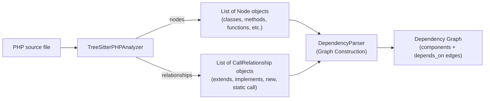

# PHP Analyzer

The PHP Analyzer module is a language-specific static analysis component of CodeWiki's dependency analysis pipeline. It parses PHP source files using `tree-sitter-php` to extract structural code entities (classes, interfaces, traits, enums, functions, and methods) and the relationships between them (inheritance, interface implementation, object instantiation, static calls, constructor property promotion, and namespace imports). Its output feeds directly into the shared dependency analyzer models (`Node`, `CallRelationship`) that the rest of the CodeWiki dependency graph pipeline consumes.

This module is one of several per-language analyzers registered under the [Tree Sitter Analyzers](tree-sitter-analyzers.md) module, alongside analyzers for [C Family Analyzers](c_family_analyzers.md), [Java Analyzer](java_analyzer.md), [JavaScript/TypeScript Analyzers](javascript_typescript_analyzers.md), and [Python Analyzer](python_analyzer.md).

## Purpose and Scope

PHP has language features that make dependency extraction non-trivial compared to simpler languages:

- **Namespaces and `use` statements**, including aliasing (`use App\User as U;`) and grouped imports (`use App\{User, Post};`)
- **Fully-qualified vs. relative class names** that must be resolved relative to the current namespace and import table
- **Multiple declaration kinds** in a single file: classes (including abstract classes), interfaces, traits, enums, free functions, and methods
- **Template files** (e.g. Blade `.blade.php`, `.phtml`) that mix PHP with HTML/markup and should typically be excluded from dependency analysis
- **PHP 8+ constructor property promotion**, which implicitly creates typed dependencies on constructor parameters

The PHP Analyzer module addresses all of these concerns through two cooperating classes:

- **`NamespaceResolver`** — resolves short/aliased PHP type names to fully-qualified names (FQNs)
- **`TreeSitterPHPAnalyzer`** — walks the tree-sitter AST for a PHP file, using the resolver to produce `Node` and `CallRelationship` objects

A convenience function, `analyze_php_file`, wraps analyzer construction and returns the extracted `(nodes, call_relationships)` tuple, matching the calling convention expected by the broader dependency-analysis pipeline.

## Architecture



`Node` and `CallRelationship` are defined outside this module in the shared dependency analyzer models component group, so the PHP Analyzer module only produces instances of them — it does not own their schema.

### Class Relationships



## Core Components

### NamespaceResolver

`NamespaceResolver` maintains the state needed to translate PHP type names as they appear in source code into fully-qualified names (FQNs) suitable for use as dependency identifiers.

Internal state:
- `current_namespace: str` — the namespace declared for the file (set via `register_namespace`)
- `use_map: Dict[str, str]` — maps a local alias (or the short class name if no alias) to its FQN, populated via `register_use`

Resolution logic in `resolve(name)`:
1. If `name` already starts with `\`, it is already fully qualified — the leading backslash is stripped and it is returned as-is.
2. If `name` matches an entry in `use_map` exactly, the mapped FQN is returned.
3. If the first segment of a dotted/qualified name matches an alias in `use_map`, the base is substituted and the remainder appended.
4. Otherwise, the current namespace is prepended to `name`.
5. If there is no current namespace and no match, the name is returned unchanged.

This mirrors PHP's own name-resolution rules for `use App\Foo as Bar; new Bar();` style code, ensuring dependency edges point at real, de-aliased classes.

### TreeSitterPHPAnalyzer

`TreeSitterPHPAnalyzer` is the primary entry point for analyzing a single PHP file. It is constructed with the file path, its content, and (optionally) the repository root path used to compute relative/module paths.

**Initialization flow:**



#### Template File Skipping

Before any parsing occurs, `_is_template_file()` checks the file path against:
- Extension patterns: `.blade.php`, `.phtml`, `.twig.php`
- Directory patterns: `views`, `templates`, `resources/views`

If matched, analysis is skipped entirely (`nodes` and `call_relationships` remain empty), avoiding noisy or irrelevant dependency data from view/template files.

#### Three-Pass Analysis

Once a file is confirmed to be analyzable PHP, `_analyze()` parses it with the `tree_sitter_php` grammar and runs three sequential passes over the AST:

1. **Namespace/use extraction** (`_extract_namespace_info`) — walks the whole tree looking for `namespace_definition` and `namespace_use_declaration` nodes, registering the namespace and populating the `NamespaceResolver`'s `use_map` (including grouped `use App\{User, Post};` syntax via `_extract_use_statement`).
2. **Node extraction** (`_extract_nodes`) — walks the tree again, this time creating a `Node` for each recognized declaration type:
   - `class_declaration` → `"class"` or `"abstract class"` (detected via `abstract_modifier`)
   - `interface_declaration` → `"interface"`
   - `trait_declaration` → `"trait"`
   - `enum_declaration` → `"enum"`
   - `function_definition` → `"function"`
   - `method_declaration` → `"method"` (name is composed as `ContainingClass.methodName`)

   For classes/methods, extra metadata is captured: `parameters` (via `_extract_parameters`) and `base_classes` (via `_extract_base_classes`). Every node also gets a preceding PHPDoc comment attached as its `docstring`, discovered by `_get_preceding_docstring`.
3. **Relationship extraction** (`_extract_relationships`) — a further tree walk that emits `CallRelationship` objects for:
   - `namespace_use_declaration` → import-based dependency from the file module to the imported FQN
   - `class_declaration` with a `base_clause` → inheritance (`extends`)
   - `class_declaration`/`enum_declaration` with a `class_interface_clause` → interface implementation
   - `object_creation_expression` (`new Foo()`) → instantiation dependency
   - `scoped_call_expression` (`Foo::bar()`) → static-call dependency
   - `property_promotion_parameter` (PHP 8 constructor promotion) → typed dependency on the promoted parameter's type

All PHP primitive/built-in types (see `PHP_PRIMITIVES`, e.g. `string`, `int`, `self`, `static`, `Exception`, `DateTime`) are filtered out via `_is_primitive` so that dependency edges reflect meaningful application code rather than language or standard-library noise.

A `MAX_RECURSION_DEPTH` guard (100) is applied to every recursive tree walk to protect against pathologically deep ASTs causing a Python `RecursionError`.

#### Component ID Generation

`_get_component_id(name, parent_class)` produces the identifier used as a `Node.id` / `CallRelationship.caller`/`callee` value. If a namespace was detected for the file, the ID is built as:

```text
Namespace.With.Dots::ParentClass.memberName
```

Otherwise it falls back to a module path derived from the file's location relative to the repository root (via `_get_module_path`), using `::` to separate the module path from the local declaration name — consistent with the ID convention expected by the graph construction stage's `DependencyParser`, which splits on `::` when deriving module groupings.

### analyze_php_file

```python
def analyze_php_file(file_path: str, content: str, repo_path: str = None) -> Tuple[List[Node], List[CallRelationship]]
```

This module-level function is the simple functional interface used by callers that do not need direct access to the analyzer instance: it constructs a `TreeSitterPHPAnalyzer`, runs analysis as part of construction, and returns the resulting `nodes` and `call_relationships` lists. This mirrors the calling pattern used by sibling analyzers such as those in [C Family Analyzers](c_family_analyzers.md), [Java Analyzer](java_analyzer.md), and [Python Analyzer](python_analyzer.md), allowing the orchestrating graph construction parser to treat all language analyzers uniformly.

## Data Flow: PHP File to Dependency Graph



The `Node` objects produced here carry `depends_on` as an empty set by default; it is the surrounding graph construction logic (`DependencyParser`) that consumes the emitted `CallRelationship` list to populate each `Node.depends_on` set and assign final namespaced component IDs (FQDNs) across the whole repository — potentially spanning multiple languages.

## Relationship Types Extracted

| PHP Construct | AST Node Type | Relationship Produced |
|---|---|---|
| `use App\Foo;` | `namespace_use_declaration` | File-to-class import dependency |
| `class A extends B` | `class_declaration` + `base_clause` | `A` → `B` (inheritance) |
| `class A implements I` | `class_declaration`/`enum_declaration` + `class_interface_clause` | `A` → `I` (implementation) |
| `new Foo()` | `object_creation_expression` | Containing class/function → `Foo` (instantiation) |
| `Foo::bar()` | `scoped_call_expression` | Containing class/function → `Foo` (static call) |
| `public function __construct(private Foo $foo)` | `property_promotion_parameter` | Containing class → `Foo` (typed dependency) |

Each relationship is emitted as `is_resolved=False`, meaning name resolution to a final graph-wide component ID is deferred to the shared graph-construction stage rather than being finalized within this module.

## Integration Points

- **Input model**: raw PHP file paths and content, plus an optional repository root, supplied by the orchestrating dependency parser as part of graph construction.
- **Output model**: `Node` and `CallRelationship` instances defined in the dependency analyzer models.
- **Sibling analyzers**: registered together under [Tree Sitter Analyzers](tree-sitter-analyzers.md) for other supported languages (C/C++/C#, Java, JavaScript/TypeScript, Python).
- **Downstream consumers**: the assembled dependency graph is used by the analysis pipeline (`AnalysisService`, `RepoAnalyzer`, `CallGraphAnalyzer`) as part of generating repository-wide documentation.

## Design Notes

- **Template exclusion is path/extension based**, not content based — a `.blade.php` file is skipped regardless of its actual PHP content, trading recall for precision and avoiding markup-heavy files that rarely represent meaningful code dependencies.
- **Namespace resolution happens in a dedicated pre-pass** before node/relationship extraction so that `use` aliases declared anywhere in the file are available when resolving type references later in the same file, regardless of declaration order.
- **Recursion depth protection** (`MAX_RECURSION_DEPTH = 100`) is applied uniformly across all three AST walks, with graceful degradation (a warning log and early return) rather than raising unhandled exceptions.
- **Primitive/built-in type filtering** is centralized in `PHP_PRIMITIVES`, keeping dependency graphs focused on user-defined types.
