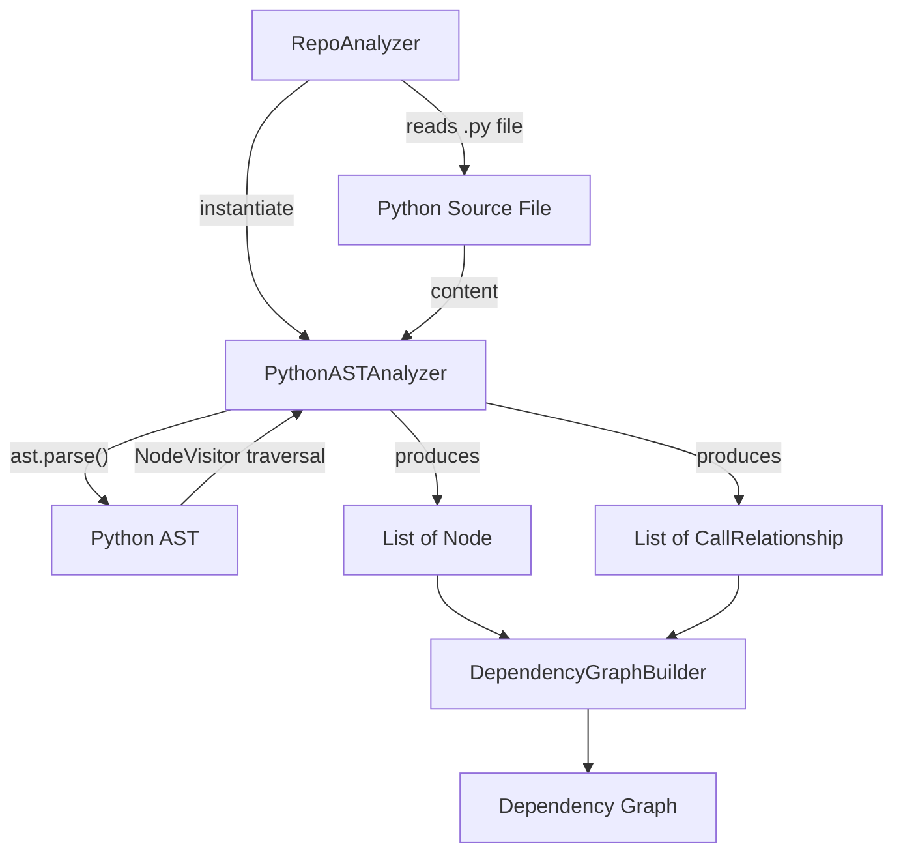
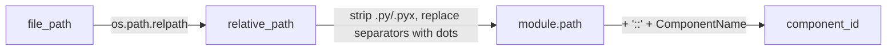
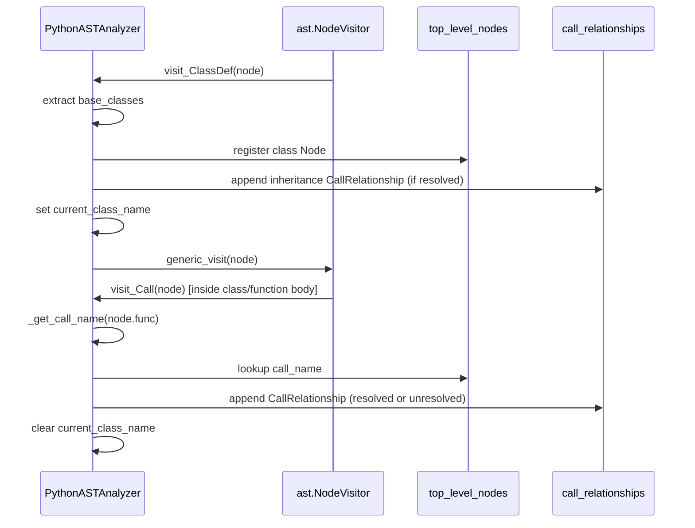
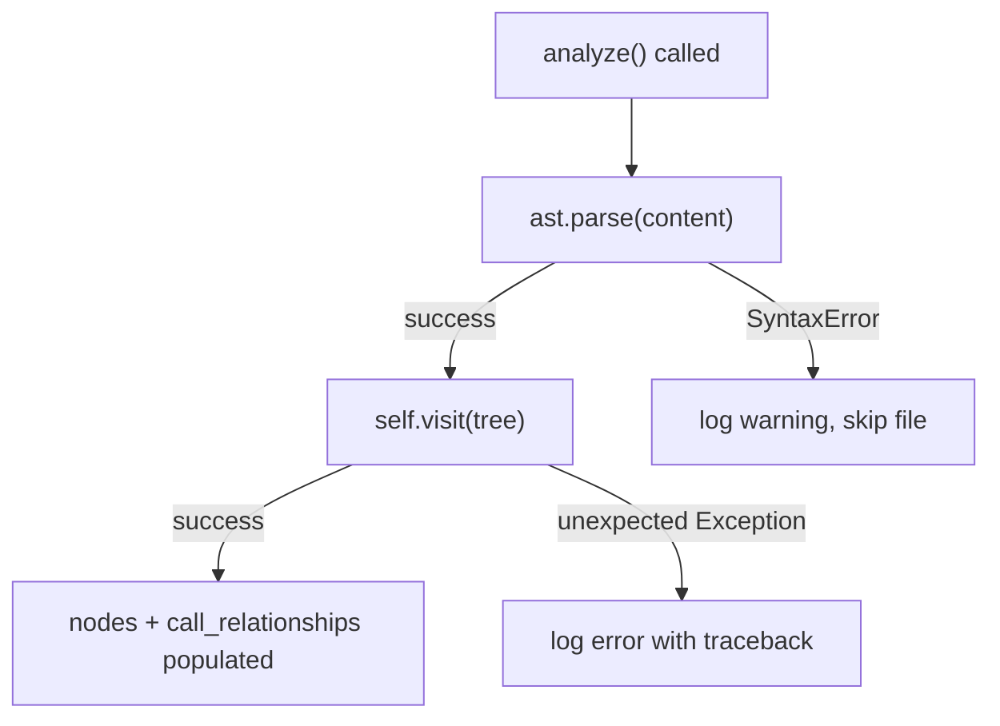

# Python Analyzer

The Python Analyzer module implements an AST-based static analysis engine for Python source files. It walks the Python `ast` (Abstract Syntax Tree) produced by the standard library to extract structural information — classes, functions, and their call relationships — and converts that information into the standardized `Node` and `CallRelationship` models used throughout the dependency analysis pipeline.

This module is one of several language-specific analyzers under the [Tree Sitter Analyzers](tree-sitter-analyzers.md) family. While its siblings (C, C++, C#, Java, JavaScript/TypeScript, PHP) rely on the `tree-sitter` parsing library, the Python analyzer uniquely leverages Python's own built-in `ast` module, since CPython ships with a fully-featured native parser for its own syntax.

## Purpose and Role in the System

The Python Analyzer is invoked by the dependency analyzer core during repository analysis to process individual `.py` files. Its output — lists of `Node` and `CallRelationship` objects — feeds directly into the dependency analyzer models and ultimately into the graph construction stage handled by `DependencyGraphBuilder`.

Within the broader system, the analysis pipeline works roughly as follows:

1. The `RepoAnalyzer` (part of the dependency analyzer core) walks the repository file tree and identifies Python source files.
2. For each Python file, `PythonASTAnalyzer` is instantiated and its `analyze()` method is invoked.
3. The analyzer parses the file content into an AST, traverses it, and produces `Node` objects (representing classes and top-level functions) plus `CallRelationship` objects (representing call-graph edges between them).
4. These results are aggregated with the output of other language analyzers and passed to `DependencyGraphBuilder` to construct the overall dependency graph.



## Core Component

### `PythonASTAnalyzer`

`PythonASTAnalyzer` extends `ast.NodeVisitor` from the Python standard library, using the visitor pattern to walk the syntax tree and collect structural information as it goes.

**Constructor parameters:**

| Parameter | Type | Description |
|---|---|---|
| `file_path` | `str` | Absolute or relative path to the Python file being analyzed |
| `content` | `str` | Raw source code content of the file |
| `repo_path` | `Optional[str]` | Repository root path, used to compute paths relative to the repo for FQDN generation |

**Key internal state:**

- `nodes: List[Node]` — accumulates discovered classes and top-level functions
- `call_relationships: List[CallRelationship]` — accumulates discovered call edges
- `current_class_name` / `current_function_name` — tracks the visitor's current traversal context so calls can be attributed to the correct enclosing scope
- `top_level_nodes: dict` — maps simple names to their `Node` objects, used to resolve whether a given call target is a locally-defined class/function or an external reference

## Component ID Generation (FQDN Format)

A central responsibility of the analyzer is producing globally consistent, fully-qualified component IDs so that call relationships can be resolved across the whole dependency graph — not just within a single file. IDs follow the format:

```text
<dotted.module.path>::<ComponentName>
```

- The dotted module path is derived from the file's path relative to the repository root (via `_get_relative_path()` and `_get_module_path()`), stripping the `.py`/`.pyx` extension and converting path separators to dots.
- The component name is either a bare class/function name, or `ClassName.method_name` when inside a class body (tracked via `current_class_name`).

This is implemented in `_get_module_path()` and `_get_component_id()`:



## AST Traversal and Extraction Logic

### Class Extraction — `visit_ClassDef`

When the visitor encounters a `ClassDef` node:

1. Base classes are extracted via `_extract_base_class_name`, which handles both simple names (`class Foo(Bar)`) and dotted attribute access (`class Foo(module.Bar)`).
2. A `Node` is constructed with `component_type="class"`, capturing source code slice, docstring, line ranges, and base class names.
3. The class is registered into `top_level_nodes` for later call resolution.
4. If any base class is itself a known top-level node in the same file, an `is_resolved=True` `CallRelationship` is recorded representing the inheritance edge.
5. `current_class_name` is set before recursing into the class body (via `generic_visit`) and cleared afterward, so nested calls/methods are correctly attributed.

### Function Extraction — `visit_FunctionDef` / `visit_AsyncFunctionDef`

Both regular and `async def` functions are routed through `_process_function_node`:

1. Only **top-level** functions (i.e., `current_class_name` is `None`) are added as standalone `Node` objects with `component_type="function"`. Methods defined inside classes are intentionally excluded from being top-level nodes (they are traversed for call extraction, but not separately registered as class members in this analyzer version).
2. `_should_include_function` filters out functions whose names start with `_test_` (helper filter to avoid polluting the graph with certain test scaffolding functions).
3. `current_function_name` is tracked during the recursive visit so that calls inside the function body can be attributed to it.

### Call Relationship Extraction — `visit_Call`

For every function/method call expression encountered during traversal:

1. `_get_call_name` resolves the callee's name from the AST call target, handling:
   - Simple name calls: `foo()`
   - Attribute calls: `obj.method()` → resolved as `obj.method`
   - Chained attributes: `a.b.method()`
   - A hardcoded set of Python builtins (`print`, `len`, `isinstance`, etc.) is filtered out to avoid noise from standard library calls.
2. The caller ID is determined by the current traversal context — either the enclosing class or the enclosing top-level function.
3. If the resolved call name matches an entry in `top_level_nodes`, the relationship is marked `is_resolved=True` and the callee ID is fully qualified with the module path. Otherwise, the raw call name is stored as an unresolved reference (to potentially be resolved later at the cross-file graph-building stage).



## Data Model Alignment

The `Node` and `CallRelationship` objects produced by this analyzer are defined in the dependency analyzer models. The Python Analyzer populates the following key fields:

**`Node` fields populated:**

| Field | Description |
|---|---|
| `id` / `component_id` | FQDN-format identifier (`module.path::Name`) |
| `name` | Simple class or function name |
| `component_type` | `"class"` or `"function"` |
| `file_path` / `relative_path` | Absolute and repo-relative file locations |
| `source_code` | Exact source lines spanning the node's definition |
| `start_line` / `end_line` | Line range from the AST node |
| `has_docstring` / `docstring` | Extracted via `ast.get_docstring()` |
| `parameters` | Argument names, for functions only |
| `node_type` | Mirrors `component_type` (`"class"` / `"function"`) |
| `base_classes` | List of resolved base class names, for classes only |
| `display_name` | Human-readable label, e.g. `"class Foo"` or `"function bar"` |

**`CallRelationship` fields populated:**

| Field | Description |
|---|---|
| `caller` | FQDN of the enclosing class or function |
| `callee` | FQDN (if resolved) or raw call name (if unresolved) |
| `call_line` | Line number of the call expression |
| `is_resolved` | `True` if the callee matches a locally-known top-level node |

## Error Handling and Robustness

The `analyze()` method wraps parsing and traversal in exception handling to ensure a single malformed file does not halt the entire repository analysis:

- **`SyntaxError`**: Caught and logged as a warning when `ast.parse()` fails on invalid Python syntax; analysis for that file is skipped gracefully.
- **General exceptions**: Caught and logged as errors with full traceback (`exc_info=True`), keeping the pipeline resilient to unexpected AST edge cases.
- **`SyntaxWarning` suppression**: Parsing is wrapped in `warnings.catch_warnings()` to silence `SyntaxWarning`s (e.g., from invalid escape sequences in string/regex literals within analyzed source files), preventing noisy log output during large-scale repository scans.



## Public Entry Point

The module exposes a convenience function for one-shot analysis without manually managing the analyzer instance:

```python
def analyze_python_file(
    file_path: str, content: str, repo_path: Optional[str] = None
) -> Tuple[List[Node], List[CallRelationship]]:
    ...
```

This function instantiates `PythonASTAnalyzer`, calls `.analyze()`, and returns the `(nodes, call_relationships)` tuple directly — the typical integration point used by callers such as `RepoAnalyzer` in the dependency analyzer core.

## Design Notes and Limitations

- **Top-level focus**: Only classes and top-level (module-scope) functions are registered as `Node` objects. Methods defined within classes are traversed for call-extraction purposes but are not independently registered as separate top-level nodes in this analyzer's current implementation — call attribution for method bodies is scoped to the enclosing class.
- **Builtin filtering**: A static allowlist of common Python builtins is excluded from call relationship extraction to reduce graph noise; this list is not exhaustive and may need periodic updates as usage patterns evolve.
- **Local-file resolution only**: Call resolution (`is_resolved`) is determined using only the nodes discovered within the same file (via `top_level_nodes`). Cross-file/cross-module call resolution is deferred to later stages of the pipeline, such as `DependencyGraphBuilder` in the dependency analyzer core.
- **Test function filtering**: Functions with names starting with `_test_` are excluded via `_should_include_function`, a convention-based filter to reduce noise from certain test helper patterns.

## Related Modules

- [Tree Sitter Analyzers](tree-sitter-analyzers.md) — parent grouping of all language-specific analyzers, including the [C Family Analyzers](c_family_analyzers.md), [Java Analyzer](java_analyzer.md), [JavaScript/TypeScript Analyzers](javascript_typescript_analyzers.md), and [PHP Analyzer](php_analyzer.md), which follow an analogous extraction pattern using `tree-sitter` grammars instead of Python's native `ast` module.
- Dependency Analyzer Core — hosts `RepoAnalyzer`, `AnalysisService`, `CallGraphAnalyzer`, and `DependencyGraphBuilder`, which orchestrate invocation of this analyzer and consume its output.
- Dependency Analyzer Models — defines the `Node` and `CallRelationship` Pydantic models that structure this analyzer's output.

