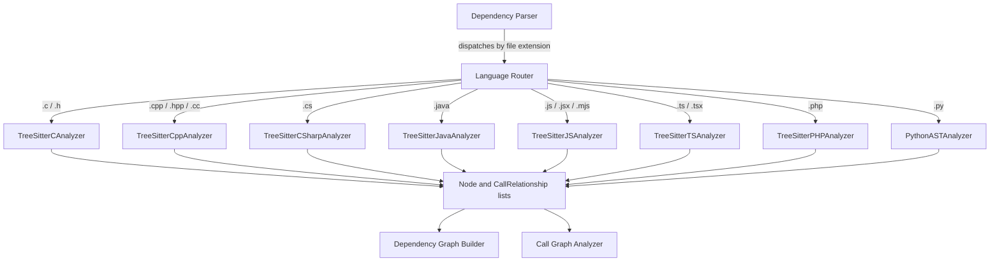

# Tree Sitter Analyzers

## Purpose

The Tree Sitter Analyzers module is the multi-language source-code parsing layer of CodeWiki's dependency analysis pipeline. For every supported programming language, it provides a dedicated analyzer that reads a single source file and produces two things:

1. **Nodes** — structural entities such as classes, functions, methods, interfaces, structs, enums, and global variables.
2. **Call Relationships** — edges describing how those entities depend on or interact with one another (function calls, inheritance, interface implementation, object creation, type usage, and more).

These `Node` and `CallRelationship` objects are the common currency of the entire dependency analysis system. They are defined by the shared data models used across the backend and are consumed by the graph-construction stage that assembles the full repository dependency graph and the call-graph analyzer used for clustering and documentation generation.

Because every analyzer emits data in the exact same shape, the rest of the pipeline (dependency graph building, call-graph resolution, clustering, and documentation generation) can operate on any supported language without needing to know the language-specific parsing details.

## Supported Languages

| Language | Analyzer | Parsing Technology |
|---|---|---|
| C | `TreeSitterCAnalyzer` | tree-sitter (`tree_sitter_c`) |
| C++ | `TreeSitterCppAnalyzer` | tree-sitter (`tree_sitter_cpp`) |
| C# | `TreeSitterCSharpAnalyzer` | tree-sitter (`tree_sitter_c_sharp`) |
| Java | `TreeSitterJavaAnalyzer` | tree-sitter (`tree_sitter_java`) |
| JavaScript | `TreeSitterJSAnalyzer` | tree-sitter (`tree_sitter_javascript`) |
| TypeScript | `TreeSitterTSAnalyzer` | tree-sitter (`tree_sitter_typescript`) |
| PHP | `TreeSitterPHPAnalyzer` | tree-sitter (`tree_sitter_php`) |
| Python | `PythonASTAnalyzer` | Python's built-in `ast` module |

All analyzers except the Python one are built on top of [tree-sitter](https://tree-sitter.github.io/tree-sitter/) grammars. The Python analyzer instead uses Python's native `ast` module since a fully-featured, zero-dependency parser is already available in the standard library.

## Architecture

Every analyzer follows the same lifecycle:

1. **Instantiate** with `(file_path, content, repo_path)`.
2. **Parse** the file content into a syntax tree (tree-sitter grammar or Python `ast`).
3. **Extract nodes** — walk the tree once (or twice, for languages that need entity pre-collection) to identify top-level declarations and record them as `Node` objects.
4. **Extract relationships** — walk the tree again to detect calls, inheritance, instantiation, and type usage, producing `CallRelationship` objects that reference the nodes discovered in step 3.
5. **Expose results** via `self.nodes` and `self.call_relationships`, typically also through a module-level `analyze_<language>_file(...)` convenience function that returns a `(nodes, relationships)` tuple.



### Component identity (FQDN scheme)

Every analyzer computes a **component ID** for each extracted node so that entities can be uniquely referenced across the whole repository, following the pattern:

```text
<dotted.module.path>::<Name>
<dotted.module.path>::<ClassName>.<memberName>
```

For example, a method `save` inside class `UserRepository` located at `src/data/user_repository.py` becomes:

```text
src.data.user_repository::UserRepository.save
```

The module path is derived by taking the file path relative to the repository root, stripping the language-specific file extension, and replacing path separators with dots. This scheme is shared by all analyzers so that downstream consumers (dependency graph construction, clustering, and documentation generation) can treat component IDs uniformly regardless of source language.

### Two-phase extraction

Most analyzers separate **node extraction** from **relationship extraction** into two full tree traversals:

- The first traversal builds a lookup table of top-level names (`top_level_nodes` / `all_entities`) mapping simple names to their `Node` objects.
- The second traversal re-walks the tree, and whenever it encounters a call, instantiation, inheritance clause, or type reference, it looks up the target name in that table to decide whether the relationship is *locally resolved* (target found in the same file) or *unresolved* (left for the cross-file resolution stage to handle later, similar to how the call-graph analyzer resolves cross-file callees).

This is important because a single file cannot know about declarations in other files; each analyzer only guarantees **intra-file** resolution and marks everything else with `is_resolved=False`, leaving further resolution to the broader dependency analysis pipeline.

## Sub-modules

The eight language analyzers are grouped into five documentation sub-modules based on shared structural patterns and language families:

- [C Family Analyzers](c_family_analyzers.md) — `TreeSitterCAnalyzer`, `TreeSitterCppAnalyzer`, `TreeSitterCSharpAnalyzer`. These three analyzers share a nearly identical single-pass extraction structure with growing structural complexity (functions only → classes/namespaces → interfaces/records/delegates).
- [Java Analyzer](java_analyzer.md) — `TreeSitterJavaAnalyzer`. Handles Java's rich type system: classes, interfaces, enums, records, annotations, and detailed method/field/object-creation relationship extraction, including local-variable type inference.
- [JavaScript & TypeScript Analyzers](javascript_typescript_analyzers.md) — `TreeSitterJSAnalyzer`, `TreeSitterTSAnalyzer`. Both analyze ECMAScript-family syntax (functions, arrow functions, classes, JSDoc/TypeScript type annotations) but differ in how strictly they validate "true top-level" declarations versus nested ones.
- [PHP Analyzer](php_analyzer.md) — `TreeSitterPHPAnalyzer` (with its `NamespaceResolver` helper). Unique among the analyzers in that it must resolve PHP namespaces and `use` statement aliases to fully qualified class names before building relationships.
- [Python Analyzer](python_analyzer.md) — `PythonASTAnalyzer`. The only analyzer built on Python's native `ast` module rather than tree-sitter, using the visitor pattern (`ast.NodeVisitor`) instead of manual tree traversal.

## Node & Relationship Type Coverage

| Language | Node Types Extracted | Relationship Types Extracted |
|---|---|---|
| C | function, struct, variable | calls, global-variable usage |
| C++ | class, struct, function, method, namespace, variable | calls, inherits, creates (`new`), uses (variable) |
| C# | class, abstract class, static class, interface, struct, enum, record, delegate | inherits (base list), property/field/parameter type usage |
| Java | class, abstract class, interface, enum, record, annotation, method | extends, implements, field type use, method invocation, object creation |
| JavaScript | class, abstract class, interface, function, generator function, arrow function, method | calls, inheritance, JSDoc-derived type dependencies |
| TypeScript | function, class, abstract class, interface, type alias, enum, variable, export statement | calls, `new` instantiation, member access, type annotations/arguments, inheritance/implements |
| PHP | class, abstract class, interface, trait, enum, function, method | `use` imports, extends, implements, `new`, static (`::`) calls, constructor property promotion |
| Python | class, function | calls, class inheritance |

## Relationship to the Rest of the System

These analyzers do not run standalone — they are invoked by the dependency parsing stage of the broader dependency analyzer, which selects the appropriate analyzer per file based on its extension, aggregates the resulting nodes and relationships across the whole repository, and hands them off to graph construction and call-graph resolution. The `Node` and `CallRelationship` data structures they produce are defined in the shared dependency analyzer models, ensuring a single consistent contract across every language-specific analyzer.
