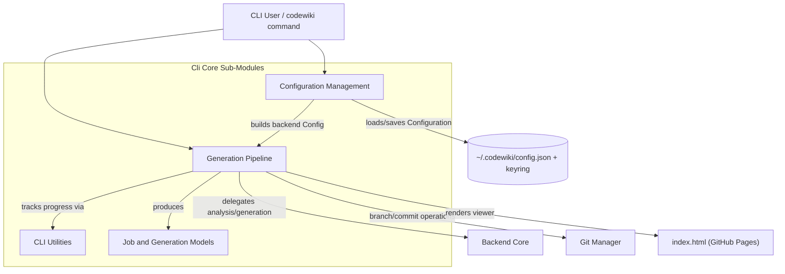
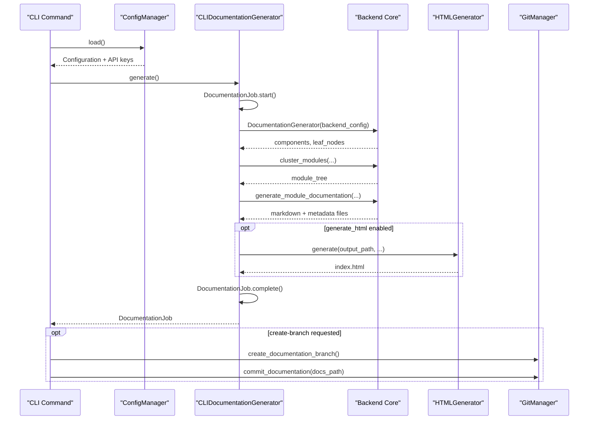

# Cli Core

## Overview

The Cli Core module implements the command-line interface layer of CodeWiki. It is the entry point that end users interact with when running documentation generation from a terminal: it manages persistent configuration (models, API keys, generation settings), wraps the [Backend Core](backend-core.md) documentation engine with progress reporting and CLI-friendly error handling, produces a self-contained HTML viewer for GitHub Pages, integrates with git to create documentation branches and commits, and defines the data models (`Configuration`, `DocumentationJob`, etc.) that describe a generation run from start to finish.

Cli Core does not perform dependency analysis or call an LLM directly - that work is delegated to [Backend Core](backend-core.md). Instead, Cli Core is responsible for:

- Translating user-facing configuration (persisted in `~/.codewiki/config.json` and the system keyring) into the backend's runtime `Config` object
- Orchestrating the multi-stage generation pipeline and reporting progress to the terminal
- Managing git repository state (clean-check, branch creation, committing generated docs)
- Rendering a static HTML documentation viewer for GitHub Pages
- Providing consistent logging and progress-bar utilities across all CLI commands

## Architecture

### How a generation run flows

## Sub-Modules

Cli Core is organized into four functional areas, each documented in detail below:

### [Configuration Management](configuration_management.md)

Handles persistent user settings and secure credential storage. `ConfigManager` reads/writes `~/.codewiki/config.json` and stores per-provider API keys in the system keyring (macOS Keychain, Windows Credential Manager, Linux Secret Service). The `Configuration` and `AgentInstructions` data models describe model selection (cluster/main/fallback), token/temperature settings, and custom documentation instructions, and know how to convert themselves into the backend's runtime `Config` object.

### [Job and Generation Models](job_and_generation_models.md)

Defines the data models that represent a single documentation generation run: `DocumentationJob` (status, timestamps, statistics, generated files), `JobStatus`, `GenerationOptions`, `JobStatistics`, and `LLMConfig`. These models provide serialization (`to_dict`/`to_json`/`from_dict`) used for the `metadata.json` produced alongside generated documentation.

### [Generation Pipeline](generation_pipeline.md)

The operational core of the CLI: `CLIDocumentationGenerator` adapts the [Backend Core](backend-core.md) documentation engine to the CLI, coordinating the dependency-analysis, module-clustering, and documentation-generation stages while updating progress and building the `DocumentationJob`. `HTMLGenerator` renders a static, self-contained `index.html` viewer suitable for GitHub Pages. `GitManager` provides git operations (clean working-directory checks, documentation branch creation, committing generated docs, and GitHub PR URL construction) used by CLI commands that want to publish documentation via a pull request.

### [Cli Utilities](cli_utilities.md)

Shared terminal UX helpers: `CLILogger` for colored, leveled console output, and `ProgressTracker`/`ModuleProgressBar` for multi-stage progress reporting and per-module progress bars during long-running generation jobs.

## Relationship to Other Modules

- **[Backend Core](backend-core.md)**: Cli Core's `CLIDocumentationGenerator` wraps `DocumentationGenerator` and builds the backend's `Config` (via `Configuration.to_backend_config` / `BackendConfig.from_cli`) to perform the actual dependency analysis, clustering, and LLM-driven documentation generation. Cli Core never talks to an LLM or the file system's dependency graph directly.
- **[Config Core](config-core.md)**: The backend runtime configuration object (`Config`) referenced throughout the generation pipeline lives in this module; Cli Core constructs it but does not define it.

## Design Notes

- **Separation of persistent vs. runtime configuration**: `Configuration` (Cli Core) represents what a user has saved locally, while the backend `Config` object represents a fully-resolved runtime configuration for a single generation job. The conversion happens in `Configuration.to_backend_config`.
- **Secrets never touch disk in plaintext**: API keys are stored exclusively via `keyring`; `config.json` only contains non-sensitive settings.
- **Progress reporting is stage-based**: `ProgressTracker` models generation as five weighted stages (dependency analysis, clustering, documentation generation, optional HTML generation, finalization) to provide ETA estimates without requiring the backend to know about CLI concerns.
- **CLI adapter isolates backend logging**: `CLIDocumentationGenerator._configure_backend_logging` reconfigures backend loggers (`codewiki.src.be`) with colored formatting and appropriate verbosity so backend log noise doesn't leak into normal (non-verbose) CLI output.
