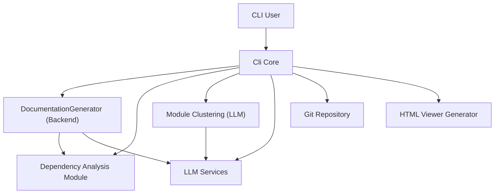
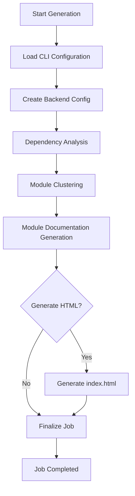
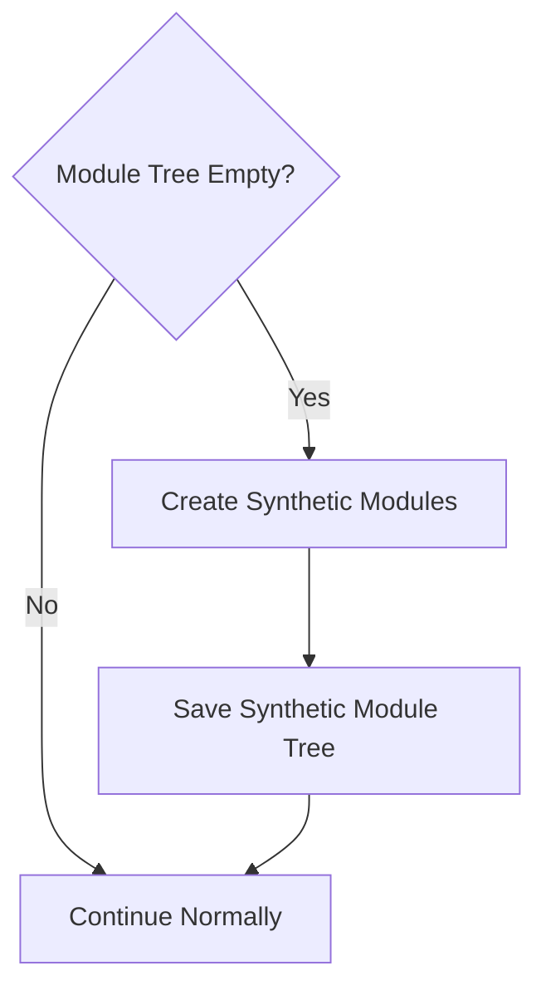
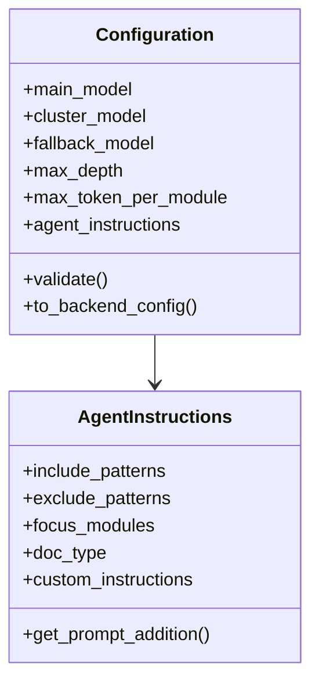
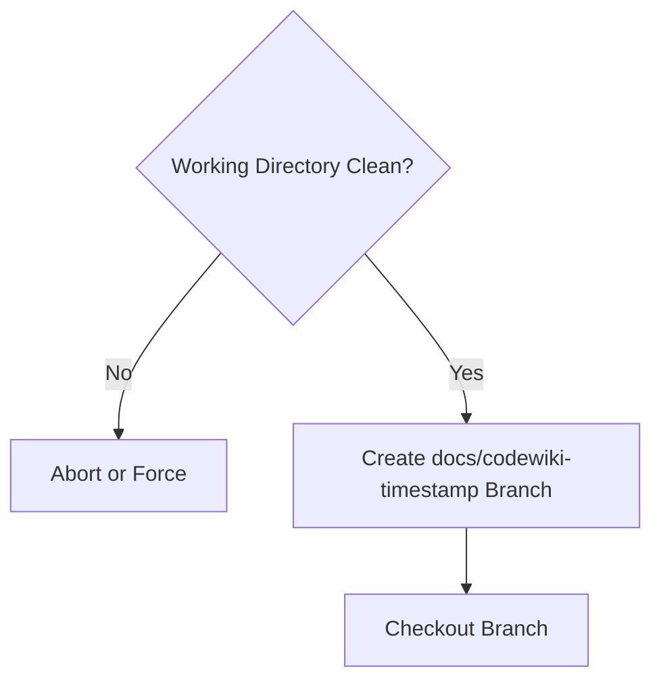
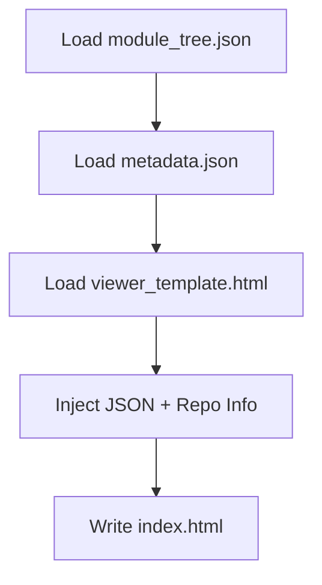
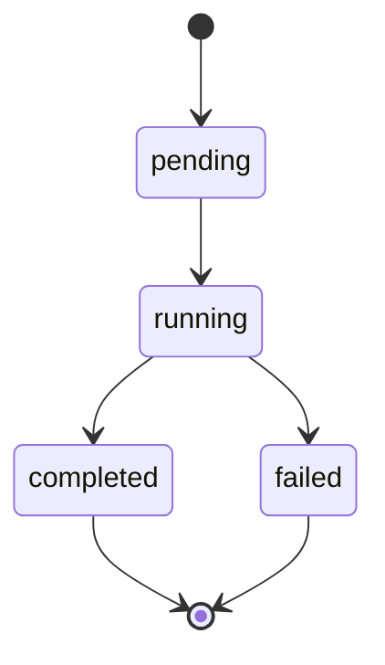
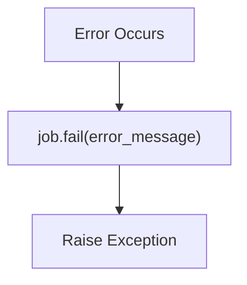

# Cli Core

The **Cli Core** module is the command-line execution engine of CodeWiki. It orchestrates repository analysis, LLM-powered module clustering, documentation generation, Git integration, configuration management, and optional HTML export.

This module acts as the bridge between:

- The **user-facing CLI commands**
- The **backend documentation and dependency analysis engines**
- The **LLM services layer**
- The **local Git repository**

It is responsible for secure configuration handling, execution lifecycle management, progress tracking, and artifact generation.

---

## High-Level Responsibilities

The Cli Core module provides:

1. **Documentation generation orchestration**
2. **Secure configuration management (keyring-backed)**
3. **Git repository integration (branching + commits)**
4. **Job lifecycle tracking and statistics**
5. **Progress tracking with stage-based ETA estimation**
6. **Optional GitHub Pages HTML viewer generation**

---

## Architecture Overview

The Cli Core sits between user commands and backend services.



The execution pipeline is divided into weighted stages handled by `ProgressTracker`:

| Stage | Description | Weight |
|-------|------------|--------|
| 1 | Dependency Analysis | 40% |
| 2 | Module Clustering | 20% |
| 3 | Documentation Generation | 30% |
| 4 | HTML Generation (optional) | 5% |
| 5 | Finalization | 5% |

---

## Execution Flow

The core orchestration logic resides in:

- `CLIDocumentationGenerator`

### End-to-End Flow



---

# Core Components

## 1. CLIDocumentationGenerator

**Location:** `codewiki/cli/adapters/doc_generator.py`

This is the primary orchestration class of Cli Core.

### Responsibilities

- Wraps the backend `DocumentationGenerator`
- Configures runtime environment for CLI usage
- Tracks multi-stage progress
- Handles verbose logging configuration
- Executes clustering and documentation phases
- Extracts Mermaid diagrams (optional)
- Produces job metadata
- Optionally generates GitHub Pages HTML viewer

### Internal Stages

The generator runs in clearly defined stages:

1. Dependency graph building
2. Module clustering (LLM-powered)
3. Module documentation generation
4. HTML viewer generation (optional)
5. Metadata finalization

### Synthetic Module Fallback

If clustering fails and produces an empty module tree, a synthetic module patch is applied to prevent context overflow.



This prevents generating documentation for the entire repository in a single LLM call.

---

## 2. ConfigManager

**Location:** `codewiki/cli/config_manager.py`

Manages persistent user configuration and secure API key storage.

### Storage Model

| Data Type | Storage Location |
|-----------|------------------|
| API Keys | System Keychain (via keyring) |
| Non-sensitive Config | `~/.codewiki/config.json` |

### Security Model

API keys are stored using the OS keychain:

- macOS Keychain
- Windows Credential Manager
- Linux Secret Service

They are never written to disk in plaintext.

### Configuration Object Model



### Key Features

- Per-provider API configuration
- Model-level temperature control
- Token limits per stage
- Custom agent instructions
- Type coercion + validation
- Runtime override merging

---

## 3. GitManager

**Location:** `codewiki/cli/git_manager.py`

Handles Git repository interactions.

### Capabilities

- Validate working directory cleanliness
- Create timestamped documentation branches
- Commit generated documentation
- Detect remote URLs
- Generate GitHub PR creation URLs

### Branch Creation Flow



Branch naming format:

```text
docs/codewiki-YYYYMMDD-HHMMSS
```

---

## 4. HTMLGenerator

**Location:** `codewiki/cli/html_generator.py`

Generates a static `index.html` documentation viewer for GitHub Pages.

### Responsibilities

- Load `module_tree.json`
- Load `metadata.json`
- Embed JSON into HTML template
- Auto-detect repository metadata
- Generate GitHub Pages URL

### HTML Generation Flow



The generated file is self-contained and suitable for GitHub Pages hosting.

---

## 5. DocumentationJob Model

**Location:** `codewiki/cli/models/job.py`

Represents a single documentation execution lifecycle.

### State Machine



### Captured Metadata

- Repository path
- Branch name
- Commit hash
- Files generated
- LLM configuration used
- Token usage statistics
- Start and end timestamps

This enables reproducibility and auditability of documentation runs.

---

## 6. ProgressTracker & ModuleProgressBar

**Location:** `codewiki/cli/utils/progress.py`

### ProgressTracker

- Stage-based progress
- Weighted time estimation
- ETA calculation
- Verbose stage logging

Overall progress is calculated as:

```text
sum(completed_stage_weights) + current_stage_weight × stage_progress
```

### ModuleProgressBar

Used during per-module documentation generation:

- Visual progress bar (non-verbose mode)
- Detailed per-module logs (verbose mode)

---

## 7. CLILogger

**Location:** `codewiki/cli/utils/logging.py`

Provides:

- Colored terminal output
- Verbose debug timestamps
- Structured step logging
- Success / warning / error formatting

Built on top of `click` for cross-platform compatibility.

---

# Interaction with Backend Modules

The Cli Core does not implement analysis or LLM logic directly. Instead, it delegates to:

- **Dependency Analysis module** for AST parsing and graph building
- **Module Clustering logic** for LLM-based structural grouping
- **Documentation Generation module** for Markdown creation
- **LLM Services layer** for model invocation

Cli Core’s role is orchestration, configuration, and lifecycle management.

---

# Error Handling Strategy

The module standardizes error propagation using:

- `APIError` for LLM failures
- `ConfigurationError` for invalid settings
- `RepositoryError` for Git failures
- `FileSystemError` for I/O issues

Errors update the `DocumentationJob` status before re-raising.



---

# Design Principles

The Cli Core follows several architectural principles:

### 1. Separation of Concerns

- CLI concerns separated from backend engine
- Secure config separated from runtime config
- Git integration isolated

### 2. Security by Default

- API keys stored in keyring
- No plaintext secrets in config file

### 3. Fail-Safe Clustering

- Synthetic module fallback prevents catastrophic LLM overflow

### 4. Observability

- Explicit job lifecycle
- Detailed statistics tracking
- Structured progress tracking

### 5. Reproducibility

- Metadata.json captures generation context
- LLM configuration persisted in job
- Git branch + commit integration

---

# Summary

The **Cli Core** module is the execution backbone of CodeWiki’s CLI system. It coordinates configuration, Git integration, dependency analysis, module clustering, documentation generation, HTML export, and job tracking into a single cohesive workflow.

It ensures:

- Secure configuration handling
- Deterministic multi-stage execution
- Safe LLM interaction boundaries
- Clear lifecycle visibility
- Git-native documentation workflows

Without Cli Core, backend services would remain disconnected components. This module turns them into a reliable, user-facing documentation generation engine.