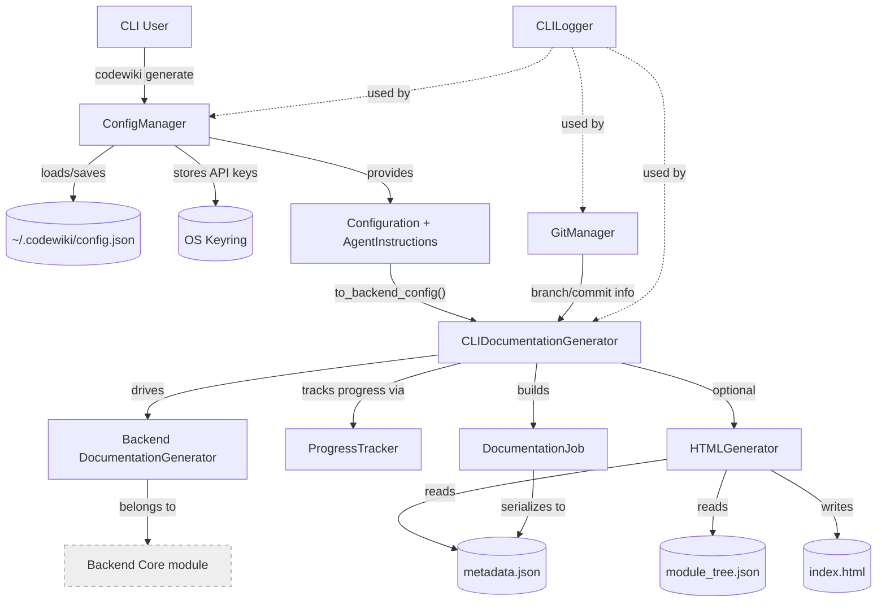

# Cli Core

## Overview

The Cli Core module is the command-line interface layer of CodeWiki. It is the entry point that end users interact with when running `codewiki` from a terminal: it manages persistent user configuration, wraps git repository operations, drives the backend documentation pipeline with progress reporting, renders a static HTML viewer for GitHub Pages, and provides shared logging/progress utilities used throughout the CLI experience.

Rather than reimplementing documentation generation, Cli Core acts as a **thin orchestration and presentation layer** on top of the backend engine (see the [Backend Core](backend-core.md) module). It translates CLI-specific concerns — credential storage, terminal progress bars, colored logging, git branch management, and static site generation — into calls against the backend's `DocumentationGenerator` and `Config` primitives.

## Responsibilities

- **Configuration persistence**: securely store LLM provider credentials (cluster/main/fallback API keys) in the OS keyring, and persist non-sensitive settings (models, base URLs, token limits, agent instructions) to `~/.codewiki/config.json`.
- **Job orchestration**: adapt the backend's async documentation pipeline into a CLI-friendly staged workflow (dependency analysis → module clustering → documentation generation → optional HTML generation → finalization) with verbose/non-verbose progress reporting.
- **Git integration**: detect repository state, verify a clean working tree, create timestamped documentation branches, commit generated docs, and compute GitHub PR/Pages URLs.
- **Static site generation**: render a self-contained `index.html` viewer for GitHub Pages by combining a template with the generated `module_tree.json` and `metadata.json`.
- **Job/result modeling**: define typed data models (`DocumentationJob`, `LLMConfig`, `JobStatistics`, `GenerationOptions`, `JobStatus`) that describe a documentation run's inputs, progress, and outputs, with JSON (de)serialization for the `metadata.json` artifact.
- **Terminal UX utilities**: colored logging and multi-stage progress tracking with ETA estimation, shared across all CLI commands.

## Architecture

At a high level, a CLI command (e.g. `generate`) loads user settings via `ConfigManager`, optionally inspects/manipulates the repository via `GitManager`, and then hands control to `CLIDocumentationGenerator`, which converts CLI configuration into a backend `Config` object and drives the [Backend Core](backend-core.md) pipeline stage by stage, reporting progress through `ProgressTracker`. The resulting `DocumentationJob` captures statistics and status, which are persisted as `metadata.json`. If HTML output is requested, `HTMLGenerator` renders a static viewer from the generated `module_tree.json` and `metadata.json`.

## Sub-modules

Cli Core is organized into the following functional areas:

| Sub-module | Responsibility |
|---|---|
| [Generation](cli-core/generation/generation.md) | Adapts the backend documentation pipeline for CLI use with staged progress reporting and logging configuration. |
| [Configuration](cli-core/configuration/configuration.md) | Manages persistent CLI settings and secure API key storage via the OS keyring; defines the configuration data model. |
| [Job Models](cli-core/job_models/job_models.md) | Typed data models describing a documentation job's status, statistics, and LLM configuration, with JSON serialization. |
| [Git Integration](cli-core/git_integration/git_integration.md) | Wraps git operations needed for documentation branch workflows (clean-check, branch creation, commit, remote/PR URL detection). |
| [Html Generation](cli-core/html_generation/html_generation.md) | Renders a static, self-contained HTML documentation viewer for GitHub Pages. |
| [Utils](cli-core/utils/utils.md) | Shared terminal UX helpers: colored logging and multi-stage progress tracking with ETA. |

### Generation

The [Generation](cli-core/generation/generation.md) sub-module contains `CLIDocumentationGenerator`, the central adapter that bridges CLI configuration and the backend engine. It normalizes additional source paths, builds a backend `Config`, configures backend logging with colored output, and runs the five-stage pipeline (dependency analysis, module clustering, documentation generation, optional HTML generation, finalization), reporting progress and raising `APIError` on failure.

### Configuration

The [Configuration](cli-core/configuration/configuration.md) sub-module contains `ConfigManager` together with the `Configuration` and `AgentInstructions` data models. `ConfigManager` persists non-sensitive settings to `~/.codewiki/config.json` and stores per-provider API keys (cluster/main/fallback) in the OS keyring, falling back gracefully when the keyring is unavailable. `Configuration.to_backend_config()` is the bridge that converts persisted CLI settings into a backend `Config` instance for a specific run.

### Job Models

The [Job Models](cli-core/job_models/job_models.md) sub-module defines `DocumentationJob` and its supporting types (`JobStatus`, `JobStatistics`, `GenerationOptions`, `LLMConfig`). These models track a single documentation run's lifecycle (pending → running → completed/failed), record statistics such as files analyzed and leaf nodes, and support round-trip JSON serialization used for the `metadata.json` artifact.

### Git Integration

The [Git Integration](cli-core/git_integration/git_integration.md) sub-module contains `GitManager`, which wraps the `git` Python library to support the "create documentation branch and commit" workflow: checking for a clean working directory, generating timestamped branch names, committing generated docs, and deriving GitHub remote/PR URLs.

### Html Generation

The [Html Generation](cli-core/html_generation/html_generation.md) sub-module contains `HTMLGenerator`, which loads `module_tree.json` and `metadata.json` from a documentation output directory, populates a bundled HTML template, and writes a self-contained `index.html` suitable for GitHub Pages hosting.

### Utils

The [Utils](cli-core/utils/utils.md) sub-module contains `CLILogger`, `ProgressTracker`, and `ModuleProgressBar` — shared terminal presentation helpers used across the CLI for colored log output and multi-stage progress bars with ETA estimation.

## Relationship to Other Modules

- **Backend Core**: Cli Core does not implement documentation generation itself; it delegates to the backend's `DocumentationGenerator`, dependency analyzer, and LLM services. See the [Backend Core](backend-core.md) module for details on dependency analysis, clustering, and agent orchestration.
- **Config Core**: The backend-facing `Config` object that `Configuration.to_backend_config()` produces is defined in the shared configuration module. See [Config Core](config-core.md) for details on the runtime configuration surface consumed by the backend.

## Error Handling

Cli Core raises a small hierarchy of typed exceptions used to communicate failures to the CLI entry point with distinct exit codes:

- `ConfigurationError` — raised by `ConfigManager` when configuration cannot be loaded/saved or the keychain is unavailable.
- `RepositoryError` — raised by `GitManager` when git operations fail (e.g., dirty working directory, invalid repository).
- `FileSystemError` — raised by `HTMLGenerator` and configuration I/O helpers when reading/writing files fails.
- `APIError` — raised by `CLIDocumentationGenerator` when a backend/LLM stage (dependency analysis, clustering, documentation generation) fails.

Each exception type maps to a dedicated process exit code, allowing CLI scripts and CI pipelines to distinguish between configuration problems, repository issues, filesystem errors, and API failures.
