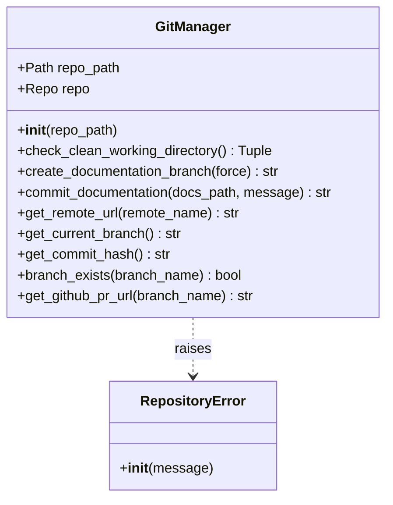
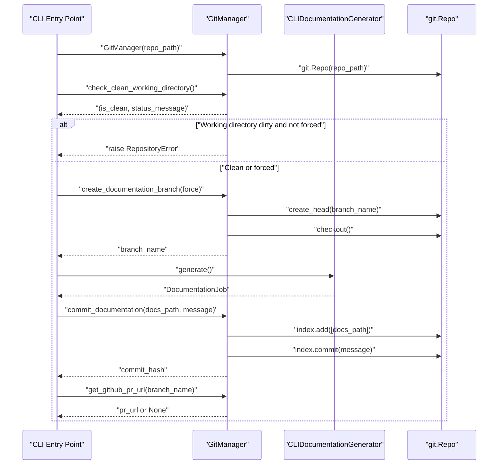
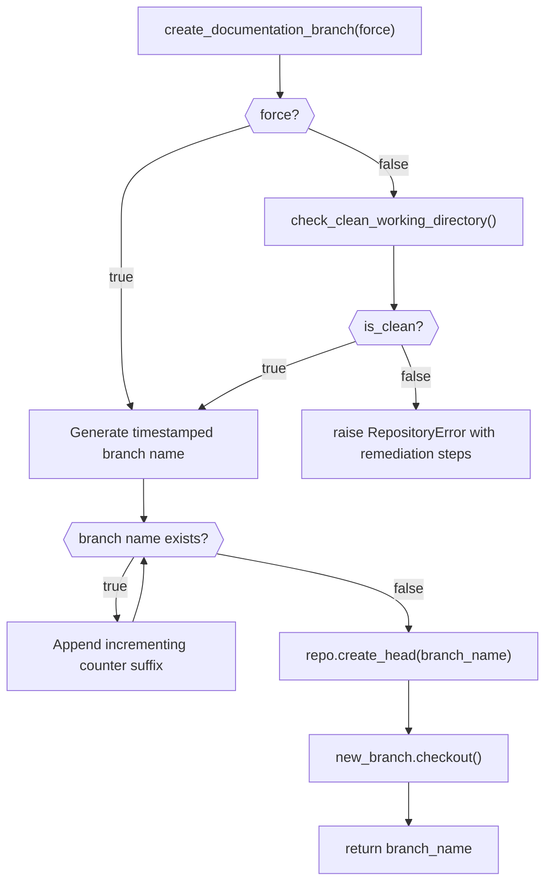

# Git Integration

The Git Integration module provides the `GitManager` component, which encapsulates all git repository operations required by the CodeWiki CLI's documentation workflow. It is responsible for validating that a target directory is a git repository, inspecting working-directory cleanliness, creating dedicated documentation branches, committing generated documentation, and deriving useful metadata such as remote URLs, branch names, commit hashes, and GitHub pull-request links.

This module is a child of the [Cli Core](../../cli-core.md) module and is used primarily by the CLI's generation workflow (see [Generation](../generation/generation.md)) to safely manage version control state before, during, and after documentation is generated.

## Purpose and Scope

When the CLI is run with branch-creation options (e.g. `--create-branch`), it must:

1. Confirm the target path is inside a valid git repository.
2. Ensure there are no uncommitted changes that could be silently mixed into a documentation commit (unless the user explicitly forces the operation).
3. Create a uniquely named, timestamped branch dedicated to documentation output.
4. Stage and commit the generated documentation files.
5. Surface repository metadata (current branch, commit hash, remote URL) back to the CLI so it can print helpful summaries.
6. Build a ready-to-open GitHub pull-request URL if the remote is hosted on GitHub.

All of this logic is centralized in the `GitManager` class, keeping git operations isolated from the rest of the CLI so that other components (progress reporting, configuration, documentation generation) do not need to know about the underlying git library (`GitPython`).

## Core Component: GitManager

`GitManager` wraps a `git.Repo` instance (from the `GitPython` library) and exposes a small, purpose-built API surface consumed by the CLI layer.

### Initialization

On construction, `GitManager` resolves the given `repo_path` to an absolute path and attempts to open it as a git repository using `git.Repo(repo_path, search_parent_directories=True)`. The `search_parent_directories=True` flag allows the manager to locate a `.git` directory even if `repo_path` points to a subdirectory of the repository (similar to how the native `git` command walks upward from the current directory).

If no valid repository is found, a `RepositoryError` is raised with actionable guidance (e.g., suggesting `git init`). `RepositoryError` is a CLI-specific exception type that carries a dedicated exit code (`EXIT_REPOSITORY_ERROR`), allowing the CLI's top-level error handler to report failures consistently and set correct process exit statuses.

### Key Responsibilities

#### 1. Working Directory Cleanliness Check

`check_clean_working_directory()` inspects the repository for uncommitted modifications or untracked files using `repo.is_dirty(untracked_files=True)`. When dirty, it builds a human-readable summary listing up to three modified and three untracked files (with a "... and N more" suffix for longer lists), returning a `(is_clean, status_message)` tuple. This check underpins the safety guarantee that documentation generation will not accidentally commit unrelated in-progress changes.

#### 2. Documentation Branch Creation

`create_documentation_branch(force: bool = False)` creates and checks out a new branch named `docs/codewiki-<timestamp>` (format `%Y%m%d-%H%M%S`). Before creating the branch it re-runs the cleanliness check unless `force=True`, raising a detailed `RepositoryError` with copy-pastable remediation commands (`git status`, `git add -A && git commit`, `git stash`) if the working directory is dirty.

To guard against timestamp collisions, it checks existing branch names and appends an incrementing numeric suffix (`-1`, `-2`, ...) if a collision would otherwise occur. Branch creation and checkout are performed via `repo.create_head(...)` followed by `.checkout()`; any underlying `GitCommandError` is translated into a `RepositoryError`.

#### 3. Committing Documentation

`commit_documentation(docs_path: Path, message: Optional[str] = None)` stages the documentation output directory via `repo.index.add([str(docs_path)])` and commits it with either a caller-supplied message or the default `"Add generated documentation\n\nGenerated by CodeWiki CLI"`. It returns the resulting commit's `hexsha`. Failures during add/commit are wrapped in `RepositoryError`.

#### 4. Repository Metadata Accessors

- `get_remote_url(remote_name="origin")` — returns the URL of the named remote, or `None` if it does not exist.
- `get_current_branch()` — returns the active branch name, or the literal string `"HEAD"` when in a detached-HEAD state (caught via `TypeError` from `GitPython`).
- `get_commit_hash()` — returns the current `HEAD` commit's hex SHA.
- `branch_exists(branch_name)` — returns whether a branch with the given name already exists locally.

#### 5. GitHub Pull-Request URL Construction

`get_github_pr_url(branch_name)` derives a ready-to-use GitHub "compare" URL (`<repo>/compare/<branch>`) from the `origin` remote, but only when that remote points to `github.com`. It normalizes the remote URL by:
- Stripping a trailing slash and any `.git` suffix.
- Converting SSH-style remotes (`git@github.com:org/repo`) into HTTPS form (`https://github.com/org/repo`).

If there is no remote or it is not a GitHub remote, it returns `None`, allowing the CLI to gracefully skip printing a PR link for non-GitHub repositories.

## Error Handling

All git-related failures surface as `RepositoryError` (defined outside this module in the CLI's shared error utilities), rather than leaking raw `GitCommandError` or `InvalidGitRepositoryError` exceptions from `GitPython`. This gives the CLI a single, well-known exception type to catch at the top level and translate into a clean error message and a dedicated process exit code, keeping git-library implementation details out of user-facing error handling.

## Architecture

## Interaction with the CLI Generation Workflow

`GitManager` is typically instantiated by the CLI's generation flow when branch-based documentation workflows are requested. The sequence below illustrates a typical end-to-end interaction: verifying repository state, creating a branch, running documentation generation (handled by `CLIDocumentationGenerator` in the [Generation](../generation/generation.md) module), committing the results, and reporting a PR link.

## Process Flow: Documentation Branch Creation

## Relationship to Other Modules

- **[Cli Core](../../cli-core.md)** — the parent module; `GitManager` is one of the core services orchestrated alongside configuration management, job models, and progress tracking to deliver the full `codewiki generate` experience.
- **[Generation](../generation/generation.md)** — `CLIDocumentationGenerator` performs the actual documentation generation (dependency analysis, clustering, LLM-driven writing, optional HTML output). The CLI entry point coordinates `GitManager` and `CLIDocumentationGenerator` together: creating a branch before generation, and committing the resulting files afterward.
- **[Job Models](../job_models/job_models.md)** — while `GitManager` itself does not depend on `DocumentationJob`, the surrounding CLI workflow often records git-derived metadata (branch name, commit hash) alongside job statistics for reporting purposes.

## Dependencies

`GitManager` depends on the third-party `GitPython` library (imported as `git`) for all low-level repository interactions, including `git.Repo`, `git.InvalidGitRepositoryError`, and `git.exc.GitCommandError`. It also depends on the CLI's shared `RepositoryError` exception type for consistent error reporting across the CLI.
