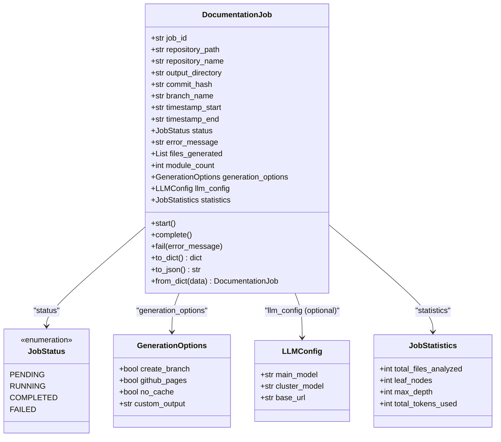
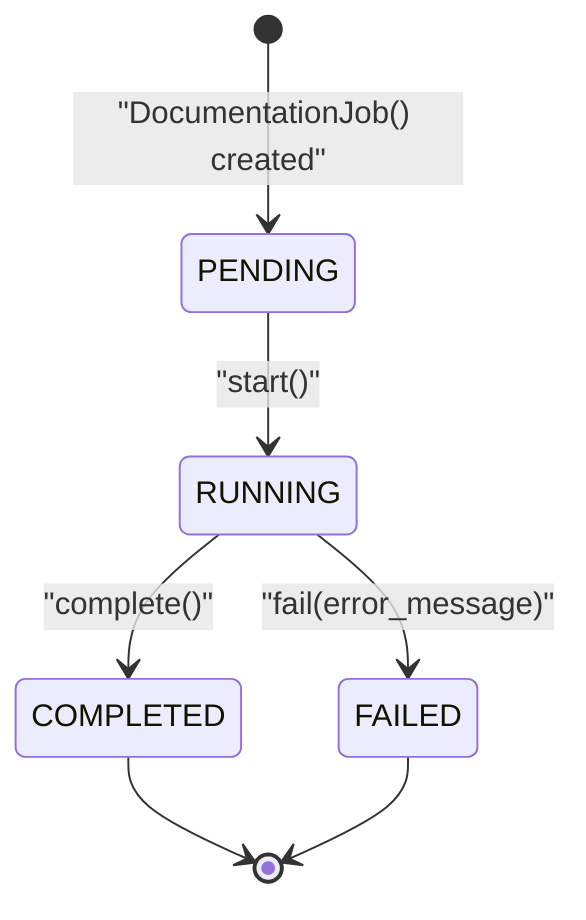
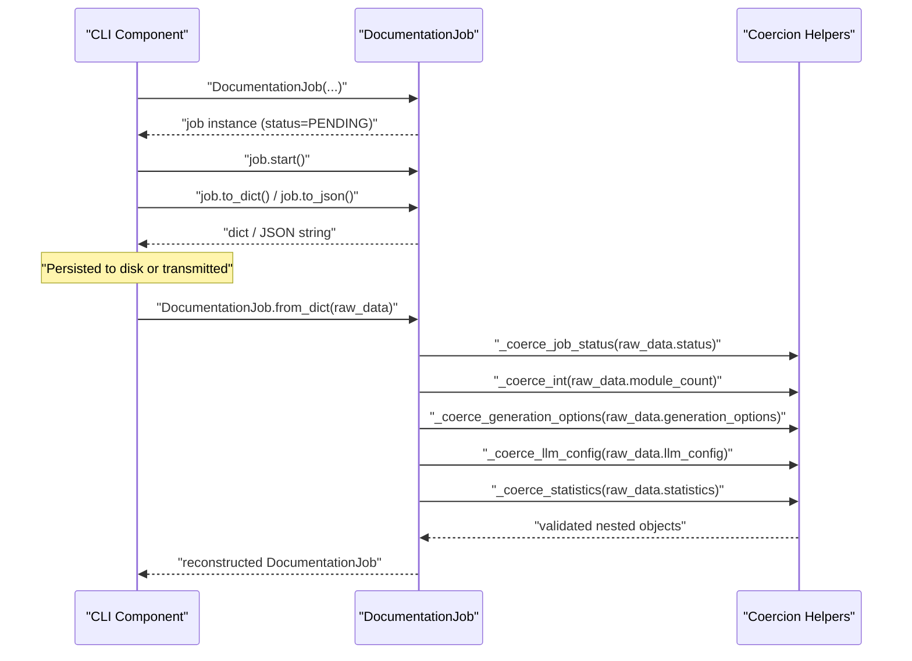
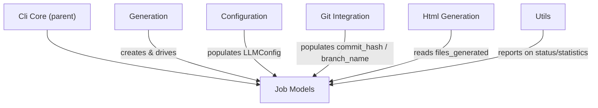

# Job Models

## Introduction

The Job Models module defines the core data structures used to represent, track, and persist documentation generation jobs within the CodeWiki CLI. It is a foundational, dependency-free module that provides typed dataclasses and enums for job state, configuration, and statistics — enabling consistent serialization, deserialization, and status tracking across the CLI documentation pipeline.

This module is a child of the [Cli Core](../../cli-core.md) module and is consumed by sibling modules such as [Generation](../generation/generation.md), [Configuration](../configuration/configuration.md), [Utils](../utils/utils.md), and other CLI orchestration components that need to create, update, or persist job records.

## Purpose and Scope

The Job Models module has a single, focused responsibility: **define the shape of a documentation job and its lifecycle**. It does not perform any I/O, orchestration, or business logic beyond simple state transitions and serialization helpers. This keeps the module lightweight, easily testable, and safe to import from anywhere in the CLI codebase without introducing circular dependencies.

Key responsibilities:
- Define the `JobStatus` enum representing the lifecycle states of a job.
- Define `GenerationOptions` for user-configurable generation behavior (branching, GitHub Pages, caching, output paths).
- Define `LLMConfig` for capturing which language models and endpoint were used for a run.
- Define `JobStatistics` for capturing quantitative results of a run (files analyzed, tree depth, tokens consumed).
- Define `DocumentationJob`, the aggregate root that ties together identity, timing, status, configuration, and results for a single documentation generation run.
- Provide robust `to_dict()` / `to_json()` / `from_dict()` methods for safe persistence and rehydration, including defensive coercion of malformed or partial data.

## Core Components

### JobStatus

`JobStatus` is a `str`-backed `Enum` representing the possible lifecycle states of a documentation job:

| Value | Meaning |
|---|---|
| `pending` | Job has been created but not yet started |
| `running` | Job is actively executing |
| `completed` | Job finished successfully |
| `failed` | Job terminated with an error |

Because it inherits from both `str` and `Enum`, instances serialize naturally to plain strings in JSON output while still supporting type-safe comparisons in code (e.g., `job.status == JobStatus.RUNNING`).

### GenerationOptions

`GenerationOptions` is a dataclass capturing user-facing flags that control how a documentation run behaves:

- `create_branch` (`bool`): Whether to create a dedicated git branch for the generated docs. Consumed by the [Git Integration](../git_integration/git_integration.md) module.
- `github_pages` (`bool`): Whether to prepare output for GitHub Pages publishing.
- `no_cache` (`bool`): Whether to bypass any caching layer during generation.
- `custom_output` (`Optional[str]`): An optional override for the output directory.

### LLMConfig

`LLMConfig` records which language models and endpoint were used to produce a job's output:

- `main_model` (`str`): The primary model used for documentation generation.
- `cluster_model` (`str`): The model used for clustering/module grouping decisions.
- `base_url` (`str`): The API base URL for the LLM provider.

This is a plain, required-field dataclass (no defaults), reflecting that when an `LLMConfig` is attached to a job, all three fields are expected to be known.

### JobStatistics

`JobStatistics` aggregates quantitative metrics collected during a documentation run:

- `total_files_analyzed` (`int`): Count of source files processed.
- `leaf_nodes` (`int`): Count of leaf-level components/modules identified.
- `max_depth` (`int`): Maximum depth of the module hierarchy produced.
- `total_tokens_used` (`int`): Total LLM tokens consumed for the run.

All fields default to `0`, so a freshly created job has a valid, zeroed-out statistics object even before execution begins.

### DocumentationJob

`DocumentationJob` is the central aggregate of this module. It represents a single documentation generation run end-to-end, combining identity, repository context, git metadata, timing, status, and nested configuration/statistics objects.

**Fields:**

| Field | Type | Description |
|---|---|---|
| `job_id` | `str` | UUID4 identifier, auto-generated if not supplied |
| `repository_path` | `str` | Absolute filesystem path to the repository being documented |
| `repository_name` | `str` | Human-readable repository name |
| `output_directory` | `str` | Destination directory for generated docs |
| `commit_hash` | `str` | Git commit SHA the job was run against |
| `branch_name` | `Optional[str]` | Git branch name, if applicable |
| `timestamp_start` | `str` | ISO-format start timestamp, auto-populated |
| `timestamp_end` | `Optional[str]` | ISO-format end timestamp, set on completion/failure |
| `status` | `JobStatus` | Current lifecycle status |
| `error_message` | `Optional[str]` | Populated when the job fails |
| `files_generated` | `List[str]` | Paths of documentation files produced |
| `module_count` | `int` | Number of modules documented |
| `generation_options` | `GenerationOptions` | Options selected for this run |
| `llm_config` | `Optional[LLMConfig]` | LLM configuration used, if known |
| `statistics` | `JobStatistics` | Quantitative results of the run |

**Lifecycle methods:**

- `start()` — Transitions status to `RUNNING` and refreshes `timestamp_start`.
- `complete()` — Transitions status to `COMPLETED` and sets `timestamp_end`.
- `fail(error_message)` — Transitions status to `FAILED`, records the error, and sets `timestamp_end`.

**Serialization methods:**

- `to_dict()` — Produces a JSON-serializable `dict` representation, flattening nested dataclasses (`GenerationOptions`, `LLMConfig`, `JobStatistics`) into plain dicts and converting `JobStatus` to its string value.
- `to_json()` — Convenience wrapper around `to_dict()` that returns a pretty-printed JSON string (2-space indent).
- `from_dict(data)` — Classmethod that reconstructs a `DocumentationJob` from a raw dictionary (e.g., loaded from a JSON file), using defensive coercion helpers to tolerate missing, malformed, or partial fields.

### Defensive Coercion Helpers

The module defines several private module-level helper functions used exclusively by `DocumentationJob.from_dict()` to safely rebuild nested objects from untrusted or partial data:

- `_coerce_job_status(value, default)` — Converts a raw value to a valid `JobStatus`, falling back to `JobStatus.PENDING` (or a supplied default) if the value is `None` or not a recognized status string.
- `_coerce_int(value, default)` — Safely converts a value to `int`, returning a default (`0`) on `None`, `TypeError`, or `ValueError`.
- `_coerce_generation_options(value)` — Rebuilds a `GenerationOptions` from a dict, defaulting missing keys.
- `_coerce_llm_config(value)` — Rebuilds an `LLMConfig` from a dict, or returns `None` if no data is present.
- `_coerce_statistics(value)` — Rebuilds a `JobStatistics` from a dict, defaulting missing/invalid numeric fields to `0`.

This coercion layer makes `DocumentationJob.from_dict()` resilient to schema drift (e.g., loading job files written by an older version of the CLI) without raising exceptions during deserialization.

## Architecture

### Component Structure

### Job Lifecycle State Machine

### Serialization / Deserialization Flow

## Integration with Other Modules

The Job Models module is intentionally dependency-free (it only imports from the Python standard library), which allows it to be safely imported by any layer of the CLI without risk of circular imports:

- **[Cli Core](../../cli-core.md)** (parent module): Exposes `DocumentationJob`, `GenerationOptions`, `JobStatistics`, `JobStatus`, and `LLMConfig` as part of its public component surface, making them available to all CLI subsystems.
- **[Generation](../generation/generation.md)**: The `CLIDocumentationGenerator` creates and drives `DocumentationJob` instances through their lifecycle (`start()` → `complete()`/`fail()`), populating `files_generated`, `module_count`, and `statistics` as generation proceeds.
- **[Configuration](../configuration/configuration.md)**: `ConfigManager` and the `Configuration`/`AgentInstructions` models supply values (such as model names and base URLs) that are captured into a job's `LLMConfig`.
- **[Git Integration](../git_integration/git_integration.md)**: `GitManager` supplies `commit_hash` and `branch_name` values and consults `GenerationOptions.create_branch` to decide whether to create a dedicated branch for generated documentation.
- **[Utils](../utils/utils.md)**: `CLILogger` and `ProgressTracker`/`ModuleProgressBar` report on job progress using the status and statistics captured on `DocumentationJob` instances.
- **[Html Generation](../html_generation/html_generation.md)**: `HTMLGenerator` may reference `files_generated` and `output_directory` from a completed job when producing rendered output.

## Design Notes

- **Immutability of shape, mutability of state**: While the dataclasses themselves are mutable (no `frozen=True`), the module encourages controlled mutation through explicit lifecycle methods (`start()`, `complete()`, `fail()`) rather than direct field assignment, keeping status transitions predictable and auditable.
- **Safe round-tripping**: The combination of `to_dict()`/`to_json()` and `from_dict()` with defensive coercion helpers ensures that job records can be persisted to disk (e.g., as job history or resumable state) and reloaded reliably even if the on-disk schema is incomplete or slightly out of date.
- **String-backed enum**: `JobStatus` extending `str` means job status values serialize directly as readable strings in JSON without requiring custom encoders, simplifying integration with logging, CLI output, and external tooling.
- **Zero external dependencies**: The module relies only on `dataclasses`, `datetime`, `typing`, `enum`, `uuid`, and `json` from the standard library, making it trivially testable and reusable across CLI contexts.
