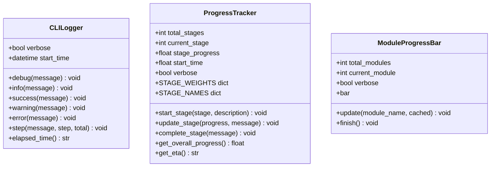
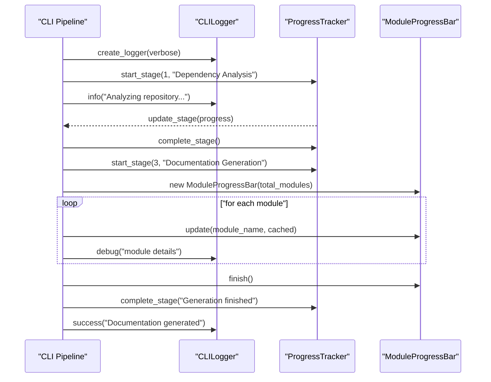
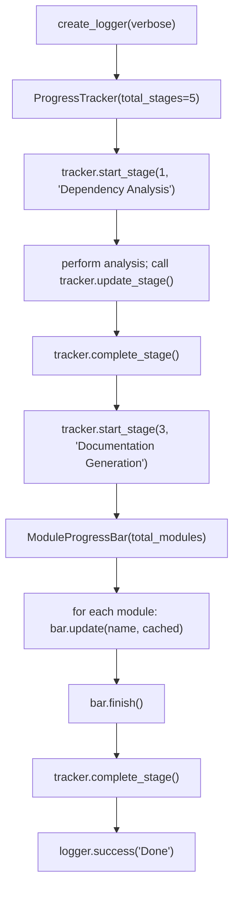

# Utils

The Utils module provides the foundational output and progress-reporting primitives used throughout the [CLI Core](../cli_core.md) subsystem. It contains no business logic of its own; instead it supplies two small, dependency-light building blocks — a colored console logger and a multi-stage progress tracker — that every other CLI component (job orchestration, generation, git integration, HTML generation) relies on to communicate status to the end user.

Because these utilities sit at the bottom of the CLI dependency graph, they are intentionally free of imports from other CLI modules. This keeps them reusable, easy to test, and safe to import from anywhere in the CLI without risking circular dependencies.

## Purpose and Scope

The module addresses two related but distinct concerns:

1. **Structured, leveled console output** — via `CLILogger`, which standardizes how informational, success, warning, error, debug, and step messages are rendered to the terminal (including color and timestamps), and quiets noisy third-party HTTP/SDK loggers.
2. **Progress and ETA reporting** — via `ProgressTracker` (stage-weighted progress across the overall documentation pipeline) and `ModuleProgressBar` (per-module progress during the module-by-module generation phase).

These two concerns are complementary: `CLILogger` handles ad-hoc textual messages, while the progress classes handle numeric/visual progress state and time estimation for long-running operations.

## Component Overview

### CLILogger

`CLILogger` (`codewiki/cli/utils/logging.py`) is the standard mechanism for writing user-facing output during a CLI run. It wraps [Click](https://click.palletsprojects.com/)'s `echo`/`secho` helpers and adds:

- **Leveled methods**: `debug`, `info`, `success`, `warning`, `error`, and `step`, each with a distinct color and symbol (✓ for success, ⚠️ for warning, ✗ for error) so terminal output is easy to scan.
- **Verbose-only debug output**: `debug()` messages are only rendered when `verbose=True`, and are timestamped for correlation with other logs.
- **Step announcements**: `step()` renders either a `[current/total]` prefix (when both `step` and `total` are supplied) or a generic arrow (`→`) prefix, useful for announcing pipeline phases.
- **Elapsed time tracking**: `elapsed_time()` reports time since the logger was constructed, formatted as `Xm Ys` or `Ys`.

The module also exposes two module-level helpers:

- `quiet_third_party_loggers(level=logging.WARNING)` — caps the log level of noisy third-party libraries (`httpx`, `openai`, `openai._base_client`, `anthropic`) so that a documentation run does not produce thousands of INFO-level HTTP request lines in CI output. This is applied explicitly rather than as an import-time side effect, so its behavior is visible at the call site.
- `create_logger(verbose=False)` — the standard factory used by CLI entry points to construct a properly configured `CLILogger`, automatically invoking `quiet_third_party_loggers()` first.

### ProgressTracker

`ProgressTracker` (`codewiki/cli/utils/progress.py`) models the overall documentation generation pipeline as five weighted stages:

| Stage | Name | Weight |
|-------|------|--------|
| 1 | Dependency Analysis | 40% |
| 2 | Module Clustering | 20% |
| 3 | Documentation Generation | 30% |
| 4 | HTML Generation (optional) | 5% |
| 5 | Finalization | 5% |

These weights (`STAGE_WEIGHTS`) reflect the relative time each stage is expected to consume, and are used to compute an aggregate `get_overall_progress()` value across the whole run, independent of how much intra-stage progress has been made.

Key behaviors:

- `start_stage(stage, description=None)` resets stage progress to `0.0`, records the stage start time, and prints a banner (verbose mode includes elapsed time; non-verbose mode shows a compact `[stage/total]` header).
- `update_stage(progress, message=None)` clamps `progress` to `[0.0, 1.0]` and, in verbose mode, prints an indented status message.
- `complete_stage(message=None)` sets stage progress to `1.0` and, in verbose mode, prints the stage's wall-clock duration plus any completion message.
- `get_overall_progress()` sums the weights of fully completed stages plus the weighted fraction of the current stage's progress.
- `get_eta()` extrapolates total run time from elapsed time and overall progress, returning a human-readable estimate (e.g., `"2m 15s"`, `"1h 5m"`, or `"< 1 min"`), or `None` if no progress has been made yet (avoiding a divide-by-zero).

This stage model is the shared contract that pipeline-driving code (in the [Job Models](../job_models/job_models.md) and generation layers) uses to report high-level progress consistently.

### ModuleProgressBar

`ModuleProgressBar` (`codewiki/cli/utils/progress.py`) is a narrower, complementary tool used specifically during the "Documentation Generation" stage, where progress is naturally expressed as "N of M modules processed" rather than a continuous percentage.

- In **non-verbose** mode, it wraps `click.progressbar` to render a live terminal progress bar with ETA and percentage, entering the context manager on construction (`__enter__`) and exiting it on `finish()` (`__exit__`).
- In **verbose** mode, no bar is drawn; instead, `update()` prints one line per module, showing whether the module was `✓ (cached)` or `⟳ (generating)`.
- `update(module_name, cached=False)` increments the internal module counter and reports progress using whichever mode is active.
- `finish()` safely closes the underlying `click.progressbar` context if one was opened.

Because `ModuleProgressBar` owns a `click.progressbar` context manager internally, callers should ensure `finish()` is invoked (e.g., in a `finally` block) even if module generation raises an exception, to avoid leaving the terminal progress bar in an inconsistent state.

## Interaction with the Broader CLI Pipeline

The Utils module is consumed — not the consumer. Higher-level orchestration code (such as the documentation generation flow) drives both `ProgressTracker` and `ModuleProgressBar` in tandem: `ProgressTracker` reports macro-level stage progress across the whole run, while `ModuleProgressBar` provides fine-grained visibility during the module generation stage specifically. `CLILogger` is used throughout for all textual status, warnings, and errors.

## Typical Usage Flow

## Design Notes

- **No cross-module coupling**: Neither `CLILogger` nor the progress classes depend on other CLI modules such as [Configuration](../configuration/configuration.md), [Job Models](../job_models/job_models.md), or [Generation](../generation/generation.md). This keeps them trivially reusable and testable in isolation.
- **Verbose vs. non-verbose modes are first-class**: Every class exposes a `verbose` flag that changes rendering strategy (timestamped multi-line logs vs. compact single-line/progress-bar output), rather than relying on global logging configuration.
- **Explicit side-effect application**: `quiet_third_party_loggers()` is called from `create_logger()` rather than at module import time, so that importing the `utils` package never silently mutates global logging state — the effect only occurs when a caller explicitly requests a logger.
- **Time estimation is defensive**: `get_eta()` guards against division by zero when no progress has been recorded, returning `None` instead of raising or producing a nonsensical estimate.

## Relationship to Parent and Sibling Modules

The Utils module is a child of [CLI Core](../cli_core.md), alongside:

- [Generation](../generation/generation.md) — the documentation generation adapter that most heavily relies on `ProgressTracker` and `ModuleProgressBar` to report pipeline progress.
- [Configuration](../configuration/configuration.md) — CLI configuration models and the config manager.
- [Job Models](../job_models/job_models.md) — data models representing documentation jobs, statuses, and statistics that the progress-tracking stages correspond to.
- [Git Integration](../git_integration/git_integration.md) — git operations invoked during pipeline execution, whose status is typically reported via `CLILogger`.
- [HTML Generation](../html_generation/html_generation.md) — the optional HTML rendering stage represented as Stage 4 in `ProgressTracker.STAGE_NAMES`.

These sibling modules depend on Utils for consistent status reporting; Utils itself has no dependency on them.
