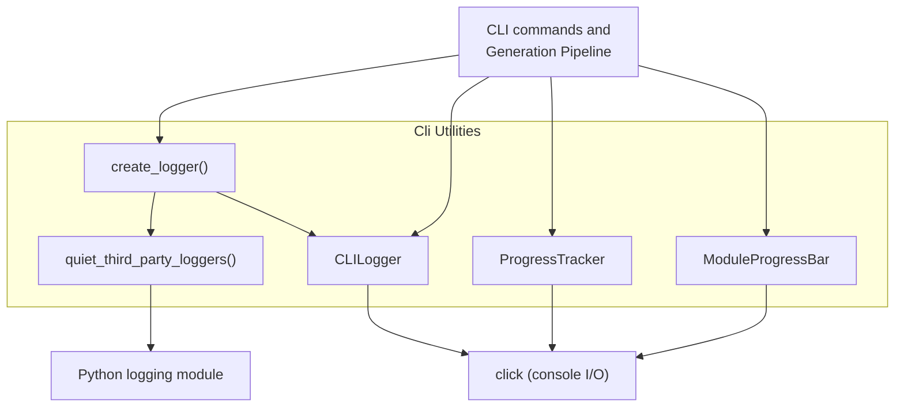
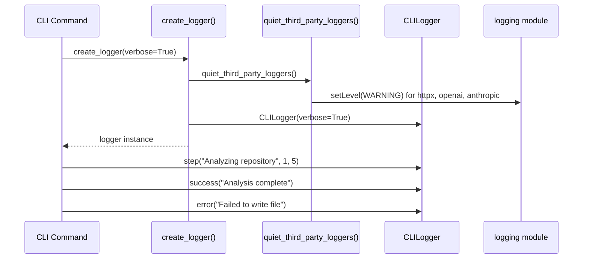
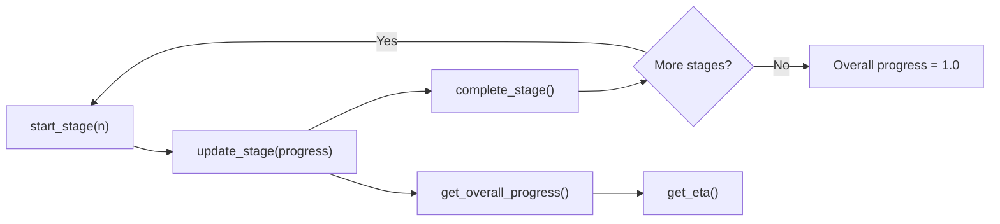
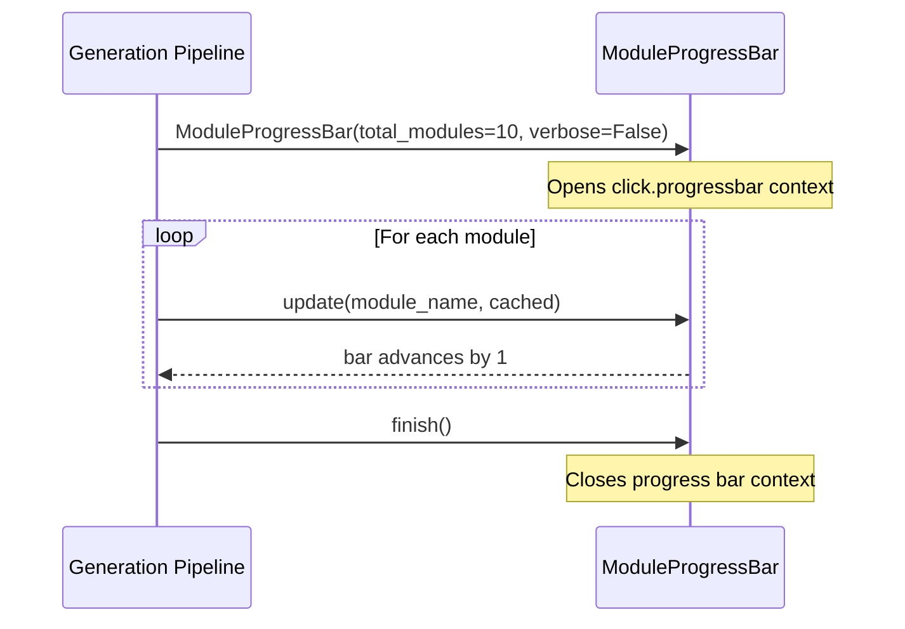
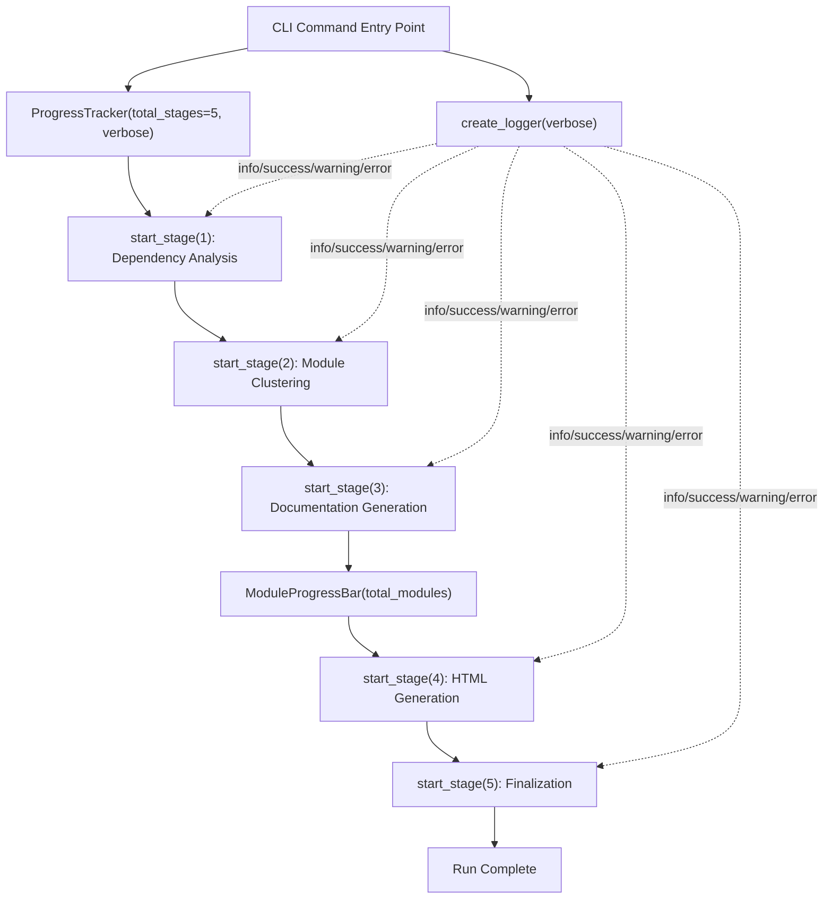

# Cli Utilities

The Cli Utilities module provides the foundational cross-cutting services used throughout the CodeWiki command-line interface: structured, colorized console logging and multi-stage progress reporting with ETA estimation. These utilities have no dependencies on other CLI subsystems, making them the lowest-level building blocks that every other part of the CLI relies on for user-facing feedback.

This module is a child of the [Cli Core](cli-core.md) module and is used by the [Generation Pipeline](generation_pipeline.md) and other CLI components to communicate execution status, warnings, errors, and progress to the end user during a documentation generation run.

## Purpose and Scope

The Cli Utilities module solves two related problems for the CLI:

1. **Consistent, readable console output** — via `CLILogger`, which standardizes how informational, success, warning, error, debug, and step messages are formatted and colored.
2. **Progress visibility for long-running operations** — via `ProgressTracker` (stage-based progress with ETA) and `ModuleProgressBar` (per-module progress during documentation generation).

Both concerns are intentionally kept separate from business logic (dependency analysis, documentation generation, configuration handling) so that any component can report status without being coupled to a specific pipeline stage.

## Core Components

| Component | File | Responsibility |
|---|---|---|
| `CLILogger` | `codewiki/cli/utils/logging.py` | Colorized, leveled console logging with elapsed-time tracking |
| `ProgressTracker` | `codewiki/cli/utils/progress.py` | Weighted, multi-stage progress tracking with ETA estimation |
| `ModuleProgressBar` | `codewiki/cli/utils/progress.py` | Simple per-module progress indicator (bar or verbose log lines) |

## Architecture Overview



### Relationship to other Cli Core modules

`CLILogger`, `ProgressTracker`, and `ModuleProgressBar` are consumed by higher-level orchestration code such as `CLIDocumentationGenerator`, `GitManager`, and `HTMLGenerator` in the [Generation Pipeline](generation_pipeline.md) module, which invoke these utilities to report progress while performing dependency analysis, module clustering, documentation generation, and HTML rendering. The utilities module itself has no outbound dependency on any other Cli Core sub-module — it depends only on the `click` library and the Python standard `logging` module.

## CLILogger

`CLILogger` provides a small, opinionated logging API tailored for CLI tools, built on top of `click.echo` / `click.secho` rather than the standard `logging` module's handler/formatter machinery. This keeps output simple and colorized without requiring log configuration.

### Behavior

- **Verbose vs. normal mode**: Controlled by the `verbose` constructor flag. Debug messages are suppressed unless `verbose=True`.
- **Elapsed time tracking**: The logger records its creation time (`start_time`) and exposes `elapsed_time()` to report how long the logger (and typically the CLI run) has been active.
- **Message severity methods**:
  - `debug(message)` — cyan, dim, timestamped; only shown in verbose mode.
  - `info(message)` — plain output via `click.echo`.
  - `success(message)` — green, prefixed with a checkmark (`✓`).
  - `warning(message)` — yellow, prefixed with a warning icon (`⚠️`).
  - `error(message)` — red, prefixed with a cross (`✗`), written to `stderr` (`err=True`).
  - `step(message, step, total)` — blue, bold; shows a `[step/total]` prefix when both are provided, otherwise a generic `→` arrow.

### Third-Party Logger Noise Suppression

Documentation generation runs make many HTTP calls to LLM providers (OpenAI, Anthropic) via `httpx`. Left unconfigured, these libraries emit one INFO line per request, which floods CI and terminal output. The module addresses this deliberately:

- `_NOISY_THIRD_PARTY_LOGGERS` is a fixed tuple of logger names (`httpx`, `openai`, `openai._base_client`, `anthropic`).
- `quiet_third_party_loggers(level=logging.WARNING)` sets each of these standard-library loggers to `WARNING` level.
- This is applied explicitly inside `create_logger()` rather than as an import-time side effect, so that the behavior is visible at the call site and does not silently affect code paths that merely import the logging module without needing a CLI logger.

### Factory Function

`create_logger(verbose=False)` is the recommended entry point for obtaining a `CLILogger`: it first calls `quiet_third_party_loggers()` and then constructs and returns a `CLILogger(verbose=verbose)` instance.



## ProgressTracker

`ProgressTracker` models documentation generation as a fixed sequence of weighted stages and reports overall progress and an estimated time to completion (ETA).

### Stage Model

The tracker defines five stages, each with a fixed weight representing its expected share of total run time:

| Stage | Name | Weight |
|---|---|---|
| 1 | Dependency Analysis | 40% |
| 2 | Module Clustering | 20% |
| 3 | Documentation Generation | 30% |
| 4 | HTML Generation (optional) | 5% |
| 5 | Finalization | 5% |

These weights (`STAGE_WEIGHTS`) and display names (`STAGE_NAMES`) are class-level constants, ensuring consistent progress calculation regardless of which specific CLI command instantiates the tracker.

### Key Methods

- `start_stage(stage, description=None)` — Marks the beginning of a stage, resets `stage_progress` to `0.0`, and records the stage start time. Prints a formatted header (with elapsed time and phase indicator in verbose mode, or a compact `[stage/total]` line otherwise).
- `update_stage(progress, message=None)` — Updates the fractional progress (0.0–1.0) within the current stage; in verbose mode also prints an optional status message with elapsed time.
- `complete_stage(message=None)` — Sets `stage_progress` to `1.0` and, in verbose mode, prints the stage duration and any completion message.
- `get_overall_progress()` — Computes total progress as the sum of weights for fully completed stages plus the weighted fractional progress of the current stage.
- `get_eta()` — Extrapolates total estimated duration from elapsed time and current overall progress, returning a human-readable remaining-time string (e.g., `"2m 30s"`, `"1h 5m"`, or `"< 1 min"`), or `None` if progress is `0.0`.
- `_format_elapsed()` — Internal helper formatting elapsed seconds as `MM:SS`.

### Progress Calculation Flow



The formula used in `get_overall_progress()` is:

```text
overall_progress = sum(STAGE_WEIGHTS[s] for s in completed_stages)
                  + STAGE_WEIGHTS[current_stage] * stage_progress
```

## ModuleProgressBar

`ModuleProgressBar` provides simpler, per-item progress feedback for the module-by-module documentation generation phase (Stage 3, Documentation Generation), where the total unit of work is a count of modules rather than a continuous percentage.

### Behavior

- **Non-verbose mode**: Wraps `click.progressbar` to render an interactive terminal progress bar with ETA and percentage, labeled `"Generating modules"`. The bar is opened via `__enter__()` in the constructor and must be closed via `finish()`.
- **Verbose mode**: Instead of a progress bar, prints one line per module update in the form `[current/total] module_name... status`, where status is either `"✓ (cached)"` (when the module's documentation was loaded from cache) or `"⟳ (generating)"` (when freshly generated).
- `update(module_name, cached=False)` — Increments `current_module` and reports status per the active mode.
- `finish()` — Closes the underlying `click.progressbar` context if one is active, releasing terminal resources.



## Usage Patterns

Typical usage within a CLI command combines both utilities: `CLILogger` for narrative status messages and `ProgressTracker` / `ModuleProgressBar` for quantitative progress feedback during a multi-stage run orchestrated by components such as `CLIDocumentationGenerator` in the [Generation Pipeline](generation_pipeline.md) module.



## Design Notes

- **No shared state between components**: `CLILogger`, `ProgressTracker`, and `ModuleProgressBar` are independent classes with no cross-references. A caller composes them as needed rather than the utilities module enforcing a particular workflow.
- **Click-based rendering**: All terminal output goes through `click`'s `echo`/`secho`/`progressbar` APIs, ensuring consistent behavior across platforms (including color support detection) without additional dependencies.
- **Explicit noise suppression**: Third-party HTTP/SDK logger suppression is opt-in via `create_logger()`, avoiding surprising global side effects for modules that only need the `CLILogger` class without invoking the factory.
