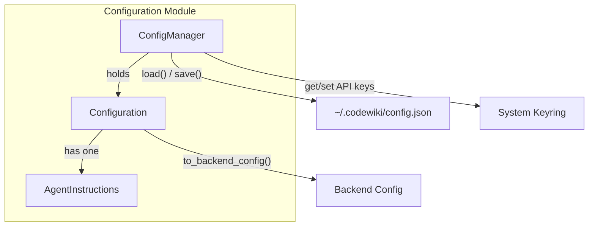
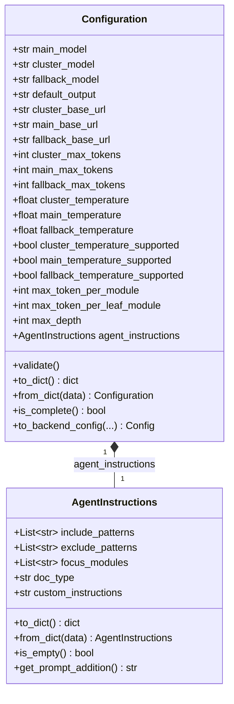
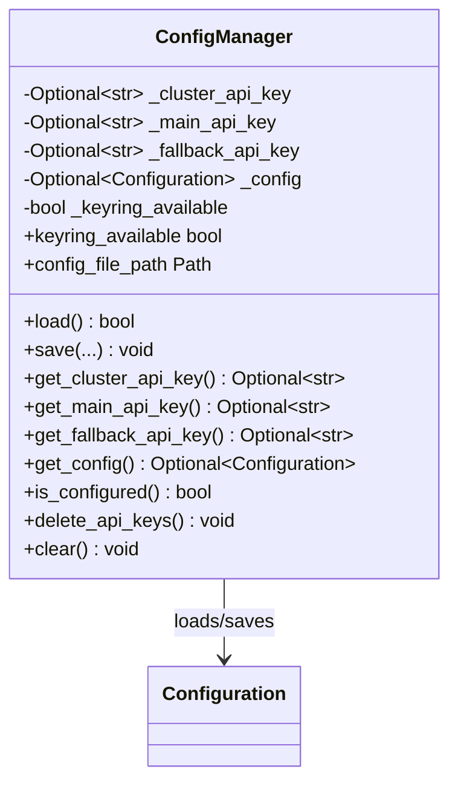
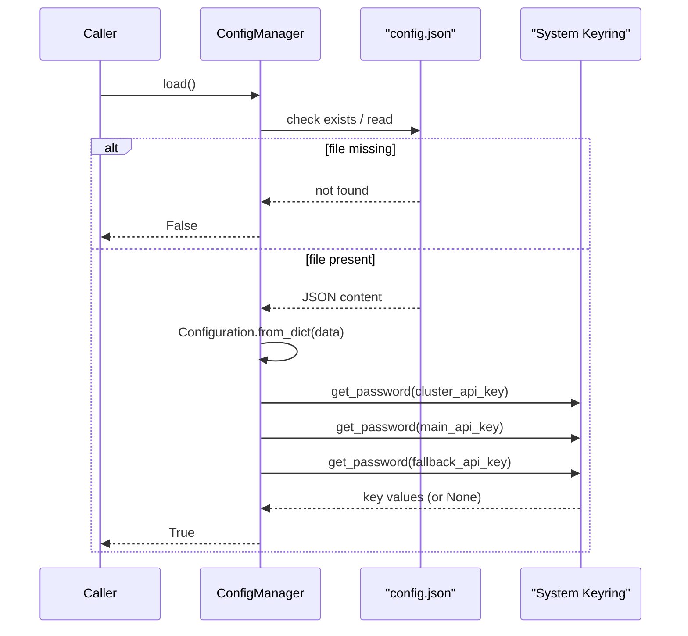
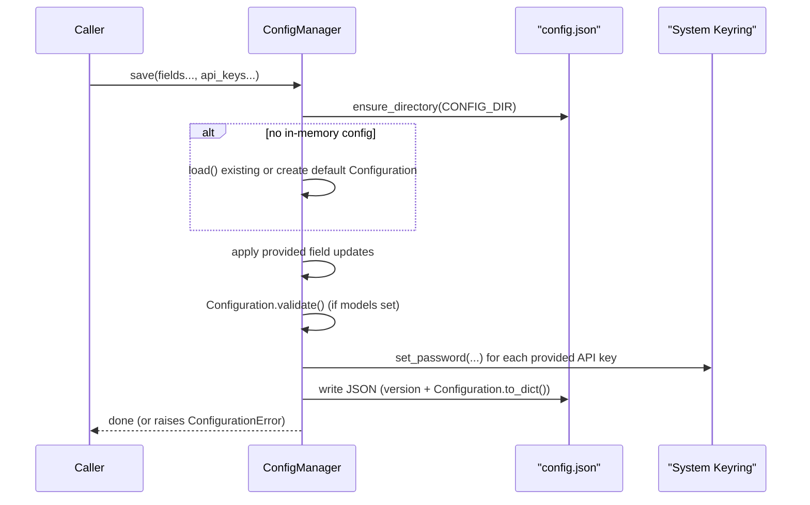
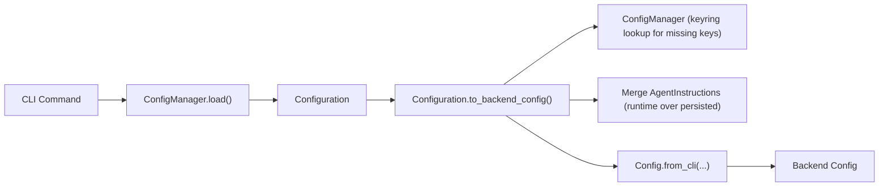

# Configuration

The Configuration module provides the persistent settings layer for the CodeWiki CLI. It defines the data models that describe user preferences (LLM providers, model names, token limits, temperature settings, and documentation-generation instructions) and the manager responsible for reading and writing those settings safely to disk and to the operating system's secure credential store.

This module is a child of [Cli Core](../cli-core.md) and works alongside sibling modules such as the job/runtime models, generation pipeline, and utility helpers to support the CLI's end-to-end workflow.

## Purpose and Scope

The Configuration module answers three core questions for the CLI:

1. **What settings does the user have configured?** — captured by the `Configuration` dataclass.
2. **How should the documentation agent behave for a given run?** — captured by `AgentInstructions`.
3. **How are these settings persisted, validated, and loaded securely?** — handled by `ConfigManager`.

Sensitive values (API keys) are never written to plaintext configuration files. Instead, they are stored using the system keyring (macOS Keychain, Windows Credential Manager, or Linux Secret Service) and only non-sensitive settings are persisted to `~/.codewiki/config.json`.

## Core Components

| Component | Responsibility |
|---|---|
| `Configuration` | Dataclass representing all persistent CLI settings: model names, base URLs, API versions, token/temperature limits, and clustering parameters. |
| `AgentInstructions` | Dataclass representing optional, user-customizable instructions for the documentation agent (file filters, focus modules, doc type, free-form instructions). |
| `ConfigManager` | Orchestrates loading/saving `Configuration` to `~/.codewiki/config.json` and securely storing/retrieving API keys via keyring. |

## Architecture Overview

`Configuration` is a plain, serializable dataclass with no direct dependency on keyring or the filesystem — those concerns are owned exclusively by `ConfigManager`. This separation keeps the data model easy to test and reuse, while `ConfigManager` acts as the single access point for persistence.

## Data Model: Configuration

`Configuration` captures all settings needed to drive a documentation-generation run, organized into three provider "roles":

- **cluster** — model used for module clustering/decomposition
- **main** — primary model used for documentation generation
- **fallback** — fallback model used when the main model fails or is rate-limited

For each role, the model tracks:
- Model name (`*_model`)
- Base URL (`*_base_url`, optional — for OpenAI-compatible or self-hosted endpoints)
- API version (`*_api_version`, optional)
- Max tokens (`*_max_tokens`)
- Temperature (`*_temperature`) and whether temperature is supported (`*_temperature_supported`)
- Max-token parameter field name (`*_max_token_field`, e.g., `"max_tokens"` vs. provider-specific names)

In addition to per-provider settings, `Configuration` holds shared clustering parameters (`max_token_per_module`, `max_token_per_leaf_module`, `max_depth`) and a `default_output` directory. API keys (`cluster_api_key`, `main_api_key`, `fallback_api_key`) exist on the dataclass only as **runtime-only fields** — they are never serialized by `to_dict()` and are populated separately from the keyring by `ConfigManager`.

### Validation

`Configuration.validate()` performs field-level checks:
- Base URLs (when set) are validated via `validate_url`.
- Model names for all three roles are validated via `validate_model_name`.

`from_dict()` performs defensive type coercion when loading from JSON (which may contain string-typed numbers/booleans due to manual editing), converting and range-checking integers (e.g., token limits), floats (temperature, bounded `0.0`–`2.0`), and booleans, raising `ValueError` on invalid input.

### Serialization Rules

- `to_dict()` only emits optional fields (`*_base_url`, `*_api_version`, `agent_instructions`) when they are set/non-empty, keeping the persisted JSON minimal.
- API keys are **excluded** from `to_dict()` entirely — they are never written to `config.json`.

## Data Model: AgentInstructions

`AgentInstructions` lets users customize how the documentation agent analyzes a repository and generates content:

- `include_patterns` / `exclude_patterns` — glob-style file filters (e.g., `["*.cs"]`, `["*Tests*"]`)
- `focus_modules` — modules that should receive more detailed documentation
- `doc_type` — a preset documentation style (`api`, `architecture`, `user-guide`, `developer`) or a free-form type
- `custom_instructions` — arbitrary additional guidance passed to the LLM

`get_prompt_addition()` translates these fields into a natural-language instruction block that is merged into the agent's prompt at generation time. `is_empty()` allows callers to distinguish "no customization" from "customization with all-default values."

Instructions can be set persistently (stored in `config.json` as part of `Configuration`) or supplied at runtime for a single job; `Configuration.to_backend_config()` merges the two, with runtime instructions taking precedence field-by-field.

## ConfigManager: Persistence and Secure Storage

`ConfigManager` is the sole component responsible for reading and writing configuration state. It manages two independent storage backends:

1. **JSON file** (`~/.codewiki/config.json`) — non-sensitive settings, versioned with a `CONFIG_VERSION` marker for future migrations.
2. **System keyring** (via the `keyring` library) — the three provider API keys (`cluster_api_key`, `main_api_key`, `fallback_api_key`), stored under a shared `codewiki` service name with distinct account identifiers.

### Load Flow

### Save Flow

Key behaviors:
- **Partial updates**: `save()` accepts every field as an optional keyword argument; only provided values overwrite the in-memory `Configuration`, allowing incremental configuration (e.g., `codewiki configure` sub-commands that set one field at a time).
- **Validation gate**: full validation (`Configuration.validate()`) only runs once `main_model` and `cluster_model` are both set, avoiding premature failures during multi-step setup.
- **Keyring failures surface as `ConfigurationError`**, with an actionable message when the OS keychain is unavailable or misconfigured.
- **`is_configured()`** combines two checks: all three API keys must be retrievable from keyring, and `Configuration.is_complete()` must be true (all three model names set).
- **`clear()`** performs a full reset — deleting API keys from keyring and removing `config.json` — used by commands like `codewiki configure --reset`.

## Bridging to Runtime Execution: to_backend_config

`Configuration.to_backend_config()` is the seam between this module's persistent settings and the runtime configuration consumed by the documentation-generation backend. It:

1. Fetches any missing API keys from the keyring via a fresh `ConfigManager` instance (if not explicitly passed in).
2. Merges `runtime_instructions` (per-invocation `AgentInstructions`) over the persisted `agent_instructions`, with runtime values taking precedence field-by-field.
3. Constructs and returns a backend `Config` object (`Config.from_cli(...)`) populated with all model, token, temperature, and clustering settings, ready to drive a documentation job.

This bridging pattern keeps the CLI's persistent, user-facing settings model (`Configuration`) decoupled from the backend's execution-time `Config` model. The backend `Config` class itself is documented in the [Config Core](../config-core.md) module.

## Relationship to Other CLI Modules

- **[Job Models](../job_models/job_models.md)** — represents the runtime state of an in-progress documentation job (`DocumentationJob`, `JobStatus`, `LLMConfig`, `GenerationOptions`, `JobStatistics`). Where `Configuration` describes *persistent user preferences*, the job models describe the *live execution* of a single generation run, often derived from a `Configuration` via `to_backend_config()`.
- **[Generation](../generation/generation.md)** — the `CLIDocumentationGenerator` adapter consumes a resolved `Configuration`/backend `Config` to drive the documentation pipeline.
- **[Utils](../utils/utils.md)** — provides shared filesystem (`ensure_directory`, `safe_read`, `safe_write`) and error types (`ConfigurationError`, `FileSystemError`) used internally by `ConfigManager`.

## Summary

The Configuration module is the trust boundary for user secrets and the single source of truth for persistent CLI preferences. `Configuration` and `AgentInstructions` define what can be configured; `ConfigManager` defines how those settings are safely loaded, validated, updated, and translated into a form the backend documentation pipeline can execute against.
