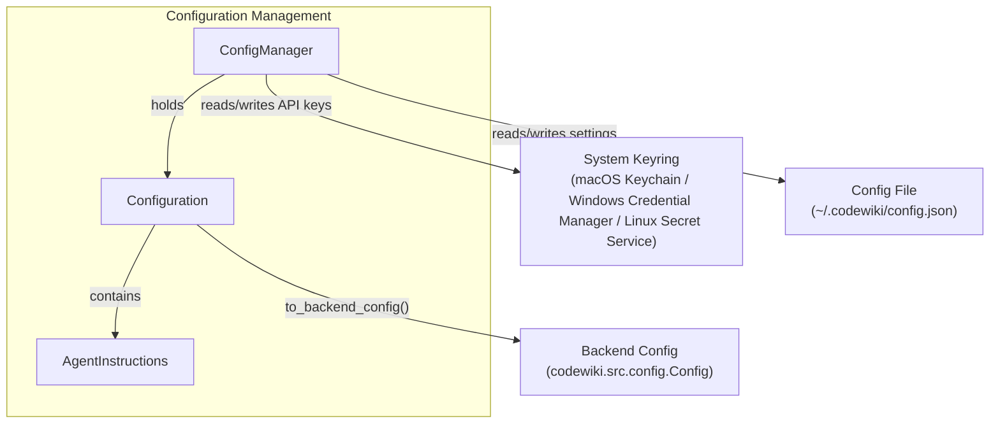
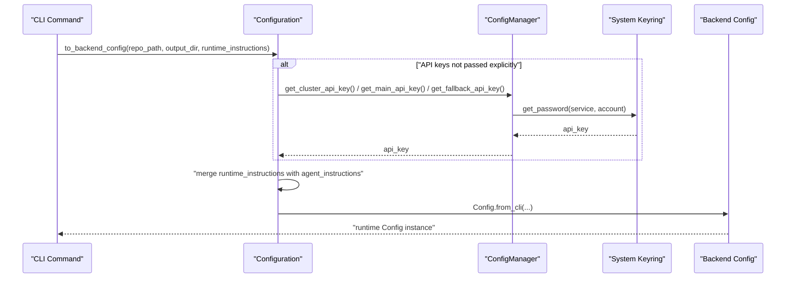
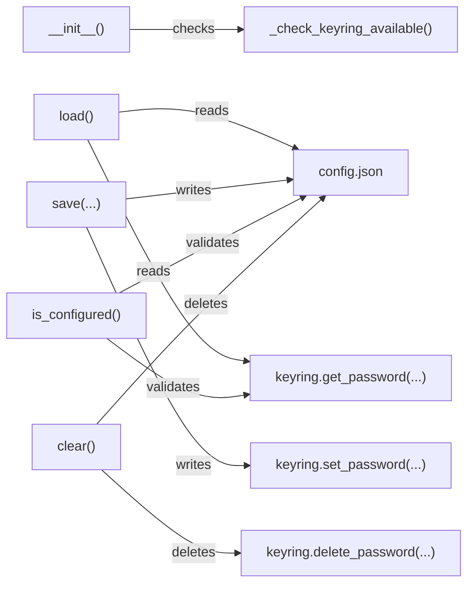
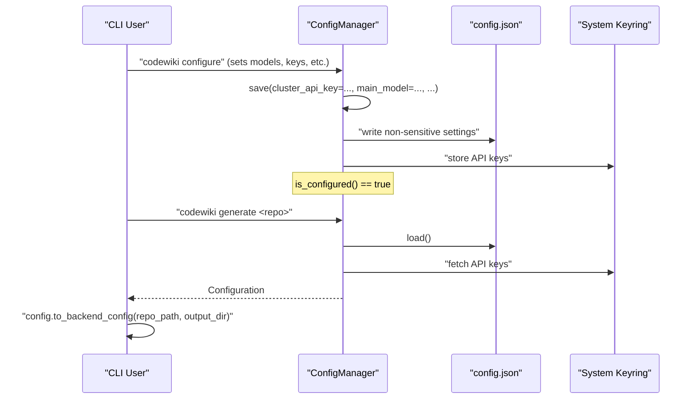

# Configuration Management

## Introduction

The Configuration Management module is responsible for defining, validating, persisting, and securely retrieving all user-configurable settings for the CodeWiki CLI. It provides the data models that describe LLM provider configuration (model names, base URLs, API versions, token limits, temperature settings), custom agent instructions for documentation generation, and the manager class that orchestrates reading and writing these settings between a local JSON configuration file and the operating system's secure credential store (keyring).

This module sits at the foundation of the [Cli Core](cli-core.md) module, acting as the bridge between persistent user preferences (stored on disk and in the OS keychain) and the runtime configuration consumed by the documentation generation backend (`codewiki.src.config.Config`, documented in the [Config Core](config-core.md) module).

## Purpose and Responsibilities

The Configuration Management module handles three core responsibilities:

1. **Data Modeling** — `Configuration` and `AgentInstructions` define the shape and validation rules for all persisted CLI settings, including per-provider (cluster/main/fallback) model configuration.
2. **Secure Persistence** — `ConfigManager` coordinates writing non-sensitive settings to `~/.codewiki/config.json` while delegating sensitive API keys to the system keyring (macOS Keychain, Windows Credential Manager, or Linux Secret Service).
3. **Configuration Bridging** — `Configuration.to_backend_config()` translates the CLI's persistent configuration model into the backend's runtime `Config` object, merging in per-invocation overrides such as runtime agent instructions and API keys.

## Core Components

| Component | Responsibility |
|---|---|
| `ConfigManager` | Loads/saves configuration to disk and keyring; exposes API key retrieval, validation status, and configuration reset operations |
| `Configuration` | Dataclass representing the full set of persistent settings (models, URLs, token limits, temperatures, agent instructions) |
| `AgentInstructions` | Dataclass representing optional customization instructions (file filters, focus modules, doc type, free-form instructions) passed to the documentation agent |

## Architecture Overview

## Data Model: Configuration

The `Configuration` dataclass captures all settings that a CLI user configures once and reuses across documentation runs. It separates settings into three model "roles":

- **Cluster model** — used for module clustering during hierarchical decomposition of a repository
- **Main model** — used for the primary documentation generation phase
- **Fallback model** — used when the main model is unavailable or fails

For each role, `Configuration` tracks:
- Model name (`main_model`, `cluster_model`, `fallback_model`)
- API base URL (`*_base_url`)
- API version (`*_api_version`)
- Max token limit (`*_max_tokens`)
- Temperature (`*_temperature`) and whether the provider supports custom temperature (`*_temperature_supported`)
- The request field name used to specify max tokens (`*_max_token_field`), since providers differ in parameter naming

It also tracks shared clustering/decomposition settings:
- `max_token_per_module`
- `max_token_per_leaf_module`
- `max_depth`

Runtime-only fields (`cluster_api_key`, `main_api_key`, `fallback_api_key`) are present on the dataclass but are **never persisted** to the JSON file — they exist only transiently in memory and are otherwise sourced from the keyring via `ConfigManager`.

### Key Methods

| Method | Purpose |
|---|---|
| `validate()` | Validates base URLs and model names; raises on invalid configuration |
| `to_dict()` / `from_dict()` | Serialize/deserialize to/from a JSON-compatible dictionary, with type coercion (int/float/bool) and defaulting for backward-compatible config files |
| `is_complete()` | Returns `True` if `main_model`, `cluster_model`, and `fallback_model` are all set |
| `to_backend_config()` | Converts this persistent CLI configuration into a backend `Config` instance, resolving API keys from the keyring if not explicitly supplied and merging runtime `AgentInstructions` overrides |

### Configuration → Backend Config Flow

The resulting backend `Config` object is consumed by the documentation generation pipeline described in the [Config Core](config-core.md) module and orchestrated via the [Generation Pipeline](generation_pipeline.md) module.

## Data Model: AgentInstructions

`AgentInstructions` allows users to customize how the documentation agent analyzes and documents a repository, without modifying core generation logic. Fields include:

- `include_patterns` / `exclude_patterns` — glob-style file filters (e.g., `["*.cs"]`, `["*Tests*"]`)
- `focus_modules` — modules to document with extra detail (e.g., `["src/core", "src/api"]`)
- `doc_type` — a hint (`api`, `architecture`, `user-guide`, `developer`) that maps to canned prompt guidance via `get_prompt_addition()`
- `custom_instructions` — free-form text appended to the documentation agent's prompt

`AgentInstructions` supports:
- `to_dict()` / `from_dict()` — JSON-safe serialization, omitting empty/None fields
- `is_empty()` — used to determine whether runtime overrides should take precedence over persisted defaults
- `get_prompt_addition()` — builds a composed instruction string injected into the agent's prompt at generation time

When both persisted (`Configuration.agent_instructions`) and runtime instructions are present, `Configuration.to_backend_config()` merges them field-by-field, with runtime values taking precedence over persisted ones.

## ConfigManager: Secure Persistence

`ConfigManager` is the operational entry point for reading and writing configuration. It coordinates two storage backends:

1. **`~/.codewiki/config.json`** — stores all non-sensitive `Configuration` fields (model names, URLs, token limits, temperatures, agent instructions), tagged with a `version` field (`CONFIG_VERSION = "1.0"`) for future migration support.
2. **System keyring** — stores the three per-provider API keys (`cluster_api_key`, `main_api_key`, `fallback_api_key`) under a shared service name (`codewiki`) with distinct account identifiers.

### Keyring Accounts

| Account | Purpose |
|---|---|
| `cluster_api_key` | API key for the clustering model provider |
| `main_api_key` | API key for the primary generation model provider |
| `fallback_api_key` | API key for the fallback model provider |

### Lifecycle Operations

### Key Methods

| Method | Description |
|---|---|
| `load()` | Loads `config.json` (if present) into a `Configuration` instance and populates cached API keys from the keyring. Returns `False` if no config file exists yet. |
| `save(**kwargs)` | Accepts granular keyword overrides for every configurable field. Ensures the config directory exists, merges provided values onto the existing (or newly created) `Configuration`, validates it when both `main_model` and `cluster_model` are set, persists API keys to the keyring, and writes the remaining settings to `config.json`. |
| `get_cluster_api_key()` / `get_main_api_key()` / `get_fallback_api_key()` | Lazily fetch and cache the respective API key from the keyring |
| `get_config()` | Returns the currently loaded `Configuration` object, or `None` if not loaded |
| `is_configured()` | Returns `True` only if all three API keys are present in the keyring **and** the loaded `Configuration` reports `is_complete()` |
| `delete_api_keys()` | Removes all three API keys from the keyring and clears in-memory caches |
| `clear()` | Fully resets configuration: deletes API keys from the keyring and removes `config.json` from disk |
| `keyring_available` (property) | Indicates whether the system keyring backend responded successfully during initialization |
| `config_file_path` (property) | Exposes the resolved path to `config.json` |

### Error Handling

`ConfigManager` wraps keyring and filesystem failures in `ConfigurationError` and `FileSystemError` (from `codewiki.cli.utils.errors`), ensuring CLI callers receive clear, actionable error messages rather than raw exceptions from the `keyring` library or filesystem I/O layer. Filesystem access is delegated to shared helpers (`ensure_directory`, `safe_read`, `safe_write`) from `codewiki.cli.utils.fs`.

## Integration with the CLI

Configuration Management underpins several other parts of the CLI:

- **[Generation Pipeline](generation_pipeline.md)** — the `CLIDocumentationGenerator` consumes a backend `Config` object produced via `Configuration.to_backend_config()`, which itself is populated using `ConfigManager`-retrieved settings and API keys.
- **[Job and Generation Models](job_and_generation_models.md)** — job-level settings such as `LLMConfig` and `GenerationOptions` are typically derived from, or aligned with, the persistent settings defined here.
- **[Cli Utilities](cli_utilities.md)** — logging and progress reporting utilities may surface configuration-related status (e.g., "not configured" warnings) during CLI operations that depend on `ConfigManager.is_configured()`.

## Typical Usage Flow

## Summary

The Configuration Management module provides a clean separation between **what** is configured (`Configuration`, `AgentInstructions`) and **how** it is safely stored and retrieved (`ConfigManager`). By isolating sensitive credentials in the OS keyring and keeping all other settings in a versioned JSON file, it enables the CLI to persist rich, per-provider LLM configuration across sessions while minimizing the security surface for API key exposure. This module is a direct dependency for any CLI workflow that ultimately produces a backend `Config` object for documentation generation.
