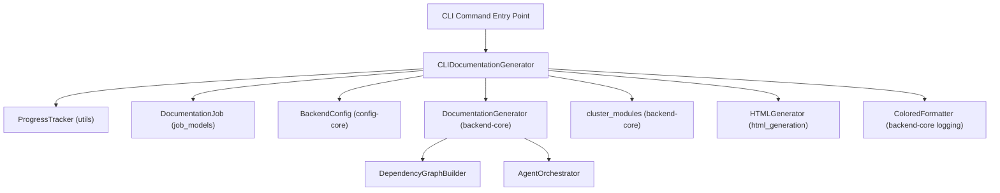
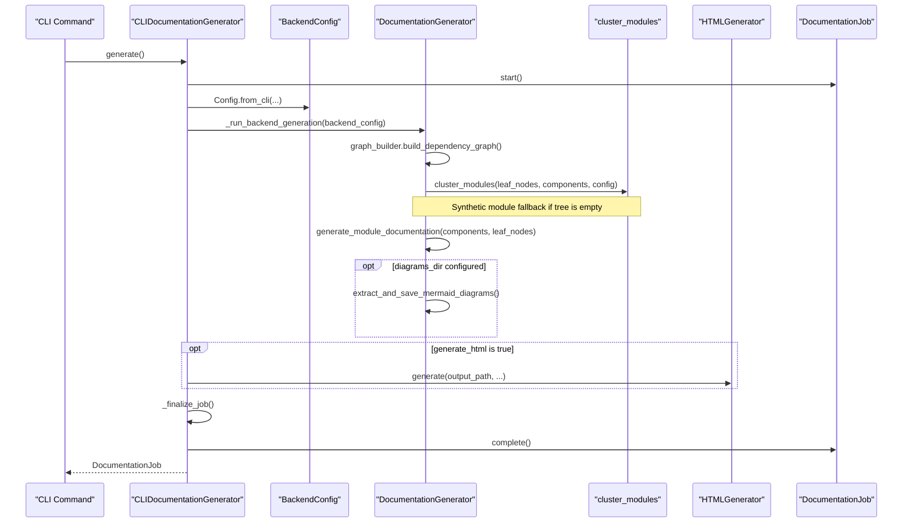
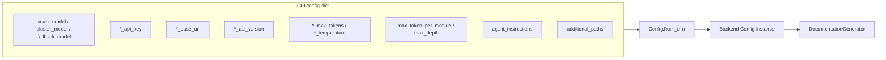

# Generation

The Generation module is the central orchestration layer of the CodeWiki CLI. It bridges the command-line interface with the backend documentation engine, coordinating the full end-to-end pipeline that turns a source code repository into a structured, hierarchical documentation set — including dependency analysis, LLM-driven module clustering, documentation generation, optional Mermaid diagram extraction, and optional HTML output.

Its single core component, `CLIDocumentationGenerator`, acts as an **adapter**: it wraps the backend's `DocumentationGenerator` (from [Backend Core](../backend-core.md)) with CLI-specific concerns such as progress reporting, colored logging, verbose diagnostics, and job lifecycle tracking via the [Job Models](../job_models/job_models.md) module.

## Purpose and Role in the System

As a child of [CLI Core](../cli-core.md), the Generation module is invoked whenever a user runs a documentation generation command. It does not implement dependency analysis, clustering, or documentation writing itself — those responsibilities belong to `backend-core`. Instead, Generation is responsible for:

1. **Translating CLI configuration** into the backend's `Config` object (model selection, API keys, base URLs, token limits, clustering depth, agent instructions, additional source paths).
2. **Orchestrating the multi-stage pipeline** (dependency analysis → module clustering → documentation generation → optional HTML generation → finalization) with a five-stage `ProgressTracker`.
3. **Tracking job state** using a `DocumentationJob` model, recording statistics, generated files, and success/failure outcomes.
4. **Handling synthetic module fallback** to avoid context-window overflows when the LLM clustering step returns an empty module tree.
5. **Optionally generating an HTML viewer** via [HTML Generation](../html_generation/html_generation.md) and extracting Mermaid diagrams into a dedicated directory.

## Architecture Overview

## Core Component

### CLIDocumentationGenerator

`CLIDocumentationGenerator` (`codewiki/cli/adapters/doc_generator.py`) is instantiated with:

- `repo_path` — path to the repository being documented
- `output_dir` — target directory for generated docs
- `config` — a dictionary of LLM/model configuration (models, API keys, base URLs, token limits, temperature settings, clustering parameters, agent instructions, additional source paths)
- `verbose` — whether to emit detailed diagnostic output
- `generate_html` — whether to produce an HTML viewer (`index.html`)
- `diagrams_dir` — optional separate output directory for extracted Mermaid diagrams

On construction, it:
- Creates a `ProgressTracker` configured for 5 pipeline stages.
- Creates a `DocumentationJob` and populates its metadata (repository path/name, output directory, `LLMConfig`).
- Configures backend logging by attaching a `ColoredFormatter`-based handler to the `codewiki.src.be` logger namespace, switching verbosity between `INFO` (verbose) and `WARNING` (quiet) levels, and disabling propagation to avoid duplicate log lines.

#### Key Responsibilities

| Responsibility | Method |
|---|---|
| Build backend configuration from CLI config dict | `generate()` |
| Run the full async generation pipeline | `_run_backend_generation()` |
| Generate the HTML viewer | `_run_html_generation()` |
| Ensure job metadata file exists | `_finalize_job()` |
| Configure colored backend logging | `_configure_backend_logging()` |

## Generation Pipeline

The `generate()` method is the public entry point. It is synchronous from the caller's perspective but internally drives an `asyncio`-based backend pipeline. It returns a completed `DocumentationJob` (see [Job Models](../job_models/job_models.md)) or raises an `APIError` on failure.

### Stage 1 — Dependency Analysis

Instantiates the backend `DocumentationGenerator` from [Documentation Generator](../documentation-generator/documentation-generator.md) (which internally wires up `DependencyGraphBuilder` and `AgentOrchestrator` from [Backend Core](../backend-core.md)) and calls `doc_generator.graph_builder.build_dependency_graph()`. The result is a map of `components` and a list of `leaf_nodes`. Statistics (`total_files_analyzed`, `leaf_nodes`) are recorded on the `DocumentationJob`. Failures are wrapped as `APIError("Dependency analysis failed: ...")`.

### Stage 2 — Module Clustering

Loads a cached `first_module_tree.json` if present, otherwise calls `cluster_modules(leaf_nodes, components, backend_config)` to invoke the LLM clustering model. The result is cached to disk (`first_module_tree_path`) and then persisted as the working module tree (`module_tree_path`).

**Synthetic Module Patch**: If the module tree ends up empty despite having leaf nodes (to prevent an LLM "whole-repo" fallback that could exceed API context limits), the generator batches leaf nodes into synthetic modules of a configurable size (`CODEWIKI_MAX_FILES_PER_MODULE`, default `5`) and re-persists the tree. This safeguard applies even when loading from cache, closing a previously identified cache-bypass gap.

The final module count is stored on the `DocumentationJob.module_count` field.

### Stage 3 — Documentation Generation

Calls `doc_generator.generate_module_documentation(components, leaf_nodes)`, which performs the topologically-ordered (leaf-first) generation of module documentation via the `AgentOrchestrator`. After generation:

- `doc_generator.create_documentation_metadata(...)` writes `metadata.json`.
- Generated `.md` and `.json` files in the output directory are collected into `DocumentationJob.files_generated`.
- If `diagrams_dir` was configured, Mermaid diagrams embedded in generated markdown are extracted via `extract_and_save_mermaid_diagrams` and indexed with `create_diagrams_readme`.

### Stage 4 — HTML Generation (Optional)

If `generate_html=True`, `_run_html_generation()` uses the [HTML Generation](../html_generation/html_generation.md) module's `HTMLGenerator` to detect repository info (name, URL, GitHub Pages URL) and render `index.html`, auto-loading the module tree and metadata from the output directory. The generated file is appended to `DocumentationJob.files_generated`.

### Stage 5 — Finalization

`_finalize_job()` verifies that `metadata.json` exists in the output directory; if the backend did not already write it, the generator writes the job's own JSON representation (`DocumentationJob.to_json()`) as a fallback.

## Configuration Mapping

`generate()` builds the backend `Config` object (see [Config Core](../config-core.md)) via `Config.from_cli(...)`, translating the CLI's flat configuration dictionary into per-provider settings:

Additional source paths supplied in the CLI config are normalized to absolute paths (resolved relative to `repo_path`) before being passed through as `additional_source_paths`.

In verbose mode, the generator prints a detailed configuration summary (model names, base URLs, token limits, module settings, additional paths, and a preview of custom agent instructions) before kicking off Stage 1.

## Progress Tracking and Logging

The Generation module relies on utilities from the [Utils](../utils/utils.md) module:

- **`ProgressTracker`**: manages a 5-stage weighted progress model (Dependency Analysis 40%, Module Clustering 20%, Documentation Generation 30%, HTML Generation 5%, Finalization 5%), providing `start_stage`, `update_stage`, `complete_stage`, elapsed-time formatting, and ETA estimation.
- **`CLILogger`**: complements verbose/non-verbose console output alongside `ProgressTracker`'s stage banners.

Backend logs are captured by attaching a handler using `ColoredFormatter` (from `backend-core`'s Logging Config child module) directly to the `codewiki.src.be` logger, ensuring consistent colored output regardless of whether the CLI or backend emitted the log line, while preventing duplicate propagation to the root logger.

## Error Handling

All backend-facing calls (`build_dependency_graph`, `cluster_modules`, `generate_module_documentation`) are wrapped in `try`/`except` blocks that convert unexpected exceptions into `APIError` with contextual messages (e.g., `"Dependency analysis failed: ..."`). At the top level, `generate()` catches both `APIError` and generic `Exception`, marks the `DocumentationJob` as failed via `job.fail(str(e))`, and re-raises so the CLI layer can present the error to the user.

## Relationship to Other Modules

- **[CLI Core](../cli-core.md)**: parent module; Generation is one of its functional children alongside [Configuration](../configuration/configuration.md), [Job Models](../job_models/job_models.md), [Git Integration](../git_integration/git_integration.md), [HTML Generation](../html_generation/html_generation.md), and [Utils](../utils/utils.md).
- **[Job Models](../job_models/job_models.md)**: supplies `DocumentationJob`, `LLMConfig`, `JobStatus`, and `JobStatistics`, which Generation populates throughout the pipeline.
- **[HTML Generation](../html_generation/html_generation.md)**: invoked optionally at Stage 4 to render the documentation as a browsable HTML site.
- **[Utils](../utils/utils.md)**: provides `ProgressTracker` for stage-based progress reporting.
- **[Backend Core](../backend-core.md)**: supplies the actual documentation engine (`DocumentationGenerator`, `AgentOrchestrator`, `DependencyGraphBuilder`) that Generation orchestrates but does not reimplement.
- **[Config Core](../config-core.md)**: supplies the `Config` class used to translate CLI settings into the backend's runtime configuration.
