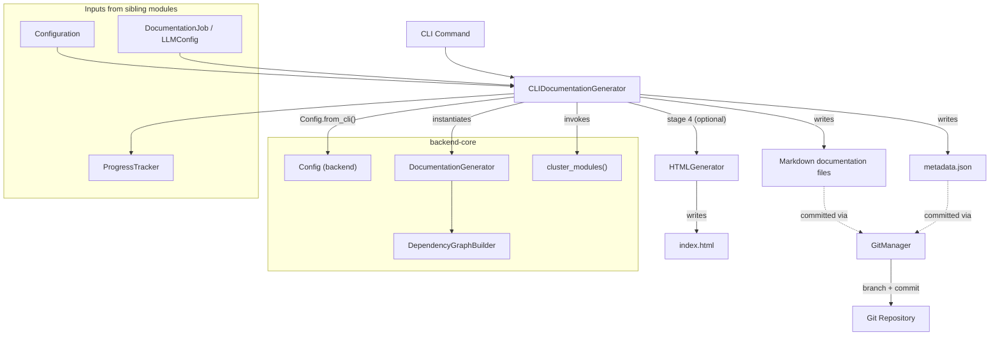
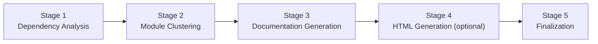
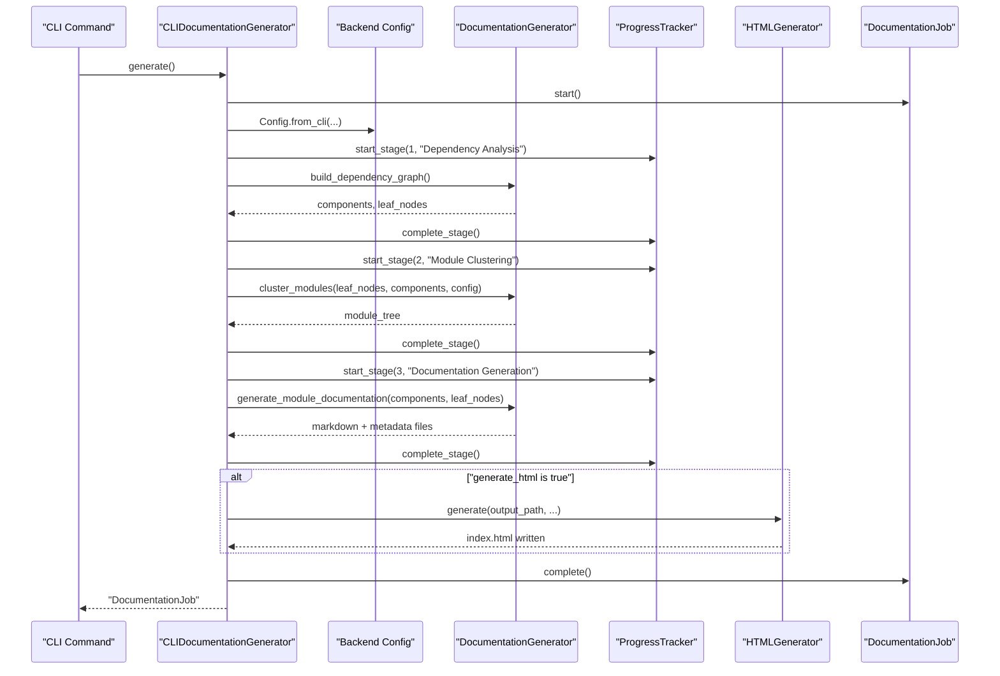
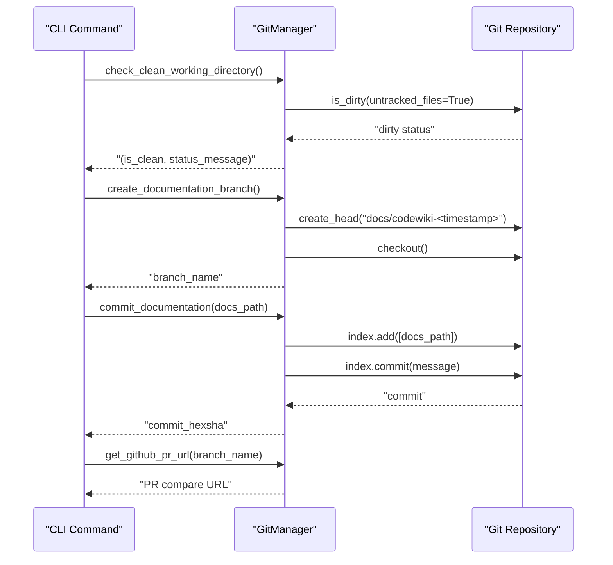

# Generation Pipeline

The Generation Pipeline module is the execution engine of the CodeWiki CLI. It orchestrates the full documentation-generation lifecycle — from dependency analysis and LLM-driven module clustering, through markdown documentation generation, optional static HTML rendering, and (optionally) git branch/commit automation for publishing the results.

This module sits inside the [Cli Core](cli-core.md) module and is responsible for translating a validated `Configuration` and `DocumentationJob` (see [Configuration Management](configuration_management.md) and [Job And Generation Models](job_and_generation_models.md)) into a completed set of documentation artifacts on disk, while reporting progress through the [Cli Utilities](cli_utilities.md) module.

## Responsibilities

- **Pipeline orchestration** — `CLIDocumentationGenerator` drives a five-stage pipeline (dependency analysis, module clustering, documentation generation, optional HTML generation, finalization) and adapts the backend `DocumentationGenerator` for CLI use.
- **Backend integration** — Bridges CLI configuration into the backend `Config` object and delegates the heavy lifting (AST parsing, dependency graph construction, LLM calls) to the backend-core module.
- **Progress and logging** — Wires backend logging into CLI-friendly colored output and reports stage-by-stage progress via `ProgressTracker`.
- **Static site generation** — `HTMLGenerator` renders a self-contained `index.html` viewer for GitHub Pages, embedding the module tree and generation metadata.
- **Git automation** — `GitManager` provides safe branch creation and commit operations so generated documentation can be reviewed and published through normal git/PR workflows.

## Architecture

## Core Components

### CLIDocumentationGenerator

`CLIDocumentationGenerator` (in `codewiki/cli/adapters/doc_generator.py`) is the CLI-facing adapter around the backend `DocumentationGenerator`. It is constructed with the repository path, output directory, an LLM configuration dictionary, and optional flags for verbosity, HTML generation, and a dedicated diagrams directory.

Key behaviors:

- Initializes a `DocumentationJob` (from [Job And Generation Models](job_and_generation_models.md)) and populates it with repository metadata and `LLMConfig`.
- Configures backend logging (`codewiki.src.be`) with a `ColoredFormatter`, switching between verbose (`INFO`) and quiet (`WARNING`) modes.
- `generate()` is the main entry point: it sets the CLI execution context, normalizes any additional source paths, builds a backend `Config` via `Config.from_cli(...)`, runs the async backend generation pipeline, optionally triggers HTML generation, finalizes the job, and returns the completed `DocumentationJob`.
- `_run_backend_generation()` implements the three core backend stages (dependency analysis, module clustering, documentation generation), reporting progress at each step through `ProgressTracker` (see [Cli Utilities](cli_utilities.md)).
- Includes a fallback path that synthesizes module groupings when the LLM-based clustering returns an empty tree, preventing later stages from falling back to a single oversized "whole repository" module that could exceed model context limits.
- `_run_html_generation()` delegates to `HTMLGenerator` to produce `index.html` for GitHub Pages.
- `_finalize_job()` ensures a `metadata.json` file exists in the output directory, writing the job's own JSON representation if the backend has not already produced one.

### HTMLGenerator

`HTMLGenerator` (in `codewiki/cli/html_generator.py`) produces a static, self-contained HTML documentation viewer suitable for GitHub Pages deployment.

Key behaviors:

- `load_module_tree()` and `load_metadata()` read `module_tree.json` and `metadata.json` from the documentation output directory, with a safe fallback structure when the module tree file is missing.
- `generate()` loads an HTML template (`viewer_template.html`), builds an information panel from generation metadata (model, timestamp, commit, component/depth statistics), embeds the module tree and metadata as JSON, and writes the final HTML to the requested output path.
- `detect_repository_info()` inspects the local git repository (via `GitPython`) to determine the repository name, canonical remote URL, and the expected GitHub Pages URL (`https://<owner>.github.io/<repo>/`).

### GitManager

`GitManager` (in `codewiki/cli/git_manager.py`) wraps `GitPython` operations needed to safely publish generated documentation.

Key behaviors:

- Validates that the target path is a git repository on construction, raising a `RepositoryError` otherwise.
- `check_clean_working_directory()` reports whether there are uncommitted or untracked changes, summarizing up to three files of each kind.
- `create_documentation_branch()` creates and checks out a timestamped branch (e.g., `docs/codewiki-20240101-120000`), refusing to proceed on a dirty working directory unless `force=True` is passed.
- `commit_documentation()` stages the documentation output directory and commits it with a default or caller-supplied message.
- `get_remote_url()`, `get_current_branch()`, `get_commit_hash()`, and `branch_exists()` expose repository state used elsewhere in the CLI.
- `get_github_pr_url()` builds a `.../compare/<branch>` URL for GitHub repositories to streamline pull-request creation after documentation is committed.

## Generation Workflow

The pipeline executes five sequential stages, tracked through `ProgressTracker`:

- **Stage 1 — Dependency Analysis:** Instantiates the backend `DocumentationGenerator` and calls `graph_builder.build_dependency_graph()` to produce components and leaf nodes; failures are wrapped as `APIError`.
- **Stage 2 — Module Clustering:** Loads a cached module tree if present, otherwise calls `cluster_modules()` against the configured cluster LLM; applies a synthetic-module fallback when clustering yields no modules.
- **Stage 3 — Documentation Generation:** Calls `doc_generator.generate_module_documentation(components, leaf_nodes)`, then `create_documentation_metadata(...)`, collects generated `.md`/`.json` files into the job, and optionally extracts Mermaid diagrams into a separate directory.
- **Stage 4 — HTML Generation (optional):** Only runs if `generate_html=True`; delegates to `HTMLGenerator.generate()`.
- **Stage 5 — Finalization:** Verifies (or creates) `metadata.json` and marks the `DocumentationJob` as complete.

### Sequence: End-to-End Generation

### Sequence: Git Publishing Flow

`GitManager` is typically used after generation completes, to commit the produced documentation and optionally prepare a pull request:

## Error Handling

- Backend failures during dependency analysis, module clustering, or documentation generation are caught and re-raised as `APIError` with contextual messages, allowing the CLI layer to present clean, actionable errors.
- `CLIDocumentationGenerator.generate()` marks the `DocumentationJob` as failed (`job.fail(...)`) on either `APIError` or any unexpected exception before re-raising.
- `GitManager` raises `RepositoryError` for invalid repositories, dirty working directories (unless forced), and failed git commands (branch creation, commit).
- `HTMLGenerator` raises `FileSystemError` when the expected template file is missing.

## Relationship to Other Modules

- **[Cli Core](cli-core.md):** Parent module; the Generation Pipeline is one of its four children alongside configuration, job/model definitions, and shared utilities.
- **[Configuration Management](configuration_management.md):** Supplies the `Configuration` and `AgentInstructions` values consumed as the `config` dictionary passed into `CLIDocumentationGenerator`.
- **[Job And Generation Models](job_and_generation_models.md):** Supplies `DocumentationJob`, `LLMConfig`, `JobStatus`, and `JobStatistics`, which the pipeline populates throughout execution.
- **[Cli Utilities](cli_utilities.md):** Supplies `ProgressTracker` and `CLILogger`, used for stage tracking and console output during generation.
- **[Backend Core](backend-core.md):** The pipeline is a thin CLI wrapper around the backend's `DocumentationGenerator`, `DependencyGraphBuilder`, and module clustering functions, which perform the actual AST parsing, dependency graph construction, and LLM-based documentation synthesis.
