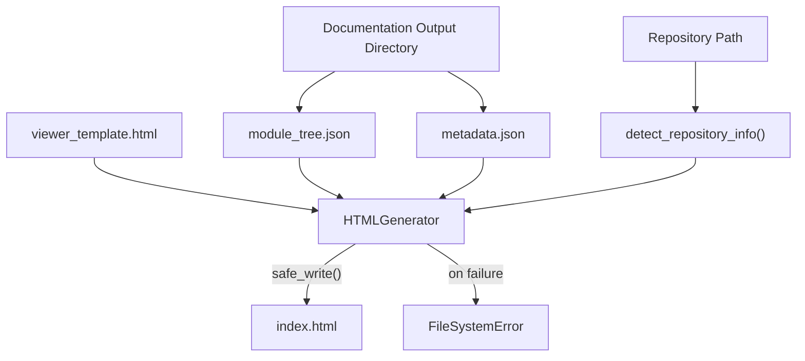
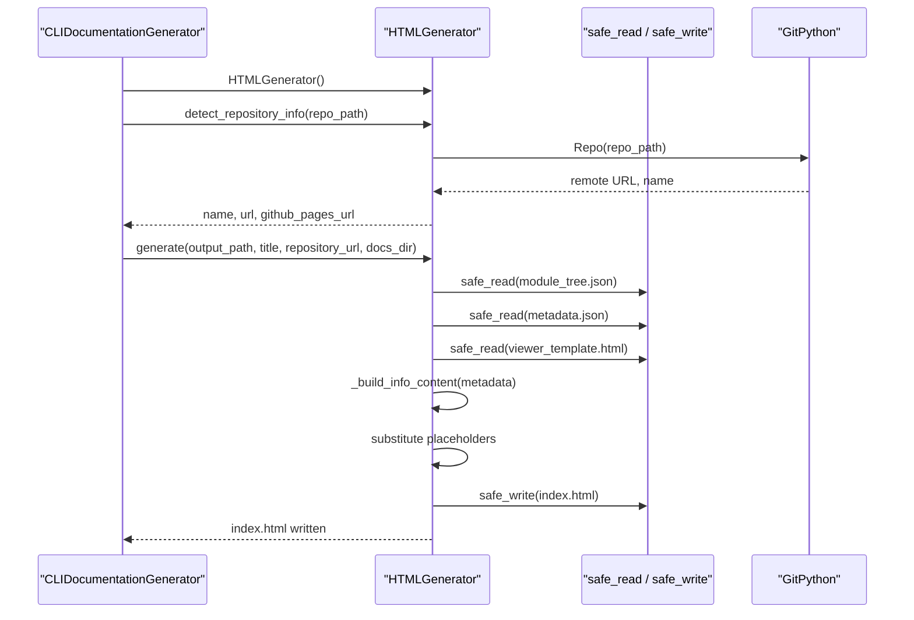
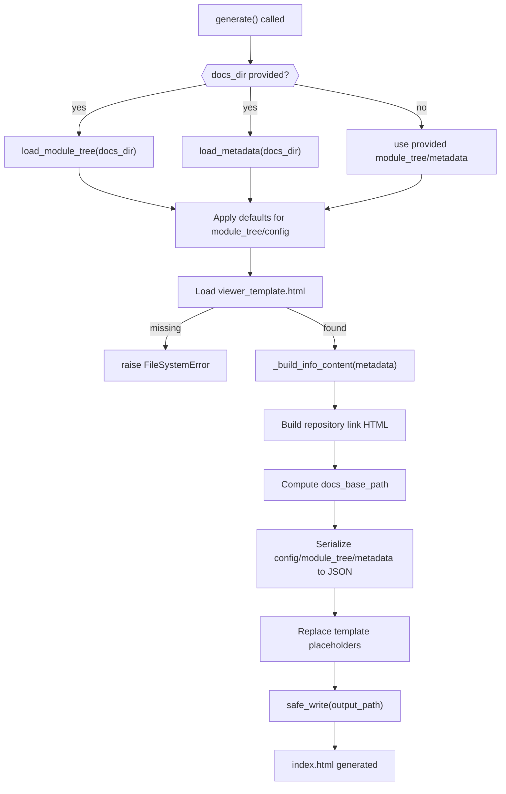

# Html Generation

The Html Generation module produces a self-contained, static HTML documentation viewer suitable for GitHub Pages (or any static file host). It is the final, optional presentation layer of the CodeWiki CLI pipeline: after the [Generation](../generation/generation.md) stage has produced Markdown documentation files, a module tree, and metadata, the Html Generation module packages that output into a single browsable `index.html` file with embedded configuration, styles, and client-side rendering logic.

## Purpose and Scope

The `HTMLGenerator` class is the sole core component of this module. Its responsibilities are:

- **Template loading** — reads a static HTML template (`viewer_template.html`) shipped with the package.
- **Data discovery** — auto-loads `module_tree.json` and `metadata.json` from a documentation output directory when explicit data is not supplied.
- **Placeholder substitution** — injects title, repository link, embedded JSON data (module tree, metadata, config), and an "info panel" HTML fragment into the template.
- **Repository introspection** — inspects a local git repository to derive a display name, remote URL, and a predicted GitHub Pages URL.
- **Atomic file output** — writes the final HTML file safely using the shared filesystem utilities.

This module has no knowledge of *how* documentation content was produced; it only consumes the artifacts (`module_tree.json`, `metadata.json`, generated Markdown files) that the [Generation](../generation/generation.md) module and the backend documentation pipeline produce. This keeps Html Generation a pure "rendering/packaging" concern, decoupled from LLM orchestration, dependency analysis, and job tracking.

## Core Component

### HTMLGenerator

`HTMLGenerator` (`codewiki/cli/html_generator.py`) encapsulates all HTML viewer generation logic.

| Method | Responsibility |
|---|---|
| `__init__(template_dir)` | Resolves the template directory, defaulting to the package's `templates/github_pages` folder. |
| `load_module_tree(docs_dir)` | Reads `module_tree.json` from the docs directory; falls back to a minimal single-node structure if the file is missing. |
| `load_metadata(docs_dir)` | Reads `metadata.json`; returns `None` (non-critical) if missing or unparsable. |
| `generate(...)` | Orchestrates the full generation: auto-loads data, builds the info panel, computes paths/links, serializes JSON, performs placeholder substitution, and writes the output file. |
| `_build_info_content(metadata)` | Builds an HTML fragment (model name, generation timestamp, commit hash, component count, max depth) displayed in the viewer's info panel. |
| `_escape_html(text)` | Escapes HTML-sensitive characters to prevent malformed markup when embedding user/repo-derived strings (e.g., title). |
| `detect_repository_info(repo_path)` | Uses `GitPython` to read the repository name, normalize the remote URL (including `git@github.com:` SSH URLs), and compute the expected `https://<owner>.github.io/<repo>/` Pages URL. |

## Architecture

### Dependencies

- **`codewiki.cli.utils.fs`** — `safe_read` / `safe_write` provide atomic, encoding-safe file I/O used to load the template/JSON files and write the final HTML output. See the [Utils](../utils/utils.md) module for other shared CLI utilities such as logging and progress tracking.
- **`codewiki.cli.utils.errors::FileSystemError`** — raised when the template file is missing or when reading/writing fails, allowing the CLI layer to surface a consistent error type.
- **`git` (GitPython)** — used only within `detect_repository_info` to introspect the local repository; failures are caught and silently ignored, degrading gracefully to a viewer without repository links.

## Integration with the CLI Pipeline

Html Generation is invoked as an optional, final stage by [`CLIDocumentationGenerator`](../generation/generation.md) (from the [Generation](../generation/generation.md) module), which drives the overall CLI workflow: dependency analysis → module clustering → documentation generation → **HTML generation** → job finalization.

This corresponds to the `_run_html_generation` step inside `CLIDocumentationGenerator.generate()`: it is only executed when the CLI was invoked with `generate_html=True`, after the backend has produced Markdown files, `module_tree.json`, and `metadata.json` in the output directory. On success, `"index.html"` is appended to `DocumentationJob.files_generated` (see the [Job Models](../job_models/job_models.md) module).

## Generation Flow

### Template Placeholders

The generator performs a straightforward string substitution over the template file. The following placeholders are populated by `generate()`:

| Placeholder | Source |
|---|---|
| `{{TITLE}}` | Escaped `title` argument (e.g., repository name) |
| `{{REPO_LINK}}` | HTML anchor to `repository_url`, empty if not provided |
| `{{SHOW_INFO}}` | `"block"` or `"none"` depending on whether info content was built |
| `{{INFO_CONTENT}}` | HTML fragment from `_build_info_content` (model, timestamp, commit, stats) |
| `{{CONFIG_JSON}}` | JSON-serialized `config` dictionary |
| `{{MODULE_TREE_JSON}}` | JSON-serialized module tree structure |
| `{{METADATA_JSON}}` | JSON-serialized metadata, or the literal `null` |
| `{{DOCS_BASE_PATH}}` | Relative path from the output file to the docs directory |

## Error Handling

- Missing `viewer_template.html` raises `FileSystemError`, propagated up to the CLI layer.
- Missing or malformed `module_tree.json` is either substituted with a minimal fallback structure (`load_module_tree`) or, on unexpected read/parse errors, raises `FileSystemError`.
- Missing or malformed `metadata.json` is treated as non-critical: `load_metadata` swallows exceptions and returns `None`, resulting in the info panel being hidden (`{{SHOW_INFO}} = "none"`).
- Git introspection failures in `detect_repository_info` are caught broadly, so the generator always returns a usable (if partially empty) info dictionary rather than failing the whole pipeline.

## Relationship to Other Modules

- **[Generation](../generation/generation.md)** — the `CLIDocumentationGenerator` orchestrates when and how `HTMLGenerator` is invoked as part of the overall documentation generation job.
- **[Job Models](../job_models/job_models.md)** — the generated `index.html` file path is recorded in the `DocumentationJob.files_generated` list.
- **[Utils](../utils/utils.md)** — shares low-level filesystem helpers (`safe_read`/`safe_write`) and error types used throughout the CLI.
- **[cli-core](../cli-core.md)** — the parent module that aggregates Html Generation alongside generation, configuration, job models, git integration, and shared utilities into the full CLI toolchain.
