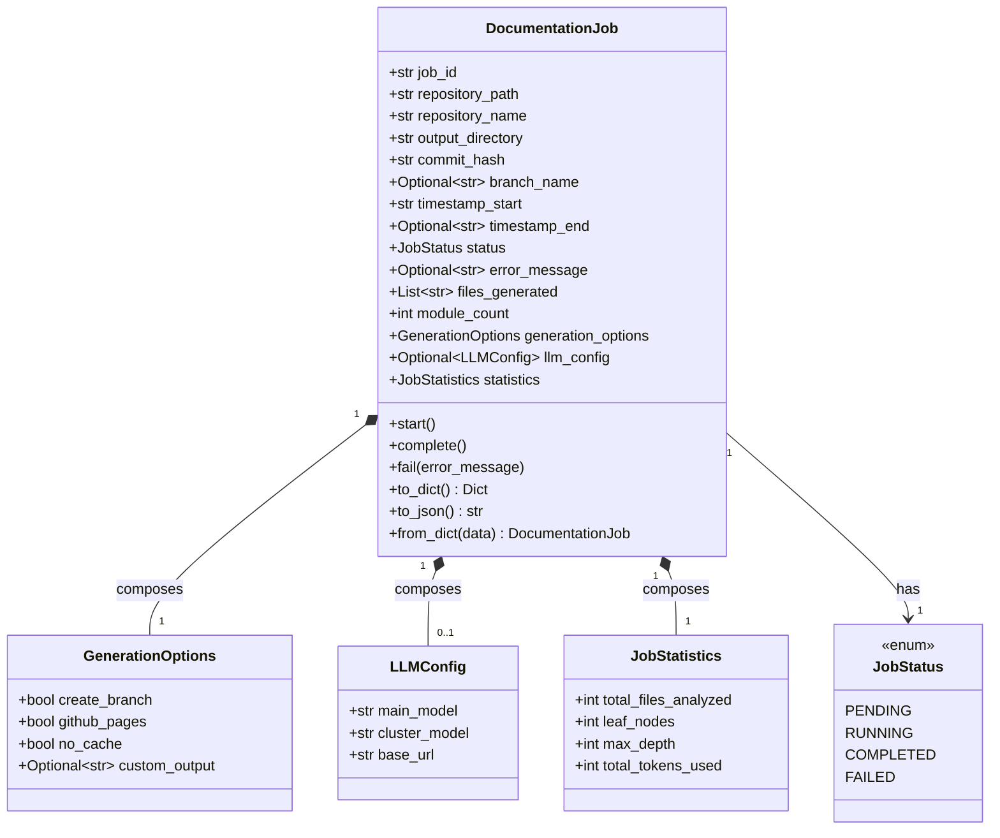
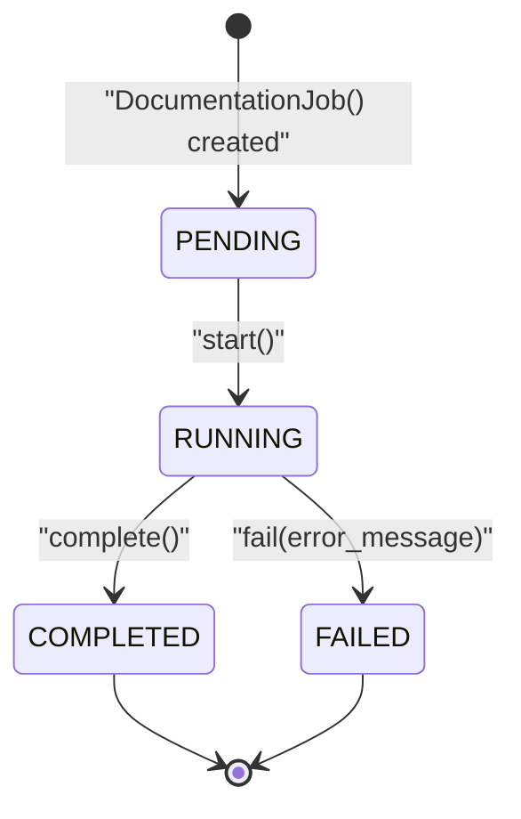
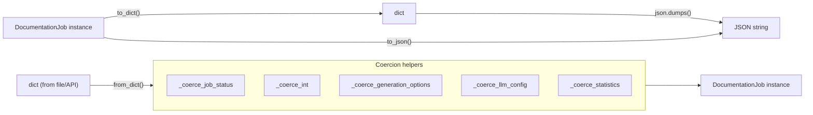
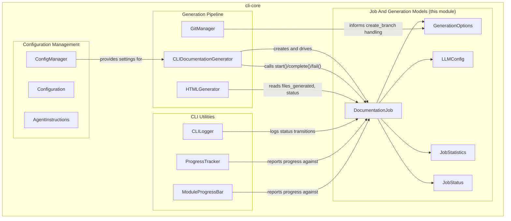

# Job And Generation Models

The Job And Generation Models module defines the core data structures used to represent, track, and persist documentation generation jobs within the CodeWiki CLI. It provides the `DocumentationJob` dataclass — the single source of truth for a job's lifecycle, configuration, and results — along with supporting types for generation options, LLM configuration, job statistics, and status tracking.

This module is a foundational, dependency-free layer: it has no imports from other CodeWiki modules and is consumed by higher-level CLI components such as the [Generation Pipeline](generation_pipeline.md) and [Cli Utilities](cli_utilities.md), which orchestrate and report on jobs whose state is modeled here.

## Purpose and Scope

The module answers a simple but critical question for the CLI: *what does a documentation generation job look like, and how is its state represented and serialized?*

It is intentionally kept as plain data (Python `dataclasses` and an `Enum`), free of I/O, network, or file-system side effects. Responsibilities include:

- Defining the **shape** of a documentation job (`DocumentationJob`)
- Modeling the **lifecycle status** of a job (`JobStatus`)
- Capturing **user-facing generation options** (`GenerationOptions`)
- Capturing the **LLM configuration** used for a run (`LLMConfig`)
- Capturing **run-time statistics** (`JobStatistics`)
- Providing **serialization/deserialization** helpers (`to_dict`, `to_json`, `from_dict`) so jobs can be persisted to disk or transmitted between CLI invocations

Because this module contains no business logic beyond simple mutators (`start`, `complete`, `fail`) and (de)serialization, it is designed to be imported freely by any layer of the CLI without introducing circular dependencies.

## Component Overview

| Component | Kind | Responsibility |
|---|---|---|
| `JobStatus` | `str, Enum` | Enumerates the lifecycle states of a job: `PENDING`, `RUNNING`, `COMPLETED`, `FAILED` |
| `GenerationOptions` | `dataclass` | User-selected flags controlling how documentation is generated (branch creation, GitHub Pages, cache usage, custom output path) |
| `LLMConfig` | `dataclass` | Captures which LLM models and base URL were used for a job (main model, cluster model, base URL) |
| `JobStatistics` | `dataclass` | Aggregated metrics produced during generation (files analyzed, leaf nodes, max depth, tokens used) |
| `DocumentationJob` | `dataclass` | The aggregate root representing a single documentation generation run, composing the types above |

## Data Model

### `JobStatus`

`JobStatus` is a `str`-backed `Enum` with four values: `pending`, `running`, `completed`, and `failed`. Because it subclasses `str`, instances compare equal to their string values and serialize naturally to JSON via `.value`. This makes it safe to store directly in dictionaries and files without custom encoders.

### `GenerationOptions`

Represents the flags a user supplies when invoking documentation generation:

- `create_branch` — whether to create a dedicated Git branch for generated docs (consumed by the Git-related logic in the [Generation Pipeline](generation_pipeline.md))
- `github_pages` — whether to prepare output for GitHub Pages publishing
- `no_cache` — whether to bypass any caching during generation
- `custom_output` — an optional override for the output directory

### `LLMConfig`

Records which language models and endpoint were used to produce a job's documentation:

- `main_model` — the primary model used for content generation
- `cluster_model` — the model used for clustering/module grouping
- `base_url` — the API base URL for the LLM provider

`LLMConfig` has no default values for its fields, so callers must always supply all three when constructing one directly. The `DocumentationJob.llm_config` field wraps it in `Optional[LLMConfig]` since a job may not yet have LLM configuration attached (e.g., before it starts running).

### `JobStatistics`

A simple metrics container populated as generation proceeds:

- `total_files_analyzed`
- `leaf_nodes`
- `max_depth`
- `total_tokens_used`

All fields default to `0`, so a freshly created `DocumentationJob` has zeroed-out statistics until the pipeline updates them.

### `DocumentationJob`

The central aggregate of this module. Each job is uniquely identified by a UUID (`job_id`, auto-generated) and tracks:

- **Identity/location**: `repository_path`, `repository_name`, `output_directory`, `commit_hash`, `branch_name`
- **Timing**: `timestamp_start` (auto-populated with the current time), `timestamp_end`
- **Lifecycle**: `status` (a `JobStatus`), `error_message`
- **Results**: `files_generated`, `module_count`
- **Configuration/metrics**: `generation_options`, `llm_config`, `statistics`

## Job Lifecycle

`DocumentationJob` exposes three mutator methods that transition a job through its lifecycle. These methods do not raise on invalid transitions — they are simple state setters intended to be called by the orchestrating pipeline at the appropriate points.

- **`start()`** — sets `status` to `RUNNING` and refreshes `timestamp_start` to the current time.
- **`complete()`** — sets `status` to `COMPLETED` and stamps `timestamp_end`.
- **`fail(error_message)`** — sets `status` to `FAILED`, records `error_message`, and stamps `timestamp_end`.

Consumers such as the components in [Generation Pipeline](generation_pipeline.md) are expected to call these methods at the beginning and end of a generation run, while [Cli Utilities](cli_utilities.md) can inspect `status` to render progress or summary information to the user.

## Serialization

`DocumentationJob` provides round-trippable serialization so that job state can be persisted to disk (e.g., a job history file) or passed between processes.

- **`to_dict()`** flattens the job — including its nested `GenerationOptions`, `LLMConfig`, and `JobStatistics` — into a plain `Dict[str, Any]`. `JobStatus` is converted to its `.value` string.
- **`to_json()`** wraps `to_dict()` with `json.dumps(..., indent=2)` for human-readable persistence.
- **`from_dict(data)`** is a classmethod that reconstructs a `DocumentationJob` from a dictionary, using private module-level coercion helpers to safely handle missing or malformed nested data:
  - `_coerce_job_status` — falls back to `JobStatus.PENDING` if the value is `None` or not a valid enum member
  - `_coerce_int` — falls back to `0` (or a supplied default) if the value cannot be converted to `int`
  - `_coerce_generation_options` — builds a `GenerationOptions`, defaulting to an all-`False`/`None` instance if no data is present
  - `_coerce_llm_config` — builds an `LLMConfig` from a dict, or returns `None` if no data is present
  - `_coerce_statistics` — builds a `JobStatistics`, defaulting all counts to `0` if no data is present

This defensive coercion makes `from_dict` tolerant of partially-written or older-format job files, which is important for a CLI tool that may persist job state across versions.

## Component Interaction

`DocumentationJob` and its nested types are pure data holders; the actual work of populating and advancing them is performed by the [Generation Pipeline](generation_pipeline.md) (particularly `CLIDocumentationGenerator`), which drives a job through `start()` → generation → `complete()`/`fail()`. Configuration values sourced from [Configuration Management](configuration_management.md) inform how `GenerationOptions` and `LLMConfig` are populated for a given run. The [Cli Utilities](cli_utilities.md) module consumes job state (status, statistics) to render progress bars and log messages to the user.

## Design Notes

- **No external dependencies**: This module relies only on the Python standard library (`dataclasses`, `datetime`, `enum`, `uuid`, `json`, `typing`), making it safe to import from anywhere in the CLI codebase without risk of circular imports.
- **Defaults favor safety over strictness**: Most fields have sensible defaults (empty strings, empty lists, zeroed statistics), except `LLMConfig`, whose three fields are required — reflecting that LLM configuration should be explicitly supplied rather than silently defaulted.
- **String-backed enum for interoperability**: `JobStatus` inheriting from `str` means it can be compared to plain strings (`job.status == "running"`) and serializes cleanly without custom JSON encoders.
- **Tolerant deserialization**: The `_coerce_*` helper functions ensure `from_dict` degrades gracefully when reading job files that are missing fields or contain unexpected types, rather than raising exceptions.

## Related Modules

- Parent module: [Cli Core](cli-core.md)
- Sibling module: [Configuration Management](configuration_management.md) — supplies configuration values that populate `GenerationOptions` and `LLMConfig`
- Sibling module: [Generation Pipeline](generation_pipeline.md) — orchestrates job creation and lifecycle transitions using `DocumentationJob`
- Sibling module: [Cli Utilities](cli_utilities.md) — consumes job status and statistics for logging and progress reporting
