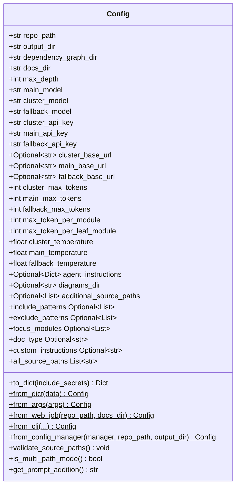
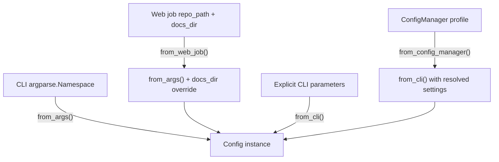
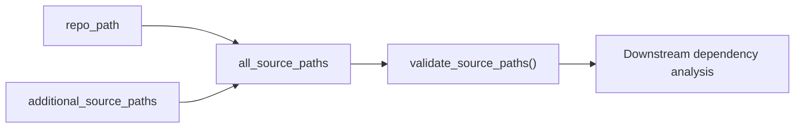
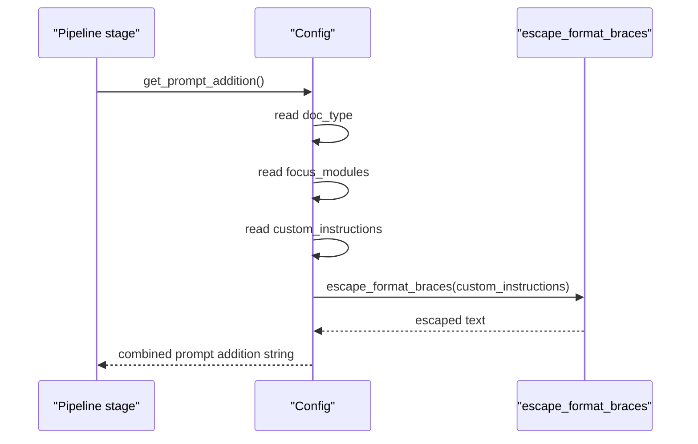
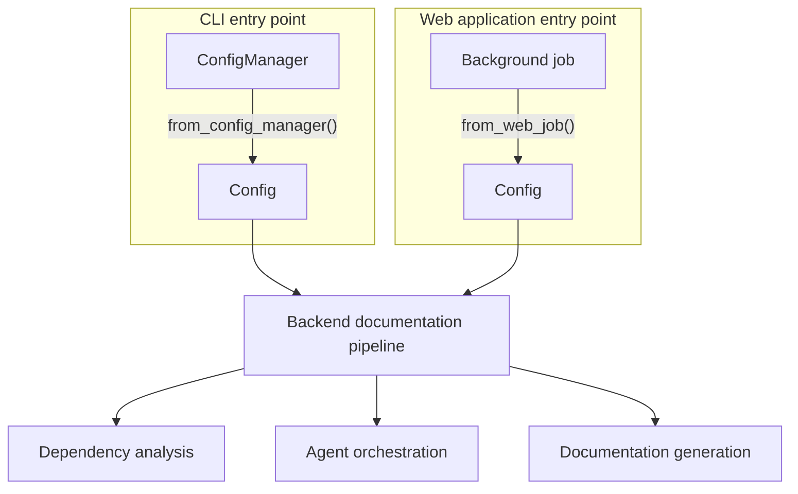

# Config Core

Config Core is the central configuration module for CodeWiki. It defines the `Config` dataclass — the single source of truth for repository paths, output directories, per-provider LLM settings (models, API keys, base URLs, temperatures, and token limits), and agent-instruction customization (include/exclude patterns, focus modules, doc type, and custom instructions). Every entry point into the documentation-generation pipeline — the CLI, the web application, and internal orchestration code — constructs and passes around a `Config` instance to drive behavior consistently across the system.

## Purpose and Scope

The `Config` dataclass, defined in `codewiki/src/config.py`, exists to:

- Provide a single, strongly-typed configuration object consumed by the backend documentation pipeline (analysis, clustering, and generation stages).
- Normalize configuration construction from multiple entry points: CLI arguments, web-app jobs, explicit CLI parameters, and a persisted `ConfigManager` profile.
- Encapsulate per-provider (cluster / main / fallback) LLM settings so each pipeline stage can select the right model, API key, base URL, temperature, and token limits.
- Safely serialize/deserialize configuration while guaranteeing runtime-only secrets (API keys) are never persisted unless explicitly requested.
- Support multi-path analysis, allowing a primary repository plus additional source directories to be validated and merged into a single documentation run.
- Translate high-level "agent instructions" (doc type, focus modules, custom text) into concrete prompt additions consumed by the LLM-driven generation stages.

## Core Component

| Component | Description |
|---|---|
| `Config` | Dataclass holding all pipeline configuration; provides constructors, serialization helpers, validation, and prompt-generation logic. |

### Class Structure

## Configuration Fields

`Config` groups its fields into logical categories:

- **Paths**: `repo_path`, `output_dir`, `dependency_graph_dir`, `docs_dir`, `diagrams_dir`, `additional_source_paths`.
- **Pipeline behavior**: `max_depth` (hierarchical decomposition depth), `max_token_per_module`, `max_token_per_leaf_module`.
- **Per-provider LLM settings** (repeated for `cluster`, `main`, and `fallback` providers): model name, API key, base URL, API version, max tokens, max-token field name (`max_tokens` vs `max_completion_tokens`), temperature, and whether the provider supports custom temperature.
- **Agent instructions**: an optional dict (`agent_instructions`) exposing `include_patterns`, `exclude_patterns`, `focus_modules`, `doc_type`, and `custom_instructions` via read-only properties.

### Secret Handling

API key fields (`cluster_api_key`, `main_api_key`, `fallback_api_key`) are runtime-only. `to_dict()` excludes them by default (`_RUNTIME_ONLY_SECRET_FIELDS`) to prevent accidental persistence, caching, or logging. Callers that need a fully round-trippable dict (e.g., for in-process transfer within the same trust boundary) must pass `include_secrets=True`, and `from_dict()` will raise a `TypeError` if required secret fields are missing from the input.

## Construction Paths

`Config` exposes four classmethod constructors, each tailored to a different caller in the system:

- **`from_args(args)`** — Builds a `Config` from an `argparse.Namespace`, reading required environment variables (`FALLBACK_MODEL`, `CLUSTER_API_KEY`, `MAIN_API_KEY`, `FALLBACK_API_KEY`) and deriving `docs_dir` from a sanitized repository name. Raises `ValueError` if any required environment variable is missing.
- **`from_web_job(repo_path, docs_dir)`** — A thin wrapper around `from_args()` used by the web application's background job processing, since there is no CLI `Namespace` to construct in that context. It builds a synthetic `Namespace(repo_path=repo_path)`, then overrides `docs_dir` with the job-specific output directory.
- **`from_cli(...)`** — Accepts fully explicit parameters (models, API keys, base URLs, token limits, temperatures, agent instructions, multi-path directories) and performs extensive validation (see below) before constructing the instance. This is the canonical constructor used when configuration values come from a source other than environment variables, such as a loaded `ConfigManager` profile.
- **`from_config_manager(manager, repo_path, output_dir)`** — Reads a loaded configuration profile and per-provider API keys from a `ConfigManager` instance, validates presence of required models and keys, extracts `additional_source_paths` from agent instructions if present, and delegates to `from_cli()`.

### `from_cli` Validation Rules

`from_cli()` is the strictest constructor and enforces:

1. All three API keys (`cluster_api_key`, `main_api_key`, `fallback_api_key`) must be non-empty strings.
2. All three base URLs must be non-empty strings.
3. All numeric fields (`*_max_tokens`, `max_token_per_module`, `max_token_per_leaf_module`, `max_depth`) are coerced to `int` and must be positive.
4. All temperature fields are coerced to `float` and must fall within `0.0`–`2.0`.
5. `*_max_token_field` values must be one of `max_tokens` or `max_completion_tokens`.
6. After construction, `validate_source_paths()` is invoked to confirm the repository path and any additional source paths exist, are directories, and (for additional paths) are readable.

## Multi-Path Source Support

`Config` supports analyzing a primary repository alongside additional source directories, merging them into a single documentation run:

- `all_source_paths` (property) returns the absolute path list: `repo_path` first, followed by any `additional_source_paths`.
- `is_multi_path_mode()` returns `True` when `additional_source_paths` is set and non-empty.
- `validate_source_paths()` raises `ValueError` for missing/non-directory paths and `OSError` for unreadable additional paths.

## Agent Instructions and Prompt Generation

`agent_instructions` is an optional dict that customizes generation behavior. `Config` exposes it through read-only properties (`include_patterns`, `exclude_patterns`, `focus_modules`, `doc_type`, `custom_instructions`), and `get_prompt_addition()` combines them into a single text block appended to LLM prompts:

- `doc_type` maps to predefined focus instructions (`api`, `architecture`, `user-guide`, `developer`) or a generic fallback for custom types.
- `focus_modules` produces an instruction to give the listed modules more detailed documentation.
- `custom_instructions` is escaped (via `escape_format_braces`) to avoid `KeyError` when the text is later used with Python's `.format()` — this matters when custom instructions embed JSON (e.g., external-repository configuration).

## Integration with the Rest of the System

Config Core sits at the intersection of the CLI, the web application, and the backend generation pipeline:

- The [Cli Core](cli-core.md) module's `ConfigManager` (see its `configuration_management` sub-module) persists user-level settings (models, API keys via keyring, agent instructions) that `Config.from_config_manager()` reads to build a runtime `Config` for a documentation run.
- The [Frontend Core](frontend-core.md) module's background job processing constructs a `Config` via `Config.from_web_job()` when a repository submission is picked up for processing, using the job's cloned repository path and job-specific docs directory.
- The [Backend Core](backend-core.md) module consumes the resulting `Config` instance throughout the documentation pipeline: dependency analysis stages read `repo_path`/`all_source_paths` and `max_depth`; the agent orchestration and generation stages read per-provider model/API key/temperature/token settings and the `get_prompt_addition()` output.

## Serialization

`Config` supports safe round-tripping through plain dictionaries:

- `to_dict(include_secrets=False)` — Uses `dataclasses.asdict()` and strips secret fields unless explicitly requested. Suitable for caching, logging, or transmitting configuration metadata without leaking API keys.
- `from_dict(data)` — Filters the incoming dict to known dataclass fields (ignoring unknown keys) and constructs a `Config`. If secrets were stripped during serialization, they must be supplied separately or construction will fail with a `TypeError` due to missing required fields.

This pattern allows configuration state to be safely stored (e.g., alongside a job record in [Frontend Core](frontend-core.md)) while API keys remain sourced from environment variables, keyring, or explicit runtime parameters at the point of use.
