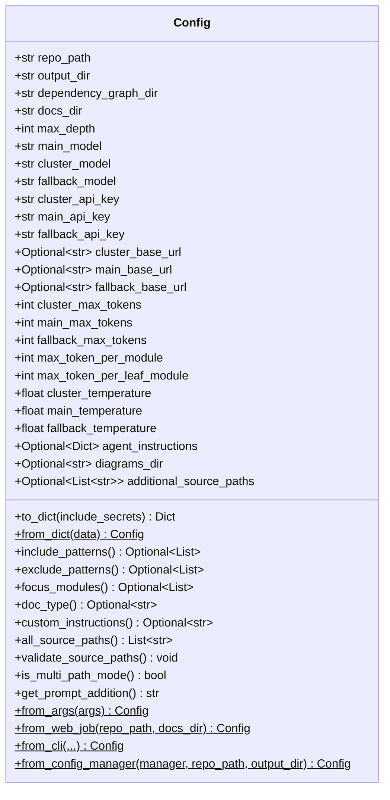
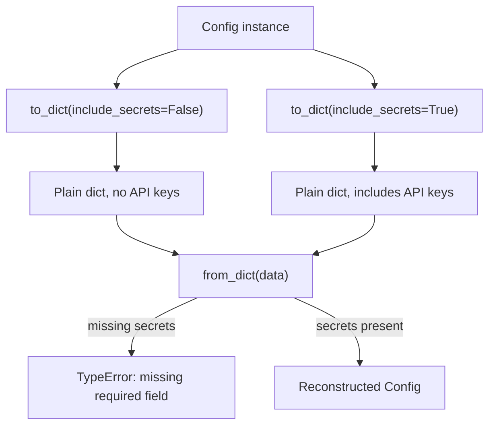
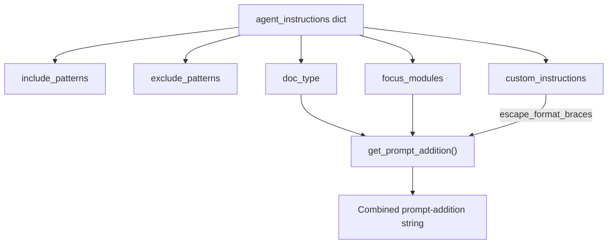
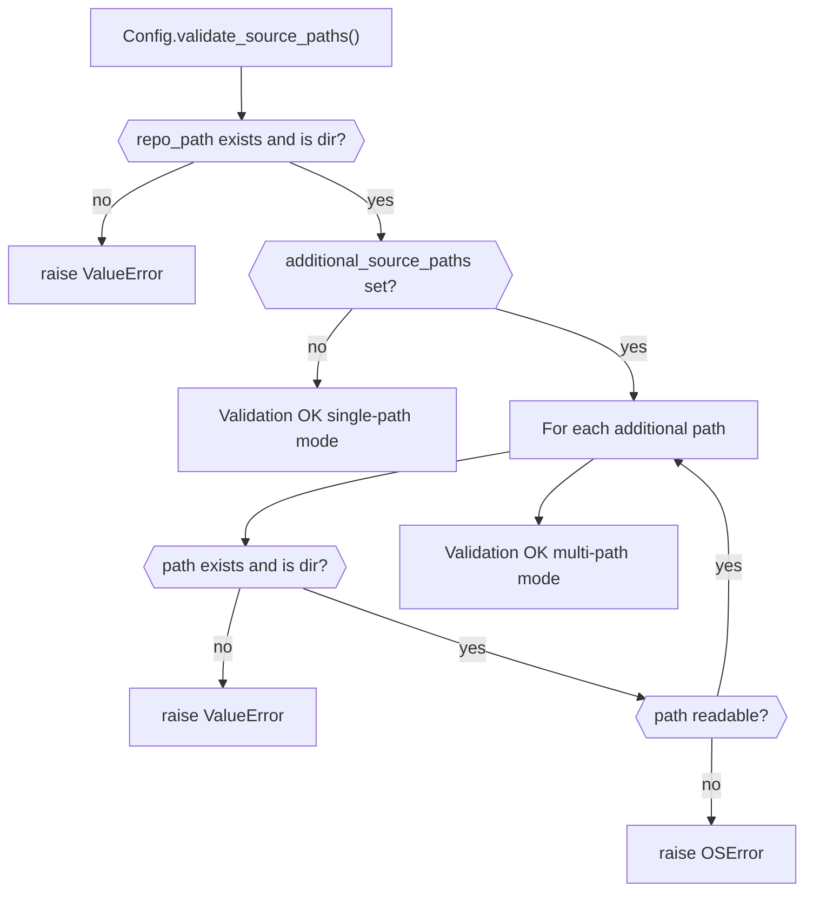
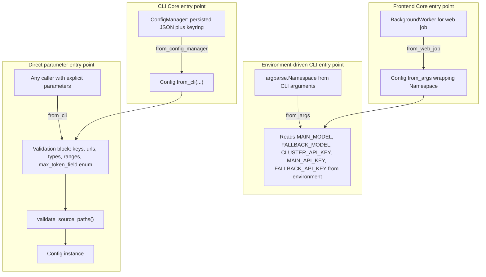
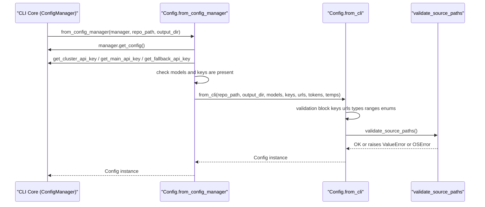

# Config Core

The Config Core module defines the central `Config` dataclass that CodeWiki uses to drive every stage of the documentation-generation pipeline. It is the single source of truth for repository paths, output directories, LLM provider settings (models, API keys, base URLs, temperatures, and token limits), and agent-instruction customization such as include/exclude file patterns, focus modules, documentation type, and free-form custom instructions.

Config Core is intentionally small and dependency-light: it contains one component, `Config`, but it is consumed heavily by [Backend Core](backend-core.md) (which executes the actual analysis and generation pipeline), [CLI Core](cli-core.md) (which builds a `Config` from a locally persisted configuration file), and [Frontend Core](frontend-core.md) (which builds a `Config` for each web-submitted documentation job). Because nearly every other module depends on `Config`, understanding its shape and construction paths is a prerequisite for understanding the rest of the system.

## Purpose and Responsibilities

`Config` serves three distinct responsibilities:

1. **Data container** — holds all repository, output, and per-provider LLM settings (cluster/main/fallback models, keys, base URLs, API versions, max tokens, temperatures, and the field name used to send max-tokens to the provider).
2. **Construction factory** — offers four classmethod entry points (`from_args`, `from_web_job`, `from_cli`, `from_config_manager`) that adapt different callers' inputs (argparse namespaces, web job parameters, explicit CLI parameters, or a `ConfigManager`) into a fully validated `Config` instance.
3. **Derived-behavior provider** — exposes properties and helper methods (`include_patterns`, `exclude_patterns`, `focus_modules`, `doc_type`, `custom_instructions`, `all_source_paths`, `is_multi_path_mode`, `get_prompt_addition`, `validate_source_paths`) that downstream consumers use instead of re-implementing agent-instruction parsing or multi-path logic themselves.

## Core Component

### Config (`codewiki/src/config.py`)

`Config` is a `@dataclass` with required fields (`repo_path`, `output_dir`, `dependency_graph_dir`, `docs_dir`, `max_depth`, `main_model`, `cluster_model`, `fallback_model`, `cluster_api_key`, `main_api_key`, `fallback_api_key`) and a large set of optional fields with sensible defaults for base URLs, API versions, max-tokens, temperatures, and multi-path/diagram directory support.

## Field Groups

| Group | Fields | Purpose |
|---|---|---|
| Paths | `repo_path`, `output_dir`, `dependency_graph_dir`, `docs_dir`, `diagrams_dir` | Where source code is read from and where analysis artifacts and docs are written |
| Multi-path support | `additional_source_paths` | Allows analyzing multiple source directories as one unified documentation set |
| Model selection | `main_model`, `cluster_model`, `fallback_model` | Which LLM is used for generation, clustering, and fallback |
| Per-provider credentials | `cluster_api_key`, `main_api_key`, `fallback_api_key` | Required, runtime-only secrets — never serialized by `to_dict()` unless explicitly requested |
| Per-provider connectivity | `*_base_url`, `*_api_version` | Endpoint configuration for each provider |
| Per-provider limits | `*_max_tokens`, `*_max_token_field`, `max_token_per_module`, `max_token_per_leaf_module` | Token budgeting for generation and clustering |
| Per-provider sampling | `*_temperature`, `*_temperature_supported` | Controls determinism/creativity per provider, with a flag for providers that reject custom temperatures |
| Agent customization | `agent_instructions` | Dict-based include/exclude patterns, focus modules, doc type, and custom instructions consumed via properties |

## Secret Handling: `to_dict` / `from_dict`

`Config` maintains a frozen set of runtime-only secret field names (`cluster_api_key`, `main_api_key`, `fallback_api_key`). `to_dict()` strips these by default so that serialized configuration (e.g., cached to disk or logged) never leaks API keys; callers must pass `include_secrets=True` to get a fully round-trippable dict. `from_dict()` reconstructs a `Config` by filtering the input to only known dataclass fields, so extra keys are safely ignored, but if secrets were stripped they must be supplied separately or construction raises a `TypeError` (missing required field).

## Agent Instructions Properties

`agent_instructions` is an optional dict (or an object exposing `to_dict()`, e.g. `AgentInstructions` from [CLI Core](cli-core.md)). Five read-only properties expose its contents without requiring callers to know its internal shape:

- `include_patterns` — file glob patterns to include in analysis
- `exclude_patterns` — file glob patterns to exclude
- `focus_modules` — module names that should receive more detailed documentation
- `doc_type` — one of `api`, `architecture`, `user-guide`, `developer`, or a free-form string
- `custom_instructions` — free-form additional guidance text

`get_prompt_addition()` combines `doc_type`, `focus_modules`, and `custom_instructions` into a single prompt-ready string, escaping curly braces in `custom_instructions` (via `escape_format_braces`) so JSON-like content does not break downstream `.format()` calls in the generation pipeline consumed by [Backend Core](backend-core.md).

## Multi-Path Source Support

`additional_source_paths` enables analyzing more than one directory as a single logical repository. `all_source_paths` always returns `repo_path` as the first absolute path, followed by any additional paths. `validate_source_paths()` raises `ValueError`/`OSError` if any path is missing, not a directory, or unreadable. `is_multi_path_mode()` is a simple boolean check used by the analysis pipeline in [Backend Core](backend-core.md) to decide whether to merge multiple source trees.

## Construction Paths

`Config` provides four classmethods for building an instance, each tailored to a different caller in the system.

### `from_args(args)`

Builds a `Config` purely from environment variables (`MAIN_MODEL`, `CLUSTER_MODEL`, `LLM_BASE_URL`, `FALLBACK_MODEL`, `CLUSTER_API_KEY`, `MAIN_API_KEY`, `FALLBACK_API_KEY`) plus the `repo_path` supplied on `args`. It computes a sanitized repo name for the docs output directory and raises `ValueError` if `FALLBACK_MODEL` or any per-provider API key is missing. This is the lowest-level, environment-driven constructor.

### `from_web_job(repo_path, docs_dir)`

A thin wrapper used by [Frontend Core](frontend-core.md)'s background worker. It delegates to `from_args` (wrapping `repo_path` in a synthetic `argparse.Namespace`) and then overrides `docs_dir` with the job-specific output directory, avoiding the need to fabricate a fake CLI namespace at the call site.

### `from_cli(...)`

The most comprehensive constructor, accepting every field explicitly (models, keys, base URLs, API versions, token limits, temperatures, max-token field names, `agent_instructions`, `diagrams_dir`, `additional_source_paths`). It performs an extensive validation block before construction:

- Required, non-empty API keys and base URLs for all three providers
- Type coercion and validation for token limits (`int`) and temperatures (`float`)
- Range checks: token limits must be positive, temperatures must be within `0.0`–`2.0`
- Enum checks: `*_max_token_field` must be `max_tokens` or `max_completion_tokens`

After construction, it calls `validate_source_paths()` to ensure the repository and any additional paths actually exist and are accessible before returning the instance.

### `from_config_manager(manager, repo_path, output_dir)`

Used by [CLI Core](cli-core.md) to bridge its persisted `ConfigManager`/`Configuration` model into a runtime `Config`. It pulls the loaded `Configuration` object and per-provider API keys from the `ConfigManager`, validates that models and keys are present (raising actionable `ValueError`s referencing the `codewiki config set` command), extracts `additional_source_paths` from `agent_instructions` if present, and finally delegates to `from_cli(...)` with all fields populated from the manager.

## Integration with Other Modules

- **[Backend Core](backend-core.md)** — the `AgentOrchestrator`, `DocumentationGenerator`, and dependency-analyzer components consume a fully constructed `Config` for repo paths, model selection, token limits, and prompt additions (`get_prompt_addition()`), and use `all_source_paths()`/`is_multi_path_mode()` to drive multi-path analysis.
- **[CLI Core](cli-core.md)** — `ConfigManager` and the `Configuration`/`AgentInstructions` models persist user settings to disk; `Config.from_config_manager` bridges that persisted state into the runtime `Config` used for a documentation run.
- **[Frontend Core](frontend-core.md)** — `BackgroundWorker` builds a `Config` per submitted job via `Config.from_web_job`, using job-specific `repo_path` and `docs_dir` values while relying on environment-configured models and keys.

## Design Rationale

- **Secrets never leak by default.** The `_RUNTIME_ONLY_SECRET_FIELDS` frozenset and the `include_secrets` flag on `to_dict()` ensure API keys are excluded from any dict representation used for caching, logging, or persistence, unless a caller explicitly opts in for same-process reconstruction.
- **Fail fast, fail clearly.** `from_cli` performs exhaustive validation (presence, type, range, enum) before constructing the object, and `validate_source_paths()` checks filesystem accessibility immediately after — so configuration errors surface with actionable messages before any expensive analysis or LLM calls begin.
- **One shape, many origins.** Regardless of whether a `Config` originates from CLI environment variables, a persisted `ConfigManager` configuration, or a web job submission, all paths converge on the same validated dataclass shape, so the rest of the pipeline ([Backend Core](backend-core.md)) never needs to know which caller produced it.
