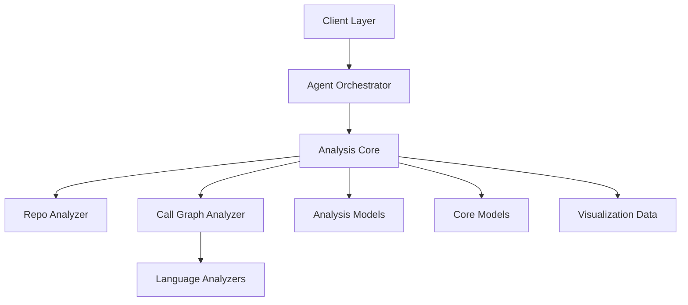
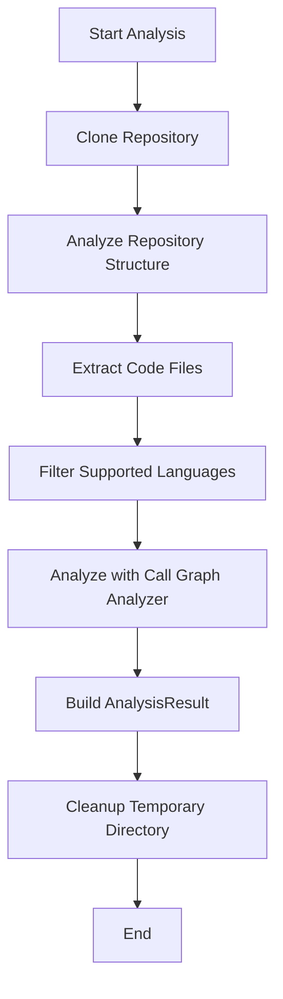
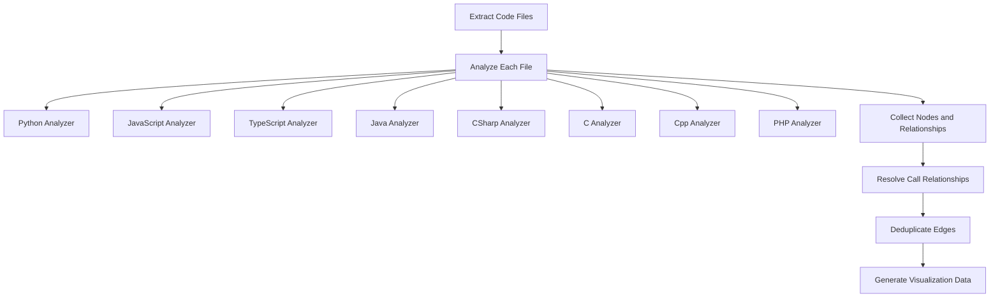
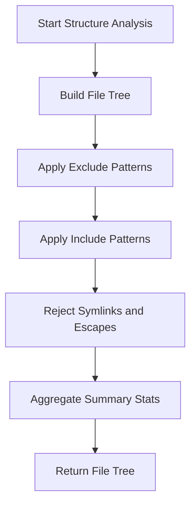
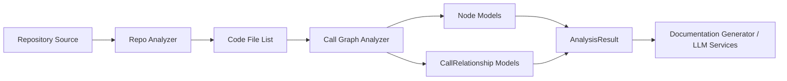

# Analysis Core

The **Analysis Core** module is the central orchestration layer for repository inspection and call graph generation within the Dependency Analysis subsystem.

It coordinates:

- Repository cloning and cleanup
- File structure analysis and filtering
- Multi-language AST parsing
- Call graph construction and resolution
- Visualization data generation

This module provides the high-level services that power downstream components such as documentation generation and LLM-based analysis.

---

## Position in the System Architecture

The Analysis Core sits between raw repository access and higher-level consumers like documentation generation and orchestration layers.

### Related Modules

The Analysis Core collaborates closely with the following modules:

- [Language Analyzers](../language-analyzers/language-analyzers.md) – Language-specific AST parsers (Python, JS, TS, Java, C#, C, C++, PHP, etc.)
- [AST and Dependency Parsing](../ast-and-dependency-parsing/ast-and-dependency-parsing.md) – Shared parsing infrastructure
- [Dependency Graph Building](../dependency-graph-building/dependency-graph-building.md) – Graph construction utilities
- [Analysis Models](../analysis-models/analysis-models.md) – Domain objects like `AnalysisResult` and `NodeSelection`
- [Core Models](../core-models/core-models.md) – Foundational graph models such as `Node`, `CallRelationship`, and `Repository`

---

# Core Components

The Analysis Core module consists of three primary components:

1. **AnalysisService** – High-level orchestration service
2. **CallGraphAnalyzer** – Multi-language call graph builder
3. **RepoAnalyzer** – Repository structure analyzer

---

# 1. AnalysisService

**Component:**

- `CodeWiki.codewiki.src.be.dependency_analyzer.analysis.analysis_service.AnalysisService`

## Purpose

`AnalysisService` is the top-level façade for repository analysis. It provides clean entry points for:

- Full repository analysis (structure + call graph)
- Structure-only analysis
- Local repository analysis

It encapsulates cloning, parsing, analysis, result assembly, and cleanup.

---

## High-Level Workflow

---

## Public APIs

### 1. analyze_local_repository

Used for analyzing an already-cloned repository.

Responsibilities:

- Delegates structure analysis to `RepoAnalyzer`
- Extracts code files
- Filters by language (optional)
- Delegates AST parsing to `CallGraphAnalyzer`
- Returns lightweight dictionary result

### 2. analyze_repository_full

Performs complete end-to-end analysis of a GitHub repository.

Steps:

1. Clone repository
2. Parse repository metadata
3. Analyze file structure
4. Generate call graph
5. Read README (securely)
6. Build `AnalysisResult`
7. Cleanup

Returns:

- `AnalysisResult` (rich domain object)

### 3. analyze_repository_structure_only

Lightweight analysis for file tree generation without AST parsing.

Use cases:

- Quick repository previews
- UI file tree rendering
- Pre-filtering before full analysis

---

## Security Considerations

The service uses safe file handling:

- `assert_safe_path` ensures no path traversal
- `safe_open_text` prevents unsafe file reads
- Symlinks escaping repository root are rejected

This ensures untrusted repositories cannot access the host environment.

---

# 2. CallGraphAnalyzer

**Component:**

- `CodeWiki.codewiki.src.be.dependency_analyzer.analysis.call_graph_analyzer.CallGraphAnalyzer`

## Purpose

`CallGraphAnalyzer` builds a complete, multi-language call graph across a repository.

It:

- Routes files to language-specific analyzers
- Collects function definitions
- Collects call relationships
- Resolves cross-references
- Deduplicates edges
- Generates visualization-ready data

---

## Internal Architecture

---

## Key Responsibilities

### 1. File Extraction

Uses extension mappings (`CODE_EXTENSIONS`) to determine language.

### 2. Language Routing

Dispatches files to appropriate analyzer functions such as:

- `analyze_python_file`
- `analyze_javascript_file_treesitter`
- `analyze_typescript_file_treesitter`
- `analyze_java_file`
- `analyze_csharp_file`
- `analyze_c_file`
- `analyze_cpp_file`
- `analyze_php_file`

Language-specific implementations are documented in the Language Analyzers module.

---

### 3. Call Resolution

After collecting raw relationships, `_resolve_call_relationships`:

- Matches call names to function IDs
- Handles:
  - Direct function name matches
  - Component ID matches
  - Method name extraction
- Marks resolved relationships

This allows cross-file and partial cross-language resolution.

---

### 4. Deduplication

Removes duplicate caller → callee pairs to reduce noise.

---

### 5. Visualization Data

Produces Cytoscape-compatible elements:

- Node styling by language
- Edge styling for resolved calls
- Summary statistics

This enables frontend graph rendering.

---

### 6. LLM-Optimized Format

`generate_llm_format()` creates a simplified representation:

- Function name
- File name
- Purpose (first docstring line)
- Parameters
- Call relationships

This format is optimized for prompt injection into LLM pipelines.

---

# 3. RepoAnalyzer

**Component:**

- `CodeWiki.codewiki.src.be.dependency_analyzer.analysis.repo_analyzer.RepoAnalyzer`

## Purpose

`RepoAnalyzer` generates a filtered file tree representation of one or more repositories.

It supports:

- Include pattern filtering
- Exclude pattern filtering
- Symlink rejection
- Multi-repository merging with namespaces

---

## Repository Structure Flow

---

## Key Capabilities

### Pattern Handling

- `DEFAULT_IGNORE_PATTERNS` define ignored paths
- Custom exclude patterns are merged with defaults
- Include patterns override default include behavior

### Multi-Repository Support

When multiple repository paths are provided:

- Each repository is assigned a namespace
- Trees are wrapped under namespace root
- A merged structure is returned
- Summary includes total files and namespaces

This enables cross-repository dependency analysis.

---

# Data Flow Across the Module

---

# Supported Languages

Currently supported for AST-based analysis:

- Python
- JavaScript
- TypeScript
- Java
- C#
- C
- C++
- PHP

Filtering ensures unsupported languages are skipped safely.

---

# Error Handling Strategy

The Analysis Core follows a defensive strategy:

- Logs detailed debug information
- Catches per-file analysis failures
- Continues analysis when possible
- Ensures cleanup on failure
- Raises `RuntimeError` for top-level failures

This balances robustness with observability.

---

# Design Principles

The Analysis Core is built around:

### 1. Separation of Concerns

- Structure analysis separated from AST parsing
- Language logic isolated in analyzers
- Models separated from orchestration

### 2. Extensibility

To add a new language:

1. Implement analyzer in Language Analyzers
2. Register extension in `CODE_EXTENSIONS`
3. Add routing logic in `CallGraphAnalyzer`

No changes required in orchestration layer.

### 3. Security First

- Path validation
- Symlink rejection
- Safe file reads
- Controlled repository cloning

### 4. Visualization-Ready Output

Graph output is prepared for immediate frontend rendering.

---

# Summary

The **Analysis Core** module is the heart of repository intelligence within CodeWiki.

It transforms raw source code into:

- Structured file trees
- Function-level nodes
- Resolved call relationships
- Graph visualization data
- LLM-ready summaries

By cleanly separating orchestration, parsing, and modeling, it provides a scalable foundation for multi-language repository analysis and automated documentation generation.
