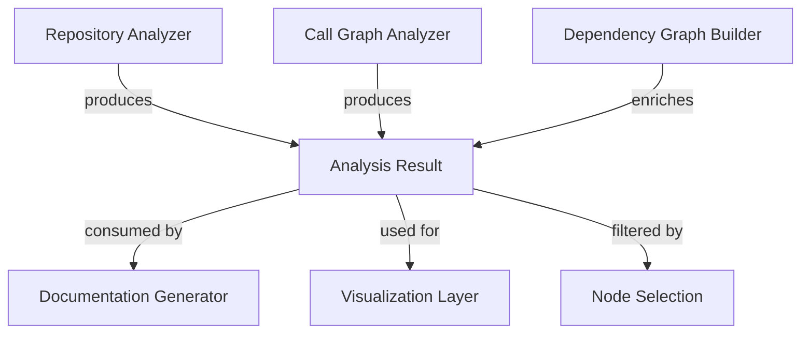
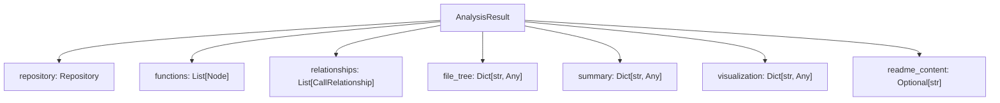
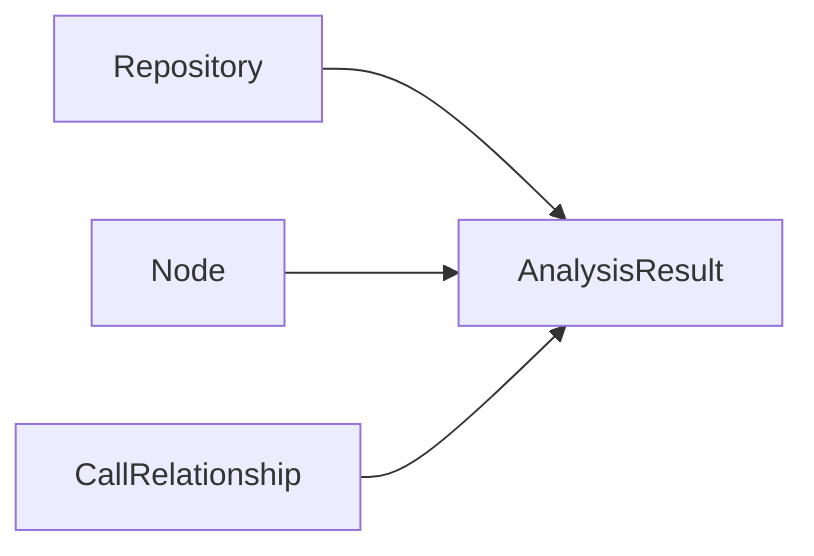
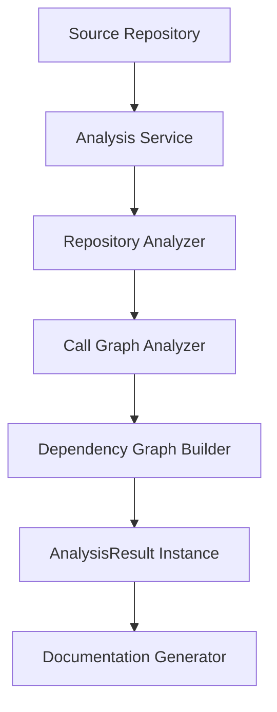
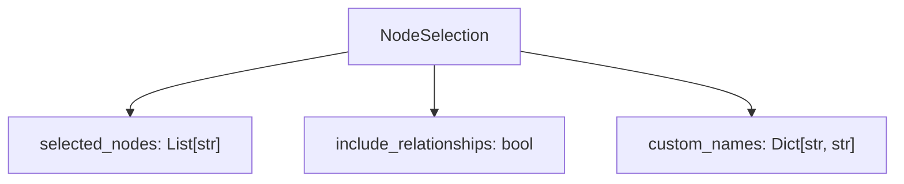
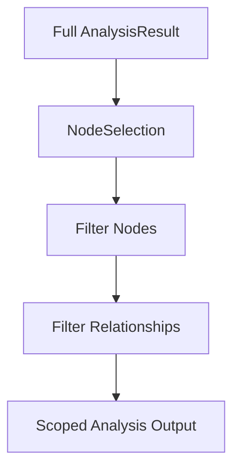
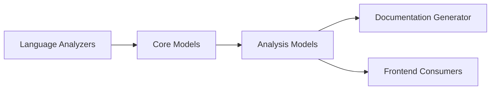

# Analysis Models

The **Analysis Models** module defines the core data structures used to represent the results of repository analysis within the Dependency Analysis subsystem. It acts as the structured contract between analysis engines, dependency graph builders, and downstream consumers such as documentation generators and visualization layers.

At its core, this module provides:

- A standardized representation of analysis output via `AnalysisResult`
- A mechanism for partial graph export via `NodeSelection`
- Tight integration with foundational domain models from [Core Models](../core-models/core-models.md)

This module does not perform analysis itself. Instead, it provides immutable, validated containers that enable consistent data exchange across the system.

---

## Architectural Context

The Analysis Models module sits between the analysis engines and higher-level services that consume analysis results.



### Related Modules

- [Analysis Core](../analysis-core/analysis-core.md) — Performs repository and call graph analysis
- [Dependency Graph Building](../dependency-graph-building/dependency-graph-building.md) — Builds graph structures
- [Core Models](../core-models/core-models.md) — Defines `Node`, `CallRelationship`, and `Repository`
- [Documentation Generation](../../documentation-generation/documentation-generation.md) — Consumes structured analysis results

---

## Data Model Overview

### 1. AnalysisResult

`AnalysisResult` represents the complete output of analyzing a repository.

It is implemented as a Pydantic model, ensuring:

- Type validation
- Schema consistency
- Easy serialization to JSON
- Strong contracts between backend services

### Structure



### Field Responsibilities

| Field | Type | Purpose |
|--------|------|----------|
| `repository` | `Repository` | Metadata and structural representation of the analyzed repository |
| `functions` | `List[Node]` | Extracted functional or structural elements |
| `relationships` | `List[CallRelationship]` | Call graph edges between nodes |
| `file_tree` | `Dict[str, Any]` | Hierarchical representation of repository files |
| `summary` | `Dict[str, Any]` | Aggregated metrics and statistics |
| `visualization` | `Dict[str, Any]` | Precomputed visualization metadata |
| `readme_content` | `Optional[str]` | Extracted or generated README content |

---

## Interaction with Core Models

The Analysis Models module builds on abstractions defined in [Core Models](../core-models/core-models.md).



### Key Relationships

- `Node` represents a function, method, class, or structural unit
- `CallRelationship` represents directed invocation or dependency edges
- `Repository` encapsulates repository-level metadata

`AnalysisResult` aggregates these into a single coherent object.

---

## Data Flow Across the System

The lifecycle of an `AnalysisResult` follows a structured pipeline.



### Step-by-Step Flow

1. Repository metadata is collected.
2. Language-specific analyzers extract nodes and relationships.
3. The dependency graph builder organizes relationships.
4. All artifacts are consolidated into a single `AnalysisResult`.
5. Downstream systems consume this structured representation.

---

## NodeSelection Model

`NodeSelection` supports partial exports and scoped analysis operations.

It allows downstream consumers to:

- Select a subset of nodes
- Decide whether to include relationships
- Apply custom display names

### Structure



### Usage Scenarios

- Exporting a subset of functions
- Generating documentation for a specific module
- Visualizing a reduced call graph
- Renaming nodes for user-friendly display

---

## Partial Export Process

`NodeSelection` modifies how an `AnalysisResult` is consumed.



### Filtering Logic

1. Match selected node identifiers.
2. Optionally remove unrelated relationships.
3. Apply custom naming mappings.
4. Produce a reduced, context-specific view.

This enables efficient documentation generation and visualization without recomputing analysis.

---

## Design Principles

### 1. Separation of Concerns

- Analysis logic resides in [Analysis Core](../analysis-core/analysis-core.md)
- Graph construction resides in [Dependency Graph Building](../dependency-graph-building/dependency-graph-building.md)
- Data representation resides in **Analysis Models**

### 2. Validation and Safety

Using Pydantic ensures:

- Type correctness
- Predictable serialization
- Early validation errors

### 3. Extensibility

The flexible `Dict[str, Any]` fields (`file_tree`, `summary`, `visualization`) allow:

- Adding metadata without schema breaking
- Supporting multiple visualization strategies
- Future AI-driven enrichments

---

## Example Logical Representation

Below is a simplified logical representation of an analysis result:

```text
AnalysisResult
 ├── Repository
 ├── Nodes (functions, classes, modules)
 ├── CallRelationships (edges)
 ├── File Tree (hierarchical structure)
 ├── Summary (metrics, counts)
 ├── Visualization metadata
 └── README content
```

---

## Role Within Dependency Analysis

Within the broader [Dependency Analysis](../dependency-analysis.md) module, Analysis Models act as the canonical data contract.



They ensure that:

- Analysis engines remain decoupled from documentation logic
- Visualization layers do not depend on raw AST data
- Frontend and backend communicate through structured schemas

---

## Summary

The **Analysis Models** module provides the structural backbone of repository analysis output. By formalizing how analysis data is represented and filtered, it enables:

- Reliable data exchange across modules
- Clean separation between analysis and presentation
- Flexible partial exports via `NodeSelection`
- Strong schema validation through Pydantic

Although small in implementation, this module is foundational in maintaining consistency, scalability, and clarity throughout the Dependency Analysis pipeline.