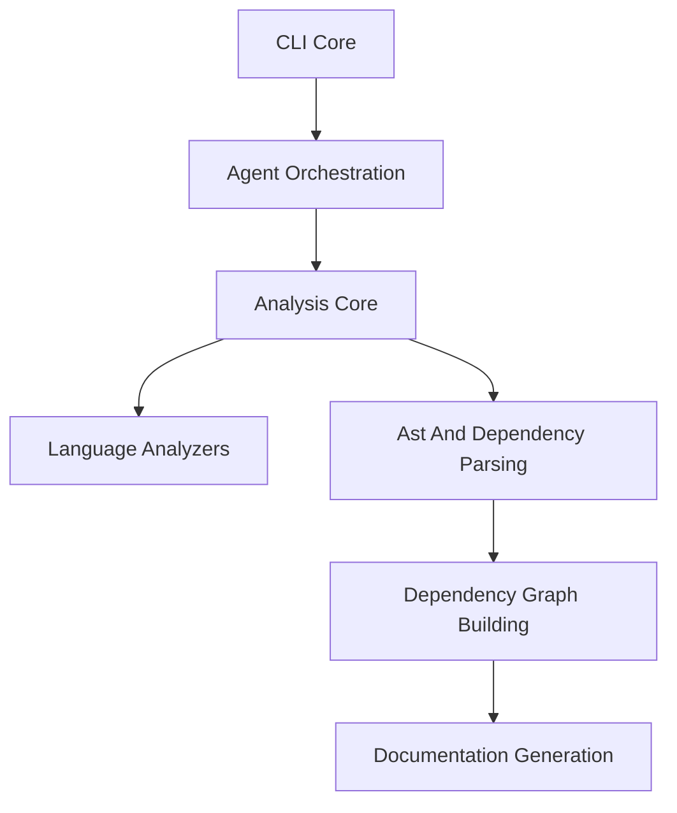
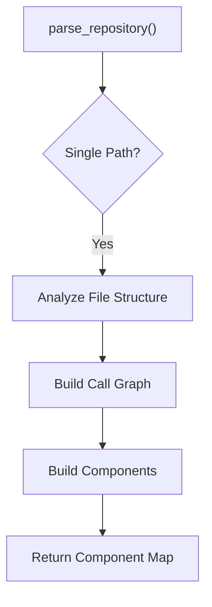
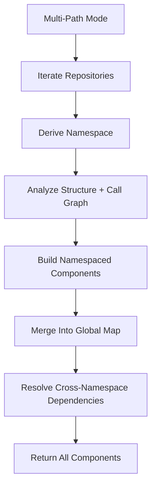
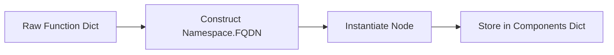
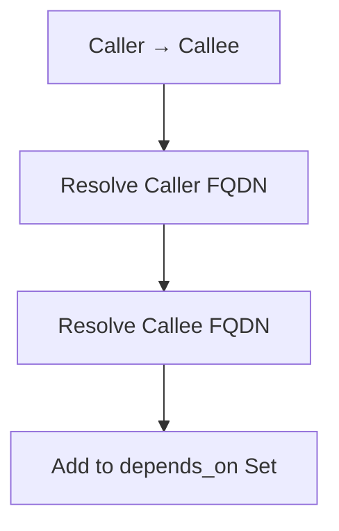
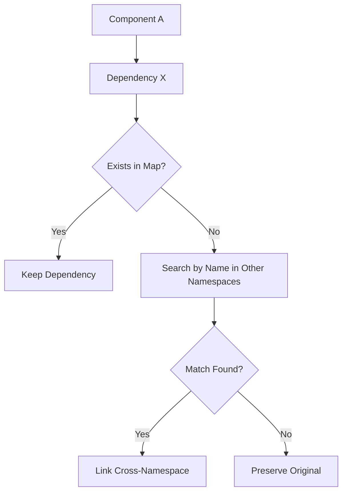
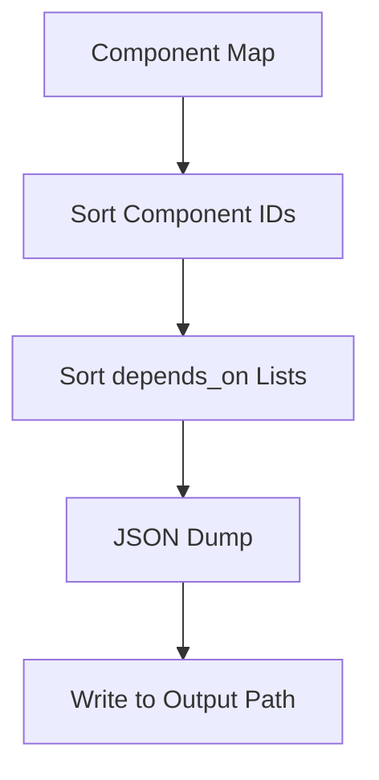
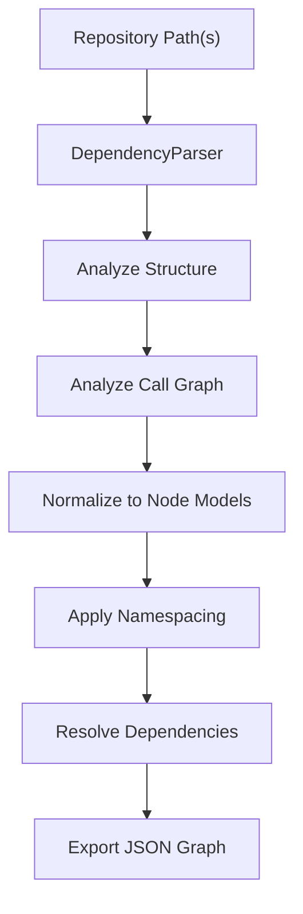

# Ast And Dependency Parsing

The **Ast And Dependency Parsing** module is responsible for transforming raw source code repositories into a structured, namespaced graph of code components. It bridges low-level language analysis and higher-level dependency graph construction by:

- Parsing one or multiple repositories
- Extracting functions, classes, and other code elements
- Building fully-qualified component identifiers (FQDNs)
- Resolving intra- and cross-repository dependencies
- Producing a normalized component map for downstream processing

At the center of this module is the `DependencyParser`, which orchestrates structural analysis and call graph extraction via the [Analysis Core](../analysis-core/analysis-core.md), and prepares the data for the [Dependency Graph Building](../dependency-graph-building/dependency-graph-building.md) module.

---

## 1. Responsibilities and Scope

The Ast And Dependency Parsing module focuses on:

1. Repository traversal (single or multiple roots)
2. AST-driven component extraction (delegated to analysis services)
3. Component normalization into `Node` models
4. Namespacing and FQDN construction
5. Dependency resolution (including cross-namespace linking)
6. Deterministic export of dependency graphs

It does **not**:

- Perform language-specific AST parsing directly (handled by [Language Analyzers](../language-analyzers/language-analyzers.md))
- Execute high-level orchestration (handled by Agent Orchestration)
- Generate documentation (handled by Documentation Generation)

---

## 2. Architectural Position

Within the broader Dependency Analysis subsystem, Ast And Dependency Parsing acts as the normalization and aggregation layer.



### Key Interactions

- **Analysis Core**: Provides file structure and call graph results.
- **Language Analyzers**: Extract language-specific AST nodes and relationships.
- **Dependency Graph Building**: Consumes normalized `Node` objects and dependency edges.

---

## 3. Core Component

### DependencyParser

**Location:** `codewiki/src/be/dependency_analyzer/ast_parser.py`

The `DependencyParser` class orchestrates parsing, component construction, namespacing, and dependency resolution.

### Constructor

```python
DependencyParser(
    repo_path: Union[str, List[str]],
    include_patterns: List[str] = None,
    exclude_patterns: List[str] = None
)
```

#### Parameters

- `repo_path`: Single repository path or list of repository paths
- `include_patterns`: Optional glob patterns to include (e.g. `"*.py"`)
- `exclude_patterns`: Optional patterns to exclude (e.g. `"*Tests*"`)

Internally:

- Normalizes paths to absolute paths
- Supports both **single-path** and **multi-path** modes
- Instantiates `AnalysisService`

---

## 4. Parsing Modes

### 4.1 Single Repository Mode

Used when a single path is provided.



Steps:

1. `_analyze_structure()` via AnalysisService
2. `_analyze_call_graph()` to extract:
   - Functions
   - Classes
   - Relationships
3. `_build_components_from_analysis()`
4. Populate:
   - `self.components`
   - `self.modules`

All components are namespaced using the repository directory name.

---

### 4.2 Multi Repository Mode

When multiple repository paths are provided, the parser operates in **multi-path mode**.



### Namespace Strategy

For each repository:

- Namespace = last directory name of the path
- Component ID becomes:

```text
{namespace}.{original_id}
```

Example:

```text
frontend.utils.formatDate
backend.services.UserService.getUser
```

This prevents collisions across repositories and enables multi-repo analysis.

---

## 5. Component Model Construction

Each extracted function or class is transformed into a `Node` (see [Core Models](../core-models/core-models.md)).

### FQDN Strategy

Each component receives:

- `id`: Fully Qualified Domain Name (FQDN)
- `short_id`: Original ID from call graph
- `namespace`: Repository-derived namespace
- `is_from_deps`: Whether it originates from dependency repositories



### Metadata Preserved

- Name
- Component type (function, class, interface, etc.)
- File path
- Relative path
- Source code snippet
- Line range
- Docstring
- Parameters
- Base classes

This normalized representation ensures consistency across languages.

---

## 6. Dependency Resolution

Dependencies originate from call graph relationships.

### 6.1 Intra-Namespace Resolution

Within a single repository:

- Caller and callee IDs are mapped to FQDN
- `depends_on` sets are updated



---

### 6.2 Cross-Namespace Resolution

In multi-path mode, dependencies may cross repositories.

Algorithm:

1. Iterate over all components
2. For each unresolved dependency:
   - Attempt name-based match across namespaces
   - If match found in different namespace → register cross-namespace dependency
3. Preserve unresolved references if no match is found



The algorithm uses sorted iteration to ensure deterministic output.

---

## 7. Determinism and Stability

To guarantee reproducible results:

- Component dictionaries are iterated in sorted order
- Dependency sets are converted to sorted lists during export
- Cross-namespace resolution iterates deterministically

This is essential for:

- Stable documentation generation
- Consistent diff output
- CI/CD validation

---

## 8. Exporting the Dependency Graph

The `save_dependency_graph()` method serializes components into JSON.

### Output Characteristics

- Keys sorted lexicographically
- `depends_on` converted from `set` to sorted list
- UTF-8 encoding
- Indented JSON



The exported graph serves as input for:

- [Dependency Graph Building](../dependency-graph-building/dependency-graph-building.md)
- Higher-level analysis and visualization
- Documentation synthesis

---

## 9. Internal Data Structures

### Components

```text
Dict[str, Node]
```

- Key: FQDN
- Value: Node model

### Modules

```text
Set[str]
```

- Tracks module paths (namespaced)
- Derived from hierarchical IDs

---

## 10. Integration with Other Modules

### Analysis Core

Provides:

- `_analyze_structure()`
- `_analyze_call_graph()`

The Ast And Dependency Parsing module depends directly on its outputs.

### Language Analyzers

Indirectly used via Analysis Core. These include:

- Tree-sitter analyzers for C, C++, C#, Java, JavaScript, PHP, TypeScript
- Python AST analyzer

They provide language-specific extraction that is normalized here.

### Dependency Graph Building

Consumes:

- Fully normalized `Node` objects
- `depends_on` relationships

This module ensures the graph builder receives a consistent, cross-language representation.

---

## 11. End-to-End Flow Summary



---

## 12. Design Principles

1. **Language-Agnostic Core**  
   All language-specific complexity is delegated to analyzers.

2. **Namespace Isolation**  
   Prevents ID collisions across repositories.

3. **Deterministic Output**  
   Sorted iteration ensures reproducibility.

4. **Extensibility**  
   Additional languages or repositories require no changes to the core parser logic.

5. **Separation of Concerns**  
   Parsing, graph construction, and documentation generation remain distinct layers.

---

## 13. Summary

The **Ast And Dependency Parsing** module is the normalization backbone of the dependency analysis pipeline. It:

- Aggregates multi-language AST results
- Constructs stable, namespaced component identifiers
- Resolves dependencies across repository boundaries
- Produces a deterministic component graph

By abstracting repository complexity into a unified `Node` model and dependency map, it enables reliable downstream graph building and documentation generation across heterogeneous, multi-repository systems.