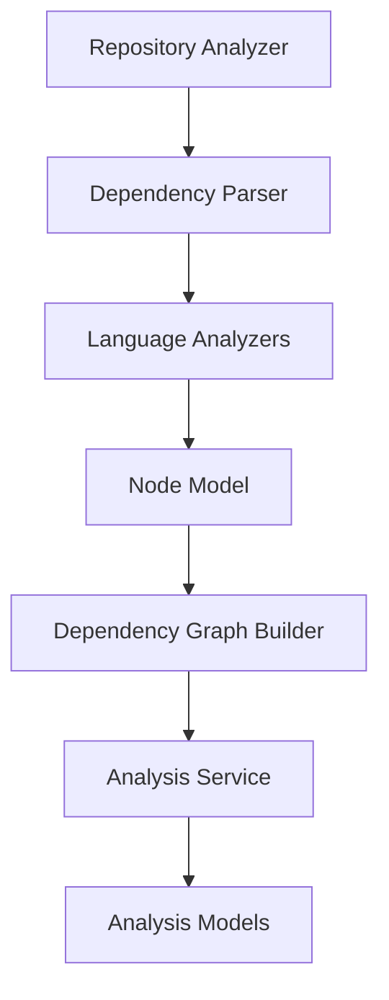
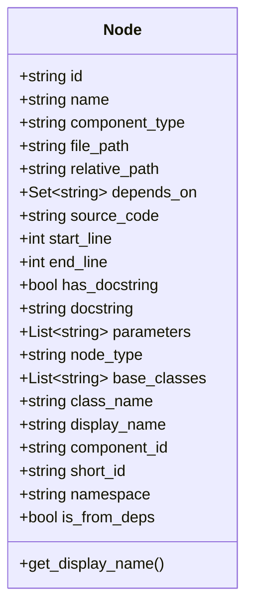
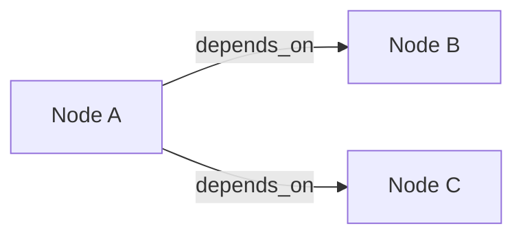
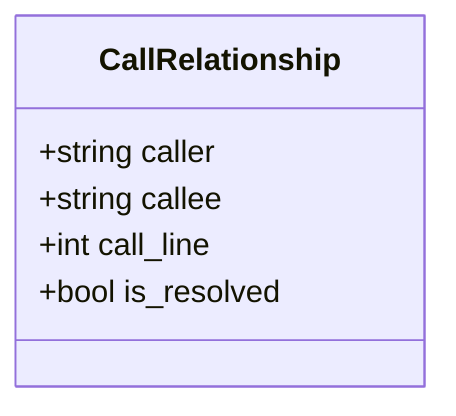
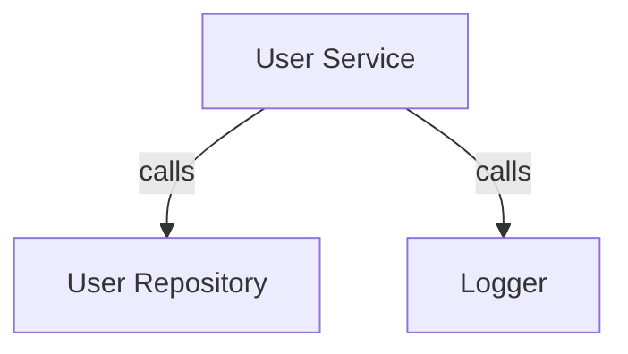
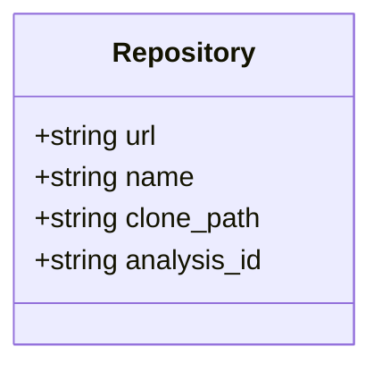
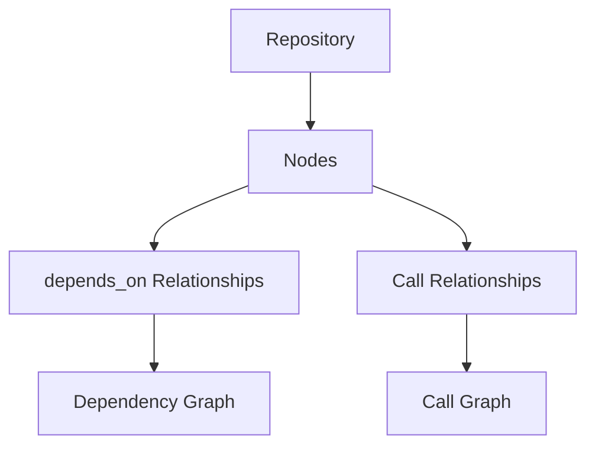

# Core Models

The **Core Models** module defines the foundational domain objects used by the Dependency Analysis subsystem. These models represent the structural elements of a source code repository—such as nodes (functions, classes, modules), call relationships, and repository metadata—that power higher-level analysis, graph construction, and documentation workflows.

This module acts as the canonical data contract between:

- Language parsers and AST analyzers
- Dependency graph builders
- Analysis services
- Documentation generation pipelines

It is intentionally lightweight and framework-agnostic, relying on Pydantic models for validation and serialization.

---

## Position in the Overall Architecture

The Core Models module sits at the heart of the Dependency Analysis pipeline.



### Related Modules

- [Analysis Core](../analysis-core/analysis-core.md)
- [Language Analyzers](../language-analyzers/language-analyzers.md)
- [AST and Dependency Parsing](../ast-and-dependency-parsing/ast-and-dependency-parsing.md)
- [Dependency Graph Building](../dependency-graph-building/dependency-graph-building.md)
- [Analysis Models](../analysis-models/analysis-models.md)

The Core Models module provides the shared entities that all these modules depend on.

---

## Design Principles

1. **Language-Agnostic Representation**  
   Models abstract away language-specific syntax while preserving structural semantics.

2. **FQDN-Based Identity**  
   Each node is uniquely identified using a Fully Qualified Domain Name (FQDN).

3. **Graph-Friendly Structure**  
   Relationships are explicit and easily convertible into graph edges.

4. **Backward Compatibility**  
   Metadata fields include defaults to avoid breaking existing workflows.

5. **Pydantic-Based Validation**  
   All models inherit from `BaseModel` for serialization and validation.

---

# Core Domain Models

## 1. Node

The `Node` model represents a structural code element such as:

- Class
- Function
- Method
- Module
- Interface
- Component

It is the fundamental building block of the dependency graph.

### Structural Overview



### Key Concepts

#### 1. FQDN Identity

The `id` field follows a Fully Qualified Domain Name structure:

```text
{namespace}.{original_id}
```

Examples:

```text
main.UserService.create_user
ui-kit.Button.render
```

This ensures:

- Global uniqueness across modules
- Clear separation between main repository and dependencies
- Stable graph indexing

Related metadata fields:

- `short_id` – original identifier without namespace
- `namespace` – logical boundary such as "main" or "deps"
- `is_from_deps` – indicates if the node originates from external dependencies

---

#### 2. Dependency Representation

Each node tracks structural dependencies via:

```python
depends_on: Set[str]
```

This stores referenced node IDs, forming the adjacency basis for graph construction.

Dependency flow:



The `Dependency Graph Builder` converts this into a directed graph.

---

#### 3. Source Metadata

Nodes also store:

- `source_code` – optional extracted source
- `start_line` and `end_line` – code boundaries
- `file_path` and `relative_path` – file location
- `has_docstring` and `docstring` – documentation metadata

This enables:

- Context-aware documentation generation
- Code snippet embedding
- Traceability to original files

---

#### 4. Object-Oriented Metadata

For class-based languages:

- `base_classes`
- `class_name`
- `parameters`
- `node_type`

These allow the system to model inheritance and method signatures across languages.

---

### Display Name Resolution

The helper method:

```python
def get_display_name(self) -> str:
    return self.display_name or self.name
```

Provides a consistent human-readable label for:

- Graph visualization
- Documentation headings
- UI representation

---

## 2. Call Relationship

The `CallRelationship` model represents runtime or static call interactions between nodes.



### Fields

- `caller` – FQDN of calling node
- `callee` – FQDN of target node
- `call_line` – optional source line number
- `is_resolved` – indicates whether the call target was successfully resolved

### Call Graph Example



Unresolved calls (e.g., dynamic dispatch) are flagged via `is_resolved = False`, enabling:

- Deferred resolution strategies
- Diagnostics reporting
- Partial graph analysis

---

## 3. Repository

The `Repository` model captures metadata about the analyzed codebase.



### Responsibilities

- Identify the source repository
- Track local clone location
- Associate analysis runs using `analysis_id`

This model links the Dependency Analysis subsystem with:

- Repository ingestion workflows
- Job orchestration layers
- Documentation generation pipelines

---

# Interaction Between Core Models

The three models combine to form the structural backbone of the analysis system.



### Data Flow Summary

1. A `Repository` is registered for analysis.
2. Language analyzers create `Node` instances.
3. Structural dependencies populate `depends_on`.
4. Function calls generate `CallRelationship` entries.
5. Graph builders transform these into navigable graphs.
6. Higher-level services compute metrics and summaries.

---

# Integration with Other Modules

## With Language Analyzers

Language-specific analyzers generate `Node` objects enriched with:

- Parameters
- Inheritance data
- Docstrings
- Source ranges

See: [Language Analyzers](../language-analyzers/language-analyzers.md)

---

## With Dependency Graph Building

The `DependencyGraphBuilder` consumes:

- `Node.depends_on`
- `CallRelationship`

And constructs directed graphs for traversal and visualization.

See: [Dependency Graph Building](../dependency-graph-building/dependency-graph-building.md)

---

## With Analysis Core

The `AnalysisService` orchestrates repository scanning and returns structured results built on top of Core Models.

See: [Analysis Core](../analysis-core/analysis-core.md)

---

## With Analysis Models

Higher-level result objects such as `AnalysisResult` and `NodeSelection` wrap and filter Core Model instances.

See: [Analysis Models](../analysis-models/analysis-models.md)

---

# Why Core Models Matter

Without this module:

- There would be no consistent identity system across languages.
- Graph construction would lack a stable schema.
- Documentation generation would not have structured code metadata.
- Cross-module analysis would be brittle and tightly coupled.

Core Models provide:

- A normalized representation of code structure
- A graph-ready dependency abstraction
- A language-agnostic contract between analysis stages
- A stable foundation for future extensions

---

# Summary

The **Core Models** module defines the canonical structural entities of the Dependency Analysis system:

- `Node` – represents structural code elements
- `CallRelationship` – represents invocation edges
- `Repository` – represents repository metadata

Together, these models form the backbone of:

- Static analysis
- Dependency graph construction
- Call graph modeling
- Automated documentation generation

Every higher-level feature in the Dependency Analysis subsystem ultimately depends on these foundational models.