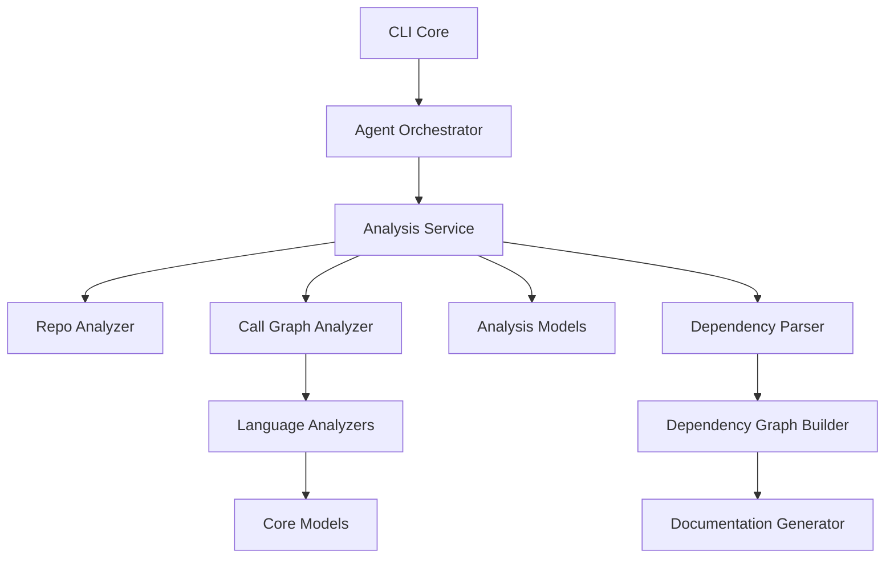
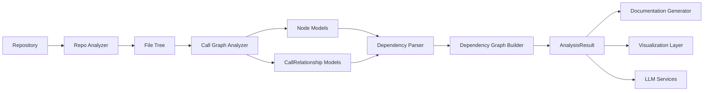

# Dependency Analysis

The **Dependency Analysis** module is the structural intelligence layer of CodeWiki. It transforms raw source code repositories into structured, validated, and visualizable dependency graphs that power documentation generation, architectural insights, and LLM-driven reasoning.

Located under:

```
codewiki/src/be/dependency_analyzer
```

This module performs:

- Multi-language static analysis (AST-based parsing)
- Call graph generation
- Cross-file and cross-repository dependency resolution
- Namespaced component normalization
- Graph construction and validation
- LLM-ready and visualization-ready output formatting

It acts as the backbone for documentation generation and higher-level orchestration.

---

# Purpose

The **Dependency Analysis** module exists to:

1. Parse repositories across multiple programming languages.
2. Extract structural components (classes, functions, interfaces, etc.).
3. Detect relationships between components.
4. Normalize and namespace identifiers.
5. Build a deterministic dependency graph.
6. Provide structured output for:
   - Documentation Generation
   - LLM-based analysis
   - Architecture visualization
   - Frontend graph rendering

It ensures that heterogeneous, multi-language repositories are reduced to a consistent and analyzable model.

---

# High-Level Architecture



---

# Repository Structure

```
codewiki/src/be/dependency_analyzer/
│
├── analysis/
│   ├── analysis_service.py
│   ├── call_graph_analyzer.py
│   └── repo_analyzer.py
│
├── analyzers/
│   ├── c/
│   ├── cpp/
│   ├── csharp/
│   ├── java/
│   ├── javascript/
│   ├── php/
│   ├── python/
│   └── typescript/
│
├── ast_parser.py
├── dependency_graphs_builder.py
│
└── models/
    ├── analysis/
    │   ├── AnalysisResult
    │   └── NodeSelection
    └── core/
        ├── Node
        ├── CallRelationship
        └── Repository
```

---

# Core Submodules

The Dependency Analysis module is composed of six major subdomains:

---

## 1. Analysis Core

**Components:**

- `AnalysisService`
- `CallGraphAnalyzer`
- `RepoAnalyzer`

**Responsibilities:**

- Orchestrate repository analysis
- Clone and inspect repositories
- Extract file structures
- Route files to language analyzers
- Resolve call relationships
- Produce `AnalysisResult`

See detailed documentation:
- `analysis-core.md`

---

## 2. Language Analyzers

**Components:**

- `TreeSitterCAnalyzer`
- `TreeSitterCppAnalyzer`
- `TreeSitterCSharpAnalyzer`
- `TreeSitterJavaAnalyzer`
- `TreeSitterJSAnalyzer`
- `TreeSitterTSAnalyzer`
- `TreeSitterPHPAnalyzer`
- `NamespaceResolver`
- `PythonASTAnalyzer`

**Responsibilities:**

- Parse language-specific ASTs
- Extract:
  - Classes
  - Functions
  - Methods
  - Interfaces
  - Enums
- Emit standardized:
  - `Node`
  - `CallRelationship`

Supported languages:

- Python
- JavaScript
- TypeScript
- Java
- C#
- C
- C++
- PHP

See:
- `language-analyzers.md`

---

## 3. AST and Dependency Parsing

**Component:**

- `DependencyParser`

**Responsibilities:**

- Normalize components across repositories
- Apply namespacing
- Resolve cross-repository dependencies
- Produce deterministic component maps
- Export dependency graphs as JSON

Supports:

- Single repository mode
- Multi-repository mode
- Include/exclude filtering

See:
- `ast-and-dependency-parsing.md`

---

## 4. Dependency Graph Building

**Component:**

- `DependencyGraphBuilder`

**Responsibilities:**

- Build adjacency graph from parsed components
- Validate graph completeness
- Identify valid leaf nodes
- Filter documentation entry points
- Persist graph artifacts

See:
- `dependency-graph-building.md`

---

## 5. Analysis Models

**Components:**

- `AnalysisResult`
- `NodeSelection`

**Responsibilities:**

- Define structured output schema
- Aggregate:
  - Repository metadata
  - Functions and classes
  - Call relationships
  - File tree
  - Summary metrics
  - Visualization metadata
- Support scoped exports

See:
- `analysis-models.md`

---

## 6. Core Models

**Components:**

- `Node`
- `CallRelationship`
- `Repository`

**Responsibilities:**

- Define canonical domain objects
- Represent:
  - Structural entities
  - Directed call relationships
  - Repository metadata
- Provide stable graph primitives

---

# End-to-End Data Flow



---

# Multi-Language Strategy

The module ensures language consistency through:

1. AST-level parsing (Tree-sitter or native AST)
2. Deterministic component identifiers:
   ```
   <namespace>.<module>.<class>.<method>
   ```
3. Relationship normalization into directed edges
4. Deduplication and resolution
5. Namespaced merging for multi-repo systems

This allows:

- Cross-language dependency graphs
- Unified visualization
- Reliable LLM summarization

---

# Design Principles

### 1. Separation of Concerns

- Parsing → Language Analyzers
- Orchestration → Analysis Core
- Normalization → Dependency Parser
- Graph Construction → Graph Builder
- Representation → Models

---

### 2. Deterministic Output

- Sorted iteration
- Stable identifier generation
- Reproducible JSON graph export

Essential for:

- CI/CD stability
- Diff-based documentation updates
- Reliable automation

---

### 3. Security First

- Safe file access
- Symlink rejection
- Path validation
- Controlled repository handling

---

### 4. Extensibility

To add a new language:

1. Implement analyzer
2. Register file extensions
3. Plug into `CallGraphAnalyzer`

No changes required in higher-level modules.

---

# Role Within CodeWiki

The **Dependency Analysis** module is the analytical engine of CodeWiki.

It provides:

- Structural truth of repositories
- Dependency graphs
- LLM-ready summaries
- Documentation entry points
- Visualization-ready graph metadata

Without this module, automated documentation and architecture analysis would not be possible.

---

# Summary

The **Dependency Analysis** module transforms raw source code into a structured, validated, multi-language dependency graph. It combines:

- AST parsing
- Call graph resolution
- Namespace normalization
- Graph construction
- Structured result modeling

By cleanly separating parsing, orchestration, modeling, and graph construction, it delivers a scalable foundation for automated documentation, architectural visualization, and AI-assisted code understanding across complex repositories.