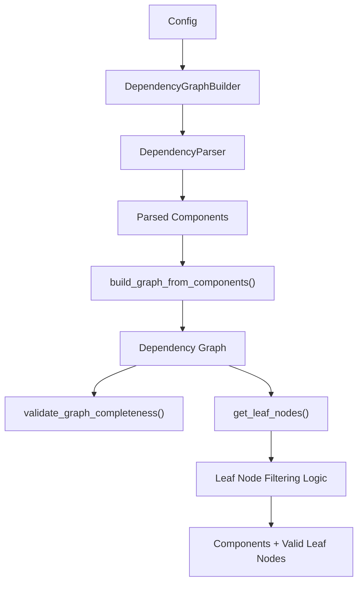
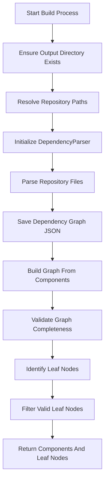
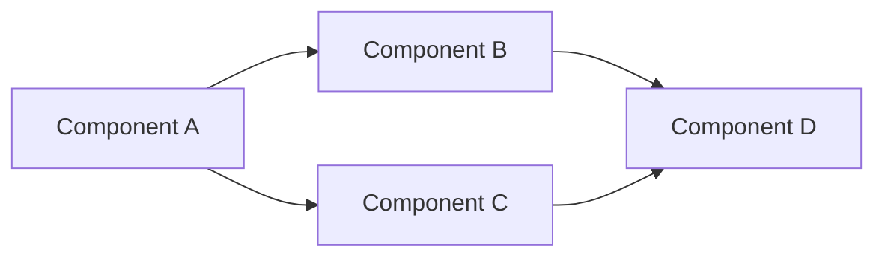
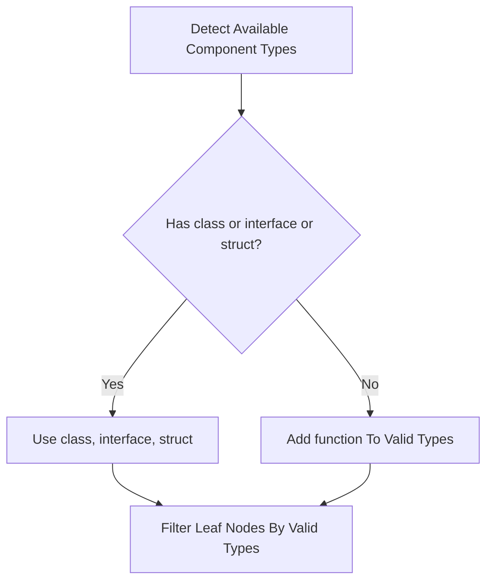
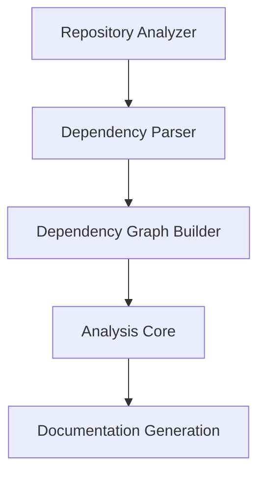

# Dependency Graph Building

The **Dependency Graph Building** module is responsible for transforming parsed source code components into a validated, traversable dependency graph. It acts as the bridge between raw dependency extraction and higher-level analysis or documentation generation.

At its core, this module consolidates parsed components, constructs a graph representation, validates structural completeness, and identifies meaningful leaf nodes that serve as entry points for downstream processing (e.g., documentation generation or LLM-based summarization).

---

## 1. Purpose and Responsibilities

The Dependency Graph Building module performs the following responsibilities:

- Ensures dependency graph output directories exist
- Coordinates parsing via the Dependency Parser
- Persists dependency graph artifacts to disk
- Builds an in-memory graph representation from parsed components
- Validates graph completeness
- Identifies and filters valid leaf nodes
- Returns structured data for downstream modules

It relies heavily on:

- [AST And Dependency Parsing](ast-and-dependency-parsing/ast-and-dependency-parsing.md)
- [Core Models](core-models/core-models.md)
- [Analysis Core](analysis-core/analysis-core.md)

This module does **not** perform language parsing itself. Instead, it orchestrates and structures outputs from lower-level analysis modules.

---

## 2. High-Level Architecture

The module is centered around a single orchestrator class:

- `DependencyGraphBuilder`

### Architectural Context



### Key Dependencies

- `DependencyParser` — Parses repository files and extracts dependency relationships.
- `build_graph_from_components()` — Constructs adjacency structures.
- `validate_graph_completeness()` — Ensures graph integrity.
- `get_leaf_nodes()` — Identifies traversal entry points.
- `file_manager` — Handles JSON persistence.

---

## 3. Core Class: DependencyGraphBuilder

### Constructor

```python
class DependencyGraphBuilder:
    def __init__(self, config: Config):
        self.config = config
```

The builder receives a `Config` object containing:

- Repository path
- Output directory for dependency graphs
- Include/exclude patterns
- Multi-path configuration

Configuration management originates in CLI and orchestration layers.

---

## 4. Dependency Graph Build Process

The main workflow is implemented in:

```python
build_dependency_graph() -> tuple[Dict[str, Any], List[str]]
```

It returns:

- `components`: All parsed components
- `keep_leaf_nodes`: Filtered leaf nodes suitable for documentation

### End-to-End Flow



---

## 5. Repository Parsing and Component Extraction

Parsing is delegated to the Dependency Parser module:

- Accepts single-path or multi-path repositories
- Applies include/exclude filters
- Produces a dictionary of `Node` objects

Each component contains metadata such as:

- Unique identifier
- Component type (class, interface, struct, function)
- Dependency references

See:

- [AST And Dependency Parsing](ast-and-dependency-parsing/ast-and-dependency-parsing.md)
- [Core Models](core-models/core-models.md)

---

## 6. Graph Construction

After parsing, the builder constructs a graph representation using:

```python
build_graph_from_components(components)
```

This produces an adjacency-based dependency graph suitable for:

- Traversal
- Topological analysis
- Leaf node identification

### Conceptual Graph Model



In this example:

- `Component D` has no outgoing dependencies → candidate leaf
- `Component A` is a root node

---

## 7. Graph Validation

Immediately after construction, the module performs structural validation:

```python
validate_graph_completeness(components, graph)
```

### Validation Goals

- Ensure all parsed components exist in the graph
- Detect orphaned or unresolved nodes
- Catch inconsistencies introduced during parsing

This defensive validation step prevents downstream failures in documentation or analysis modules.

---

## 8. Leaf Node Identification

Leaf nodes are identified via:

```python
get_leaf_nodes(graph, components)
```

### What Is a Leaf Node?

A leaf node is a component with:

- No outgoing dependencies
- A valid component identifier

Leaf nodes typically represent:

- Independent services
- Concrete implementations
- End-of-chain components

These serve as natural documentation entry points.

---

## 9. Intelligent Leaf Node Filtering

Not all leaf nodes are suitable for documentation.

The module applies multiple filtering rules:

### 9.1 Identifier Validation

Leaf nodes are discarded if:

- They are not strings
- They are empty
- They contain error keywords ("error", "exception", "failed", "invalid")

This guards against malformed parsing results.

---

### 9.2 Type-Based Filtering

Valid types by default:

- `class`
- `interface`
- `struct`

Special case:

If no object-oriented types exist in the repository, `function` is added automatically (for C-style codebases).

### Type Resolution Logic



---

### 9.3 Missing Component Handling

If a leaf node appears in the graph but not in parsed components:

Possible causes:

- File excluded after scan
- Parsing failure
- External dependency reference

These are logged and skipped.

---

## 10. Output Contract

The method returns:

```python
return components, keep_leaf_nodes
```

### `components`

- Dictionary keyed by unique component identifiers
- Values are `Node` instances

### `keep_leaf_nodes`

- List of valid leaf node identifiers
- Safe for documentation generation

These outputs are consumed by:

- Analysis layers
- Documentation generation
- Agent orchestration

---

## 11. Integration Within the Dependency Analysis Domain

The Dependency Graph Building module sits inside the Dependency Analysis subsystem.

### Subsystem Structure



Related modules:

- [Analysis Core](analysis-core/analysis-core.md)
- [Language Analyzers](language-analyzers/language-analyzers.md)
- [AST And Dependency Parsing](ast-and-dependency-parsing/ast-and-dependency-parsing.md)
- [Analysis Models](analysis-models/analysis-models.md)
- [Core Models](core-models/core-models.md)

---

## 12. Logging and Observability

The module provides structured logging for:

- Multi-path vs single-path mode
- Component type breakdown
- Graph persistence location
- Leaf filtering statistics

Example metrics logged:

- Total components parsed
- Component type distribution
- Total leaf nodes found
- Leaf nodes kept vs skipped

This observability is critical for:

- Large repositories
- Multi-language projects
- Debugging incomplete graph issues

---

## 13. Design Principles

### 13.1 Separation of Concerns

- Parsing → Dependency Parser
- Modeling → Core Models
- Graph construction → Topological utilities
- Validation → Dedicated validation module
- Filtering logic → This module

---

### 13.2 Defensive Programming

- Identifier validation
- Type validation
- Completeness checks
- Graceful handling of inconsistencies

---

### 13.3 Extensibility

The module supports:

- Multi-path repositories
- Language-agnostic component types
- Future extension for additional component categories

---

## 14. Summary

The **Dependency Graph Building** module is the structural backbone of the dependency analysis pipeline.

It:

- Converts parsed components into a validated graph
- Identifies documentation-ready entry points
- Enforces structural integrity
- Prepares data for higher-level orchestration

Without this module, the system would lack a coherent, validated representation of inter-component dependencies — a critical prerequisite for automated documentation and analysis workflows.
