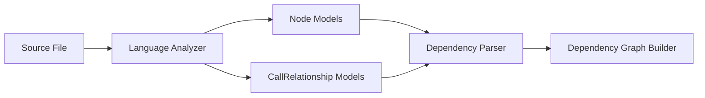
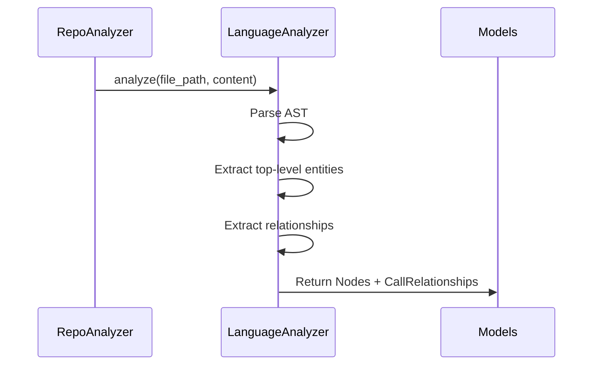
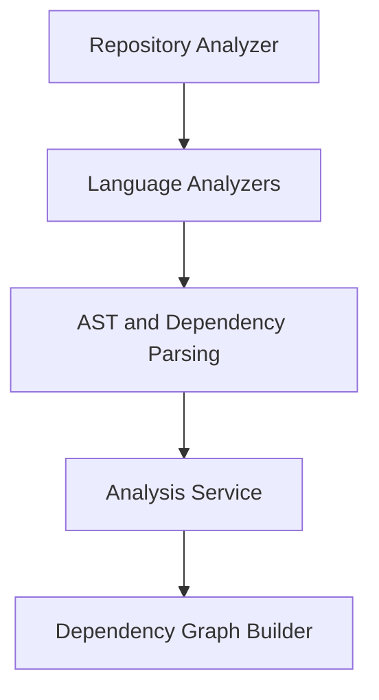

# Language Analyzers

The **Language Analyzers** module is responsible for parsing source code written in multiple programming languages and extracting structured representations of code elements and their relationships. It forms the foundation of the dependency analysis pipeline by transforming raw source files into normalized `Node` and `CallRelationship` models.

This module lives under the broader Dependency Analysis domain and collaborates closely with:

- [Analysis Core](../analysis-core/analysis-core.md)
- [AST and Dependency Parsing](../ast-and-dependency-parsing/ast-and-dependency-parsing.md)
- [Dependency Graph Building](../dependency-graph-building/dependency-graph-building.md)
- [Core Models](../core-models/core-models.md)

Rather than performing repository-wide reasoning, Language Analyzers focus on **file-level static analysis**, producing consistent intermediate artifacts used downstream.

---

## Responsibilities

The Language Analyzers module:

- Parses source files using language-specific parsers (Tree-sitter or Python AST).
- Extracts top-level entities (classes, functions, structs, interfaces, enums, etc.).
- Builds standardized `Node` objects.
- Detects intra-file relationships and emits `CallRelationship` objects.
- Normalizes identifiers into dot-separated `component_id` values.
- Filters out primitives and system-level constructs to reduce noise.

Each analyzer operates independently and adheres to the same output contract:

```text
Input:  (file_path, file_content, repo_root)
Output: (List[Node], List[CallRelationship])
```

---

## Architectural Overview



### Position in the Dependency Analysis Pipeline

1. **Language Analyzers** perform syntax-level parsing.
2. Extracted models are passed to [AST and Dependency Parsing](../ast-and-dependency-parsing/ast-and-dependency-parsing.md).
3. Parsed relationships are resolved and aggregated by [Analysis Core](../analysis-core/analysis-core.md).
4. Final dependency graphs are constructed by [Dependency Graph Building](../dependency-graph-building/dependency-graph-building.md).

---

## Supported Languages and Implementations

Each language has a dedicated analyzer implementation:

| Language | Analyzer Class |
|----------|----------------|
| C | `TreeSitterCAnalyzer` |
| C++ | `TreeSitterCppAnalyzer` |
| C# | `TreeSitterCSharpAnalyzer` |
| Java | `TreeSitterJavaAnalyzer` |
| JavaScript | `TreeSitterJSAnalyzer` |
| TypeScript | `TreeSitterTSAnalyzer` |
| PHP | `TreeSitterPHPAnalyzer` |
| Python | `PythonASTAnalyzer` |

Most analyzers use **Tree-sitter** for robust AST parsing. Python uses the built-in `ast` module for native syntax analysis.

---

## Core Data Flow per File



---

## Shared Design Patterns Across Analyzers

Although implementations differ by language, most analyzers follow the same pattern:

### 1. Module Path Normalization

Each analyzer converts file paths into dot-separated module identifiers:

```text
src/services/user.py
→ src.services.user
```

This ensures consistent `component_id` construction:

```text
src.services.user.UserService
src.services.user.get_user
```

---

### 2. Node Extraction

Analyzers identify top-level constructs such as:

- Classes
- Functions
- Methods
- Interfaces
- Structs
- Enums
- Namespaces
- Traits (PHP)

Each extracted construct is converted into a `Node` object containing:

- `id`
- `name`
- `component_type`
- `file_path`
- `relative_path`
- `source_code`
- `start_line` / `end_line`
- `parameters`
- `base_classes`

The `Node` model is defined in [Core Models](../core-models/core-models.md).

---

### 3. Relationship Extraction

Each analyzer extracts language-specific dependency types and normalizes them into `CallRelationship` objects.

Common relationship categories:

- Function calls
- Method calls
- Object instantiation
- Class inheritance
- Interface implementation
- Field/property type dependencies
- Constructor injection
- Static calls
- Namespace imports

These relationships are later resolved and unified across files by higher-level modules.

---

## Language-Specific Behavior

### C Analyzer

- Detects functions, structs, and global variables.
- Tracks function-to-function calls.
- Tracks usage of global variables inside functions.
- Filters common system functions (e.g., `printf`, `malloc`).

---

### C++ Analyzer

- Extracts classes, structs, namespaces, functions, and methods.
- Detects:
  - Inheritance (`inherits` relationships)
  - Object creation (`creates`)
  - Method calls
  - Global variable usage
- Resolves method-to-class relationships.

---

### C# Analyzer

- Extracts classes, interfaces, structs, enums, records, delegates.
- Tracks:
  - Base class inheritance
  - Interface implementation
  - Property and field type dependencies
  - Method parameter type dependencies
- Filters primitive and common framework types.

---

### Java Analyzer

- Detects:
  - Classes, interfaces, enums, records, annotations
  - Methods
- Extracts:
  - `extends` relationships
  - `implements` relationships
  - Field type dependencies
  - Object creation
  - Method invocations
- Attempts local variable type resolution inside methods.

---

### JavaScript Analyzer

- Extracts:
  - Classes and methods
  - Functions (including async and generator)
  - Arrow functions
  - Exported entities
- Tracks:
  - Function calls
  - Constructor calls (`new`)
  - Inheritance via class heritage
  - JSDoc-based type dependencies
- Deduplicates relationships using an internal cache.

---

### TypeScript Analyzer

- Extends JavaScript analysis with:
  - Interfaces
  - Type aliases
  - Enums
  - Ambient declarations
  - Type annotations and generic types
- Extracts:
  - Inheritance and implementation
  - Constructor injection dependencies
  - Type-level dependencies
- Filters nested/local entities to isolate true top-level declarations.

---

### PHP Analyzer

- Handles namespace resolution via `NamespaceResolver`.
- Extracts:
  - Classes, interfaces, traits, enums
  - Functions and methods
- Tracks:
  - `use` imports
  - `extends` inheritance
  - `implements`
  - Static calls (`::`)
  - Object creation
  - Constructor property promotion (PHP 8+)
- Skips template/view files to reduce noise.

---

### Python Analyzer

- Uses Python's native `ast` module.
- Extracts:
  - Classes
  - Top-level functions
- Tracks:
  - Inheritance via base classes
  - Function calls
- Filters built-in functions and common primitives.

---

## Component Identifier Strategy

All analyzers generate deterministic identifiers:

```text
<module_path>.<entity_name>
<module_path>.<class_name>.<method_name>
```

This design ensures:

- Cross-language consistency
- Easy graph merging
- Conflict reduction
- Compatibility with downstream graph builders

---

## Error Handling and Resilience

Language Analyzers are designed to be resilient:

- Parser initialization failures are logged and skipped.
- Syntax errors do not crash the full repository analysis.
- Recursion depth limits prevent stack overflows (PHP).
- Built-in and primitive types are filtered.

This allows large heterogeneous repositories to be analyzed safely.

---

## How It Fits Into the Overall System



Within the full CodeWiki pipeline:

- Dependency Analysis feeds into
- Documentation Generation
- LLM-based summarization
- Architecture visualization

Language Analyzers provide the **structural truth layer** of the system.

---

## Summary

The Language Analyzers module is the multi-language parsing backbone of the dependency analysis system. It:

- Normalizes code structure across languages
- Extracts deterministic nodes and relationships
- Filters noise and built-ins
- Enables graph-based reasoning downstream

By standardizing static analysis outputs across C, C++, C#, Java, JavaScript, TypeScript, PHP, and Python, the module ensures that higher-level components operate on a unified representation of software structure.
