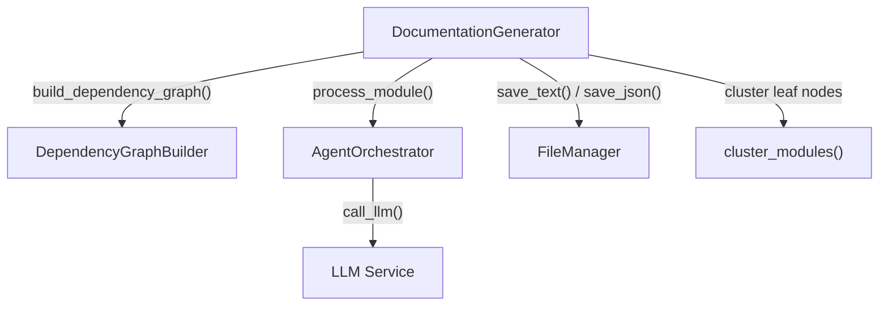
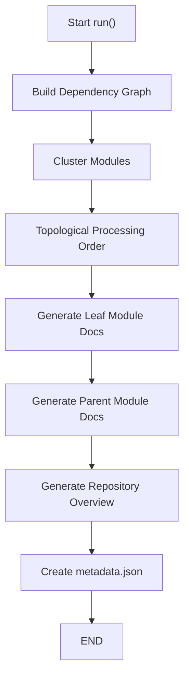
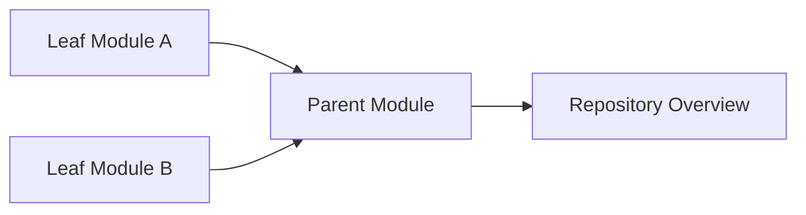
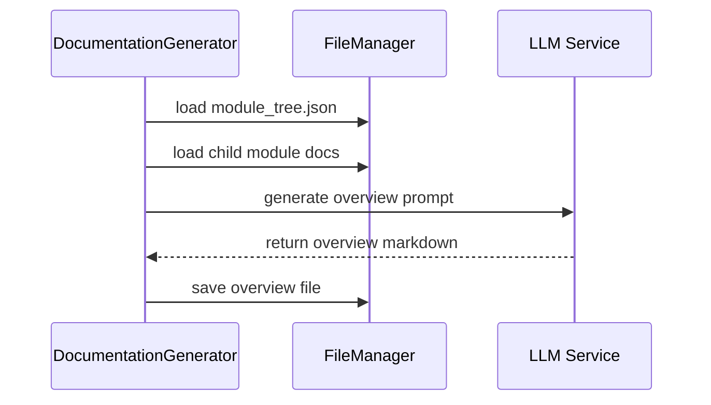
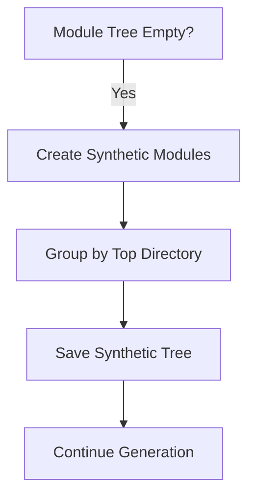

# Documentation Generation

The **Documentation Generation** module is the core orchestration engine that transforms analyzed source code into structured, hierarchical, and LLM-generated technical documentation.

It coordinates dependency analysis results, module clustering, LLM prompt generation, hierarchical file output, and metadata tracking. The module ensures documentation is generated in a bottom-up manner (leaf modules first, then parents, then repository overview) to preserve architectural context and avoid LLM context overflow.

---

## Purpose and Responsibilities

The Documentation Generation module is responsible for:

- Building a dependency graph via the Dependency Analysis module
- Clustering components into logical modules
- Determining module processing order (leaf → parent → root)
- Generating documentation using the Agent Orchestration module
- Creating hierarchical directory structures for output
- Generating repository and parent module overviews
- Preventing LLM context overflow via synthetic module fallback
- Producing metadata for traceability and auditing

It acts as the **central orchestration layer** between:

- Dependency Analysis
- Agent Orchestration
- LLM Services
- File Management Utilities

---

## High-Level Architecture



### Key Collaborators

- **DependencyGraphBuilder** (from Dependency Analysis) — Builds component graph
- **AgentOrchestrator** (from Agent Orchestration) — Generates module-level documentation
- **LLM Service** — Produces textual documentation
- **FileManager** — Persists output files
- **cluster_modules()** — Groups leaf nodes into logical modules

---

## End-to-End Generation Flow

The generation process follows a deterministic multi-stage pipeline.



### Processing Strategy

1. Build dependency graph
2. Identify leaf nodes
3. Cluster leaf nodes into modules
4. Process leaf modules first
5. Generate parent modules from child documentation
6. Generate repository overview
7. Write metadata

This bottom-up approach guarantees:

- Context-efficient LLM usage
- Accurate architectural summarization
- Deterministic processing order

---

## Dynamic Programming Approach

The module uses a **leaf-first topological ordering strategy**.



### Why Leaf-First?

- Leaf modules contain raw component information
- Parent modules summarize child documentation
- Repository overview summarizes top-level modules

This avoids passing the entire repository context into a single LLM call.

---

## Hierarchical Output Structure

The module enforces a strict directory convention:

For a module path:

```text
["Backend", "Authentication", "JWT"]
```

The output structure becomes:

```text
docs_dir/
 └── Backend/
     └── Authentication/
         └── JWT/
             └── JWT.md
```

Even root-level modules follow:

```text
module_name/
 └── module_name.md
```

This guarantees:

- Deterministic file paths
- Safe parent overview generation
- Easy recursive discovery of generated files

---

## Parent Module Overview Generation

Parent documentation is generated using child documentation as structured input.

### Overview Strategy

1. Load `module_tree.json`
2. Collect direct child documentation
3. Mark target module
4. Generate structured prompt
5. Call LLM
6. Persist overview file



### Tag Handling

If the LLM returns wrapped content:

- Extract content between OVERVIEW tags

If not:

- Use full response

This makes the system robust to prompt variations.

---

## Synthetic Module Patch (Context Overflow Protection)

A critical safety feature prevents LLM context overflow.

### Problem

If clustering fails and no modules are created, the system might attempt to document the entire repository in one LLM call.

### Solution

Automatically create synthetic modules grouped by top-level directory.



This ensures:

- Bounded LLM context
- Scalable processing
- Stability for large repositories

---

## Metadata Generation

After documentation is generated, the module writes `metadata.json`.

### Metadata Includes

- Timestamp
- Model name
- Generator version
- Repository path
- Commit ID
- Total components
- Leaf node count
- Maximum module depth
- List of all generated markdown files

This enables:

- Auditability
- Reproducibility
- CI traceability

---

## Error Handling Strategy

The module uses graceful degradation:

- Exceptions during module generation do not stop the entire process
- Failures are logged
- Remaining modules continue processing
- Parent generation skips existing files

This ensures partial documentation is still usable.

---

## Core Class

### DocumentationGenerator

Primary responsibilities:

- Orchestrate full documentation workflow
- Maintain module processing order
- Coordinate LLM calls
- Build hierarchical structure
- Generate metadata

### Key Methods

- `run()` — Entry point
- `generate_module_documentation()` — Leaf-first generation
- `generate_parent_module_docs()` — Overview generation
- `get_processing_order()` — Topological sorting
- `build_overview_structure()` — Child doc injection
- `create_documentation_metadata()` — Metadata output

---

## Integration with Other Modules

The Documentation Generation module depends on:

- [Dependency Analysis](dependency-analysis.md)
- [Agent Orchestration](agent-orchestration.md)
- [LLM Services](llm-services.md)
- [Utils](utils.md)

It does not perform static analysis itself — it consumes structured analysis results and converts them into readable documentation.

---

## Architectural Characteristics

| Characteristic | Implementation Strategy |
|---------------|--------------------------|
| Scalability | Leaf-first processing |
| Context Safety | Synthetic module fallback |
| Determinism | Topological module ordering |
| Traceability | metadata.json generation |
| Idempotency | Skip existing docs |
| Fault Tolerance | Graceful error handling |

---

## Summary

The **Documentation Generation** module is the orchestration backbone of CodeWiki’s automated documentation pipeline.

It transforms dependency graphs into structured documentation using:

- Hierarchical processing
- Controlled LLM invocation
- Modular summarization
- Deterministic output layout

By combining dependency analysis, module clustering, and multi-stage summarization, it enables scalable, repository-wide documentation generation without exceeding LLM context limits.