# Ecosystem: CodeWiki

> Generated from the repository graph by the Flamingo documentation pipeline. Do not edit by hand: it is rebuilt from the manifests and sources on every merge.

## Role

CodeWiki is a **unknown**.

## Upstream dependencies

None recorded.

## Downstream consumers

None recorded.

## Graph

```mermaid
flowchart LR
  r_3520daeca3e340219ea472f2["CodeWiki"]
  class r_3520daeca3e340219ea472f2 roleUnknown
  classDef roleLibrary stroke-width:2px
  classDef roleService stroke-width:2px
  classDef roleApp stroke-width:2px
  classDef roleInfra stroke-dasharray:4 2
  classDef roleFork stroke-dasharray:2 2
  classDef roleUnknown stroke-dasharray:1 3
  classDef stateStale stroke-dasharray:6 3,stroke-width:3px
  classDef stateMissing stroke-dasharray:2 4,stroke-width:1px
```

## Index state

- Snapshot: `32826fc8086d` on `main`, indexed 2026-09-18T01:33:54.283+00:00
- Coverage: full (every other managed repository has a fresh graph, so a symbol with no consumer here has no consumer in the org)
