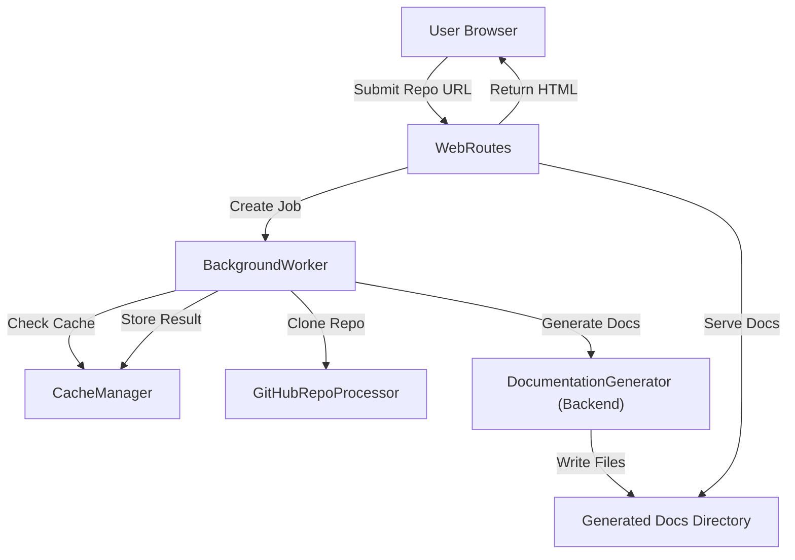
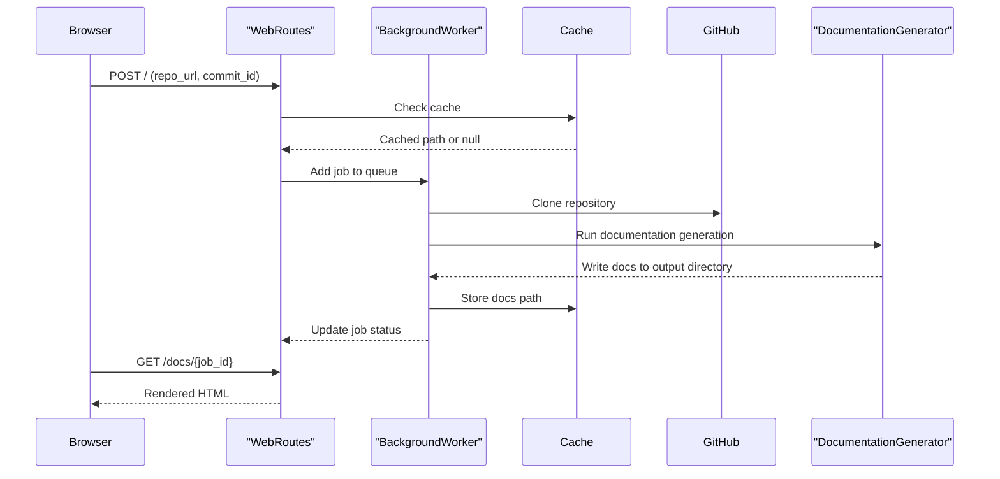
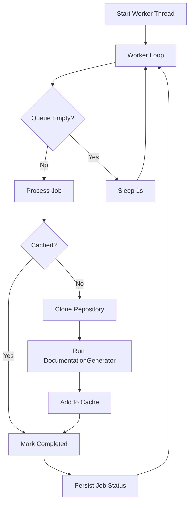
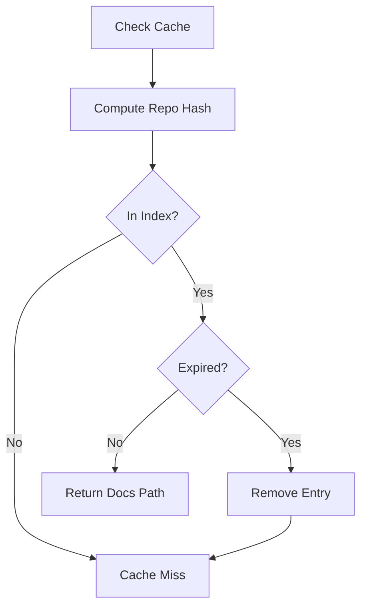
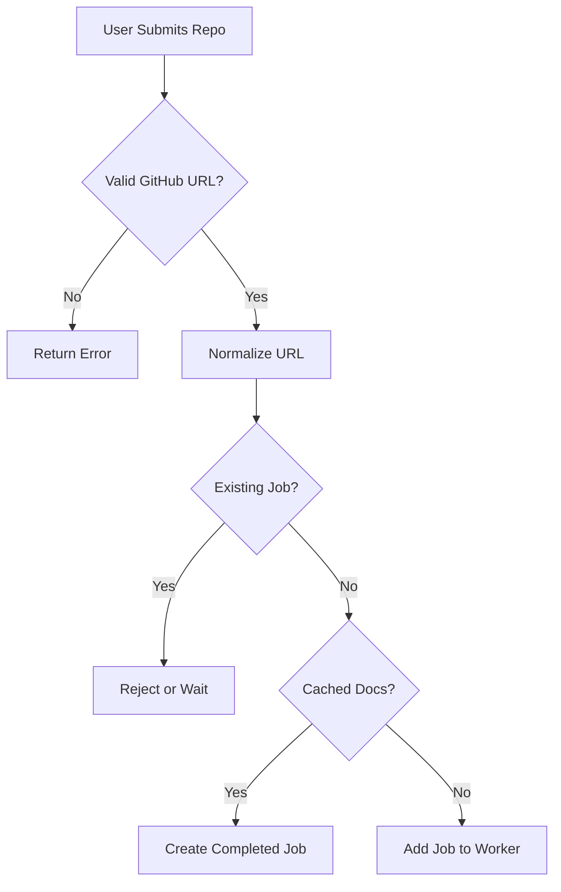
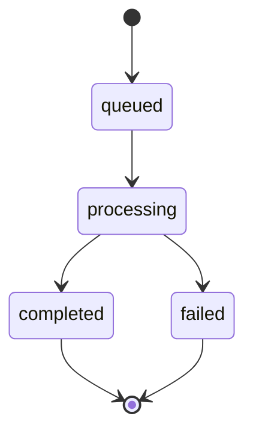

# Frontend Core

## Overview

The **Frontend Core** module provides the web application layer of CodeWiki. It exposes a FastAPI-based interface that allows users to submit GitHub repositories, track documentation generation jobs, and browse generated documentation through a dynamic HTML interface.

At a high level, Frontend Core is responsible for:

- Accepting and validating GitHub repository submissions
- Managing background documentation generation jobs
- Caching generated documentation
- Serving rendered Markdown documentation as HTML
- Managing job lifecycle and persistence

It acts as a bridge between the user-facing web interface and backend services such as the Documentation Generator and dependency analysis engine.

---

## High-Level Architecture

The Frontend Core coordinates user requests, background processing, caching, and documentation rendering.

### Key Responsibilities by Component

- **WebRoutes**: HTTP endpoints and request orchestration
- **BackgroundWorker**: Asynchronous job processing and lifecycle management
- **CacheManager**: Persistent documentation cache with expiration logic
- **GitHubRepoProcessor**: Repository validation and cloning
- **WebAppConfig**: Centralized configuration
- **Models**: Strongly-typed data contracts for jobs and API responses
- **Template Utilities**: HTML rendering and navigation generation

---

## Request-to-Documentation Flow

The typical flow for generating documentation is:

---

## Core Components

### 1. BackgroundWorker

**Class:** `CodeWiki.codewiki.src.fe.background_worker.BackgroundWorker`

The BackgroundWorker is the heart of Frontend Core. It manages:

- A bounded processing queue
- A background daemon thread
- Job status tracking
- Cache integration
- Repository cloning
- Backend documentation generation
- Persistent job state storage

#### Internal Workflow

#### Key Responsibilities

- Maintains `processing_queue` with maximum size defined in WebAppConfig
- Stores job states in memory and persists them to disk (`jobs.json`)
- Reconstructs completed jobs from cache if needed
- Runs asynchronous documentation generation inside a dedicated event loop
- Cleans up temporary repositories after execution

It integrates directly with the backend `DocumentationGenerator` and uses shared configuration objects to determine output paths.

---

### 2. CacheManager

**Class:** `CodeWiki.codewiki.src.fe.cache_manager.CacheManager`

The CacheManager prevents redundant documentation generation by storing previously generated results.

#### Responsibilities

- Hashes repository URLs using SHA-256
- Maintains a `cache_index.json` file
- Stores:
  - Repository URL
  - Hashed key
  - Documentation output path
  - Creation timestamp
  - Last access timestamp
- Enforces expiration via configurable number of days

#### Cache Validation Logic

This mechanism significantly reduces computation and LLM usage for repeated repository submissions.

---

### 3. WebRoutes

**Class:** `CodeWiki.codewiki.src.fe.routes.WebRoutes`

WebRoutes defines the FastAPI route handlers and orchestrates interactions between the browser, worker, and cache.

#### Main Endpoints

- `index_get` – Render submission form and recent jobs
- `index_post` – Validate and enqueue repository
- `get_job_status` – Return JSON job state
- `view_docs` – Redirect to generated documentation
- `serve_generated_docs` – Render Markdown as HTML

#### Job Submission Logic

#### Documentation Serving

When serving documentation:

1. Validate job existence or reconstruct from cache
2. Load `module_tree.json` if available
3. Load metadata if available
4. Convert Markdown to HTML
5. Render using Jinja2 templates

This keeps rendering logic separate from generation logic.

---

### 4. GitHubRepoProcessor

**Class:** `CodeWiki.codewiki.src.fe.github_processor.GitHubRepoProcessor`

Encapsulates GitHub-specific logic.

#### Responsibilities

- Validate GitHub URLs
- Extract owner and repository name
- Normalize clone URLs
- Clone repositories using `git`
- Support shallow cloning by default
- Checkout specific commit if provided

The cloning behavior changes depending on whether a `commit_id` is specified:

- Without commit: shallow clone using configured depth
- With commit: full clone followed by `git checkout`

Timeouts and depth are controlled via WebAppConfig.

---

### 5. WebAppConfig

**Class:** `CodeWiki.codewiki.src.fe.config.WebAppConfig`

Centralizes configuration for the web layer.

#### Configuration Domains

- Directory paths (cache, temp, output)
- Queue size limits
- Cache expiry settings
- Job cleanup duration
- Retry cooldown duration
- Git clone timeout and depth
- Default server host and port

It also ensures required directories exist before execution.

---

### 6. Data Models

**Module:** `CodeWiki.codewiki.src.fe.models`

Frontend Core uses structured models for strong typing and API clarity.

#### RepositorySubmission (Pydantic)
- Validates incoming GitHub URLs

#### JobStatus (Dataclass)
- Tracks lifecycle state:
  - queued
  - processing
  - completed
  - failed
- Stores timestamps and output path
- Includes optional commit ID and model metadata

#### JobStatusResponse (Pydantic)
- API-safe representation of JobStatus
- Used in status endpoint

#### CacheEntry (Dataclass)
- Represents a single cache record

This separation ensures internal state and API contracts remain cleanly defined.

---

### 7. Template Utilities

**Module:** `CodeWiki.codewiki.src.fe.template_utils`

Provides Jinja2-based rendering utilities.

#### Features

- String-based template loader
- Auto-escaping for HTML safety
- Navigation rendering from module tree
- Job list rendering

The navigation system dynamically builds links based on the generated `module_tree.json`, allowing documentation browsing without hardcoded routes.

---

## Job Lifecycle

### Persistence Strategy

- Active jobs stored in memory
- Completed jobs persisted to `jobs.json`
- Cache index stored in `cache_index.json`
- Generated documentation stored in output directory

On startup:

- Completed jobs are reloaded
- Missing job file triggers reconstruction from cache

---

## Integration with Backend Modules

Frontend Core delegates actual repository analysis and documentation generation to backend components such as the Documentation Generator and dependency analysis system.

Its responsibilities are orchestration, lifecycle management, caching, and presentation — not analysis itself.

This separation ensures:

- Clear boundary between web and analysis layers
- Easier scaling of backend generation logic
- Reduced coupling between HTTP handling and LLM execution

---

## Design Principles

The Frontend Core follows several architectural principles:

- **Asynchronous Processing**: Long-running tasks executed in background thread
- **Idempotency via Caching**: Avoid reprocessing identical repositories
- **Persistence and Recovery**: Job reconstruction on restart
- **Separation of Concerns**: Routing, caching, cloning, and rendering are isolated
- **Extensibility**: New backend generators or cache strategies can be integrated with minimal changes

---

## Summary

The Frontend Core module provides the operational web interface for CodeWiki. It:

- Accepts repository submissions
- Manages documentation generation jobs
- Integrates with backend generation logic
- Caches results for efficiency
- Serves interactive HTML documentation

By combining FastAPI routing, background processing, caching, and dynamic rendering, it transforms backend documentation generation capabilities into a user-friendly web application experience.