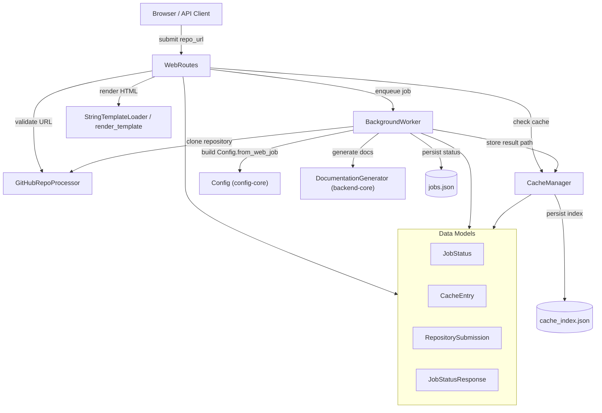
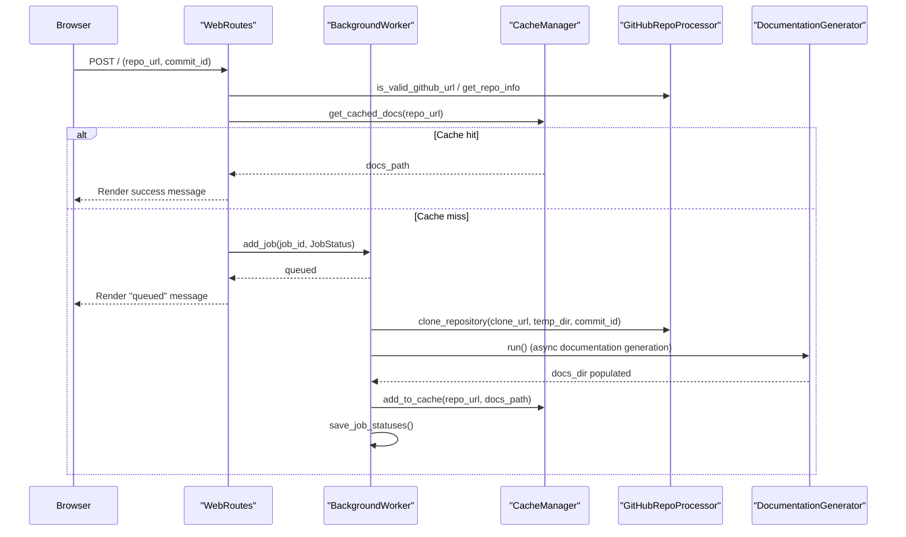
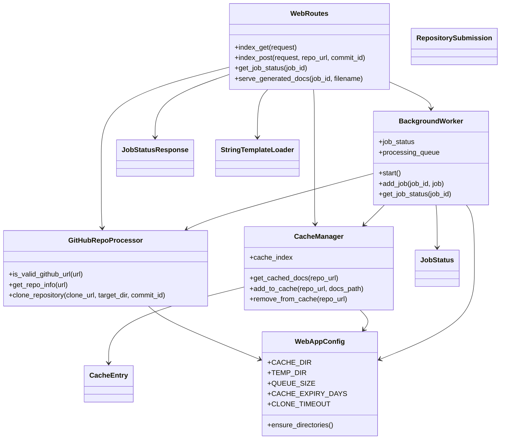
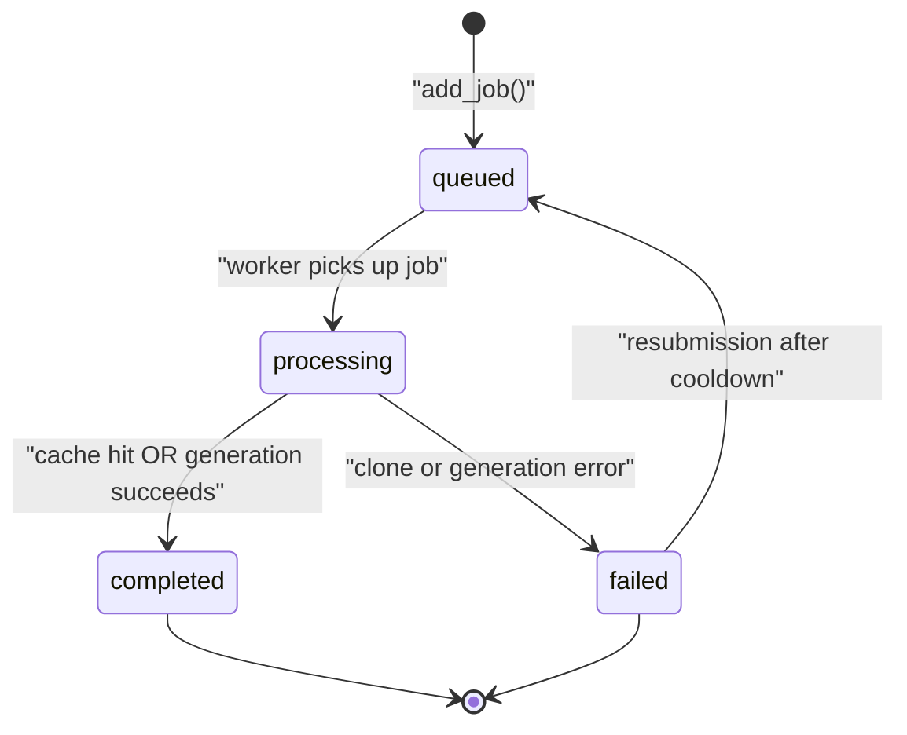

# Frontend Core

## Introduction

The Frontend Core module implements CodeWiki's **web application layer** — a FastAPI-based service that lets users submit GitHub repository URLs, tracks documentation-generation jobs asynchronously, caches completed results, and serves the generated documentation back to the browser.

It acts as the bridge between end users (submitting repositories through a web form) and the heavier documentation-generation machinery implemented in [Backend Core](backend-core.md) (specifically `DocumentationGenerator`) and the shared runtime settings in [Config Core](config-core.md) (`Config`).

Unlike `cli-core` and `backend-core`, this module is not further decomposed into child sub-modules in the module tree — it is a compact, single-layer module. This document therefore covers all of its components directly, without separate sub-module pages.

## Responsibilities

- Validate and normalize submitted GitHub repository URLs
- Queue documentation-generation jobs and process them on a background thread
- Cache generated documentation by repository URL to avoid redundant regeneration
- Persist job status and cache metadata to disk so state survives restarts
- Render the web UI (submission form, job list, generated docs viewer) via Jinja2 templates
- Expose HTTP endpoints (via FastAPI route handlers) for submission, status polling, and documentation viewing

## Architecture Overview

The module is organized around a simple pipeline: a web request creates or looks up a `JobStatus`, which is queued to the `BackgroundWorker`. The worker clones the repository, invokes the documentation generator, and stores results through the `CacheManager`. All directories, timeouts, and queue sizing are centralized in `WebAppConfig`.

**Cross-module dependencies:**
- [Backend Core](backend-core.md) — `DocumentationGenerator` performs the actual dependency analysis and LLM-driven documentation generation invoked by `BackgroundWorker`.
- [Config Core](config-core.md) — `Config.from_web_job()` builds the runtime configuration (models, API keys, directories) used for each documentation job.

## Core Components

### WebAppConfig — Central Settings

`WebAppConfig` (in `config.py`) is a plain class holding static configuration constants used across the whole module:

- **Directories**: `CACHE_DIR`, `TEMP_DIR`, `OUTPUT_DIR`
- **Queue settings**: `QUEUE_SIZE`
- **Cache settings**: `CACHE_EXPIRY_DAYS`
- **Job cleanup**: `JOB_CLEANUP_HOURS`, `RETRY_COOLDOWN_MINUTES`
- **Server defaults**: `DEFAULT_HOST`, `DEFAULT_PORT`
- **Git clone settings**: `CLONE_TIMEOUT`, `CLONE_DEPTH`

It also provides `ensure_directories()` (creates cache/temp/output folders) and `get_absolute_path()`. Every other component in this module reads its defaults from `WebAppConfig` unless overridden by an explicit constructor argument.

### GitHubRepoProcessor — Repository Validation & Cloning

`GitHubRepoProcessor` is a stateless utility class (all static methods) responsible for:

- `is_valid_github_url(url)` — ensures the URL points to `github.com`/`www.github.com` with a valid `owner/repo` path
- `get_repo_info(url)` — extracts `owner`, `repo`, `full_name`, and a normalized `clone_url`
- `clone_repository(clone_url, target_dir, commit_id=None)` — clones via `git clone` (shallow, depth-limited by `WebAppConfig.CLONE_DEPTH`, unless a specific `commit_id` is requested, in which case a full clone + `git checkout` is performed); cleans up the target directory on failure

This component has no dependency on any other module — it only shells out to `git` and reads settings from `WebAppConfig`.

### CacheManager — Documentation Cache

`CacheManager` maintains an on-disk index (`cache_index.json`) mapping a SHA-256 hash of the repository URL (`get_repo_hash`) to a `CacheEntry` describing where the generated docs live and when they were created/last accessed.

Key behaviors:
- `get_cached_docs(repo_url)` — returns the cached docs path if the entry exists and has not expired (`CACHE_EXPIRY_DAYS`); expired entries are automatically removed
- `add_to_cache(repo_url, docs_path)` — creates/updates a `CacheEntry` and persists the index
- `remove_from_cache(repo_url)` / `cleanup_expired_cache()` — cache invalidation utilities
- Corrupted index files are detected and backed up rather than crashing the app

### BackgroundWorker — Asynchronous Job Processing

`BackgroundWorker` is the core orchestration engine of the module. It owns:

- A bounded `Queue` (`processing_queue`, sized by `WebAppConfig.QUEUE_SIZE`) of job IDs waiting to be processed
- An in-memory `job_status: Dict[str, JobStatus]` map
- A `jobs.json` file for persisting completed job state across restarts

Lifecycle:
1. `start()` launches a daemon thread running `_worker_loop()`, which polls the queue and dispatches jobs to `_process_job()`.
2. `add_job(job_id, job)` registers a new `JobStatus` and enqueues its ID.
3. `_process_job(job_id)`:
   - Checks `CacheManager` first — if valid cached docs exist, marks the job `completed` immediately.
   - Otherwise resolves repo info via `GitHubRepoProcessor.get_repo_info()`, clones the repository into a per-job temp directory (`GitHubRepoProcessor.clone_repository`, optionally checking out a specific `commit_id`).
   - Builds a `Config` via `Config.from_web_job(repo_path, docs_dir)` (see [Config Core](config-core.md)).
   - Instantiates `DocumentationGenerator(config, job.commit_id)` from [Backend Core](backend-core.md) and runs its async `run()` method in a dedicated event loop.
   - On success, registers the output path with `CacheManager.add_to_cache()` and marks the job `completed`; on failure, marks it `failed` with an `error_message`.
   - Always cleans up the temporary cloned repository directory.

`load_job_statuses()` / `save_job_statuses()` persist only `completed` jobs to `jobs.json`. If no jobs file exists yet, `_reconstruct_jobs_from_cache()` rebuilds job entries directly from the `CacheManager`'s index for backward compatibility (older deployments that only had cache data).

### Data Models

Defined in `models.py`, these dataclasses and Pydantic models flow between the components above:

| Model | Kind | Purpose |
|---|---|---|
| `RepositorySubmission` | Pydantic `BaseModel` | Validates form input containing a `repo_url: HttpUrl` |
| `JobStatusResponse` | Pydantic `BaseModel` | Shape of the `/api/jobs/{job_id}` JSON response (status, timestamps, error, docs path, model used, commit) |
| `JobStatus` | `dataclass` | In-memory/on-disk representation of a job's lifecycle: `queued` → `processing` → `completed`/`failed` |
| `CacheEntry` | `dataclass` | Cache index entry: repo URL, its hash, docs path, creation and last-access timestamps |

`JobStatus` and `CacheEntry` are pure data holders serialized manually (via `dataclasses.asdict`/manual dict construction) by `BackgroundWorker` and `CacheManager` respectively — they carry no business logic themselves.

### WebRoutes — HTTP Route Handlers

`WebRoutes` implements the FastAPI-facing handlers, wired to a `BackgroundWorker` and `CacheManager` instance:

- `index_get(request)` — renders the main submission form plus the 100 most recent jobs
- `index_post(request, repo_url, commit_id)` — the primary submission flow:
  1. Cleans up expired jobs (`cleanup_old_jobs`)
  2. Validates the URL via `GitHubRepoProcessor`
  3. Normalizes the URL and derives a URL-safe `job_id` (`owner--repo`)
  4. Checks for an existing in-flight or recently-failed job (respecting `WebAppConfig.RETRY_COOLDOWN_MINUTES`) to prevent duplicate work
  5. Checks the cache; if a hit, synthesizes a `completed` `JobStatus` for immediate display
  6. Otherwise creates a new `queued` `JobStatus` and calls `BackgroundWorker.add_job()`
- `get_job_status(job_id)` — JSON API returning a `JobStatusResponse`
- `view_docs(job_id)` — redirects to the static documentation viewer for a completed job
- `serve_generated_docs(job_id, filename)` — resolves and renders a specific generated Markdown file (with path-traversal protection), falling back to reconstructing job state from the cache if no in-memory job exists; loads `module_tree.json`/`metadata.json` for navigation and converts Markdown to HTML for display
- Helper methods `_normalize_github_url`, `_repo_full_name_to_job_id`, `_job_id_to_repo_full_name`, `cleanup_old_jobs` support the above flows

### Template Rendering

`template_utils.py` provides a thin Jinja2 integration layer:

- `StringTemplateLoader` — a custom `jinja2.BaseLoader` that serves a template directly from a Python string (no filesystem template directory needed), enabling templates to be defined inline as Python string constants elsewhere in the application
- `render_template(template, context)` — configures a `Jinja2` `Environment` (autoescaping HTML/XML, `trim_blocks`/`lstrip_blocks` enabled) and renders the given template string against a context dict
- `render_navigation(module_tree, current_page)` — renders sidebar navigation HTML from a documentation module tree structure
- `render_job_list(jobs)` — renders the recent-jobs list HTML fragment

`WebRoutes` uses `render_template` to produce every `HTMLResponse` it returns.

## Component Relationships

## Job Lifecycle State Machine

## Integration with the Rest of CodeWiki

- **Documentation generation**: `BackgroundWorker._process_job()` delegates the actual analysis and Markdown/diagram generation to `DocumentationGenerator` from [Backend Core](backend-core.md). Frontend Core does not implement any dependency analysis itself — it only manages the job lifecycle, caching, and presentation around that generator.
- **Configuration**: Every job builds a fresh runtime `Config` via `Config.from_web_job(repo_path, docs_dir)`, defined in [Config Core](config-core.md). This keeps LLM model selection, API keys, and output directories consistent with the rest of the pipeline while allowing the web app to supply job-specific paths.
- **Independent of CLI**: Unlike [CLI Core](cli-core.md), which drives documentation generation from the command line with its own `ConfigManager` and job models, Frontend Core is a self-contained HTTP-facing alternative entry point that shares the same downstream `DocumentationGenerator` and `Config` but has its own job-tracking (`JobStatus`) and caching (`CacheManager`) implementations tailored for a multi-user web environment (queueing, retry cooldowns, cache expiry).

## Summary

Frontend Core provides the web-facing shell around CodeWiki's documentation engine: validating and queueing repository submissions, running generation jobs on a background thread, caching results to avoid repeat work, and rendering both the submission UI and the generated documentation itself. Its five main building blocks — `WebAppConfig`, `GitHubRepoProcessor`, `CacheManager`, `BackgroundWorker`, and `WebRoutes` — form a straightforward pipeline, with `BackgroundWorker` acting as the connective tissue to the heavier [Backend Core](backend-core.md) documentation generator and [Config Core](config-core.md) configuration model.
