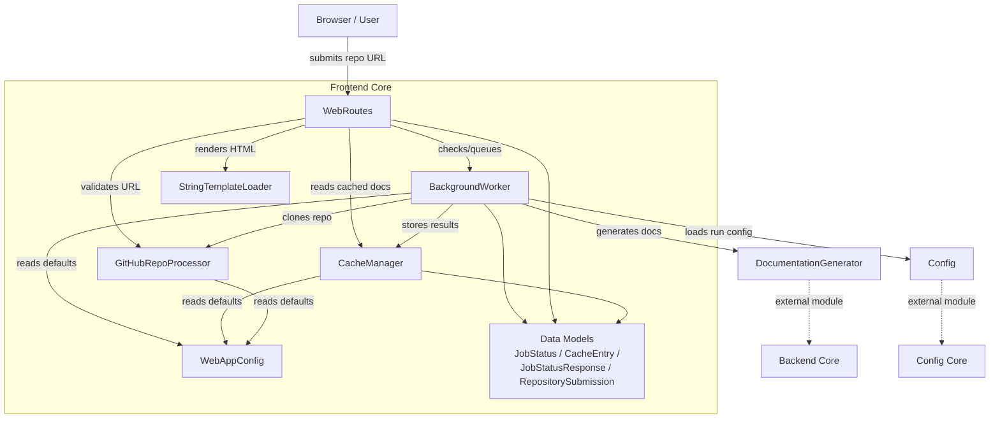
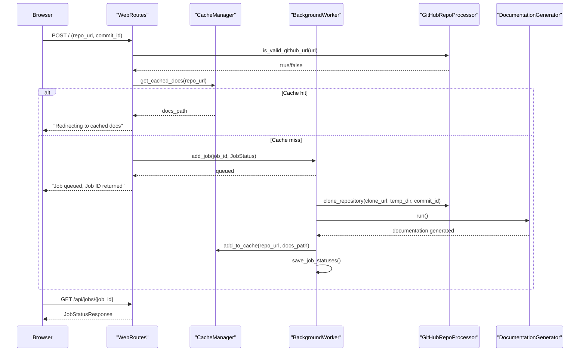

# Frontend Core

## Overview

The Frontend Core module implements the web-facing layer of CodeWiki: a lightweight FastAPI-based application that lets users submit GitHub repository URLs, tracks the resulting documentation-generation jobs, caches completed results, and serves the generated documentation back to the browser.

It acts as the glue between the outside world (HTTP requests from users) and the heavy-lifting backend components — most notably the `DocumentationGenerator` from [Backend Core](../backend-core.md) and the shared `Config` object from [Config Core](../config-core.md). Frontend Core itself contains no analysis or LLM logic; its responsibility is orchestration, request handling, persistence of job/cache state, and presentation.

## Purpose and Responsibilities

- Accept and validate GitHub repository submissions from users (`GitHubRepoProcessor`, `WebRoutes`).
- Queue and asynchronously process documentation-generation jobs without blocking HTTP requests (`BackgroundWorker`).
- Cache completed documentation so repeated requests for the same repository are served instantly (`CacheManager`).
- Track job lifecycle state (`queued` → `processing` → `completed`/`failed`) and persist it to disk so state survives restarts (`JobStatus`, `background_worker.save_job_statuses`).
- Render HTML pages (submission form, job status, generated documentation) using Jinja2 templates (`StringTemplateLoader`, `render_template`).
- Centralize file-system and runtime configuration in one place (`WebAppConfig`).

## Architecture Overview

### Job Lifecycle Flow

## Sub-modules

Frontend Core is organized into four focused sub-modules, each covering a distinct concern of the web application:

### [Request Handling](frontend-core/request_handling/request_handling.md)
Contains `WebRoutes`, the FastAPI route handlers that expose the HTTP surface of the application (submission form, job status API, documentation viewer), and `StringTemplateLoader`, the Jinja2 integration used to render all HTML responses from in-memory template strings.

### [Job Processing](frontend-core/job_processing/job_processing.md)
Contains `BackgroundWorker`, the queue-driven worker thread that clones repositories, invokes the documentation generator, and tracks job state; and `CacheManager`, which persists and retrieves previously generated documentation keyed by a hash of the repository URL.

### [GitHub Integration](frontend-core/github_integration/github_integration.md)
Contains `GitHubRepoProcessor`, a small static-method utility responsible for validating GitHub URLs, extracting owner/repo metadata, and performing the actual `git clone`/`checkout` operations used by the job pipeline.

### [Configuration And Data Models](frontend-core/configuration_and_data_models/configuration_and_data_models.md)
Contains `WebAppConfig`, the single source of truth for directories, queue sizes, cache expiry, and server defaults; and the data models (`JobStatus`, `JobStatusResponse`, `CacheEntry`, `RepositorySubmission`) that are passed between all other sub-modules.

## Relationship to Other Modules

- **[Backend Core](../backend-core.md)**: `BackgroundWorker` delegates the actual documentation generation work to `DocumentationGenerator`, defined in Backend Core's [Documentation And Services](../backend-core/documentation-and-services/documentation-and-services.md) sub-module.
- **[Config Core](../config-core.md)**: `BackgroundWorker` constructs a `Config` instance (via `Config.from_web_job`) to configure each documentation-generation run, using constants such as `MAIN_MODEL`, `OUTPUT_BASE_DIR`, and `DOCS_DIR` defined in Config Core.

## Data Flow Summary

1. A user submits a GitHub URL through the form rendered by **Request Handling**.
2. **GitHub Integration** validates the URL and derives repository metadata (owner, repo, clone URL).
3. **Configuration And Data Models** provides the `JobStatus` record used to track the request, and `WebAppConfig` supplies directory/queue defaults.
4. **Job Processing**'s `CacheManager` is checked first; on a miss, the job is queued with `BackgroundWorker`, which clones the repository (via **GitHub Integration**), runs `DocumentationGenerator` (Backend Core), and caches the result.
5. **Request Handling** exposes the resulting job status and serves the generated documentation pages back to the browser.
