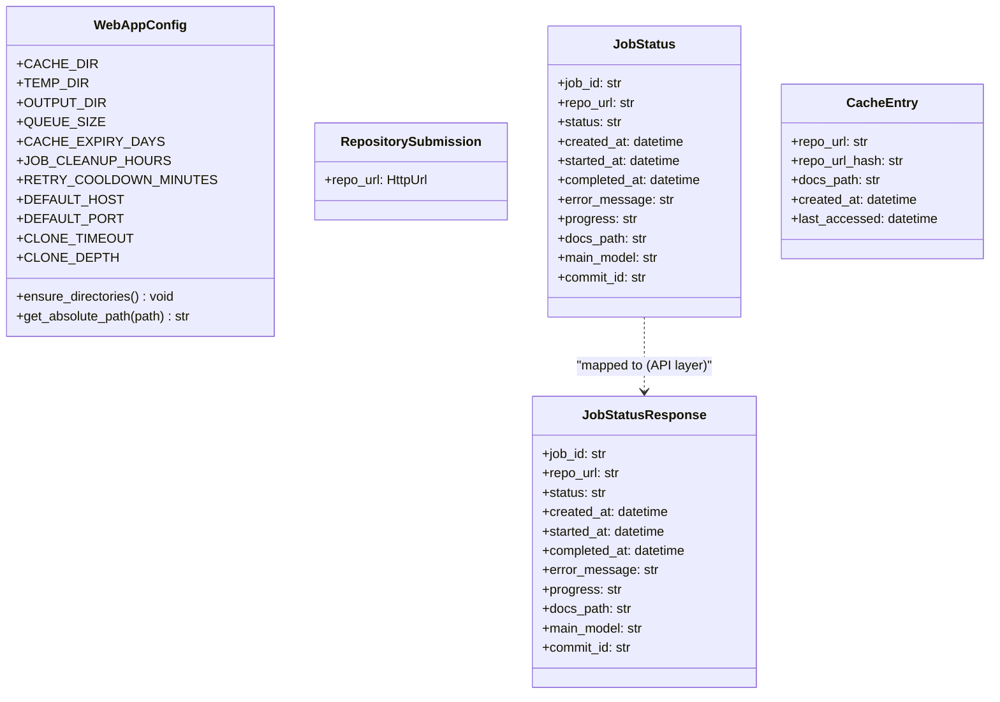
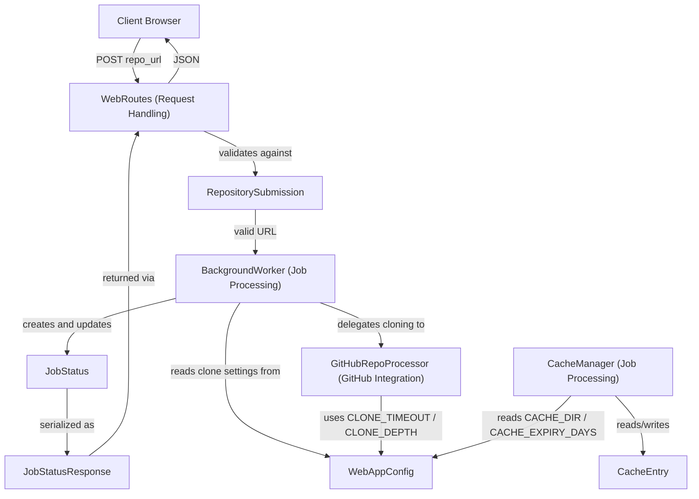
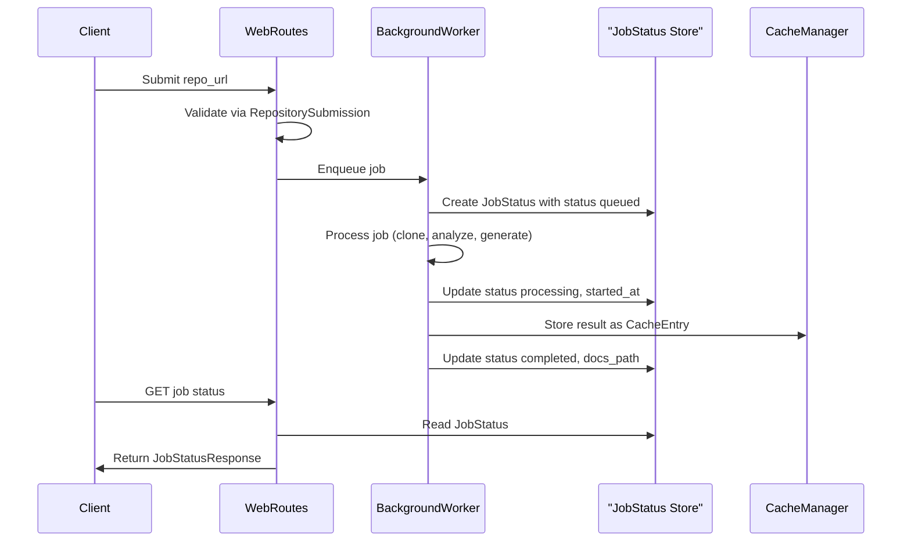

# Configuration And Data Models

## Introduction

The Configuration And Data Models module is the foundational layer of the [Frontend Core](../../frontend-core.md) subsystem. It centralizes application-wide settings through `WebAppConfig` and defines the shared data contracts — `CacheEntry`, `JobStatus`, `JobStatusResponse`, and `RepositorySubmission` — that every other frontend component relies on to communicate consistently.

Rather than owning any business logic itself, this module provides the **vocabulary** used across the frontend: it tells [Request Handling](../request_handling/request_handling.md) how to validate incoming submissions and shape outgoing API responses, tells [Job Processing](../job_processing/job_processing.md) how to represent job lifecycle state and cache records internally, and tells [GitHub Integration](../github_integration/github_integration.md) where to clone repositories and how long to wait. Because these types are defined once and imported everywhere, the frontend avoids duplicated schemas and keeps configuration values in a single, easily auditable location.

## Module Purpose and Scope

This module has two responsibilities:

1. **Static configuration** (`WebAppConfig`): directory paths, queue sizing, cache expiry, job cleanup windows, server bind settings, and git cloning parameters — all exposed as class-level constants with small helper methods for directory bootstrapping and path resolution.
2. **Data modeling** (`models.py`): the plain and validated data structures that flow between the HTTP layer, the background job system, and the caching layer.

The distinction between the two Pydantic models (`RepositorySubmission`, `JobStatusResponse`) and the two dataclasses (`JobStatus`, `CacheEntry`) is intentional:

- **Pydantic models** sit at the HTTP boundary — they validate untrusted input and serialize typed output for API consumers.
- **Dataclasses** are internal, lightweight structures used for in-memory/in-process state tracking (job queues, cache indices) where validation overhead is unnecessary.

## Component Overview

### WebAppConfig

`WebAppConfig` is a configuration class exposing only class attributes and classmethods — it is never instantiated. Consumers reference its constants directly (e.g., `WebAppConfig.CACHE_DIR`) or call its two helper methods.

| Category | Constants | Purpose |
|---|---|---|
| Directories | `CACHE_DIR`, `TEMP_DIR`, `OUTPUT_DIR` | Filesystem locations for cached docs, temporary clones, and generated output |
| Queue | `QUEUE_SIZE` | Maximum size of the background job queue |
| Cache | `CACHE_EXPIRY_DAYS` | Number of days a cache entry remains valid |
| Job Cleanup | `JOB_CLEANUP_HOURS`, `RETRY_COOLDOWN_MINUTES` | Retention window for job records and minimum wait before allowing a retry |
| Server | `DEFAULT_HOST`, `DEFAULT_PORT` | Default bind address/port for the web server |
| Git | `CLONE_TIMEOUT`, `CLONE_DEPTH` | Timeout and shallow-clone depth used when fetching repositories |

Helper methods:

- `ensure_directories()` — creates `CACHE_DIR`, `TEMP_DIR`, and `OUTPUT_DIR` (including parents) if they do not already exist. Typically called once at application startup.
- `get_absolute_path(path)` — resolves a relative path string to its absolute filesystem equivalent, used when consumers need a fully-qualified path for logging or file operations.

### RepositorySubmission

A Pydantic `BaseModel` used to validate the incoming repository submission form. Its single field, `repo_url: HttpUrl`, leverages Pydantic's URL validation to reject malformed input before any downstream processing (cloning, job creation) is attempted.

### JobStatus

An internal dataclass tracking a documentation generation job through its lifecycle. The `status` field takes one of four string values: `queued`, `processing`, `completed`, or `failed`. Optional fields (`started_at`, `completed_at`, `error_message`, `docs_path`, `main_model`, `commit_id`) are populated incrementally as the job progresses through the [Job Processing](../job_processing/job_processing.md) pipeline.

### JobStatusResponse

A Pydantic `BaseModel` mirroring `JobStatus` field-for-field, but intended for external API consumption. Keeping this as a distinct type from `JobStatus` allows the internal dataclass representation to evolve independently of the public API contract, and lets the HTTP layer serialize/validate output without exposing internal-only fields.

### CacheEntry

An internal dataclass representing a single cached documentation result, keyed by `repo_url_hash`. It tracks the source `repo_url`, the `docs_path` where generated documentation lives, and both `created_at` and `last_accessed` timestamps — the latter used to support cache-expiry logic driven by `WebAppConfig.CACHE_EXPIRY_DAYS`.

## Architecture

## Data Flow and Usage Across Frontend Core

The types defined here flow through the entire request lifecycle handled by [Frontend Core](../../frontend-core.md):

### Lifecycle of a Job Status Object

## Relationships With Other Modules

- **[Request Handling](../request_handling/request_handling.md)** — `WebRoutes` consumes `RepositorySubmission` to validate incoming form data and constructs `JobStatusResponse` objects to return job status over HTTP.
- **[Job Processing](../job_processing/job_processing.md)** — `BackgroundWorker` creates and mutates `JobStatus` instances as jobs move through the queue, and `CacheManager` persists/retrieves `CacheEntry` records; both rely on `WebAppConfig` for directory paths, queue sizing, and cache expiry policy.
- **[GitHub Integration](../github_integration/github_integration.md)** — `GitHubRepoProcessor` reads `WebAppConfig.CLONE_TIMEOUT` and `WebAppConfig.CLONE_DEPTH` when cloning repositories, and writes into the `TEMP_DIR` defined here.
- **[Frontend Core](../../frontend-core.md)** — the parent module that composes Request Handling, Job Processing, GitHub Integration, and this Configuration And Data Models module into the complete web application.

## Design Notes

- **Separation of validation boundaries**: Pydantic models (`RepositorySubmission`, `JobStatusResponse`) are used exclusively at points where data crosses a trust boundary (HTTP input/output). Dataclasses (`JobStatus`, `CacheEntry`) are used for internal state where Pydantic's validation overhead is unnecessary.
- **Single source of configuration truth**: All tunable constants (timeouts, directories, expiry windows) live in `WebAppConfig` rather than being scattered as magic numbers across consuming modules, making the system easier to tune and audit.
- **Optional field progression**: `JobStatus` and `JobStatusResponse` intentionally default most lifecycle fields (`started_at`, `completed_at`, `error_message`, `docs_path`, `main_model`, `commit_id`) to `None`/empty, reflecting that a job's full record is only populated incrementally as processing advances.
