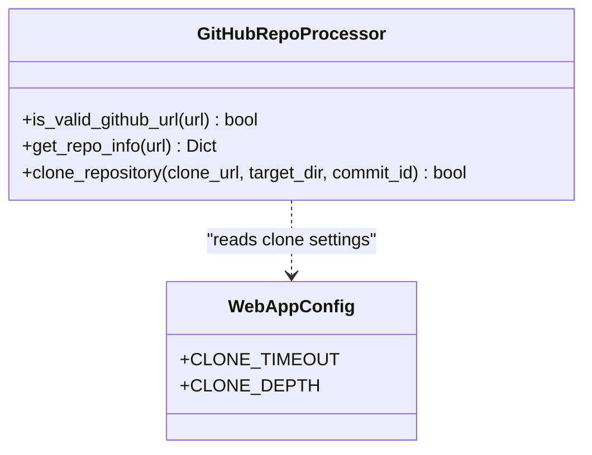
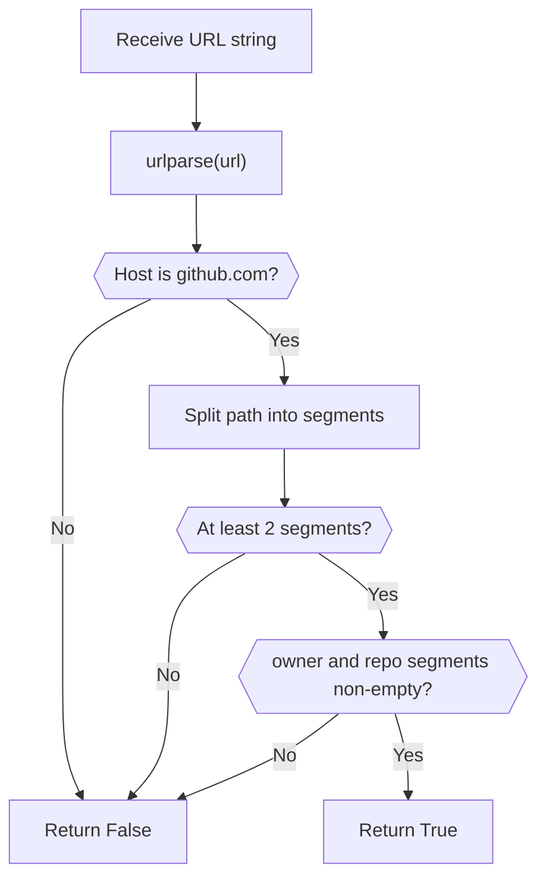
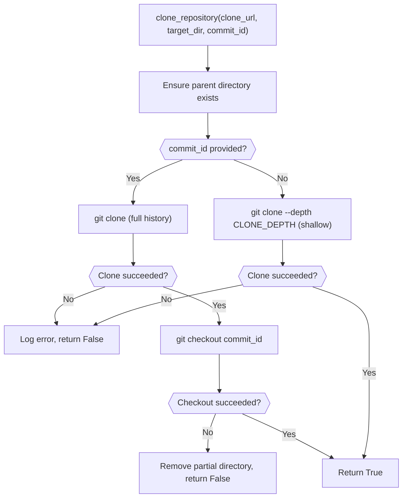
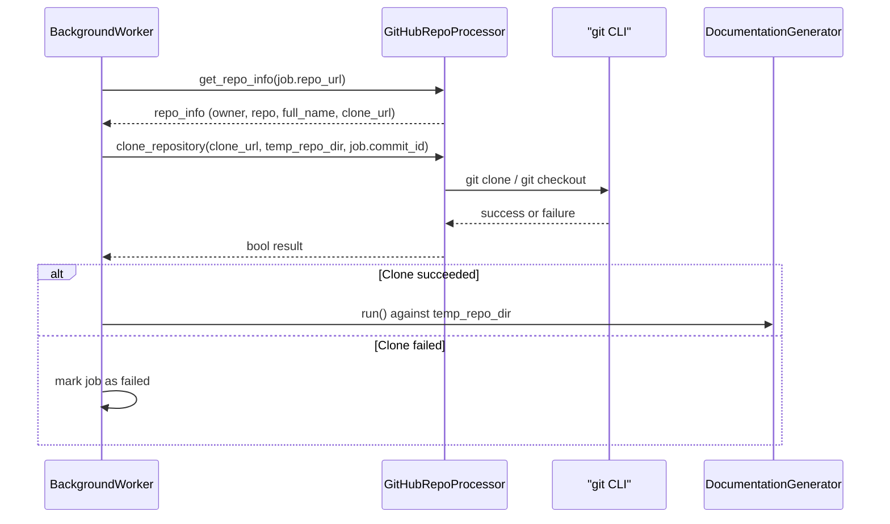

# Github Integration

The Github Integration module provides the low-level utilities required to validate, interpret, and clone GitHub repositories on behalf of the CodeWiki web front end. It is a small, focused module built around a single static-method utility class, `GitHubRepoProcessor`, which is consumed by the [Job Processing](../job_processing/job_processing.md) module's `BackgroundWorker` whenever a new documentation generation job needs source code to analyze.

## Purpose and Scope

When a user submits a GitHub repository URL through the web application, the system must:

1. Confirm the URL actually points to a valid GitHub repository.
2. Parse the URL into structured metadata (owner, repository name, canonical clone URL).
3. Clone the repository (optionally pinned to a specific commit) into a local working directory so that the backend documentation pipeline can analyze it.

The Github Integration module encapsulates all three responsibilities behind a stateless, static utility interface, keeping GitHub-specific logic isolated from job orchestration and caching concerns.

## Core Component

### `GitHubRepoProcessor`

`GitHubRepoProcessor` (defined in `codewiki/src/fe/github_processor.py`) is a stateless utility class exposing three static methods:

| Method | Responsibility |
|---|---|
| `is_valid_github_url(url)` | Validates that a submitted URL is a well-formed `github.com` repository URL with an `owner/repo` path. |
| `get_repo_info(url)` | Parses a validated URL into a dictionary containing `owner`, `repo`, `full_name`, and `clone_url`. |
| `clone_repository(clone_url, target_dir, commit_id=None)` | Performs the actual `git clone` (and optional `git checkout`) operation, returning a boolean success indicator. |

Because all methods are `@staticmethod`, `GitHubRepoProcessor` requires no instantiation and holds no internal state — every call is self-contained, making it safe to invoke from multiple worker threads.

## Component Design

`GitHubRepoProcessor` depends on `WebAppConfig` (from the [Configuration and Data Models](../configuration_and_data_models/configuration_and_data_models.md) module) for two clone-related settings:

- `CLONE_TIMEOUT` — maximum time in seconds allowed for the `git clone` subprocess before it is aborted.
- `CLONE_DEPTH` — the shallow-clone depth used when no specific commit is requested (defaults to a depth-1 clone for speed).

## URL Validation Logic

`is_valid_github_url` performs defensive parsing using Python's `urlparse`:

Any exception during parsing (malformed URL, unexpected types, etc.) is caught and treated as an invalid URL, ensuring the caller never receives an unhandled exception from this check.

## Repository Metadata Extraction

Once a URL is confirmed valid, `get_repo_info` extracts structured metadata:

- Splits the URL path into `owner` and `repo` segments.
- Strips a trailing `.git` suffix from the repository name if present.
- Builds a canonical `full_name` (`owner/repo`) and a normalized HTTPS `clone_url` (`https://github.com/{owner}/{repo}.git`), regardless of the original URL's format (e.g., with or without `.git`, trailing slashes, or `www.` prefix).

This normalization ensures downstream components — such as job identifiers in `BackgroundWorker` — always operate on a consistent repository identity.

## Repository Cloning

`clone_repository` wraps the `git` CLI via `subprocess.run`, supporting two modes:

Key behaviors:

- **Shallow clone by default**: when no `commit_id` is supplied, the clone uses `--depth` set to `WebAppConfig.CLONE_DEPTH`, minimizing network and disk usage for the common case of analyzing the default branch's latest state.
- **Full clone for pinned commits**: when a specific `commit_id` is requested, a full (non-shallow) clone is performed so that the requested commit is reachable, followed by an explicit `git checkout`.
- **Timeout enforcement**: the clone subprocess is bounded by `WebAppConfig.CLONE_TIMEOUT` seconds; the checkout step uses a fixed 30-second timeout.
- **Cleanup on failure**: if checkout fails or any exception is raised, any partially created target directory is removed with `shutil.rmtree` to avoid leaving corrupt working directories behind.
- **Non-throwing contract**: all failure paths are caught internally and reported via logging plus a `bool` return value, so callers never need to handle raised exceptions from this method.

## Integration with Job Processing

`GitHubRepoProcessor` is invoked exclusively from `BackgroundWorker` in the [Job Processing](../job_processing/job_processing.md) module, both to reconstruct job identity from cached entries and to drive the actual clone step of the documentation pipeline.

Specifically:

- `BackgroundWorker._process_job` calls `GitHubRepoProcessor.get_repo_info(job.repo_url)` to derive the clone URL and repository full name used for naming the temporary working directory.
- It then calls `GitHubRepoProcessor.clone_repository(...)`, passing the job's optional `commit_id`, before handing the cloned directory off to `DocumentationGenerator` (part of [Documentation and Services](../../backend-core/documentation-and-services/documentation-and-services.md) in the backend) for analysis.
- `BackgroundWorker._reconstruct_jobs_from_cache` also calls `GitHubRepoProcessor.get_repo_info` when rebuilding job records from existing cache entries, ensuring job identifiers remain consistent even across process restarts.

## Error Handling and Resilience

The module is designed to fail safely and predictably:

- Invalid or malformed URLs are rejected early via `is_valid_github_url`, before any network or filesystem operation is attempted.
- Cloning failures (network errors, invalid repository, missing commit) are logged with the underlying `stderr` output and surfaced as a simple boolean, letting `BackgroundWorker` transition the job to a `failed` status with a descriptive error message.
- Partial clone artifacts are proactively cleaned up to avoid disk clutter and to prevent stale directories from interfering with retried jobs.

## Relationship to Other Modules

- **[Job Processing](../job_processing/job_processing.md)**: Consumes `GitHubRepoProcessor` to resolve repository metadata and materialize source code on disk before invoking the documentation generation pipeline.
- **[Configuration and Data Models](../configuration_and_data_models/configuration_and_data_models.md)**: Supplies `WebAppConfig` clone settings (`CLONE_TIMEOUT`, `CLONE_DEPTH`) consumed during cloning.
- **[Request Handling](../request_handling/request_handling.md)**: Indirectly related — incoming repository submissions accepted through the web routes eventually flow into jobs processed using this module's cloning utilities.
