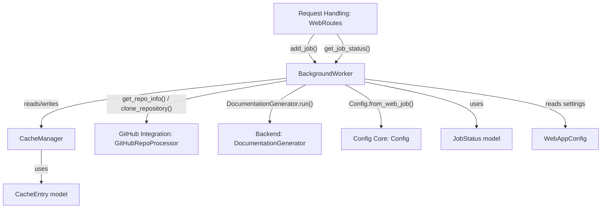
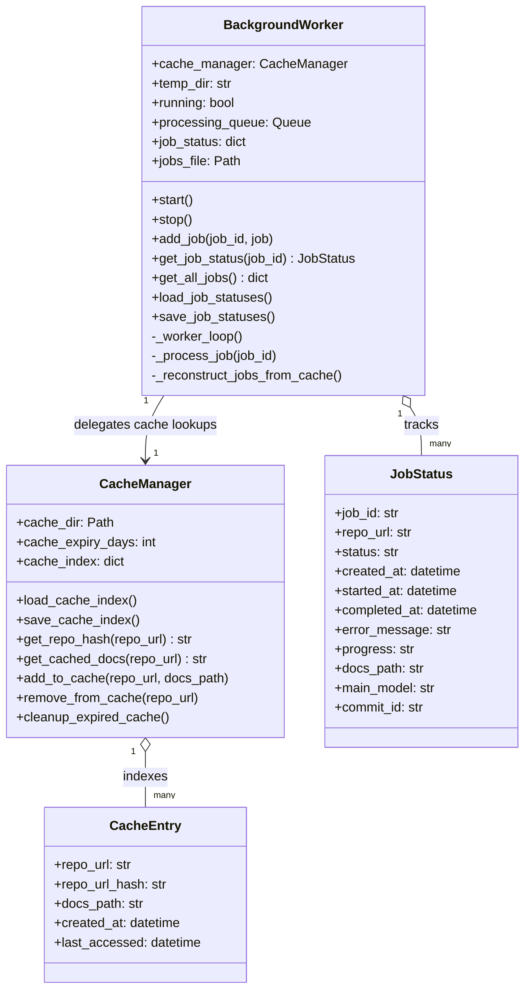
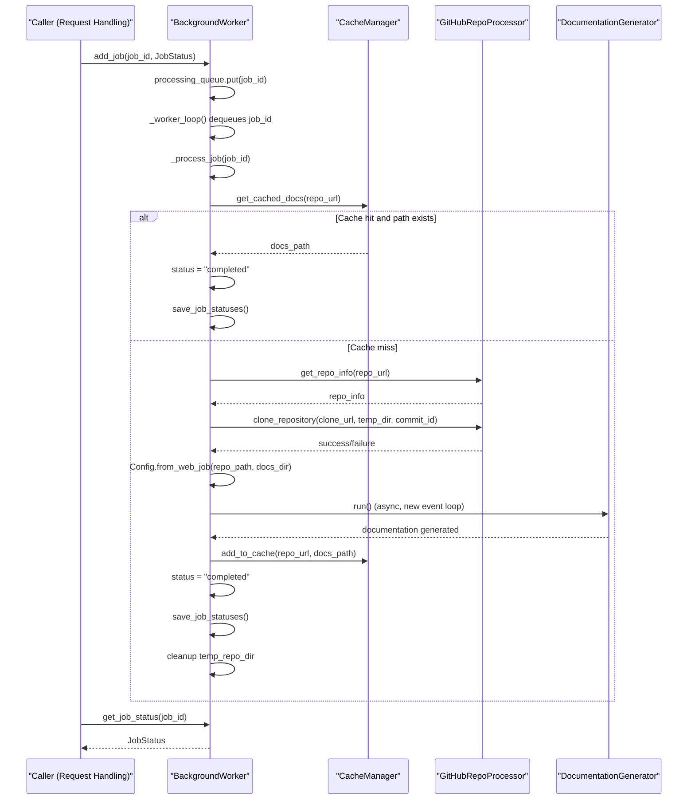
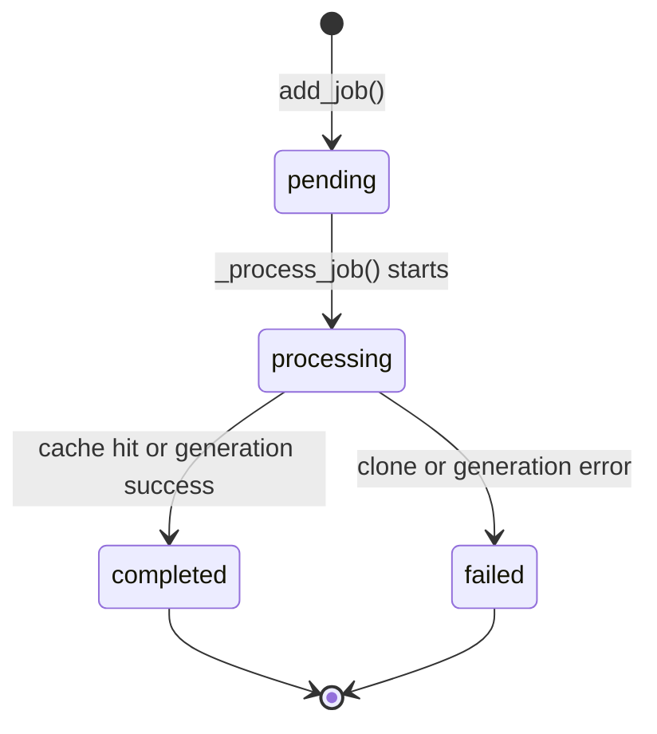
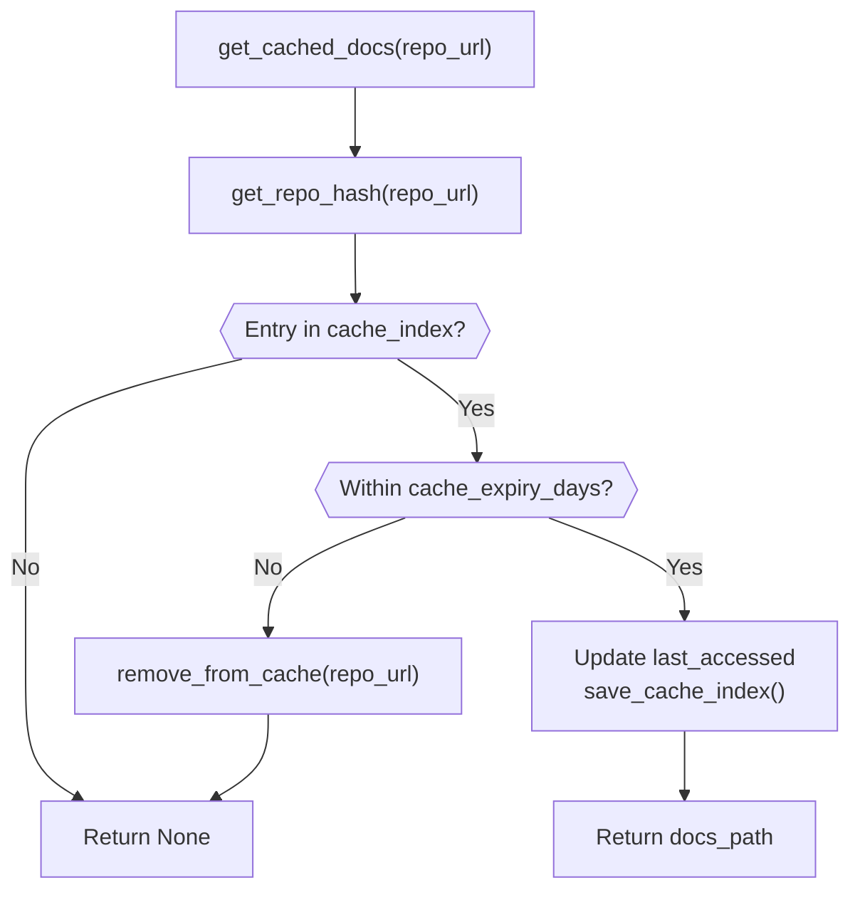

# Job Processing

The Job Processing module is the asynchronous execution engine of the frontend web application. It owns the lifecycle of a documentation-generation request from the moment it is queued until the generated documentation is either served from cache or produced fresh, persisted to disk, and made discoverable to future requests. The module is composed of two tightly cooperating components:

- **`BackgroundWorker`** – a background thread that pulls queued jobs, orchestrates repository cloning and documentation generation, tracks job state, and persists job history to disk.
- **`CacheManager`** – a content-addressable cache that avoids redundant documentation generation by mapping repository URLs to previously generated documentation paths, with expiry and corruption-recovery handling.

Together, these components decouple the web-facing request layer from the (potentially long-running) documentation generation pipeline, allowing the web server to respond immediately while work happens asynchronously in the background.

## Position in the System

Job Processing is a child module of the [Frontend Core](../frontend_core.md) module. It sits between the HTTP-facing request layer and the heavier backend documentation-generation pipeline:

- [Request Handling](../request_handling/request_handling.md) (`WebRoutes`) receives HTTP submissions and calls into `BackgroundWorker.add_job` to enqueue work, then polls `BackgroundWorker.get_job_status` to report progress back to clients.
- [GitHub Integration](../github_integration/github_integration.md) (`GitHubRepoProcessor`) is used by `BackgroundWorker` to resolve repository metadata and clone repositories prior to generation.
- [Configuration And Data Models](../configuration_and_data_models/configuration_and_data_models.md) supplies the `JobStatus` and `CacheEntry` data structures that both components operate on, as well as `WebAppConfig` for directory/queue settings.
- The backend documentation pipeline (`DocumentationGenerator`) and the shared `Config` object are invoked directly by `BackgroundWorker` to perform the actual analysis and generation work; see the backend module documentation for details on that pipeline.

## Core Components

### BackgroundWorker

`BackgroundWorker` runs a dedicated daemon thread that continuously drains a bounded `Queue` of job IDs and processes them one at a time. It is the central coordinator for the entire documentation generation workflow on the frontend side.

Responsibilities:

- **Queueing** – `add_job(job_id, job)` registers a `JobStatus` object and enqueues the job ID for processing.
- **Worker loop** – `start()` spawns a daemon thread executing `_worker_loop()`, which polls the queue and dispatches jobs to `_process_job()`.
- **Job execution** – `_process_job(job_id)` drives the full pipeline:
  1. Marks the job `processing` and records the start time.
  2. Checks `CacheManager.get_cached_docs()` for existing documentation; if found and the docs path still exists on disk, marks the job `completed` immediately.
  3. Otherwise, resolves repository metadata via `GitHubRepoProcessor.get_repo_info()` and clones the repository into a temporary directory using `GitHubRepoProcessor.clone_repository()`.
  4. Builds a `Config` via `Config.from_web_job()` pointing at the cloned repository and a job-specific docs output directory.
  5. Instantiates `DocumentationGenerator` and runs its async `run()` coroutine inside a freshly created event loop (since the worker thread has no default asyncio loop).
  6. On success, stores the resulting docs path in the cache via `CacheManager.add_to_cache()` and marks the job `completed`.
  7. On any exception, marks the job `failed` and records the error message.
  8. Always cleans up the temporary cloned repository directory.
- **Persistence** – `save_job_statuses()` serializes all known jobs to `jobs.json` inside the configured cache directory; `load_job_statuses()` restores previously **completed** jobs on startup (in-flight/failed jobs are intentionally not restored, to avoid resuming inconsistent state).
- **Cache-based recovery** – `_reconstruct_jobs_from_cache()` rebuilds job records from `CacheManager.cache_index` entries when no `jobs.json` exists yet, providing backward compatibility for deployments upgrading from a cache-only history.
- **Introspection** – `get_job_status(job_id)` and `get_all_jobs()` expose current job state to callers such as [Request Handling](../request_handling/request_handling.md).

### CacheManager

`CacheManager` maintains an on-disk index (`cache_index.json`) mapping a SHA-256 hash of a repository URL to a `CacheEntry` describing where that repository's generated documentation lives and when it was created/last accessed.

Responsibilities:

- **Hashing** – `get_repo_hash(repo_url)` produces a stable, filesystem-safe cache key (first 16 hex characters of the SHA-256 digest of the URL).
- **Lookup** – `get_cached_docs(repo_url)` returns the cached docs path if an entry exists and is not older than `cache_expiry_days` (from `WebAppConfig`); it refreshes `last_accessed` on hit and evicts expired entries automatically via `remove_from_cache()`.
- **Insertion** – `add_to_cache(repo_url, docs_path)` creates or overwrites a `CacheEntry` for the given URL with the current timestamp for both `created_at` and `last_accessed`.
- **Eviction** – `remove_from_cache(repo_url)` deletes a specific entry; `cleanup_expired_cache()` sweeps and removes all entries older than the expiry window in a single pass.
- **Resilience** – `load_cache_index()` guards against a corrupted `cache_index.json` by renaming the bad file to a timestamped `.corrupted.<timestamp>` backup and starting with an empty index rather than crashing the application.

## Data Model Dependencies

Both components operate on plain data classes defined in [Configuration And Data Models](../configuration_and_data_models/configuration_and_data_models.md):

- `JobStatus` – tracks `job_id`, `repo_url`, `status` (`pending`/`processing`/`completed`/`failed`), timestamps, `progress` text, `error_message`, `docs_path`, and `main_model`.
- `CacheEntry` – tracks `repo_url`, `repo_url_hash`, `docs_path`, `created_at`, and `last_accessed`.

`WebAppConfig` supplies operational settings consumed by both components: `TEMP_DIR` (clone staging area), `QUEUE_SIZE` (bounded queue capacity), `CACHE_DIR` (location of `jobs.json` and `cache_index.json`), and `CACHE_EXPIRY_DAYS` (cache TTL).

## Class Structure

## Job Processing Flow

The following sequence illustrates a single job's journey through `BackgroundWorker`, including the cache short-circuit path and the full generation path.

## Job Lifecycle

## Cache Decision Flow

## Persistence Model

Both components persist their state as JSON files under the directory configured by `WebAppConfig.CACHE_DIR`:

| File | Owner | Purpose |
|------|-------|---------|
| `jobs.json` | `BackgroundWorker` | Durable record of job history; only jobs with `status == 'completed'` are reloaded on startup to avoid resuming stale in-flight or failed state. |
| `cache_index.json` | `CacheManager` | Maps repository URL hashes to `CacheEntry` records pointing at generated documentation directories; corrupted files are backed up and replaced with an empty index rather than crashing. |

If `jobs.json` is absent (e.g., first run after introducing job persistence), `BackgroundWorker` reconstructs a best-effort job history directly from `CacheManager.cache_index` via `_reconstruct_jobs_from_cache()`, deriving a `job_id` from the repository's `full_name` (using `GitHubRepoProcessor.get_repo_info()`).

## Concurrency Model

- `BackgroundWorker` runs exactly one daemon thread (`_worker_loop`) that serially processes jobs from a bounded `Queue` (`WebAppConfig.QUEUE_SIZE`), meaning documentation generation jobs are processed one at a time rather than in parallel.
- Since `DocumentationGenerator.run()` is a coroutine, `_process_job` creates and manages its own `asyncio` event loop per job (`asyncio.new_event_loop()` / `loop.run_until_complete()` / `loop.close()`), isolating async execution from the synchronous worker thread.
- `job_status` is an in-memory dictionary shared between the worker thread and any caller (e.g., HTTP request handlers) inspecting job progress; state transitions are written back to disk after each significant change via `save_job_statuses()`.
