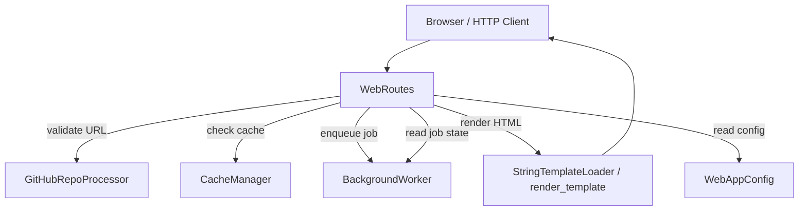
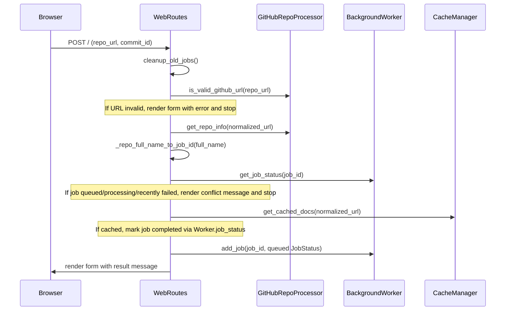
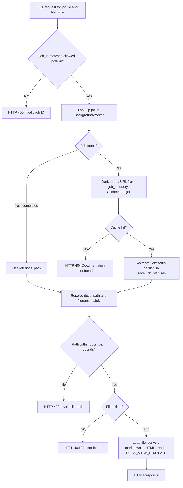
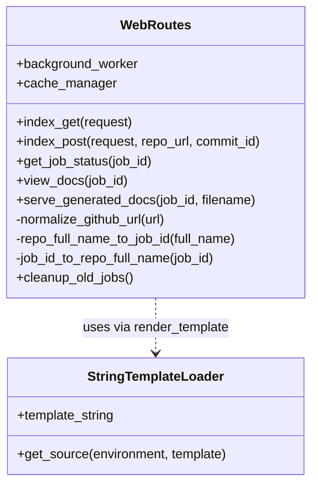

# Request Handling

The Request Handling module is the HTTP-facing layer of the CodeWiki web frontend. It defines the FastAPI route handlers that accept incoming user requests (form submissions, status polling, documentation viewing), coordinate with backend collaborators such as job queuing and caching, and render HTML responses using a lightweight Jinja2-based templating utility. This module is the primary entry point through which a user's GitHub repository submission is turned into a queued documentation generation job, and through which generated documentation is later served back to the browser.

## Purpose and Scope

The module exposes two core components:

- **`WebRoutes`** — implements the actual FastAPI endpoint logic: displaying the submission form, accepting new repository submissions, exposing a JSON job-status API, and serving generated documentation pages (including markdown-to-HTML conversion and navigation rendering).
- **`StringTemplateLoader`** (and the associated `render_template` / `render_navigation` / `render_job_list` helpers) — a minimal Jinja2 integration that allows HTML templates to be stored as in-memory strings rather than files on disk, while still benefiting from Jinja2's templating features (loops, conditionals, autoescaping).

Together these components form the "controller + view" layer of the frontend, while job execution and caching are delegated to sibling modules (see [Job Processing](../job_processing/job_processing.md)) and GitHub-specific logic is delegated to [GitHub Integration](../github_integration/github_integration.md).

## Architecture Overview

`WebRoutes` acts as a thin orchestration layer. It does not perform long-running work itself — instead it validates input, checks for cached results, and enqueues jobs onto a `BackgroundWorker`, which is documented in the [Job Processing](../job_processing/job_processing.md) module. Rendering of the resulting HTML pages is delegated to `StringTemplateLoader`/`render_template`.

- `GitHubRepoProcessor`, `BackgroundWorker`, `CacheManager`, and `WebAppConfig` are owned by sibling modules and are documented there; `WebRoutes` only consumes their public interfaces.
- `StringTemplateLoader` is internal to this module and is used exclusively by `WebRoutes` (and other frontend code) to render HTML strings without touching the filesystem.

## Component: `WebRoutes`

`WebRoutes` is instantiated with a `BackgroundWorker` and a `CacheManager` and exposes coroutine methods that are wired to FastAPI routes (typically in the application's route registration code). It has no persistent state of its own beyond references to these two collaborators.

### Responsibilities

1. **Rendering the submission form** (`index_get`) — builds the list of recent jobs and renders the main web interface template.
2. **Accepting repository submissions** (`index_post`) — validates the submitted GitHub URL, normalizes it, computes a deterministic job ID, checks for duplicate/recent/cached work, and either serves cached results immediately or enqueues a new job.
3. **Exposing job status as JSON** (`get_job_status`) — a small REST-style endpoint returning a `JobStatusResponse` Pydantic model for a given job ID.
4. **Redirecting to the documentation viewer** (`view_docs`) — validates that a job is completed and its docs exist, then issues an HTTP redirect to the static documentation viewer path.
5. **Serving individual documentation pages** (`serve_generated_docs`) — resolves a job (from live state or by reconstructing from cache), loads `module_tree.json` / `metadata.json` sidecar files, converts the requested markdown file to HTML, and renders it inside the docs-view template.
6. **Housekeeping** (`cleanup_old_jobs`, `_normalize_github_url`, `_repo_full_name_to_job_id`, `_job_id_to_repo_full_name`) — internal helpers for job ID canonicalization and periodic in-memory cleanup of stale job entries.

### Job ID Strategy

Job IDs are derived deterministically from the repository's `owner/repo` full name by replacing `/` with `--` (and reversed via `_job_id_to_repo_full_name`). This makes job IDs URL-safe and allows `serve_generated_docs` to reconstruct a job's associated repository URL even if the job status has been evicted from memory, by re-deriving the canonical GitHub URL and consulting the cache.

### Submission Flow (`index_post`)

### Serving Generated Documentation (`serve_generated_docs`)

Key safety considerations implemented in `serve_generated_docs`:

- **Job ID validation** via a strict regex (`^[A-Za-z0-9_.-]+$`) to prevent path-traversal-style inputs before any filesystem interaction.
- **Path containment check** by resolving both the documentation root and the requested file path and confirming the file path is a descendant of the root, preventing directory traversal through the `filename` query parameter.
- **Graceful cache reconstruction** — if a job's in-memory status has been cleaned up or the process has restarted, the route can still serve documentation by re-deriving the repository URL from the job ID and consulting the [Job Processing](../job_processing/job_processing.md) module's `CacheManager`.

### Dependencies on Other Modules

`WebRoutes` depends on collaborators defined outside this module:

- `BackgroundWorker` and `CacheManager` — job lifecycle, queuing, and documentation caching. See [Job Processing](../job_processing/job_processing.md).
- `GitHubRepoProcessor` — URL validation and repository metadata extraction. See [GitHub Integration](../github_integration/github_integration.md).
- `JobStatus`, `JobStatusResponse` — data models describing job state. See [Configuration And Data Models](../configuration_and_data_models/configuration_and_data_models.md).
- `WebAppConfig` — cleanup intervals and retry cooldown constants. See [Configuration And Data Models](../configuration_and_data_models/configuration_and_data_models.md).
- `DocumentationGenerator` (used indirectly through `BackgroundWorker`, not called directly by `WebRoutes`) — the backend documentation pipeline responsible for producing the markdown files this module serves.

`WebRoutes` does not import or depend on anything from the CLI or backend analysis layers directly; all backend interaction happens through the `BackgroundWorker` abstraction owned by the sibling [Job Processing](../job_processing/job_processing.md) module.

## Component: `StringTemplateLoader`

`StringTemplateLoader` is a minimal custom Jinja2 `BaseLoader` implementation that allows HTML templates authored as Python string constants (e.g. `WEB_INTERFACE_TEMPLATE`, `DOCS_VIEW_TEMPLATE`) to be loaded and rendered without requiring template files on disk. This keeps the frontend's templates colocated with the application code and avoids filesystem lookups for template resolution.

### `render_template`

`render_template(template, context)` builds a fresh Jinja2 `Environment` for each call, using `StringTemplateLoader` as the loader and enabling:

- **Autoescaping** for `html`/`xml` content, to mitigate injection when rendering user-influenced values (such as `repo_url` or job progress text) into HTML.
- **`trim_blocks` and `lstrip_blocks`** for cleaner output formatting of Jinja2 control blocks.

It is the single rendering primitive used by every `WebRoutes` handler that returns an `HTMLResponse`.

### `render_navigation` and `render_job_list`

These are convenience helpers built on top of `render_template`:

- `render_navigation(module_tree, current_page)` — renders a documentation navigation sidebar from a `module_tree` dictionary (typically loaded from `module_tree.json` produced by the documentation generation pipeline), highlighting the current page.
- `render_job_list(jobs)` — renders a list of job status entries (URL, status badge, progress text, and a "View Documentation" link when completed) for display on the main submission page.

Both functions construct a small inline Jinja2 template string and delegate to `render_template`, so they inherit the same autoescaping and formatting behavior.

## Response Types

| Endpoint (handler) | HTTP concept | Return type |
|---|---|---|
| `index_get` | Form page (GET) | `HTMLResponse` |
| `index_post` | Form submission (POST) | `HTMLResponse` |
| `get_job_status` | Status polling API (GET) | `JobStatusResponse` (Pydantic, JSON-serialized by FastAPI) |
| `view_docs` | Redirect to static viewer | `RedirectResponse` (302) |
| `serve_generated_docs` | Documentation page (GET) | `HTMLResponse` |

Error conditions are surfaced consistently via FastAPI's `HTTPException`, with `404` used for missing jobs/docs/files and `400` used for malformed job IDs or unsafe file paths.

## Summary

The Request Handling module is intentionally thin: it validates and normalizes incoming requests, defers business logic (queuing, caching, GitHub interaction) to collaborating modules, and centralizes HTML rendering through a small, dependency-light Jinja2 wrapper. This separation keeps the HTTP surface easy to reason about while allowing the underlying job processing and GitHub integration logic to evolve independently — see [Job Processing](../job_processing/job_processing.md) and [GitHub Integration](../github_integration/github_integration.md) for those implementations, and [Configuration And Data Models](../configuration_and_data_models/configuration_and_data_models.md) for the shared data structures and settings referenced throughout this module.
