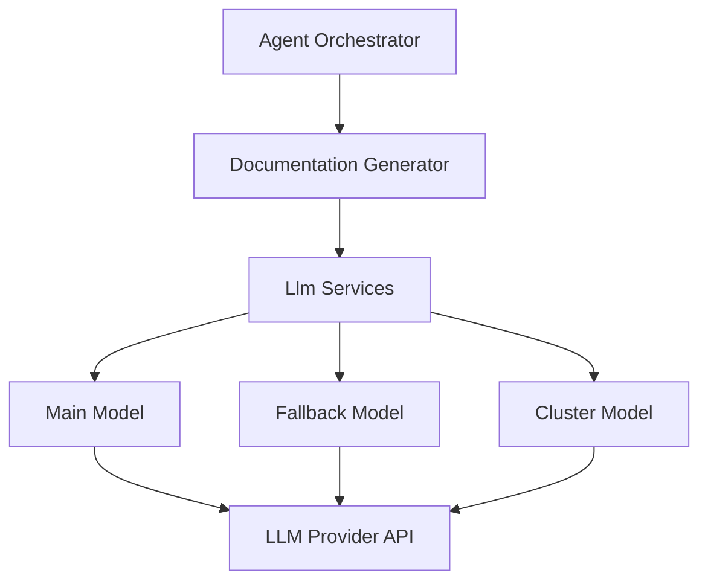
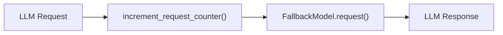
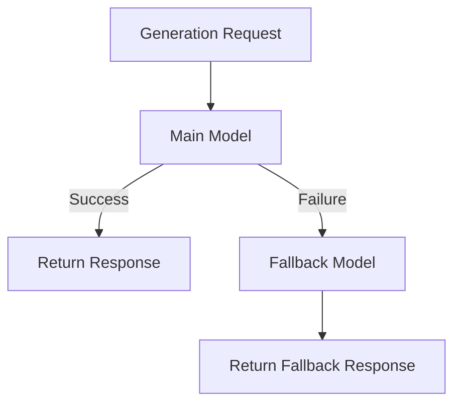
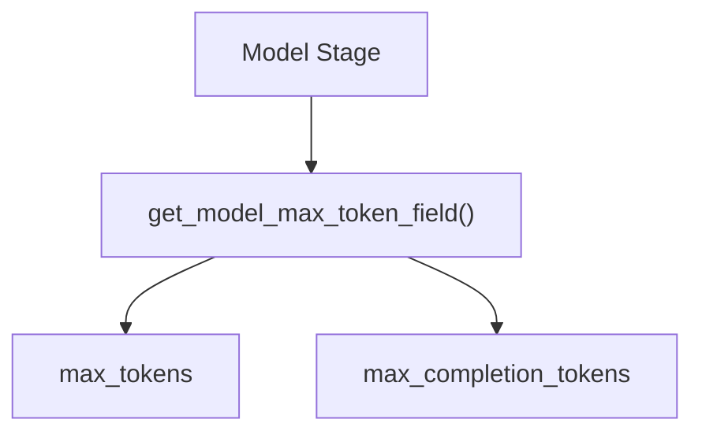
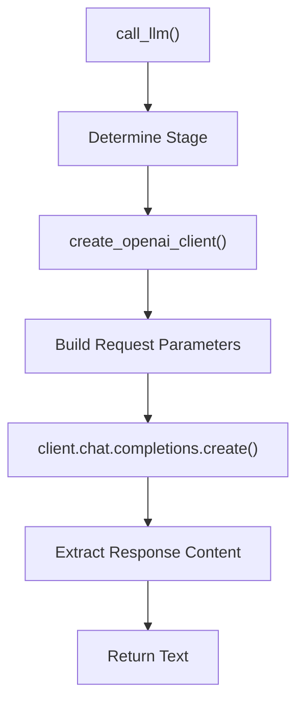
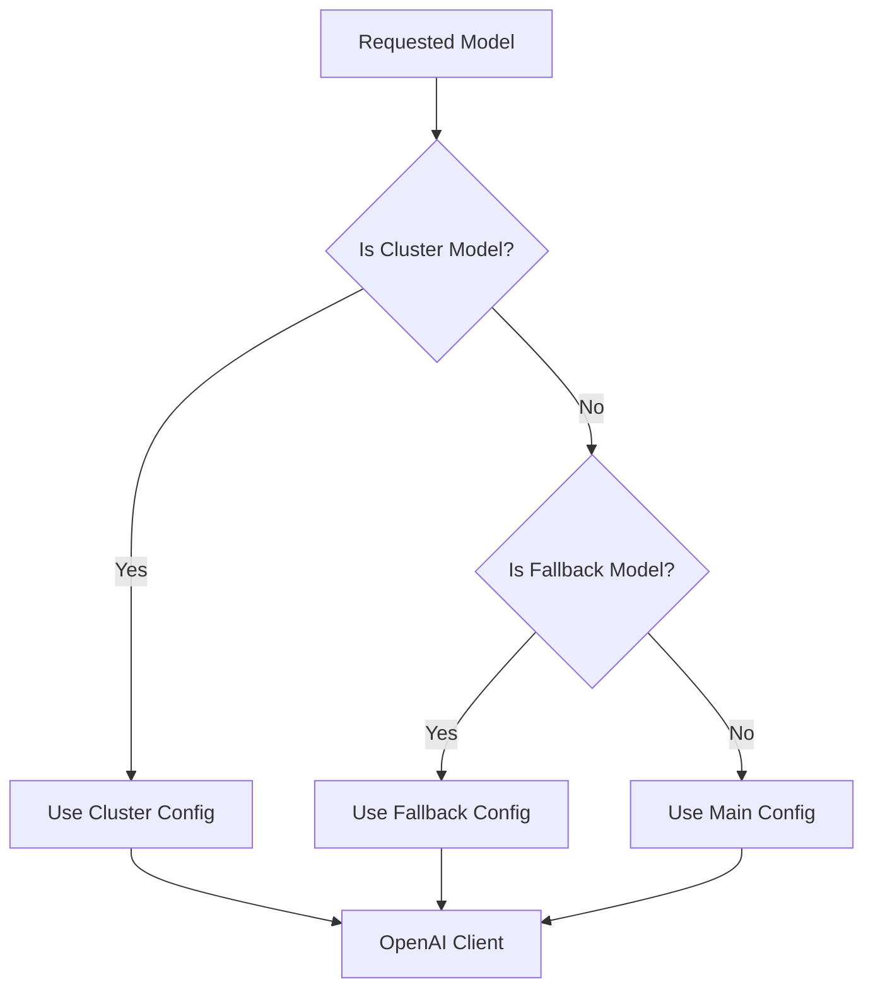
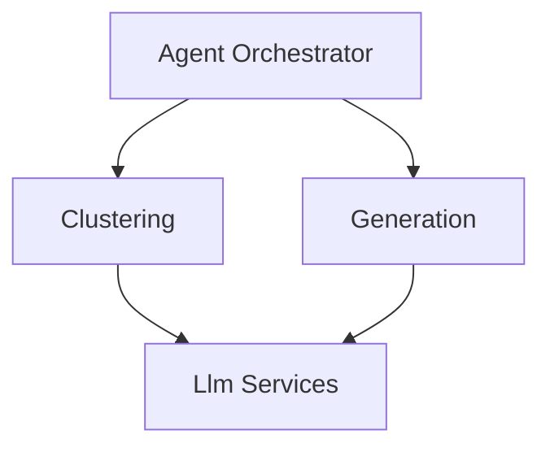

# Llm Services

The **Llm Services** module is responsible for creating, configuring, and invoking Large Language Model (LLM) providers within CodeWiki. It acts as the abstraction layer between the application’s orchestration and documentation logic and external AI providers (such as OpenAI-compatible or Anthropic-compatible endpoints).

This module centralizes:

- Model factory creation (main, fallback, cluster)
- Provider configuration (base URL, API key, API version)
- Token and temperature handling
- Dynamic parameter compatibility (e.g., `max_tokens` vs `max_completion_tokens`)
- Fallback chaining
- Request counting and logging
- Direct low-level LLM invocation via OpenAI SDK

Llm Services ensures that upstream modules such as [Documentation Generation](documentation-generation/documentation-generation.md) and [Agent Orchestration](agent-orchestration/agent-orchestration.md) remain provider-agnostic and focused on business logic.

---

## 1. Architectural Overview

Llm Services sits between the orchestration layer and external LLM providers.

### Responsibilities

| Layer | Responsibility |
|--------|----------------|
| Agent Orchestrator | Controls high-level workflow |
| Documentation Generator | Builds prompts and processes responses |
| Llm Services | Configures models and performs API calls |
| Provider API | Executes inference and returns completions |

---

## 2. Core Component

### CountingFallbackModel

Class:

- `CountingFallbackModel`

This class extends `FallbackModel` from `pydantic_ai.models.fallback` and wraps model requests with request counting logic.

#### Purpose

- Tracks total LLM requests per module
- Logs progress every 100 requests
- Provides visibility during large-scale documentation generation

---

## 3. Model Creation Strategy

Llm Services provides three distinct model creation functions:

- `create_main_model`
- `create_fallback_model`
- `create_cluster_model`

Each model has its own:

- Base URL
- API key
- API version
- Max token configuration
- Temperature behavior

### 3.1 Main Model

Used for:

- Documentation generation
- Core LLM tasks

Configuration fields expected in `Config`:

- `main_model`
- `main_base_url`
- `main_api_key`
- `main_max_tokens`
- `main_temperature`
- `main_temperature_supported`

### 3.2 Fallback Model

Used when:

- The main model fails
- The main provider is unavailable

Fallback behavior is implemented using `FallbackModel` chaining.

### 3.3 Cluster Model

Used for:

- Repository clustering
- Structural grouping
- Module-level reasoning

Cluster configuration fields:

- `cluster_model`
- `cluster_base_url`
- `cluster_api_key`
- `cluster_max_tokens`
- `cluster_temperature`
- `cluster_temperature_supported`

This separation enables:

- Cost optimization
- Specialized reasoning models for clustering
- Different providers per stage

---

## 4. Dynamic Token Field Handling

Different providers and model families use different parameter names:

- Standard models → `max_tokens`
- Reasoning models (e.g., o3 variants) → `max_completion_tokens`

Llm Services dynamically determines the correct parameter using environment variables:

- `CODEWIKI_CLUSTER_MAX_TOKEN_FIELD`
- `CODEWIKI_GENERATION_MAX_TOKEN_FIELD`
- `CODEWIKI_FALLBACK_MAX_TOKEN_FIELD`

This design allows compatibility across:

- GPT-4 family
- GPT-5.x family
- OpenAI-compatible endpoints
- Anthropic-compatible endpoints

---

## 5. Direct LLM Invocation

Function:

- `call_llm(prompt, config, model, temperature)`

This function bypasses the higher-level Pydantic AI abstraction and uses the OpenAI SDK directly.

### Why This Exists

Some models (especially reasoning models) reject `max_tokens`. If Pydantic AI hardcodes unsupported parameters, the direct API call provides a controlled fallback path.

### Execution Flow

### Logging Features

Each invocation logs:

- Model name
- Base URL
- Prompt length
- Temperature
- Max token field name
- Response length

On error, it wraps the exception with:

- Model stage
- Base URL
- Token configuration
- Temperature support flag

This greatly improves debugging in distributed or multi-provider environments.

---

## 6. OpenAI Client Factory

Function:

- `create_openai_client(config, model)`

This factory selects the correct provider configuration based on the model being used.

This ensures:

- Isolation between providers
- Multi-vendor support
- Clean separation of configuration domains

---

## 7. Request Counting and Observability

Global request counter:

- Reset per module via `reset_request_counter(module_name)`
- Incremented per request via `increment_request_counter()`

Every 100 requests:

- Emits structured progress log

This integrates naturally with:

- Long-running repository documentation jobs
- Large monorepo analysis
- Multi-module generation pipelines

---

## 8. Configuration Dependency

Llm Services depends heavily on the central `Config` object.

Configuration includes per-stage fields:

- Model name
- Base URL
- API key
- API version
- Max tokens
- Temperature
- Temperature support flag

This allows:

- OpenAI
- Azure OpenAI
- Anthropic
- Local LLM gateways
- Self-hosted OpenAI-compatible APIs

All without changing orchestration or documentation logic.

---

## 9. Interaction with Other Modules

### Documentation Generation

The [Documentation Generation](documentation-generation/documentation-generation.md) module builds prompts and consumes LLM responses. It relies on Llm Services for:

- Model instantiation
- Provider communication
- Error handling
- Token configuration

### Agent Orchestration

The [Agent Orchestration](agent-orchestration/agent-orchestration.md) module coordinates multi-stage workflows (analysis, clustering, generation). It indirectly depends on Llm Services through documentation and clustering stages.

---

## 10. Design Principles

### 1. Provider Agnosticism
The rest of the system does not know or care which LLM provider is used.

### 2. Stage Isolation
Cluster, generation, and fallback stages are fully isolated at configuration level.

### 3. Explicit Error Context
Errors are wrapped with full model and provider context.

### 4. Compatibility First
Handles parameter differences between model families dynamically.

### 5. Observability
Built-in logging and request counting for long-running jobs.

---

## 11. Summary

Llm Services is the infrastructure backbone for all AI interactions in CodeWiki.

It provides:

- Model factories
- Multi-provider configuration
- Fallback chaining
- Direct API invocation
- Token compatibility handling
- Observability and request tracking

By isolating LLM concerns in one module, CodeWiki achieves:

- Clean architecture
- Vendor flexibility
- Safer upgrades
- Easier debugging
- Scalable documentation generation workflows

Llm Services enables the rest of the system to focus purely on analysis and documentation logic while it handles the complexity of interacting with modern LLM providers.