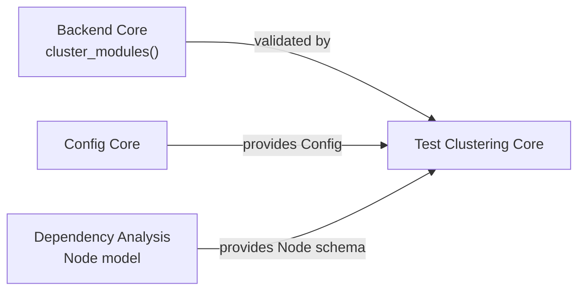

# Test Clustering Core

## Introduction

The Test Clustering Core module is a collection of standalone Python test scripts used to validate the **hierarchical module clustering** functionality of the CodeWiki backend (see [Backend Core](../backend-core.md), specifically its clustering logic that groups leaf-level code components — `Node` objects produced by the [Dependency Analysis](../backend-core/dependency-analysis/dependency-analysis.md) pipeline — into named modules).

Unlike a typical unit-test package built on `pytest` or `unittest`, these scripts are **executable diagnostic tools**: each file is a self-contained script with its own `TestResults` accumulator, a top-level execution flow, and a `sys.exit()` code that signals pass/fail to shell pipelines or CI runners. They exist to give maintainers of the clustering algorithm (`codewiki.src.be.cluster_modules`) fast, reproducible feedback loops — from pure offline logic checks to live LLM-backed end-to-end runs.

## Purpose

The clustering subsystem under test takes a flat set of leaf `Node` components (classes, functions, etc. discovered by the [Dependency Analysis](../backend-core/dependency-analysis/dependency-analysis.md) analyzers) and asks an LLM to group them into logical modules, returning a `module_tree` dictionary. Because the LLM's response format is fragile (it must return integer component IDs inside a structured tag/JSON block), this module concentrates on two goals:

1. **Verifying the end-to-end pipeline** actually produces a non-empty `module_tree` when calling a real LLM, using [`Config`](../config-core.md) instances built via the `Config` factory methods.
2. **Verifying the ID-normalization and validation logic** in isolation, without needing network access or API keys — covering edge cases like quoted integers, out-of-range IDs, negative IDs, class-name strings, duplicates, and malformed JSON.

## Architecture Overview

```mermaid
flowchart TD
    subgraph live["Live Clustering Tests"]
        Debug["test_clustering_debug.py"]
        Forced["test_clustering_forced.py"]
        Local["test_clustering_local.py"]
    end

    subgraph logic["Validation and Logic Tests"]
        Integration["test_clustering_integration.py"]
        Validation["test_clustering_validation.py"]
        IdBased["test_id_based_clustering.py"]
    end

    ClusterModules["cluster_modules()<br/>codewiki.src.be.cluster_modules"]
    ConfigCls["Config<br/>codewiki.src.config"]
    NodeCls["Node<br/>dependency_analyzer.models.core"]

    Debug -->|"calls"| ClusterModules
    Forced -->|"calls"| ClusterModules
    Local -->|"calls"| ClusterModules

    Debug -->|"builds"| ConfigCls
    Forced -->|"builds"| ConfigCls
    Local -->|"builds"| ConfigCls

    Debug -->|"creates"| NodeCls
    Forced -->|"creates"| NodeCls
    Local -->|"creates"| NodeCls

    Integration -->|"exercises"| Helpers["create_component_id_map and<br/>normalize_component_ids_by_lookup"]
    Validation -->|"simulates"| ValidationLogic["ID validation logic<br/>(inlined copy)"]
    IdBased -->|"simulates"| NormalizationLogic["ID-to-FQDN normalization<br/>(inlined copy)"]
```

Each test script owns a private `TestResults` (or, in one case, `MockNode`) class. These classes are **not shared** across files — every script re-implements a minimal pass/fail accumulator, reflecting the module's nature as a set of independent diagnostic entry points rather than a cohesive test framework.

## Sub-modules

The module tree splits naturally into two functional groups based on whether a script performs a live, network-dependent run of the clustering pipeline or exercises clustering logic offline:

| Sub-module | Scripts | Description |
|---|---|---|
| [Live Clustering Tests](test-clustering-core/live_clustering_tests/live_clustering_tests.md) | `test_clustering_debug.py`, `test_clustering_forced.py`, `test_clustering_local.py` | End-to-end scripts that build a real [`Config`](../config-core.md), construct sample `Node` components, and invoke `cluster_modules()` against a live LLM to confirm the pipeline produces a usable module tree. |
| [Validation And Logic Tests](test-clustering-core/validation_and_logic_tests/validation_and_logic_tests.md) | `test_clustering_integration.py`, `test_clustering_validation.py`, `test_id_based_clustering.py` | Offline scripts that test ID mapping, normalization, and validation logic (JSON parsing, integer-range checks, FQDN lookups) using mock data and inlined logic simulations — no LLM or network calls required. |

## How This Module Fits Into the System

- **[Backend Core](../backend-core.md)**: Owns the actual `cluster_modules()` implementation, the `create_component_id_map()` and `normalize_component_ids_by_lookup()` helpers, and the LLM client factory (`create_llm_client`) that these test scripts drive or simulate.
- **[Config Core](../config-core.md)**: Supplies the `Config` class used to configure the model names, API keys, base URLs, and clustering thresholds (`max_token_per_module`, `cluster_max_tokens`) for the live test runs.
- **[Backend Core / Dependency Analysis](../backend-core/dependency-analysis/dependency-analysis.md)**: Supplies the `Node` Pydantic model that represents the leaf-level components being clustered.

## Common Patterns Across Scripts

- **Self-contained execution**: Every script can be run directly with `python3 <script_name>.py` and returns a process exit code (0 = success, 1 = failure), making them suitable for CI smoke tests.
- **Local `TestResults` accumulator**: Each live-test script and each logic-test script defines its own lightweight `TestResults` class with `add_test(...)` and `print_summary()` methods; there is no shared base class or shared import between scripts.
- **Environment-driven configuration**: Live tests read model names, API keys, and base URLs from environment variables (`MAIN_MODEL`, `CLUSTER_MODEL`, `OPENAI_API_KEY`, `CODEWIKI_TEST_REPO`, etc.), falling back to sensible defaults, so they can run against different LLM providers without code changes.
- **No shared fixtures**: Sample `Node` data (e.g., `AuthController`, `AuthService`, `UserController`, `UserService`) is redefined per-script rather than imported from a common fixtures module.
