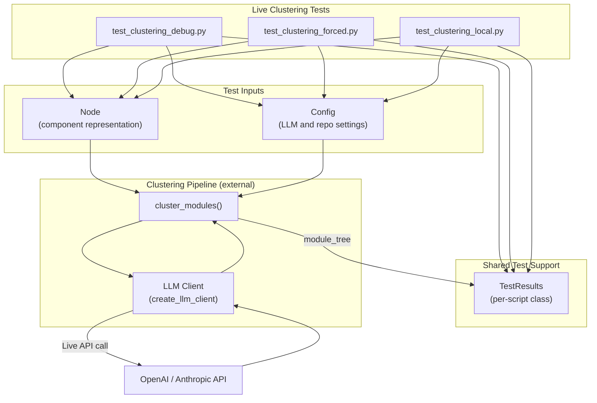
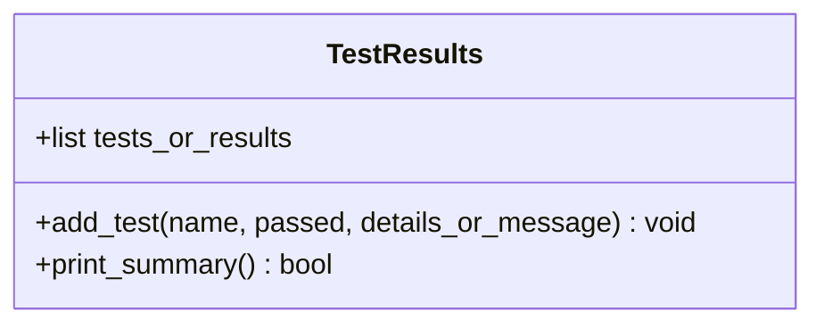
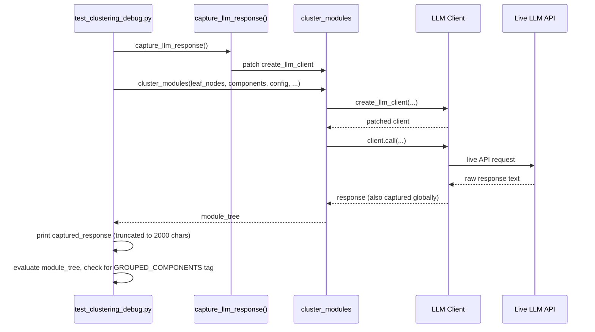
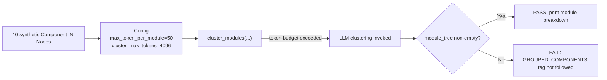
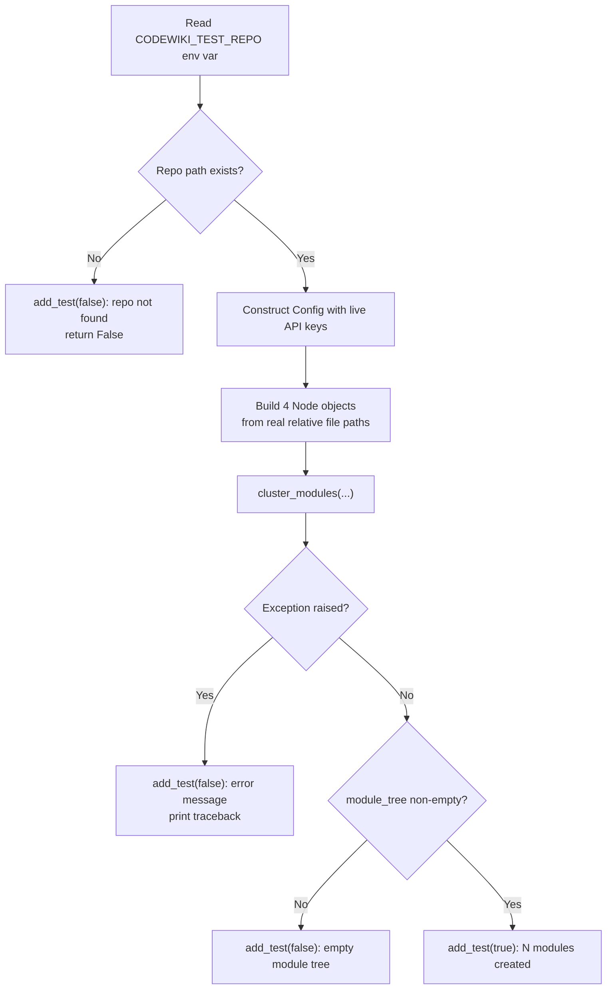
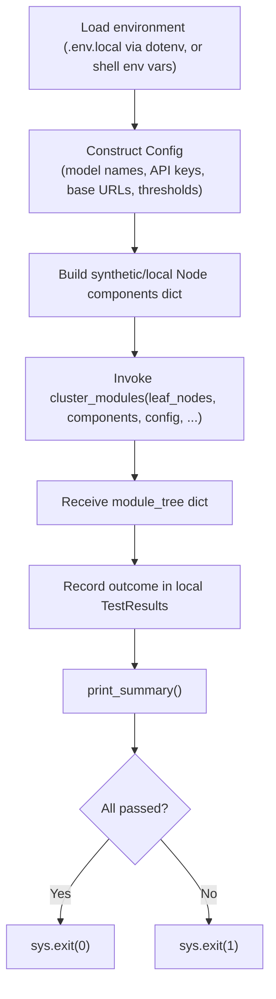

# Live Clustering Tests

## Introduction

The Live Clustering Tests module is a collection of standalone, manually-run diagnostic scripts used to exercise CodeWiki's LLM-driven module clustering pipeline (`cluster_modules`) against **real, live LLM providers**. Unlike unit tests that mock external dependencies, these scripts intentionally make actual network calls to configured LLM endpoints (OpenAI, Anthropic, etc.) so that engineers can observe, debug, and verify the raw behavior of the clustering prompt and response parsing logic under realistic conditions.

Each script in this module builds a small, synthetic set of `Node` components (representing source-code entities such as classes), constructs a `Config` object with live API credentials, and invokes `cluster_modules` to produce a module tree. The scripts differ in their diagnostic focus:

- **`test_clustering_debug.py`** — captures and prints the raw LLM response text, useful for inspecting whether the model followed the expected `<GROUPED_COMPONENTS>` tag format.
- **`test_clustering_forced.py`** — artificially lowers the `max_token_per_module` threshold to force the LLM clustering path to execute (rather than being skipped when the leaf-node set is small enough to bypass clustering).
- **`test_clustering_local.py`** — runs a more realistic scenario using a local repository checkout with real Java source file paths, intended for developers to point at their own project.

All three scripts share a common lightweight `TestResults` helper class (independently defined in each file) that accumulates pass/fail outcomes and prints a human-readable summary, exiting with a non-zero status code on failure so the scripts can also be wired into CI smoke tests if desired.

This module is a child of the [Test Clustering Core](../../test-clustering-core.md) module and is a sibling to the [Validation And Logic Tests](../validation_and_logic_tests/validation_and_logic_tests.md) module, which focuses on offline/mocked validation of clustering logic rather than live LLM calls.

---

## Purpose and Scope

| Aspect | Description |
|---|---|
| **Goal** | Manually verify that the clustering pipeline correctly calls the LLM, parses its response, and produces a non-empty module tree. |
| **Execution mode** | Standalone scripts, run directly via `python3 <script>.py`, not part of an automated pytest suite. |
| **External dependencies** | Requires live LLM API keys (`OPENAI_API_KEY`, `ANTHROPIC_API_KEY`, or overrides) since they perform real network calls. |
| **Primary subject under test** | `cluster_modules` (from `codewiki.src.be.cluster_modules`), which is part of the backend clustering logic used during documentation generation. |
| **Key inputs** | Synthetic `Node` objects and a `Config` instance. |
| **Key output** | A `module_tree` dictionary mapping generated module names to their assigned component lists. |

For details on the `Config` object shared across these scripts, see the [Config Core](../../../config-core.md) module. For details on the `Node` model used to represent source components, see [Data Models And Utilities](../../../backend-core/dependency-analysis/data_models_and_utilities/data_models_and_utilities.md) under [Backend Core](../../../backend-core.md).

---

## Architecture Overview

---

## Core Components

### TestResults (per-script)

Each of the three scripts defines its own local `TestResults` class. While structurally similar, they are independent implementations (not a shared library import), which is characteristic of ad-hoc diagnostic scripts:

| Script | Storage attribute | Add method signature | Summary behavior |
|---|---|---|---|
| `test_clustering_debug.py` | `self.tests` (list of tuples) | `add_test(name, passed, details="")` | Prints `✅ PASS` / `❌ FAIL` per test with details; returns `True` only if zero failures. |
| `test_clustering_forced.py` | `self.tests` (list of tuples) | `add_test(name, passed, message="")` | Prints a compact summary line per test; returns `True` if all tests passed. |
| `test_clustering_local.py` | `self.results` (list of tuples) | `add_test(name, passed, message="")` | Prints `X/Y tests passed` summary; returns `True` only if all passed. |

All three follow the same conceptual contract:

This lightweight, duplicated pattern avoids introducing a shared test-utility dependency for what are meant to be quick, disposable debugging scripts. Note that a more structured, reusable implementation of similar reporting logic exists in the sibling [Validation And Logic Tests](../validation_and_logic_tests/validation_and_logic_tests.md) module.

---

## Script-by-Script Breakdown

### 1. `test_clustering_debug.py` — Response Inspection

This script's distinguishing feature is a **monkey-patch** applied to `codewiki.src.be.cluster_modules.create_llm_client` before the clustering module is imported for use. The patch wraps the LLM client's `call` method so that the raw string response returned by the LLM is captured into a module-level `captured_response` variable, regardless of what `cluster_modules` internally does with it.

**Test data**: 4 synthetic Java-style `Node` objects (`AuthController`, `AuthService`, `UserController`, `UserService`) under a configurable test repository path (`CODEWIKI_TEST_REPO` env var, defaulting to a `fixtures/sample_repo` subdirectory).

**Pass criterion**: `module_tree` is non-empty. On failure, the script additionally reports whether the captured LLM response contained the `<GROUPED_COMPONENTS>` tag, helping distinguish "LLM didn't answer in the expected format" from other failure modes.

**Exit behavior**: `sys.exit(0)` on success, `sys.exit(1)` on failure — suitable for shell-based CI gating.

---

### 2. `test_clustering_forced.py` — Forcing the LLM Path

Clustering is normally skipped when the number of leaf components is small enough to fit under a token budget (`max_token_per_module`). This script deliberately sets `max_token_per_module=50` — an unrealistically low threshold — to **force** `cluster_modules` to invoke the LLM even for a small component set, ensuring the LLM-calling code path is actually exercised rather than short-circuited.

It also sets `cluster_max_tokens=4096` to keep the LLM's own response budget compatible with the `gpt-4o` default model.

**Test data**: 10 synthetic `Component{i}` Java-style nodes, generated programmatically in a loop rather than hand-written.

**Configuration source**: Uses `TEST_REPO_PATH` env var (falling back to the CodeWiki repository root) to populate file paths.

**Logging**: Explicitly configures Python's `logging` module at `INFO` level before running, so that internal `cluster_modules` log statements are visible during execution — useful for tracing exactly when the LLM call threshold is triggered.

**Pass criterion**: Same as the debug script — a non-empty `module_tree` — with console output listing each generated module name and its component count.

---

### 3. `test_clustering_local.py` — Realistic Local Repository Scenario

This script is structured as a proper function (`test_clustering(results)`) rather than top-level script logic, and is designed to be pointed at an actual local checkout of a larger codebase (the sample paths reference an OpenFrame Java service structure: `AuthController`, `AuthService`, `UserController`, `UserService` under realistic nested package paths).

**Guard behavior**: Unlike the other two scripts, this one validates that `CODEWIKI_TEST_REPO` is set **and** that the path actually exists before proceeding, failing fast with a clear message otherwise.

**API key guard**: At the `__main__` entry point, the script also checks for `OPENAI_API_KEY` or `MAIN_API_KEY` before running at all, exiting immediately with an error message if neither is present — avoiding a confusing downstream failure.

**Error handling**: Wraps the `cluster_modules` call in a `try/except`, printing a full traceback and recording a failed test entry if an exception occurs, rather than letting the script crash uncleanly.

---

## Comparative Summary

| Script | Component count | Forces LLM call? | Captures raw LLM text? | Repo path source | Guards before running |
|---|---|---|---|---|---|
| `test_clustering_debug.py` | 4 (fixed) | No (relies on default threshold) | Yes (via monkey patch) | `CODEWIKI_TEST_REPO` or `fixtures/sample_repo` | None explicit |
| `test_clustering_forced.py` | 10 (generated) | Yes (`max_token_per_module=50`) | No | `TEST_REPO_PATH` or repo root | None explicit |
| `test_clustering_local.py` | 4 (fixed, realistic paths) | No (relies on default threshold) | No | `CODEWIKI_TEST_REPO` (required) | Repo existence + API key presence |

---

## Data Flow: Common Test Lifecycle

Each script constructs its `Config` object using the same set of fields: `repo_path`, `output_dir`, `dependency_graph_dir`, `docs_dir`, `max_depth`, `main_model` / `cluster_model` / `fallback_model`, corresponding API keys and base URLs, and (in the forced-clustering case) `max_token_per_module` / `cluster_max_tokens`. This mirrors the configuration surface documented in the [Config Core](../../../config-core.md) module.

The `Node` objects constructed in all three scripts follow the same shape — `id`, `name`, `component_type`, `file_path`, `relative_path`, `language` — consistent with the `Node` model defined in [Data Models And Utilities](../../../backend-core/dependency-analysis/data_models_and_utilities/data_models_and_utilities.md).

---

## Relationship to Other Modules

- **Parent module**: [Test Clustering Core](../../test-clustering-core.md) — the umbrella module grouping all clustering-related test scripts.
- **Sibling module**: [Validation And Logic Tests](../validation_and_logic_tests/validation_and_logic_tests.md) — contains offline/mocked clustering validation (`test_clustering_integration.py`, `test_clustering_validation.py`, `test_id_based_clustering.py`), complementing the live, network-dependent tests documented here.
- **Consumed configuration model**: [Config Core](../../../config-core.md) — supplies the `Config` class used to parameterize every clustering run (models, API keys, base URLs, token thresholds).
- **Consumed data model**: `Node`, defined under [Backend Core](../../../backend-core.md) → [Dependency Analysis](../../../backend-core/dependency-analysis/dependency-analysis.md) → [Data Models And Utilities](../../../backend-core/dependency-analysis/data_models_and_utilities/data_models_and_utilities.md) — represents each source-code component fed into clustering.
- **Exercised backend logic**: `cluster_modules` and `create_llm_client`, part of the backend clustering/LLM services layer described conceptually in [Backend Core](../../../backend-core.md) (see also [Documentation And Services](../../../backend-core/documentation-and-services/documentation-and-services.md) for related LLM service wrapping via `CountingFallbackModel`).

---

## Usage Notes

- These scripts require valid LLM provider credentials to be set in the environment (or in a `.env.local` file loaded via `python-dotenv`) before execution — they are **not** safe to run in offline/CI environments without network access and API keys.
- Because they perform real API calls, they should be run sparingly and are best suited for manual debugging sessions when the clustering prompt, LLM response parsing, or `<GROUPED_COMPONENTS>` tag handling is suspected to be broken.
- Exit codes (`0` for success, `1` for failure) make these scripts usable as ad-hoc smoke tests in a shell pipeline, e.g. chaining several of them together to validate clustering end-to-end against a live model before a release.
