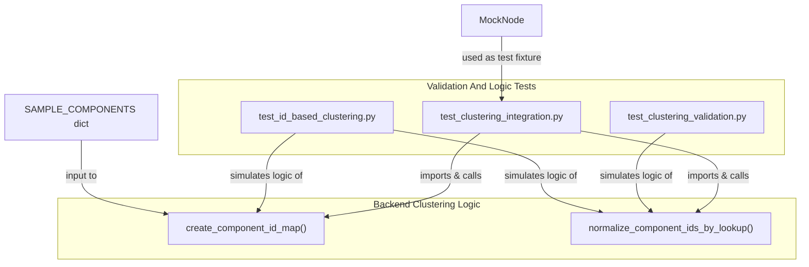
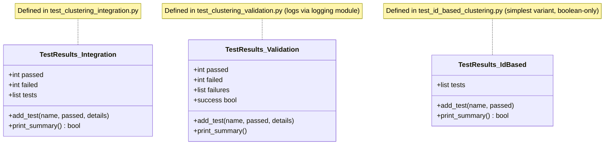
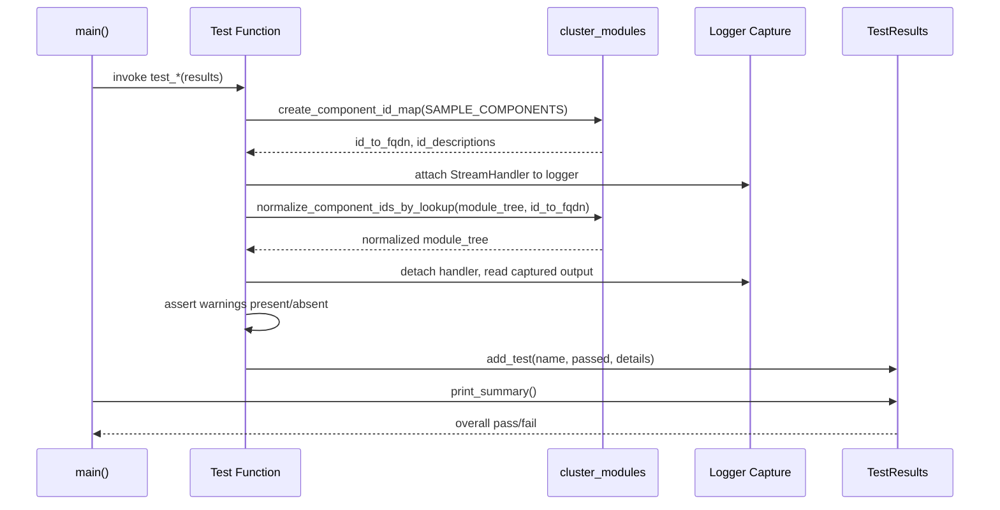
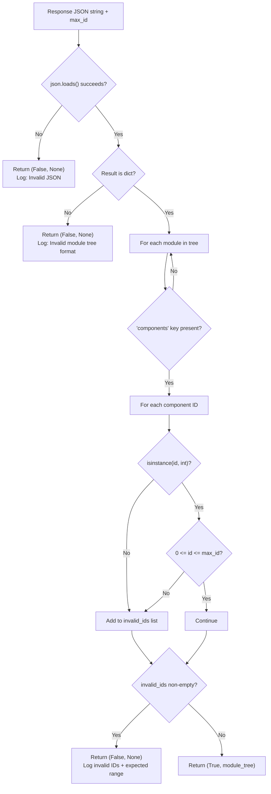

# Validation And Logic Tests

## Introduction

The Validation And Logic Tests module contains a suite of standalone Python test scripts that verify the correctness of CodeWiki's **ID-based clustering system** — the mechanism used to group components into logical modules during documentation generation. Rather than exercising a live clustering pipeline against real repositories, this module focuses on **pure logic validation**: it checks that component-ID parsing, range checking, type coercion, and FQDN (Fully Qualified Domain Name) normalization behave correctly under a wide range of valid and invalid inputs.

This module is a child of the `test-clustering-core` module tree, sitting alongside the [live_clustering_tests](../live_clustering_tests/live_clustering_tests.md) module. While `live_clustering_tests` exercises clustering behavior against live or semi-live scenarios, Validation And Logic Tests isolates and stress-tests the **validation and normalization logic** with mocked data and simulated LLM responses, independent of any actual LLM call or repository analysis.

The scripts in this module are not part of the production runtime — they are developer-facing regression tests that guard against regressions in the clustering validation code found in `codewiki.src.be.cluster_modules` (a component of the backend's clustering pipeline).

---

## Purpose and Scope

The core motivation behind this module is that CodeWiki's module-clustering step asks an LLM to assign numeric **component IDs** (rather than raw string identifiers) to generated module groupings, then maps those IDs back to fully-qualified component names (FQDNs). Because LLM output is inherently unreliable, the clustering system must defensively validate:

1. That IDs are integers (not strings, class names, or other types)
2. That IDs fall within the valid range (`0` to `max_id`)
3. That malformed JSON is rejected safely (no `eval()`-based parsing)
4. That valid IDs — including duplicates and quoted-integer strings — are normalized correctly into FQDNs
5. That invalid entries are dropped and logged as warnings rather than causing a crash

The three scripts in this module attack this problem from complementary angles:

| Script | Core Component | Focus |
|---|---|---|
| `test_clustering_integration.py` | `MockNode`, `TestResults` | End-to-end integration tests against the real `create_component_id_map` / `normalize_component_ids_by_lookup` functions, using mocked `Node` objects and captured log output |
| `test_clustering_validation.py` | `TestResults` | Table-driven tests that simulate the JSON parsing + ID-range validation logic in isolation, covering ten distinct input scenarios |
| `test_id_based_clustering.py` | `TestResults` | Focused unit checks for JSON parsing safety, function return-type unpacking, ID validation, and manual ID-to-FQDN normalization |

---

## Architecture Overview



The `test_clustering_integration.py` script is the only file in this module that directly imports and exercises the real backend implementation (`codewiki.src.be.cluster_modules`). The other two scripts (`test_clustering_validation.py` and `test_id_based_clustering.py`) **re-implement simplified versions of the validation algorithm inline** so they can be run without any dependency on the backend package — this makes them fast, self-contained smoke tests useful for quickly confirming that the *intended* validation semantics still hold.

For details on the actual backend clustering and dependency-analysis pipeline that this module validates against, see the [backend-core](../../backend-core.md) module documentation.

---

## Component Details

### MockNode (`test_clustering_integration.py`)

`MockNode` is a minimal stand-in for the backend's real `Node` model (see `CodeWiki.codewiki.src.be.dependency_analyzer.models.core::Node`), used to avoid depending on the full dependency-analyzer object graph in tests.

```python
class MockNode:
    def __init__(self, fqdn, name, file_path):
        self.fqdn = fqdn
        self.name = name
        self.file_path = file_path
```

It backs the `SAMPLE_COMPONENTS` dictionary — five representative components (`AuthService`, `CountedGenericQueryResult`, `UserController`, `DatabaseConnection`, `LoggingMiddleware`) — that is fed into `create_component_id_map()` to produce a deterministic `id_to_fqdn` mapping used across all ten test cases in the file.

### TestResults (three independent implementations)

Each script defines its **own** `TestResults` class. They share a common purpose — accumulating pass/fail outcomes and printing a human-readable summary — but differ slightly in API surface and output formatting, since each script was authored independently as a standalone CLI test runner.



- **`test_clustering_integration.TestResults`** — stores `(name, passed, details)` tuples and prints a `✅ PASS` / `❌ FAIL` summary with a final score fraction.
- **`test_clustering_validation.TestResults`** — routes pass/fail events through the standard `logging` module (`logger.info` / `logger.error`), tracks failures separately for a detailed post-mortem list, and exposes a `success` property for scripting.
- **`test_id_based_clustering.TestResults`** — the simplest variant: stores `(name, passed)` pairs only, with no details string, intended for quick boolean checks of four coarse-grained test groups.

---

## Test Suite 1: Integration Tests (`test_clustering_integration.py`)

This script performs **ten** integration tests directly against the real backend functions `create_component_id_map` and `normalize_component_ids_by_lookup`. It uses a `capture_log_warnings` decorator to intercept the logger output of `codewiki.src.be.cluster_modules`, allowing assertions on whether `❌` or `⚠️` warning markers appear in the captured log stream.

### Test Coverage

| # | Test Function | Scenario | Expected Outcome |
|---|---|---|---|
| 1 | `test_component_id_map_creation` | Build ID map from 5 sample components | Sequential integer IDs `0..4`, correct FQDN set |
| 2 | `test_valid_integer_ids` | `[0, 1, 2]` | Normalizes cleanly, no warnings |
| 3 | `test_invalid_quoted_integers` | `["0", "1", "2"]` | Accepted via Python's `int()` coercion — no warnings (resilient behavior) |
| 4 | `test_invalid_class_names` | `["AuthService", "CountedGenericQueryResult"]` | All rejected, `"Non-integer ID"` warnings logged |
| 5 | `test_mixed_invalid_ids` | `[0, "1", "AuthService", 999]` | 2 accepted (`0`, `"1"`), 2 rejected |
| 6 | `test_out_of_range_ids` | `[0, 1, 999]` | `999` rejected with `"Invalid ID 999"` / `"Valid range"` warning |
| 7 | `test_json_loads_normalization` | JSON string `"[0, 1, 2]"` parsed via `json.loads` | All 3 normalize successfully |
| 8 | `test_empty_list` | `[]` | No warnings, empty result |
| 9 | `test_duplicate_ids` | `[0, 1, 1, 2]` | Duplicates preserved (4 components, FQDN for `1` appears twice) |
| 10 | `test_negative_ids` | `[-1, 0, 1]` | `-1` rejected with `"Invalid ID -1"` warning |

### Execution Flow



The script exits with status code `0` on full success and `1` if any test fails, making it suitable for CI integration.

---

## Test Suite 2: Validation Logic Simulation (`test_clustering_validation.py`)

This script does **not** import the backend package. Instead, it reimplements the validation algorithm inline via `simulate_validation()`, mirroring the logic that lives in `cluster_modules.py` (specifically the JSON-parsing and ID-range-check block). This isolates the *validation contract* from the rest of the clustering pipeline, allowing the test to run without backend dependencies.

### Validation Algorithm



### Test Case Matrix

The script drives this algorithm through a data-driven `test_cases` list covering **ten** scenarios:

| Scenario | Input Sample | Expected Result |
|---|---|---|
| Valid — bare integers | `[0, 1, 2]` | Pass |
| Invalid — quoted integers | `["0", "1", "2"]` | Fail (strict `isinstance(int)` check, unlike the resilient `int()` coercion used in Suite 1) |
| Invalid — string class names | `["AuthService", "UserService"]` | Fail |
| Invalid — mixed types | `[0, "1", "AuthService", 2]` | Fail |
| Invalid — out-of-range ID | `[0, 1, 999]` | Fail |
| Invalid — negative ID | `[0, -1, 2]` | Fail |
| Valid — multiple modules | two modules with disjoint ID sets | Pass |
| Invalid — malformed JSON | trailing comma | Fail (`json.JSONDecodeError`) |
| Valid — empty components | `[]` | Pass |
| Valid — no components key | module dict omits `"components"` | Pass |

Each test case's actual `(success, module_tree)` outcome is compared against its expected `should_pass` flag, and results are logged/aggregated via `TestResults`.

> **Note:** This suite intentionally uses a **strict** `isinstance(comp_id, int)` check, which rejects quoted integer strings like `"0"`. This is stricter than the resilient `int()`-coercion behavior exercised in `test_clustering_integration.py`'s Test 3. Together, the two suites document both the strict validation contract (as specified in code comments referencing `cluster_modules.py` lines 338–369) and the actual resilient runtime behavior, helping maintainers understand where the two may diverge.

---

## Test Suite 3: Focused Unit Checks (`test_id_based_clustering.py`)

This script validates four narrower, independent aspects of the clustering fix set through four dedicated functions, each returning a boolean:

```mermaid
flowchart LR
    Main["main()"] --> T1["test_json_parsing()"]
    Main --> T2["test_return_types()"]
    Main --> T3["test_id_validation()"]
    Main --> T4["test_normalization()"]
    T1 --> R["TestResults.add_test(...)"]
    T2 --> R
    T3 --> R
    T4 --> R
    R --> Summary["print_summary()"]
```



1. **`test_json_parsing()`** — Confirms `json.loads()` is used (instead of unsafe `eval()`) to parse LLM responses, verifying valid JSON produces integer-typed IDs while quoted-string IDs are parsed but flagged as the wrong type.
2. **`test_return_types()`** — Uses a mock of `format_potential_core_components()` to verify the function's 4-tuple return signature `(potential_core_components, potential_core_components_with_code, id_to_fqdn, id_descriptions)` is unpacked correctly, guarding against a historical bug where `result[-1]` (a `Dict`) was mistakenly passed to a token-counting function expecting a `str`.
3. **`test_id_validation()`** — Re-implements the same type/range check as Suite 2 against both a valid and an intentionally invalid module tree, confirming invalid entries (string IDs, out-of-range integers) are correctly flagged.
4. **`test_normalization()`** — Manually walks a `module_tree`, converting each `comp_id` via `int(comp_id)` and looking it up in `id_to_fqdn`, mutating `module_data['components']` in place with the resolved FQDN list, and asserting the total normalized count matches expectations.

This suite is the most implementation-agnostic of the three: none of its logic imports backend code, making it the fastest and most portable way to sanity-check the fundamental invariants (safe parsing, correct tuple unpacking, range validation, ID-to-FQDN mapping) that the production clustering code depends on.

---

## Relationship to Sibling and Parent Modules

- **Parent:** This module is one of two children of the `test-clustering-core` module tree, which groups all clustering-related test scripts.
- **Sibling:** [Live Clustering Tests](../live_clustering_tests/live_clustering_tests.md) covers `test_clustering_debug.py`, `test_clustering_forced.py`, and `test_clustering_local.py` — these exercise clustering behavior in more integrated/live contexts, complementing the pure-logic focus of this module.
- **Dependency target:** The functions under test (`create_component_id_map`, `normalize_component_ids_by_lookup`) live in the backend's clustering module, part of the broader [backend-core](../../backend-core.md) system, which also houses the [Dependency Analysis](../../backend-core/dependency-analysis/dependency-analysis.md) components (`Node`, `Repository`, `AnalysisResult`, etc.) that ultimately supply the real component data these tests mock out via `MockNode` and `SAMPLE_COMPONENTS`.

---

## Running the Tests

Each script in this module is a standalone, executable Python file with a `main()` (or top-level `run_tests()` / `if __name__ == "__main__":`) entry point. They can be run directly with a Python interpreter, and each returns process exit code `0` on full success or `1` if any assertion fails — making them suitable for inclusion in continuous integration pipelines that need a lightweight regression check on the ID-based clustering validation logic without invoking a live LLM or full repository analysis.
