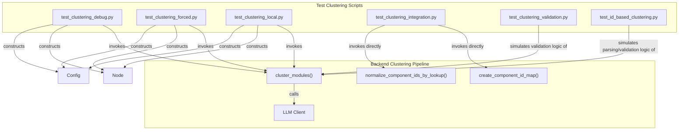
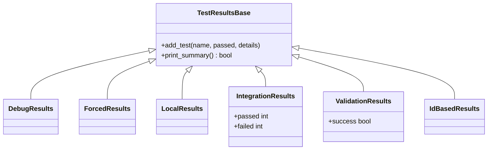
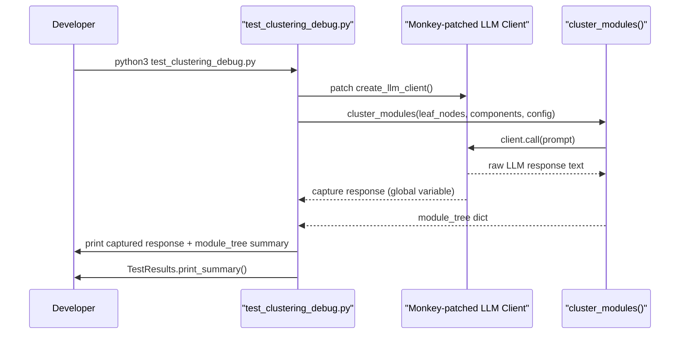

# Test Clustering

## Purpose

The Test Clustering module is a collection of standalone diagnostic and validation scripts used to exercise the LLM-driven **module clustering** functionality that lives inside the backend's documentation-generation pipeline (`cluster_modules`). Unlike a conventional `pytest` suite, these scripts are executable Python programs (`python3 script.py`) that print human-readable pass/fail reports to the console and exit with a non-zero status code on failure, making them suitable for quick manual runs, CI smoke checks, or debugging sessions when the clustering behavior of the underlying LLM changes.

Clustering is the step in the CodeWiki pipeline where a flat list of code components (functions, classes, files) discovered by the [dependency analyzer](backend-core.md) is grouped by an LLM into a hierarchical module tree (e.g. "Auth Module", "API Module") that later becomes the basis for the generated documentation structure. Because this step depends on free-form LLM output, it is especially prone to format drift (e.g., the LLM returning quoted strings or class names instead of integer IDs). The scripts in this module were written to reproduce, isolate, and regression-test these failure modes.

## Scope and Relationship to Other Modules

This module does not define new production functionality; instead, it directly imports and drives components from other parts of the system:

- **`cluster_modules`, `create_component_id_map`, `normalize_component_ids_by_lookup`** — the LLM clustering functions under test, part of the backend's documentation-generation pipeline (see [Backend Core](backend-core.md)).
- **`Node`** — the dependency-graph node model representing a single code component, documented as part of [Backend Core](backend-core/dependency-analyzer-models/dependency-analyzer-models.md).
- **`Config`** — the pipeline configuration object (model names, API keys, base URLs, token thresholds), documented in [Config Core](config-core.md).

Because the clustering step is LLM-backed, most scripts in this module require valid API credentials (`OPENAI_API_KEY`, `ANTHROPIC_API_KEY`, or the `MAIN_API_KEY` / `CLUSTER_API_KEY` / `FALLBACK_API_KEY` overrides) to be set in the environment or a local `.env.local` file before they can make live calls. The two validation-focused scripts (`test_clustering_validation.py` and `test_id_based_clustering.py`) are pure logic simulations and do **not** require any network access or API keys.

## Architecture Overview



## The Common `TestResults` Pattern

Nearly every script in this module defines its own local `TestResults` class rather than importing a shared one. This is a deliberate consequence of these being independent, copy-paste-friendly diagnostic scripts rather than a shared test library. Each implementation follows the same basic contract:

1. Accumulate `(name, passed, details)` tuples via an `add_test(...)` method.
2. Print a formatted summary via `print_summary()`.
3. Return or expose an overall boolean/exit-code indicating whether all tests passed.

| Script | `TestResults` Behavior | Exit Code Semantics |
|---|---|---|
| `test_clustering_debug.py` | Simple `add_test(name, passed, details)`; summary prints ✅/❌ per test | `sys.exit(0 if success else 1)` |
| `test_clustering_forced.py` | Same shape, message-only details | `sys.exit(0 if passed else 1)` |
| `test_clustering_local.py` | Same shape; returns `passed_count == total` | `sys.exit(0 if success else 1)` |
| `test_clustering_integration.py` | Tracks explicit `passed` / `failed` counters plus a list of dict-based test records | `main()` returns `0` or `1`, used as process exit code |
| `test_clustering_validation.py` | Tracks `passed` / `failed` counters and a `failures` list; exposes a `success` property | `exit(0 if success else 1)` |
| `test_id_based_clustering.py` | Minimal `(name, passed)` tuple list; `print_summary()` returns `all_passed` | `sys.exit(0)` / `sys.exit(1)` |



Note: `TestResultsBase` above is a conceptual grouping for documentation purposes only — each script defines its own independent class with no shared base class or import relationship in the actual source code.

## Script Reference

### `test_clustering_debug.py`

Runs a full, live invocation of `cluster_modules` against four hand-crafted `Node` components (`AuthController`, `AuthService`, `UserController`, `UserService`) and monkey-patches the LLM client factory (`create_llm_client`) so that the raw LLM response text can be captured and printed. This is the go-to script when the clustering output looks wrong and you need to see exactly what the LLM returned (including whether it emitted the expected `<GROUPED_COMPONENTS>` tag).

Key characteristics:
- Loads credentials from `.env.local` via `python-dotenv`.
- Builds a `Config` object with `repo_path` overridable via the `CODEWIKI_TEST_REPO` environment variable (defaults to a local `fixtures/sample_repo` directory).
- Prints up to 2000 characters of the captured LLM response for inspection.
- Reports failure with diagnostic detail when the module tree comes back empty (including whether the `<GROUPED_COMPONENTS>` tag was present in the response).

### `test_clustering_forced.py`

Similar in structure to the debug script, but deliberately sets `max_token_per_module=50` on the `Config` to force the clustering logic to invoke the LLM (clustering is normally skipped when the component set is small enough to fit under the token threshold). It also lowers `cluster_max_tokens` to keep the forced call cheap. Ten synthetic `Component{i}` nodes are generated to guarantee the threshold is exceeded.

This script is useful for confirming that:
- The token-based trigger for invoking the LLM clustering path actually fires.
- The LLM's response still respects the expected `<GROUPED_COMPONENTS>` tag format under a forced, low-budget scenario.

### `test_clustering_local.py`

A more guarded, "safe to run locally" variant that requires an existing on-disk repository (`CODEWIKI_TEST_REPO`) and specific Java source files inside it (`AuthController.java`, `AuthService.java`, `UserController.java`, `UserService.java`, under an OpenFrame-style API project layout). If the repo or API keys are missing, the script exits early with a clear message rather than attempting an LLM call. It wraps the `cluster_modules` invocation in a `try`/`except` block and prints a full traceback on unexpected exceptions, in addition to the standard `TestResults` summary.

### `test_clustering_integration.py`

The most comprehensive script in this module. Rather than calling `cluster_modules` end-to-end, it exercises two lower-level helper functions directly:
- `create_component_id_map(components)` — builds the `id -> FQDN` lookup and human-readable ID descriptions used to keep LLM prompts compact.
- `normalize_component_ids_by_lookup(module_tree, id_to_fqdn)` — converts LLM-returned component IDs back into fully-qualified component names, filtering out anything invalid.

It defines a lightweight `MockNode` class (with `fqdn`, `name`, `file_path` attributes) to avoid depending on the real `Node` model, and a `capture_log_warnings` decorator that redirects the `codewiki.src.be.cluster_modules` logger into an in-memory buffer so tests can assert on specific warning strings (e.g., `"Non-integer ID"`, `"Invalid ID 999"`, `"Valid range"`).

Ten focused test functions cover the following normalization edge cases:

| Test | Input | Expected Outcome |
|---|---|---|
| `test_component_id_map_creation` | 5 sample components | Sequential integer IDs `0..4` map 1:1 to FQDNs |
| `test_valid_integer_ids` | `[0, 1, 2]` | All normalize cleanly, no warnings |
| `test_invalid_quoted_integers` | `["0", "1", "2"]` | Accepted via `int()` conversion (resilient behavior), no warnings |
| `test_invalid_class_names` | `["AuthService", "CountedGenericQueryResult"]` | All rejected with `"Non-integer ID"` warnings |
| `test_mixed_invalid_ids` | `[0, "1", "AuthService", 999]` | Only `0` and `"1"` (→ 1) normalize; the rest are rejected |
| `test_out_of_range_ids` | `[0, 1, 999]` | `999` rejected with `"Invalid ID 999"` / `"Valid range"` warning |
| `test_json_loads_normalization` | `json.loads("[0, 1, 2]")` | Normalizes cleanly, confirming safe JSON parsing works |
| `test_empty_list` | `[]` | No components, no warnings |
| `test_duplicate_ids` | `[0, 1, 1, 2]` | Duplicates preserved (4 components, FQDN for `1` appears twice) |
| `test_negative_ids` | `[-1, 0, 1]` | `-1` rejected with `"Invalid ID -1"` warning |

### `test_clustering_validation.py`

A pure-simulation script that re-implements the validation logic from `cluster_modules.py` (referenced as lines 338–369 in the source comments) inside a local `simulate_validation(response_content, max_id)` function. It parses a raw JSON string with `json.loads` (explicitly avoiding `eval()` for safety) and checks that every component ID in every module is an integer within `[0, max_id]`. It is run against a table of ten hard-coded test cases covering valid bare integers, quoted integers, string class names, mixed types, out-of-range and negative IDs, malformed/trailing-comma JSON, empty component lists, and modules with no `components` key at all — asserting that the pass/fail outcome matches the expected `should_pass` flag for each case.

### `test_id_based_clustering.py`

The most isolated script — it has **no dependency on the `codewiki` package at all** and instead re-implements small snippets of the clustering logic inline to document and verify three specific historical bug fixes:

1. **`json.loads()` instead of `eval()`** for parsing LLM responses (`test_json_parsing`) — demonstrates that quoted string IDs parse but would subsequently fail type validation.
2. **Correct 4-tuple unpacking** of a mocked `format_potential_core_components()` function (`test_return_types`) — guards against a regression where the last tuple element (a `Dict` of ID descriptions) was mistakenly treated as the string passed to a token counter.
3. **Integer ID range validation** (`test_id_validation`) and **ID-to-FQDN normalization** (`test_normalization`) — smaller, self-contained versions of the same checks performed by `test_clustering_integration.py`, useful as a minimal reproduction when debugging without the full backend installed.

## Running the Scripts

All scripts are plain Python entry points and can be run directly, for example:

```bash
python3 test_clustering_debug.py
python3 test_clustering_forced.py
python3 test_clustering_local.py
python3 test_clustering_integration.py
python3 test_clustering_validation.py
python3 test_id_based_clustering.py
```

Scripts that perform live LLM calls (`test_clustering_debug.py`, `test_clustering_forced.py`, `test_clustering_local.py`) read credentials and model overrides from environment variables such as `MAIN_MODEL`, `CLUSTER_MODEL`, `FALLBACK_MODEL`, `OPENAI_API_KEY`, `ANTHROPIC_API_KEY`, `MAIN_API_KEY`, `CLUSTER_API_KEY`, and `FALLBACK_API_KEY`, and optionally load a `.env.local` file via `python-dotenv`. The purely logical scripts (`test_clustering_validation.py`, `test_id_based_clustering.py`) run without any environment configuration.

## Typical Debugging Flow



## Summary

The Test Clustering module provides a layered set of confidence checks for the LLM-based clustering step of the CodeWiki pipeline:

- **End-to-end scripts** (`test_clustering_debug.py`, `test_clustering_forced.py`, `test_clustering_local.py`) exercise the real `cluster_modules` function against live LLM calls, differing mainly in how they trigger the LLM path and how much diagnostic output they surface.
- **Targeted unit-style scripts** (`test_clustering_integration.py`) validate the ID-mapping and normalization helper functions in isolation, covering a wide range of malformed-input edge cases without requiring any LLM call.
- **Pure simulation scripts** (`test_clustering_validation.py`, `test_id_based_clustering.py`) re-implement small pieces of the validation logic to document and regression-test specific historical bugs (unsafe `eval()` usage, tuple-unpacking mistakes, ID range checks) without any dependency on the live backend or network access.

For details on the underlying components these scripts depend on, see [Backend Core](backend-core.md) (clustering pipeline and dependency graph models) and [Config Core](config-core.md) (pipeline configuration).
