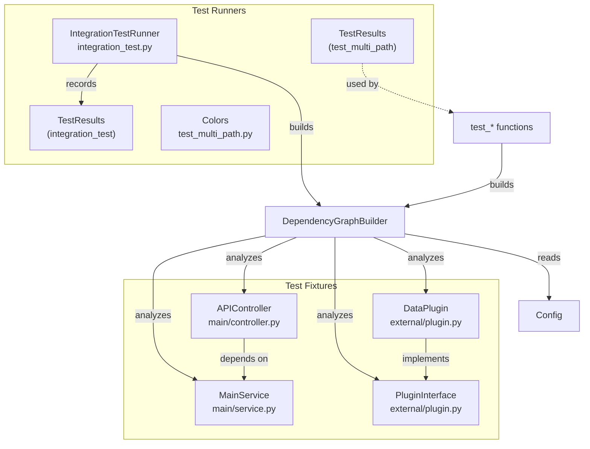
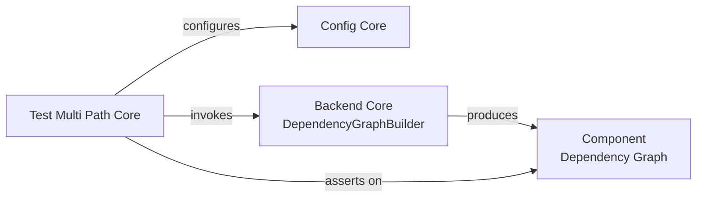

# Test Multi Path Core

## Purpose

The Test Multi Path Core module is a self-contained test fixture and validation suite for CodeWiki's **multi-path dependency analysis** capability. This capability allows the [Backend Core](backend-core.md) dependency analyzer to ingest source code from a primary repository root *plus* one or more `additional_source_paths` (configured via [Config Core](config-core.md)), and to build a single, correctly namespaced dependency graph across all of them.

This module exists purely to exercise and verify that behavior end-to-end. It provides:

1. A small, realistic **sample application** spread across multiple simulated source roots (`main/`, `deps/`/`vendor/`, `external/`) with intentional cross-path imports.
2. **Test runner scripts** that configure the dependency analyzer against these fixtures, execute the full analysis pipeline, and assert on the resulting component graph — checking namespace correctness, component counts, cross-path dependency resolution, and error handling for invalid paths.

Because it drives the real `DependencyGraphBuilder` and `Config` components from [Backend Core](backend-core.md) and [Config Core](config-core.md), this module doubles as executable documentation of how multi-path analysis is expected to behave.

## Architecture Overview

The module is organized into two complementary areas: static **fixture code** that stands in for a multi-directory codebase, and **test runner scripts** that drive analysis against those fixtures and validate the outcome.

Key relationships:

- **Fixture components** (`MainService`, `APIController`, `PluginInterface`, `DataPlugin`) are ordinary application code with no awareness of testing — they exist only to be *discovered and analyzed* by the dependency analyzer running against multiple source roots.
- **Runner components** (`IntegrationTestRunner`, both `TestResults` classes, `Colors`) orchestrate the analysis pipeline (`Config` → `DependencyGraphBuilder`) against the fixtures and assert on the output.
- Both runner scripts independently import `Config` from [Config Core](config-core.md) and `DependencyGraphBuilder` from [Backend Core](backend-core.md), meaning this module is a **consumer** of those modules rather than a dependency of them.

## Sub-Modules

### Test Fixtures

Sample application code intentionally spread across separate directories (`main/`, `external/`, and referenced `deps/`/`vendor/` paths) to simulate a realistic multi-root repository. Includes a small service/controller pair with a cross-file dependency, and a third-party-style plugin interface with a concrete implementation. This code is not exercised directly by end users — it is the input data that the test runners feed into the dependency analyzer.

See [Test Fixtures](test_fixtures.md) for details on `MainService`, `APIController`, `PluginInterface`, and `DataPlugin`.

### Test Runners

Two independent, executable test scripts that each configure `Config` and `DependencyGraphBuilder` against the fixtures and validate results: `integration_test.py` runs a full generated-fixture end-to-end scenario (creating its own temporary files for `main/`, `deps/`, and `vendor/`), while `test_multi_path.py` runs a suite of scenario-based checks (single path, multiple paths, namespacing, cross-path dependencies, invalid paths, empty paths, relative vs. absolute paths) against the on-disk fixtures in this module.

See [Test Runners](test_runners.md) for details on `IntegrationTestRunner`, `TestResults`, and `Colors`.

## How This Module Fits Into the System

Test Multi Path Core does not provide functionality consumed by other modules in the system — it is a standalone validation harness. It depends on:

- **[Config Core](config-core.md)** — for constructing `Config` instances with `additional_source_paths` set, which is the mechanism that enables multi-path mode.
- **[Backend Core](backend-core.md)** — specifically the dependency-analysis pipeline (`DependencyGraphBuilder`), which is the system under test.

Its outputs are console reports and pass/fail exit codes rather than artifacts consumed elsewhere in the platform.
