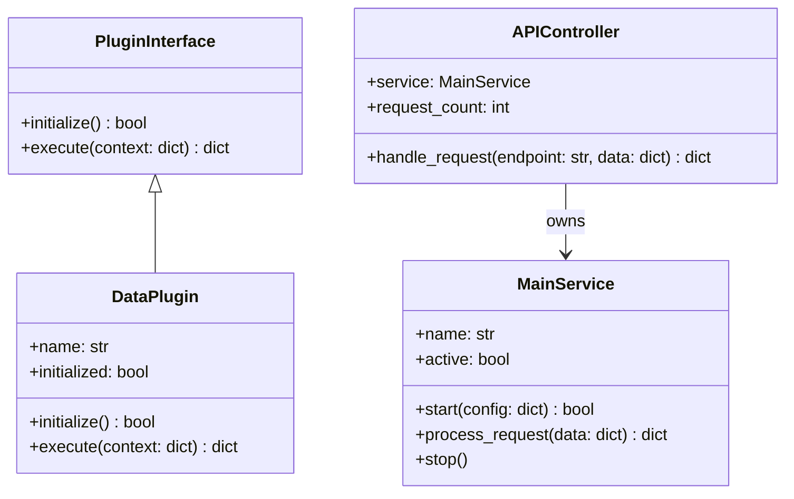
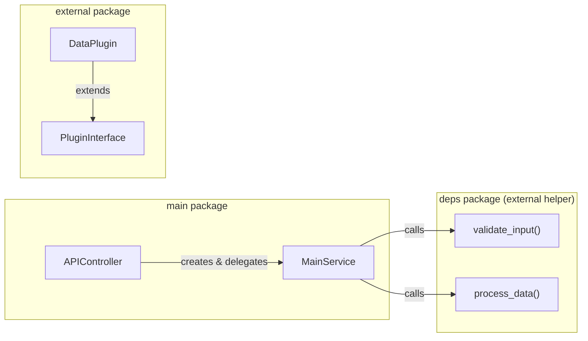
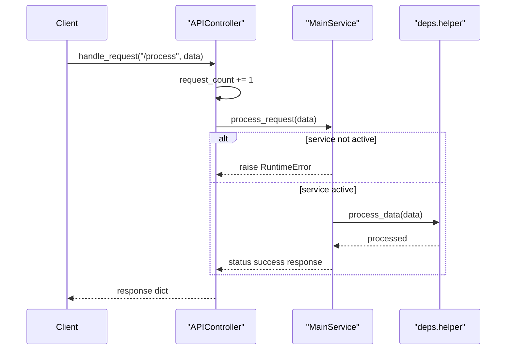
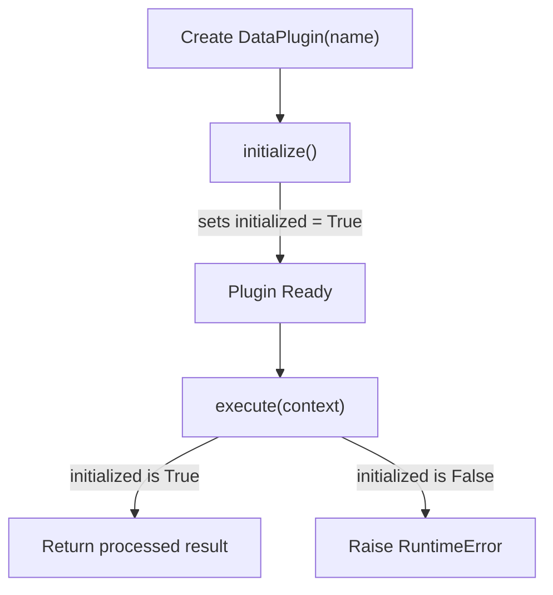

# Test Fixtures

The Test Fixtures module provides a small, self-contained set of sample application components used as **fixture code** for exercising the CodeWiki dependency-analysis and documentation-generation pipeline. It simulates a realistic multi-path Python project consisting of an API controller, a business service, and a third-party style plugin system. These fixtures are not part of CodeWiki's production runtime — they exist so that other CodeWiki subsystems (such as the [Backend Core](backend-core.md) dependency analyzers) have representative, cross-module code to parse, resolve, and document during testing.

## Purpose and Scope

This module is a child of the [Test Multi Path Core](test-multi-path-core.md) module. It contains the "application" half of the test fixture set:

- A **plugin interface and implementation** (`external/plugin.py`) that mimics a third-party package with an abstract base class and a concrete subclass.
- A **main service** (`main/service.py`) that represents core business logic and depends on an external helper package (`deps.helper`).
- An **API controller** (`main/controller.py`) that sits in front of the service and routes simple HTTP-style endpoints to service methods.

The sibling module, [Test Runners](test_runners.md), contains the test harnesses (`IntegrationTestRunner`, `TestResults`, `Colors`) that exercise these fixtures end-to-end. Together, the two child modules make up the full [Test Multi Path Core](test-multi-path-core.md) fixture project.

## Core Components

| Component | File | Responsibility |
|---|---|---|
| `PluginInterface` | `test-multi-path/external/plugin.py` | Abstract base class defining the plugin contract (`initialize`, `execute`). |
| `DataPlugin` | `test-multi-path/external/plugin.py` | Concrete plugin implementation that processes a `data` payload from a context dictionary. |
| `MainService` | `test-multi-path/main/service.py` | Core service exposing lifecycle (`start`/`stop`) and request-processing behavior; delegates data transformation to an external `deps.helper` module. |
| `APIController` | `test-multi-path/main/controller.py` | Thin routing layer that owns a `MainService` instance and dispatches requests based on endpoint string. |

## Architecture

The fixture code models a typical layered application: a controller delegates to a service, while a separate plugin subsystem demonstrates cross-package inheritance that the dependency analyzer must resolve correctly (base class defined in `external/plugin.py`, subclass in the same file, but conceptually representing a "third-party" dependency).

## Component Relationships and Dependencies

- `APIController` **instantiates and owns** a `MainService` object in its constructor, coupling the routing layer directly to a specific service instance.
- `MainService` depends on functions (`validate_input`, `process_data`) imported from an external `deps.helper` module. This module is outside the documented core components of this fixture set but represents the kind of cross-package call that the [Backend Core](backend-core.md) dependency-analysis subsystem is designed to trace.
- `DataPlugin` **inherits from** `PluginInterface`, overriding both `initialize()` and `execute()`. This inheritance relationship is a deliberate fixture pattern for validating that call-graph and class-hierarchy analyzers correctly link subclass methods back to their abstract base declarations.

## Request Processing Flow

The controller-to-service interaction demonstrates a simple, single-hop request pipeline used as a fixture for tracing call graphs across file boundaries.

Key behavioral notes captured by this fixture:

- `APIController.handle_request` supports two endpoints — `/process` (delegates to `MainService.process_request`) and `/health` (returns a status payload including the running `request_count`) — and returns an error payload for anything else.
- `MainService.process_request` raises a `RuntimeError` if the service has not been started via `start()`, exercising error-path analysis.
- `MainService.start` validates its `config` argument via `validate_input` before flipping the `active` flag to `True`.

## Plugin Lifecycle Flow

`DataPlugin` models a two-phase lifecycle — initialization followed by execution — common in plugin-based architectures. This is used as a fixture to validate that analyzers correctly track state (`initialized`) set in one method and checked in another.

## Role in the Test Multi-Path Fixture Set

This module exists purely to provide realistic, multi-file, multi-package Python source for CodeWiki's analysis tooling to consume. It does not implement production functionality. Consumers of this fixture set typically:

1. Point the [Backend Core](backend-core.md) dependency-analysis pipeline at the `test-multi-path` directory tree.
2. Verify that the resulting dependency graph correctly links `APIController` to `MainService` to `deps.helper`, and `DataPlugin` to `PluginInterface`.
3. Use the [Test Runners](test_runners.md) module's `IntegrationTestRunner` to validate the end-to-end analysis and documentation output against these fixtures.

For information on how the overall fixture project is organized and how it relates to the top-level test harness, see [Test Multi Path Core](test-multi-path-core.md).
