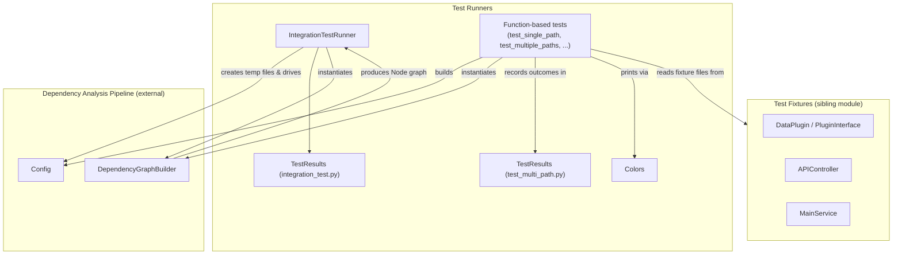
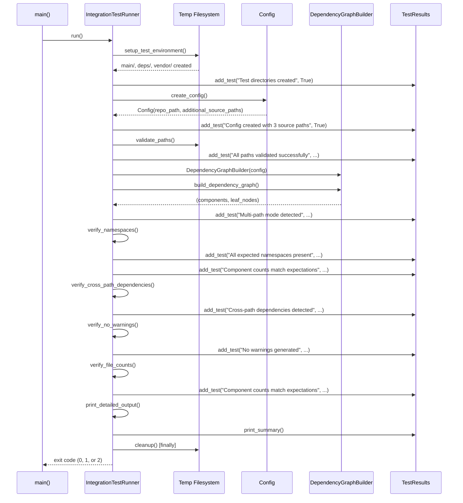
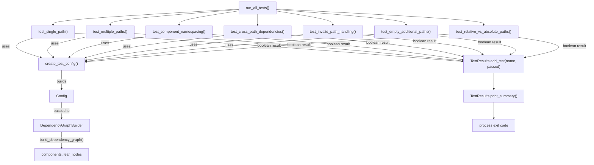

# Test Runners

## Introduction

The Test Runners module contains the executable test drivers used to validate CodeWiki's **multi-path source analysis** feature — the capability that allows the dependency analyzer to ingest code from a main repository plus one or more additional source directories (e.g. `deps/`, `vendor/`, `external/`) while keeping component identities correctly namespaced and dependency edges correctly resolved.

This module provides two independent, script-style test drivers:

- **`IntegrationTestRunner`** (in `integration_test.py`) — a self-contained, end-to-end integration test that builds its own temporary fixture files on disk, runs the full analysis pipeline, and asserts on the resulting component graph.
- **A function-based test suite** (in `test_multi_path.py`) built around the `Colors` and `TestResults` helper classes — a collection of discrete test functions that exercise multi-path analysis against pre-existing fixture directories (see the sibling [Test Fixtures](../test_fixtures/test_fixtures.md) module).

Both drivers ultimately invoke the same production pipeline components — `Config` and `DependencyGraphBuilder` — that live outside this module, and both produce a human-readable pass/fail summary plus a process exit code suitable for CI.

## Purpose and Scope

The Test Runners module is a **verification harness**, not a production component. Its responsibilities are:

1. Construct realistic multi-path repository layouts (either programmatically, in the case of `IntegrationTestRunner`, or by reading pre-built fixtures, in the case of `test_multi_path.py`).
2. Drive the dependency-analysis pipeline (`Config` → `DependencyGraphBuilder`) against those layouts.
3. Assert that:
   - Components from every source path are discovered.
   - Component IDs are namespaced by their source path (no ID collisions).
   - Cross-path dependencies are captured where possible.
   - No unexpected files/paths are missing or invalid.
4. Aggregate individual assertion results into a single summary report and translate the outcome into a process exit code (`0` = success, non-zero = failure).

## Architecture Overview



The two drivers are architecturally parallel but do not share code: each defines its own `TestResults` class with a slightly different API, reflecting their independent evolution as standalone scripts. Both, however, converge on the same two external dependencies:

- **`Config`** — see the [Config Core](config-core.md) module for configuration fields such as `repo_path`, `additional_source_paths`, and `is_multi_path_mode()`.
- **`DependencyGraphBuilder`** — see the [Backend Core](backend-core.md) module for how the multi-path component graph is actually built.

## Core Components

### IntegrationTestRunner

`IntegrationTestRunner` is a stateful orchestrator class that owns the entire lifecycle of a single, self-contained end-to-end test run. Unlike the function-based suite, it does not rely on pre-existing fixture files — it programmatically creates a temporary directory tree with three source roots (`main/`, `deps/`, `vendor/`) and hand-written Python files exhibiting realistic intra- and cross-path imports.

**Key responsibilities (mapped to instance methods):**

| Method | Responsibility |
|---|---|
| `setup_test_environment()` | Creates a temp directory with `main/`, `deps/`, `vendor/` subfolders and populates each with sample `.py` files (`_create_main_files`, `_create_deps_files`, `_create_vendor_files`). |
| `create_config()` | Builds a `Config` instance with `repo_path` set to `main/` and `additional_source_paths` set to `[deps/, vendor/]`. |
| `validate_paths()` | Confirms the root and all additional paths exist on disk. |
| `execute_dependency_parser()` | Instantiates `DependencyGraphBuilder(config)`, checks `config.is_multi_path_mode()`, and calls `build_dependency_graph()` to obtain `(components, leaf_nodes)`. |
| `verify_namespaces()` / `_verify_namespace_counts()` | Groups discovered component IDs by top-level namespace (`main`, `deps`, `vendor`) and checks expected counts (7, 5, 2 respectively). |
| `verify_cross_path_dependencies()` | Inspects each component's `dependencies` attribute for edges that cross namespace boundaries. |
| `verify_no_warnings()` | Checks whether the builder exposes a `warnings` attribute and, if so, that it is empty. |
| `verify_file_counts()` | Confirms the total component count across all namespaces matches the expected total (14). |
| `print_detailed_output()` | Prints all discovered component IDs, cross-namespace dependencies, and per-namespace counts for manual inspection. |
| `cleanup()` | Removes the temporary test directory (`shutil.rmtree`), always executed in the `finally` block of `run()`. |
| `run()` | Orchestrates the full sequence above in order and returns an integer exit code (`0` success, `1` assertion failure, `2` unhandled exception). |

**Instance state** tracked across the run: `test_dir`, `main_path`, `deps_path`, `vendor_path`, `config`, `builder`, `components`, `leaf_nodes`, and a `results: TestResults` accumulator.

### TestResults (integration_test.py)

A lightweight accumulator used exclusively by `IntegrationTestRunner`. Each recorded entry is a dictionary with `name`, `passed`, and an optional `details` string (used both for failure diagnostics and non-fatal warnings).

- `add_test(name, passed, details="")` — appends a result entry.
- `print_summary()` — prints total/passed/failed counts, lists failed assertions with their details, lists any "warning" entries (passed assertions that still carry a `details` message), and prints a final `✅ INTEGRATION TEST PASSED` / `❌ INTEGRATION TEST FAILED` banner.
- `all_passed()` — returns `True` only if every recorded entry passed; used by `IntegrationTestRunner.run()` to compute the process exit code.

### Colors

A minimal ANSI escape-code namespace used by the function-based test suite in `test_multi_path.py` for colorized console output. It defines class-level string constants:

- `GREEN`, `RED`, `YELLOW`, `BLUE`, `BOLD`, `END`

These are consumed by the module-level helper functions `print_header`, `print_success`, `print_error`, and `print_warning` to produce readable, color-coded terminal output while the test suite runs.

### TestResults (test_multi_path.py)

A separate, simpler accumulator (same class name as above, but a distinct implementation local to `test_multi_path.py`). It stores results as a `Dict[str, bool]` keyed by test name rather than a list of dictionaries with details.

- `add_test(name, passed)` — records a boolean outcome for a named test.
- `print_summary()` — prints a formatted header, iterates all results printing `print_success`/`print_error` per test (using `Colors`), prints a `"passed/total"` tally, and returns `0` if all tests passed or `1` otherwise — directly usable as a process exit code.

> **Note:** The two `TestResults` classes are intentionally independent implementations with different constructors and method signatures (`add_test(name, passed, details="")` returning nothing and printing a rich report, versus `add_test(name, passed)` with `print_summary()` returning an `int`). They are not meant to be interchanged; each is scoped to its own script.

## Data Flow: IntegrationTestRunner Execution



## Data Flow: Function-Based Multi-Path Test Suite

The `test_multi_path.py` driver takes a different shape: rather than one stateful orchestrator, it defines a series of independent test functions, each returning a boolean, which are collected and executed by `run_all_tests()`.



Each test function follows the same shape:

1. Resolve fixture paths (`main/`, `deps/`, `external/`) relative to the script's own directory — these fixtures are the ones documented in the sibling [Test Fixtures](test_fixtures.md) module (`APIController`, `MainService`, `DataPlugin`, `PluginInterface`).
2. Build a `Config` via the local `create_test_config()` helper, optionally supplying `additional_source_paths`.
3. Instantiate `DependencyGraphBuilder(config)` and call `build_dependency_graph()`.
4. Convert the returned `Node` objects to plain dictionaries via `model_dump()` for easy field inspection (`file_path`, `depends_on`).
5. Assert path-specific expectations (e.g., that `service.py` and `controller.py` are present under `main/`, that component IDs are unique, that cross-path dependency edges exist, that invalid paths raise `ValueError`/`OSError` from `config.validate_source_paths()`).
6. Return `True`/`False`, printed via the `Colors`-driven `print_success`/`print_error` helpers.

Notable individual tests:

- **`test_single_path`** — backward-compatibility check that a single `repo_path` with no `additional_source_paths` still analyzes correctly.
- **`test_multiple_paths`** — verifies that components from `main/`, `deps/`, and `external/` are all discovered in one pass.
- **`test_component_namespacing`** — asserts no duplicate component IDs are produced across paths and warns if an ID doesn't visibly reflect its source path.
- **`test_cross_path_dependencies`** — inspects each component's `depends_on` set to detect edges crossing between `main` and `deps`.
- **`test_invalid_path_handling`** — expects `config.validate_source_paths()` to raise on a nonexistent additional path.
- **`test_empty_additional_paths`** — confirms an empty `additional_source_paths` list behaves like the single-path case.
- **`test_relative_vs_absolute_paths`** — exercises path resolution behavior for relative vs. absolute additional paths.

## Relationship to Other Modules

- **[Test Fixtures](test_fixtures.md)** — the sibling module under [Test Multi Path Core](test-multi-path-core.md) that defines the on-disk sample components (`MainService`, `APIController`, `DataPlugin`, `PluginInterface`) consumed by `test_multi_path.py`'s function-based suite. `IntegrationTestRunner` does **not** depend on these fixtures; it generates its own files at runtime instead.
- **[Config Core](config-core.md)** — supplies the `repo_path` / `additional_source_paths` / `is_multi_path_mode()` / `validate_source_paths()` surface that both test drivers configure and exercise.
- **[Backend Core](backend-core.md)** — provides `DependencyGraphBuilder`, the production component whose multi-path behavior is the actual subject under test in this module.

## Usage

Both drivers are designed to be run as standalone scripts and return a process-appropriate exit code:

```bash
# Run the self-contained end-to-end integration test
python integration_test.py

# Run the fixture-based multi-path test suite
python test_multi_path.py
```

`integration_test.py` exits `0` on full success, `1` if any assertion failed, and `2` if the run crashed with an unhandled exception (stack trace printed via `traceback.print_exc()`). `test_multi_path.py`'s `run_all_tests()` returns `0` only if every individual test function returned `True`, otherwise `1`.

## Summary

The Test Runners module is the executable validation layer for CodeWiki's multi-path analysis capability. `IntegrationTestRunner` provides a fully self-contained, disk-based end-to-end scenario with rich diagnostic output, while the `Colors`/`TestResults` pairing in `test_multi_path.py` powers a broader, fixture-driven suite covering backward compatibility, namespacing, cross-path dependencies, and error handling. Together they validate the same underlying `Config` → `DependencyGraphBuilder` pipeline from two complementary angles, without depending on each other's internals.
