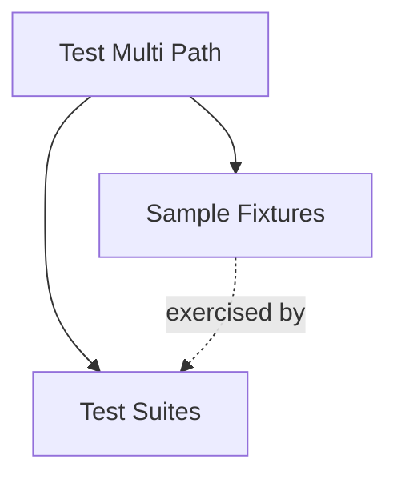
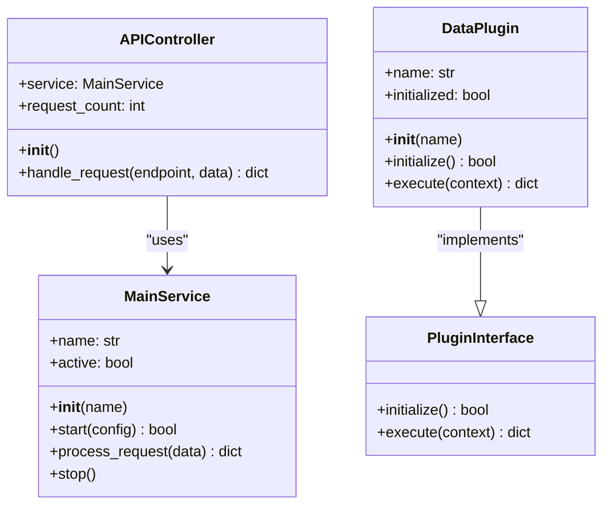
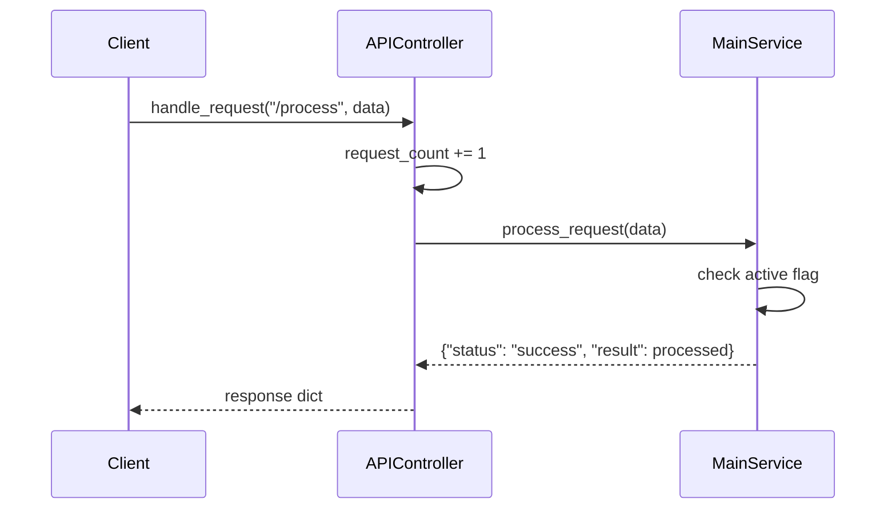
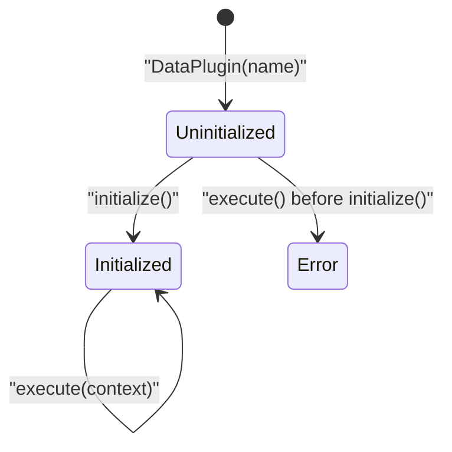
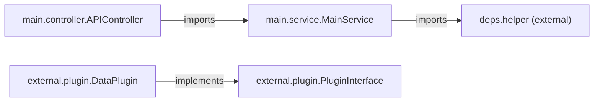

# Sample Fixtures

The Sample Fixtures module provides a small, self-contained set of illustrative components used to exercise the multi-path analysis capabilities of the dependency analyzer. It models a minimal API-driven application composed of a request controller, a core service, and a pluggable data-processing interface. These fixtures are not part of the production CodeWiki system itself — they exist as test data to validate that the [Backend Core](backend-core.md) dependency analysis and call-graph tooling correctly resolve cross-file and cross-package relationships (controller → service → plugin) across multiple source roots.

## Purpose and Scope

Sample Fixtures serves as a synthetic fixture package with three cooperating pieces:

- **`APIController`** — the entry point that receives API-style requests and routes them to the service layer.
- **`MainService`** — the core business logic component that validates and processes request data, and depends on helper utilities from an external `deps` package.
- **`PluginInterface` / `DataPlugin`** — an extensible plugin abstraction, defined in a separate `external` package, representing a third-party/pluggable extension point in the dependency graph.

Because the components live in distinct sub-packages (`main.controller`, `main.service`, `external.plugin`), this module is specifically useful for verifying that multi-path/multi-root dependency resolution works correctly — hence its parent module name, [Test Multi Path](test-multi-path.md).

## Module Position

Sample Fixtures is a child module of [Test Multi Path](test-multi-path.md), alongside its sibling module [Test Suites](test_suites.md), which contains the test runners (`IntegrationTestRunner`, `TestResults`, `Colors`) that exercise these fixtures.

## Component Architecture

The three components form a simple layered call chain: a controller delegates to a service, and the service (conceptually) could delegate further to a plugin-based extension point. `DataPlugin` implements the `PluginInterface` contract, demonstrating polymorphic extension.

### APIController

`APIController` (defined in `test-multi-path/main/controller.py`) is the request-routing entry point of the fixture application. On construction it instantiates a `MainService` named `"api-service"` and tracks a running `request_count`.

Its single public method, `handle_request(endpoint, data)`, performs simple string-based routing:

- `"/process"` — delegates to `MainService.process_request(data)`.
- `"/health"` — returns a status payload including the current `request_count`.
- Any other endpoint — returns an `{"error": "Unknown endpoint"}` response.

### MainService

`MainService` (defined in `test-multi-path/main/service.py`) encapsulates the core business logic of the fixture application. It is constructed with a `name` and starts in an inactive state (`active = False`).

Key behaviors:

- **`start(config)`** — validates the supplied configuration using `validate_input` (imported from an external `deps.helper` module, outside this module's scope) and, if valid, flips `active` to `True`.
- **`process_request(data)`** — raises a `RuntimeError` if the service has not been started; otherwise calls `process_data` (also from `deps.helper`) and wraps the result in a structured response dict containing `status`, `service`, and `result`.
- **`stop()`** — resets `active` to `False`.

This component demonstrates a cross-package dependency: `MainService` lives in `main.service` but relies on helper functions declared in a separate `deps` package, which is a key scenario the dependency analyzer's multi-path resolution is designed to detect correctly.

### PluginInterface and DataPlugin

Defined in `test-multi-path/external/plugin.py`, these two classes model a pluggable extension mechanism located in a distinct `external` package:

- **`PluginInterface`** is an abstract base defining two contract methods, `initialize()` and `execute(context)`, both of which raise `NotImplementedError` in the base class.
- **`DataPlugin`** is a concrete implementation. It tracks an `initialized` flag, requires `initialize()` to be called before `execute()` can run (otherwise raising `RuntimeError`), and its `execute(context)` method extracts a `"data"` key from the passed `context` dict and returns a formatted result string wrapped in a response dict.

## Cross-Module Dependency Flow

The fixture's package layout — `main.controller`, `main.service`, and `external.plugin` — intentionally spans multiple directories/roots so that the dependency analysis pipeline described in [Backend Core](backend-core.md) can be validated against realistic multi-path import resolution scenarios (e.g., resolving `from service import MainService` and `from deps.helper import process_data, validate_input` across different source roots).

## Usage in Testing

Sample Fixtures components are consumed by the sibling [Test Suites](test_suites.md) module, whose `IntegrationTestRunner` exercises the controller-to-service call chain and validates that analysis output (call graphs, dependency edges) matches expectations for this intentionally cross-package layout.
