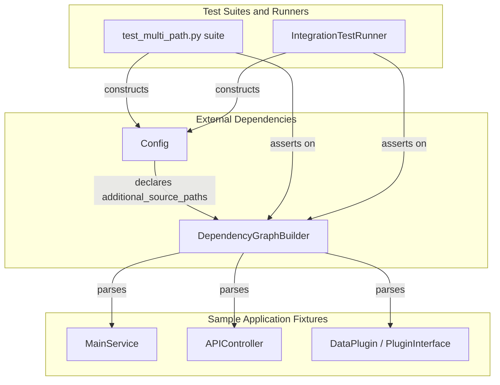
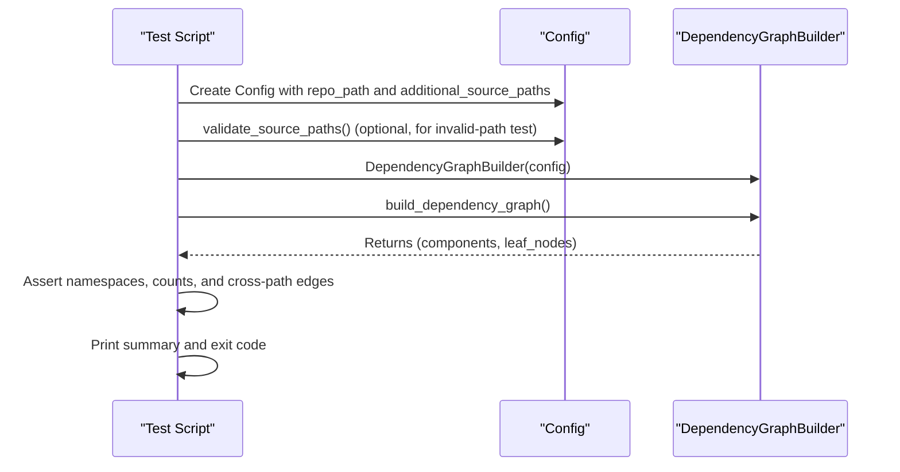

# Test Multi Path

## Purpose

The Test Multi Path module is a self-contained **test fixture and validation suite** used to verify the multi-path source analysis capability of CodeWiki's dependency analysis pipeline. It does not implement production application logic; instead, it provides:

1. **Sample application code** (a small "service + controller + plugin" codebase spread across multiple simulated source roots: `main/`, `deps/`, `external/`, and `vendor/`) that mimics a real repository with cross-directory imports.
2. **Test runner scripts** that configure the [Config](config-core.md) object with `additional_source_paths`, invoke `DependencyGraphBuilder` from the [Backend Core](backend-core.md) module, and assert that components are correctly discovered, namespaced, and (where applicable) linked across path boundaries.

This module exists to answer a specific engineering question for CodeWiki itself: *"When a repository's source code is split across multiple root directories (e.g., a monorepo with `main`, `deps`, and `vendor` folders), can the dependency analyzer correctly parse, namespace, and graph components from all of them without ID collisions or missed dependencies?"*

## Architecture Overview

The module has two cooperating halves: **fixtures** (sample code to be analyzed) and **suites** (scripts that drive the analysis and assert on results).

- **Config** and **DependencyGraphBuilder** are core components of the [Config Core](config-core.md) and [Backend Core](backend-core.md) modules respectively; Test Multi Path exercises them but does not own them.
- The fixtures (`main/service.py`, `main/controller.py`, `external/plugin.py`) are ordinary Python source files that stand in for a target repository being documented.
- The suites (`test_multi_path.py`, `integration_test.py`) are executable scripts (not pytest-based) that print colorized pass/fail output and return process exit codes.

## Sub-modules

### [Sample Fixtures](sample_fixtures.md)

Contains the sample application code used as analysis input: `MainService`, `APIController`, `DataPlugin`, and `PluginInterface`. These classes simulate a layered application (controller → service → helper) spread across the `main/` and `external/` source roots so that the analyzer has realistic cross-file and cross-path relationships to discover.

### [Test Suites](test_suites.md)

Contains the executable validation logic: the `test_multi_path.py` suite (`Colors`, `TestResults`) which runs eight discrete scenario checks (single path, multiple paths, namespacing, cross-path dependencies, invalid paths, empty paths, relative vs. absolute paths), and `integration_test.py` (`IntegrationTestRunner`, `TestResults`) which runs a single comprehensive end-to-end scenario against a freshly generated temporary repository with `main/`, `deps/`, and `vendor/` roots.

## How the Suites Use the Analysis Pipeline

Both test scripts follow the same general pattern when invoking the dependency analysis pipeline documented in [Backend Core](backend-core.md):

Key points validated by these scripts:

- **Namespacing:** component IDs are prefixed by their top-level source root (for example `main.service.MainService`) so that same-named classes in different roots (e.g., `main/service.py` vs. `deps/helper.py`) never collide.
- **Multi-path detection:** `Config.is_multi_path_mode()` correctly reports whether more than one source root was configured.
- **Path validation:** `Config.validate_source_paths()` raises an error when an additional path does not exist on disk.
- **Cross-path dependency behavior:** at the time these tests were written, import statements crossing source-root boundaries are parsed but not yet resolved into graph edges — the suites document this as expected/known behavior rather than a failure.

## Relationship to Other Modules

- **[Config Core](config-core.md):** Test Multi Path constructs `Config` instances (including the `additional_source_paths` and `validate_source_paths` behavior) to drive the scenarios under test.
- **[Backend Core](backend-core.md):** Test Multi Path exercises `DependencyGraphBuilder`, which in turn relies on the dependency-analyzer pipeline (AST parsing, node/graph models) documented in that module.
