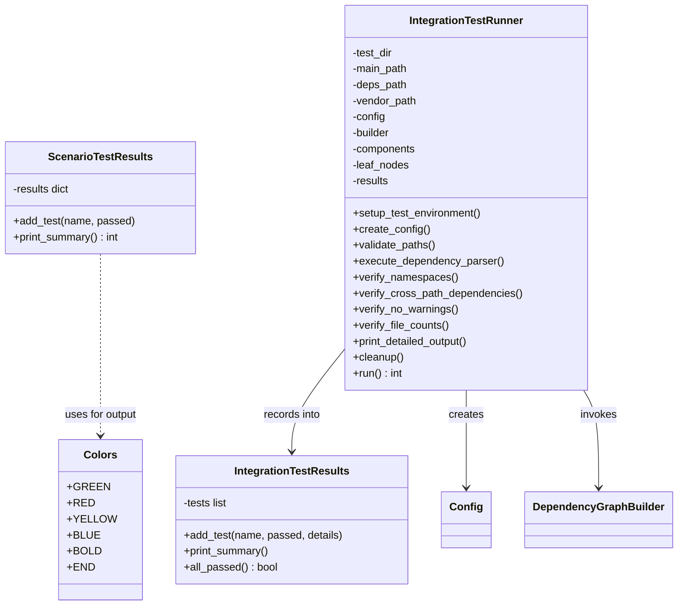
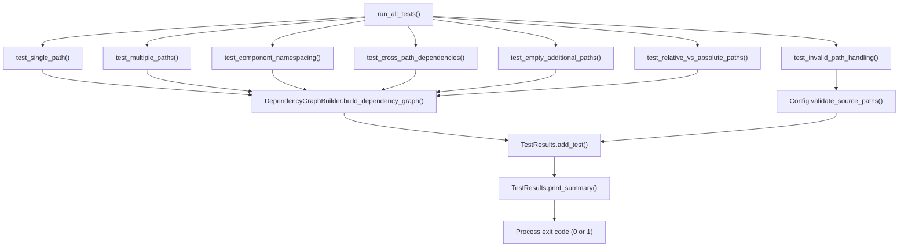
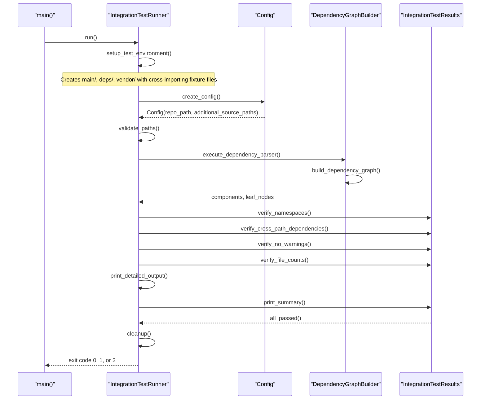
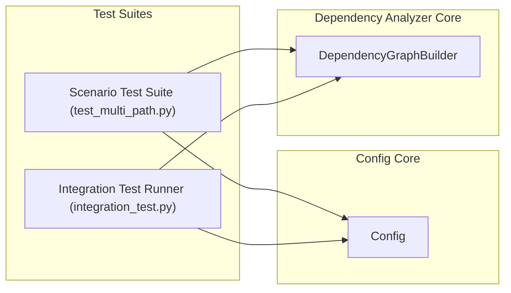

# Test Suites

## Introduction

The Test Suites module contains the executable test scripts that validate CodeWiki's **multi-path dependency analysis** feature — the ability to analyze source code spread across several independent root directories (e.g. `main/`, `deps/`, `vendor/`) as a single logical repository while keeping component identifiers correctly namespaced and dependency edges correctly resolved.

This module provides two complementary test scripts:

- **`test_multi_path.py`** — a scenario-based smoke-test suite that exercises the `DependencyGraphBuilder` (see [Backend Core](backend-core.md)) with a series of independent, self-contained checks (single path, multiple paths, namespacing, cross-path dependencies, invalid paths, empty paths, relative vs. absolute paths).
- **`integration_test.py`** — a full end-to-end integration test that programmatically builds a temporary multi-directory sample repository, runs the complete analysis pipeline against it, and asserts on namespace counts, cross-namespace dependency detection, and overall component totals.

Both scripts are executable as standalone CLI programs (`python test_multi_path.py`, `python integration_test.py`) and return a process exit code suitable for use in CI pipelines.

This module is a child of the [Test Multi Path](test-multi-path.md) module and is a sibling of the [Sample Fixtures](sample_fixtures.md) module, which supplies some of the on-disk fixture files (`main/controller.py`, `main/service.py`, `external/plugin.py`) referenced by `test_multi_path.py`.

## Module Purpose in the System

Test Suites does not implement product functionality — it is a verification harness for the dependency analysis subsystem documented in [Backend Core](backend-core.md), specifically its multi-path graph construction logic. It exercises:

- **`Config`** (from the [Config Core](config-core.md) module) — used to declare a primary `repo_path` plus a list of `additional_source_paths`.
- **`DependencyGraphBuilder`** (part of the dependency analyzer pipeline in [Backend Core](backend-core.md)) — the component under test, responsible for parsing all configured paths and producing a namespaced component graph.

Because these scripts drive real analysis runs, they act as a living specification for how multi-path namespacing and cross-path dependency resolution are expected to behave, including documenting known limitations (e.g. cross-namespace dependency resolution is not yet implemented at the AST-parsing level).

## Core Components

| Component | File | Responsibility |
|---|---|---|
| `Colors` | `test_multi_path.py` | ANSI color code constants used for terminal output formatting |
| `TestResults` (scenario suite) | `test_multi_path.py` | Accumulates pass/fail results for the seven scenario tests and prints a summary |
| `IntegrationTestRunner` | `integration_test.py` | Orchestrates the full end-to-end integration test: environment setup, config creation, pipeline execution, and multi-stage validation |
| `TestResults` (integration suite) | `integration_test.py` | Accumulates detailed assertion results (with optional `details` text) for the integration run and prints a validation summary |

> **Note:** Both scripts define a class named `TestResults`, but they are distinct, independent implementations local to each file — there is no shared base class or import relationship between them.

### Colors

A simple constants class holding ANSI escape codes (`GREEN`, `RED`, `YELLOW`, `BLUE`, `BOLD`, `END`) used by the module-level print helpers (`print_header`, `print_success`, `print_error`, `print_warning`, `print_info`) in `test_multi_path.py` to produce readable, color-coded console output.

### TestResults (test_multi_path.py)

```text
class TestResults:
    def __init__(self):
        self.results = {}          # test_name -> bool

    def add_test(self, name, passed) -> None
    def print_summary(self) -> int  # returns 0 (all passed) or 1 (failures)
```

Used by `run_all_tests()` as a simple dictionary-backed accumulator. Each of the seven scenario test functions returns a boolean, which is recorded under a descriptive test name. `print_summary()` renders a pass/fail report and computes the suite's overall exit code.

### IntegrationTestRunner

`IntegrationTestRunner` is a stateful orchestrator class that owns the entire lifecycle of the integration test:

```text
class IntegrationTestRunner:
    def __init__(self):
        self.test_dir     # temp directory root
        self.main_path     # main/ source path
        self.deps_path      # deps/ source path
        self.vendor_path    # vendor/ source path
        self.config         # Config instance
        self.builder        # DependencyGraphBuilder instance
        self.components     # Dict[str, Node] result
        self.leaf_nodes      # leaf node result
        self.results         # TestResults instance
```

Its `run()` method executes the following ordered steps, each implemented as a dedicated method:

1. `setup_test_environment()` — creates a temporary directory with three sub-paths (`main/`, `deps/`, `vendor/`) and populates each with hand-written Python fixture files (`service.py`, `api.py`, `models.py`, `controller.py`, `utils.py` in `main/`; `helper.py`, `validator.py`, `cache.py` in `deps/`; `logger.py`, `metrics.py` in `vendor/`) that intentionally cross-import between paths.
2. `create_config()` — builds a `Config` (see [Config Core](config-core.md)) with `repo_path` set to `main/` and `additional_source_paths` set to `[deps/, vendor/]`.
3. `validate_paths()` — confirms the root and all additional paths exist on disk.
4. `execute_dependency_parser()` — instantiates `DependencyGraphBuilder` (see [Backend Core](backend-core.md)), verifies `config.is_multi_path_mode()` returns `True`, and calls `build_dependency_graph()`.
5. `verify_namespaces()` — groups discovered component IDs by their top-level namespace (`main`, `deps`, `vendor`) and checks expected per-namespace component counts.
6. `verify_cross_path_dependencies()` — inspects component `dependencies` for edges that cross namespace boundaries.
7. `verify_no_warnings()` — checks the builder for any recorded warnings.
8. `verify_file_counts()` — checks the total component count against the expected total (14).
9. `print_detailed_output()` — dumps all component IDs, cross-namespace dependencies, and per-namespace counts for manual inspection.
10. `cleanup()` — removes the temporary test directory (always executed via `finally`).

### TestResults (integration_test.py)

A richer accumulator than the scenario-suite version — each recorded test entry carries an optional `details` string, allowing informational warnings to be attached to otherwise-passing assertions:

```text
class TestResults:
    def __init__(self):
        self.tests = []   # list of {"name", "passed", "details"}

    def add_test(self, name, passed, details="") -> None
    def print_summary(self) -> None   # prints PASS/FAIL + warnings block
    def all_passed(self) -> bool
```

`IntegrationTestRunner.run()` uses `all_passed()` to determine the final process exit code (`0` on success, `1` on any failed assertion, `2` if the test crashes with an unhandled exception).

## Architecture

### Class Relationships



### Scenario Test Suite Flow (`test_multi_path.py`)



Each scenario test constructs its own `Config` (see [Config Core](config-core.md)) via the local `create_test_config()` helper, pointing `repo_path` at the `main/` fixture directory and, where relevant, supplying `additional_source_paths` pointing at `deps/` and/or `external/` fixture directories (see [Sample Fixtures](sample_fixtures.md)).

### Integration Test Pipeline (`integration_test.py`)



### Dependency on Backend Core



Both scripts treat `DependencyGraphBuilder` (see [Backend Core](backend-core.md)) as the system under test and `Config` (see [Config Core](config-core.md)) as the primary input mechanism for expressing multi-path analysis intent via `additional_source_paths` and `is_multi_path_mode()`.

## Test Coverage Summary

### Scenario Test Suite (`test_multi_path.py`)

| # | Test | Validates |
|---|---|---|
| 1 | Single Path (Backward Compatibility) | Analyzing one `repo_path` with no additional paths still discovers expected components |
| 2 | Multiple Paths With Unique Components | Components from `main/`, `deps/`, and `external/` are all discovered when passed as `additional_source_paths` |
| 3 | Component ID Namespacing | No duplicate component IDs occur across paths; IDs reflect their source path |
| 4 | Cross-Path Dependencies | Dependency edges are built between components across different source paths |
| 5 | Invalid Path Handling | `Config.validate_source_paths()` raises `ValueError`/`OSError` for a nonexistent additional path |
| 6 | Empty Additional Paths | An empty `additional_source_paths` list behaves identically to single-path mode |
| 7 | Relative vs. Absolute Paths | Absolute additional paths resolve correctly (relative-path resolution is noted as needing further logic) |

### Integration Test (`integration_test.py`)

| Step | Validates |
|---|---|
| Path validation | Root and all additional paths exist on disk before analysis begins |
| Multi-path mode detection | `config.is_multi_path_mode()` returns `True` when additional paths are configured |
| Namespace presence | All expected top-level namespaces (`main`, `deps`, `vendor`) appear in the component graph |
| Namespace component counts | Each namespace yields the expected number of class/function-level components (`main`: 7, `deps`: 5, `vendor`: 2 — 14 total) |
| Cross-namespace dependencies | Dependency edges spanning namespaces are detected where present; documents current limitation that import-level cross-path resolution is not yet fully implemented |
| Warning tracking | No unexpected warnings are recorded by the builder during analysis |

## Related Modules

- [Test Multi Path](test-multi-path.md) — parent module; defines the overall multi-path test harness this module belongs to.
- [Sample Fixtures](sample_fixtures.md) — sibling module providing on-disk sample components (`MainService`, `APIController`, `DataPlugin`, `PluginInterface`) referenced by the scenario test suite's `main/` and `external/` fixture directories.
- [Config Core](config-core.md) — supplies the `Config` class used to declare `repo_path` and `additional_source_paths` for every test scenario.
- [Backend Core](backend-core.md) — houses the dependency analyzer pipeline, including the `DependencyGraphBuilder` under test.
