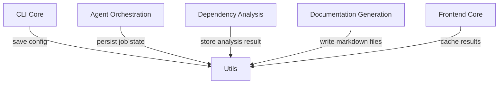
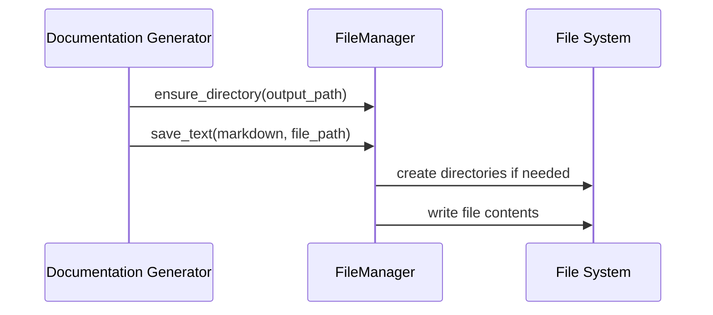
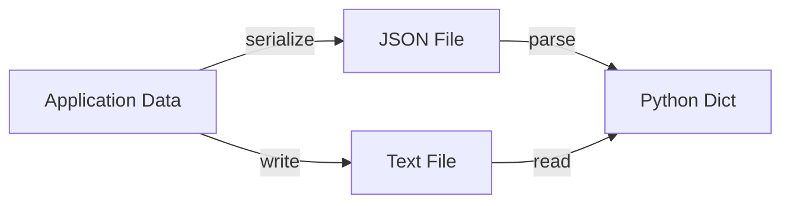
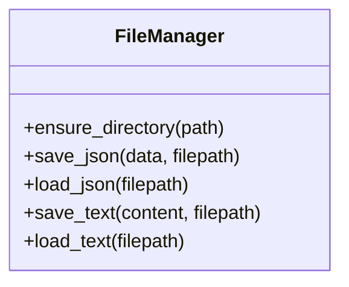

# Utils

The **Utils** module provides foundational file input/output utilities used across the CodeWiki platform. It centralizes directory management and JSON/text persistence logic through a lightweight, stateless `FileManager` abstraction.

Although small in scope, this module plays a critical infrastructural role by supporting:

- Documentation persistence in the Documentation Generation pipeline
- CLI configuration and job state storage
- Intermediate artifacts from Dependency Analysis
- Frontend caching and background processing workflows

By isolating file system operations into a single module, the system ensures consistent behavior, easier testing, and simplified future enhancements (e.g., cloud storage adapters or atomic writes).

---

## Core Component

### FileManager

**Namespace:** `CodeWiki.codewiki.src.utils.FileManager`  
**Type:** Static utility class  
**Purpose:** Provide reusable file and directory management operations.

The `FileManager` class exposes only static methods and is instantiated once as `file_manager` for convenience.

### Responsibilities

- Ensure directory creation (including nested paths)
- Save and load JSON data
- Save and load plain text files
- Gracefully handle missing JSON files

---

## API Overview

### Directory Management

```python
FileManager.ensure_directory(path: str) -> None
```

Creates a directory and all parent directories if they do not exist.

Internally uses:

```python
os.makedirs(path, exist_ok=True)
```

This enables safe creation of nested structures such as:

```text
/docs/Backend/Auth/JWT
```

---

### JSON Persistence

```python
FileManager.save_json(data: Any, filepath: str) -> None
FileManager.load_json(filepath: str) -> Optional[Dict[str, Any]]
```

**save_json**
- Serializes Python objects to formatted JSON
- Uses `indent=4` for readability

**load_json**
- Returns parsed JSON if file exists
- Returns `None` if file does not exist
- Prevents unnecessary exception handling in callers

---

### Text Persistence

```python
FileManager.save_text(content: str, filepath: str) -> None
FileManager.load_text(filepath: str) -> str
```

Used for:
- Generated markdown documentation
- Logs
- Temporary artifacts
- Cached frontend outputs

---

## Architectural Role in the System

The Utils module sits at the infrastructure layer and is reused by multiple higher-level modules.



### Key Observations

- The dependency direction is one-way: higher modules depend on Utils.
- Utils has no dependency on business logic modules.
- This preserves clean layering and reduces coupling.

---

## Interaction Flow Example

Below is a typical documentation generation persistence flow:



This illustrates how higher-level services delegate filesystem concerns to the Utils module.

---

## Data Handling Model

The module supports two primary data formats:



### Design Characteristics

- Human-readable JSON output
- No custom serialization logic
- Minimal abstraction over Python's standard library
- Predictable and synchronous behavior

---

## Error Handling Strategy

The module follows a minimalistic philosophy:

| Operation | Behavior |
|-----------|----------|
| Missing JSON file | Returns `None` |
| Directory creation | Safe with `exist_ok=True` |
| Text load | Raises standard Python exception if file missing |

This approach keeps responsibility for error policy in higher-level modules.

---

## Relationship to Other Modules

The Utils module is reused by multiple system layers:

- [CLI Core](cli-core.md)
- [Agent Orchestration](agent-orchestration.md)
- [Dependency Analysis](dependency-analysis.md)
- [Documentation Generation](documentation-generation.md)
- [Frontend Core](frontend-core.md)

These modules rely on Utils for persistent storage but encapsulate their own domain logic.

---

## Design Principles

### 1. Single Responsibility
The module focuses exclusively on file operations.

### 2. Stateless Utility Pattern
All methods are static and side-effect limited to filesystem operations.

### 3. Minimal Abstraction
Wraps Python standard library without introducing heavy frameworks.

### 4. Extensibility
Future enhancements may include:

- Atomic write operations
- Async file support
- Pluggable storage backends (e.g., S3, database)
- Centralized error logging integration

---

## Internal Structure



Additionally, a convenience singleton is provided:

```python
file_manager = FileManager()
```

This allows simple imports without requiring explicit instantiation.

---

## Why This Module Matters

Even though the Utils module is compact, it is foundational because:

- All documentation output ultimately becomes files
- Configuration persistence depends on reliable JSON handling
- Dependency analysis artifacts require structured storage
- Frontend caching relies on predictable file reads/writes

By isolating filesystem logic into a dedicated module, the system maintains:

- Clean architectural boundaries
- Reduced duplication
- Easier refactoring
- Improved maintainability

---

## Summary

The **Utils** module provides the foundational file management layer for CodeWiki. Through the `FileManager` class, it standardizes directory creation, JSON serialization, and text file handling across the entire platform.

Its simplicity is intentional: it forms a stable, dependency-light base upon which higher-level orchestration, analysis, and documentation systems are built.